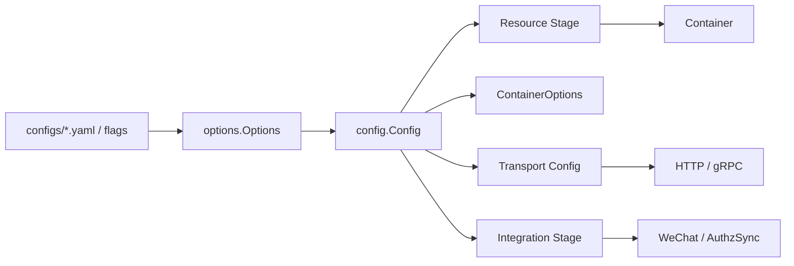

# ConfigOptions 配置链路

**本文回答**：qs-server 的 runtime 配置如何从 options/config 进入 ResourceBootstrap 和 ContainerOptions；cache、warmup、backpressure、publisher、gRPC、安全、外部集成等配置如何影响启动装配；新增配置项应该放在哪里。

---

## 30 秒结论

| 配置类型 | 进入位置 |
| -------- | -------- |
| GenericServerRunOptions | 构建 HTTP GenericAPIServer、publisher fallback mode |
| Secure/InsecureServing | HTTP server config |
| GRPCOptions | gRPC server config、TLS/mTLS/Auth/ACL/Audit |
| CacheOptions | ContainerCacheOptions、CacheSubsystem、warmup/statistics seed |
| RedisRuntime | Redis RuntimeBundle |
| MessagingOptions | MQ publisher |
| Backpressure | MySQL/Mongo/IAM limiter |
| Plan.EntryBaseURL | ContainerOptions.PlanEntryBaseURL |
| StatisticsSync.RepairWindowDays | ContainerOptions.StatisticsRepairWindowDays |
| IAMOptions | IAMModule、TokenVerifier、AuthzSnapshotLoader、AuthzSync |
| WeChat/OSSOptions | Integration Stage 初始化 QR/Notification/ObjectStore |

一句话概括：

> **ConfigOptions 文档要能回答：某个 YAML 配置最终影响哪个 runtime dependency。**

---

## 1. 配置链路总图



---

## 2. ContainerOptions 构造

`buildContainerOptions(input)` 输出：

| ContainerOptions 字段 | 来源 |
| --------------------- | ---- |
| MQPublisher | resource stage mqPublisher |
| PublisherMode | resource stage publishMode |
| EventCatalog | resource stage eventCatalog |
| Cache | `buildContainerCacheOptions()` |
| CacheSubsystem | resource stage cacheSubsystem |
| Backpressure | resource stage backpressure |
| PlanEntryBaseURL | `config.Plan.EntryBaseURL` |
| StatisticsRepairWindowDays | `statisticsRepairWindowDays(config)` |

---

## 3. Cache 配置转换

`buildContainerCacheOptions` 从 `config.Cache` 生成：

- DisableEvaluationCache。
- DisableStatisticsCache。
- TTL。
- TTLJitterRatio。
- StatisticsWarmup。
- Warmup。
- CompressPayload。
- Static/Object/Query/SDK/Lock family options。

### 3.1 TTL

配置项：

- Scale。
- ScaleList。
- Questionnaire。
- AssessmentDetail。
- AssessmentList。
- Testee。
- Plan。
- Negative。

### 3.2 Warmup

Warmup 分两类：

| 类型 | 字段 |
| ---- | ---- |
| Startup | StartupStatic / StartupQuery |
| Hotset | HotsetEnable / HotsetTopN / MaxItemsPerKind |

### 3.3 StatisticsWarmup

当 `cacheCfg.StatisticsWarmup.Enable` 为 true 时，生成：

- OrgIDs。
- OverviewPresets。
- QuestionnaireCodes。
- PlanIDs。

---

## 4. Backpressure 配置

`buildBackpressureOptions` 从：

```text
config.Backpressure.MySQL
config.Backpressure.Mongo
config.Backpressure.IAM
```

构建 limiter。

每个配置包含：

- Enabled。
- MaxInflight。
- TimeoutMs。

只在 enabled 时创建 limiter。

---

## 5. Messaging 配置

MessagingOptions 影响：

- MQ 是否启用。
- provider。
- newPublisher。
- fallbackMode。

如果 MQ publisher 创建失败，会 fallback logging mode，不阻断启动。

---

## 6. gRPC 配置

`applyGRPCOptions` 将 config.GRPCOptions 写入 grpc config：

- BindAddress。
- BindPort。
- Insecure。
- TLSCertFile / TLSKeyFile。
- MaxMsgSize。
- MaxConnectionAge。
- MTLS。
- Auth。
- ForceRemoteVerification。
- ACL。
- Audit。
- Reflection。
- HealthCheck。

---

## 7. IAM 配置

IAMOptions 影响：

- IAMModule。
- IAM Client。
- TokenVerifier。
- AuthzSnapshotLoader。
- AuthzSync subscriber。
- service auth。
- Backpressure IAM limiter 注入。

AuthzSync 若 enabled，Integration Stage 会创建 subscriber 并订阅版本变化。

---

## 8. WeChat / OSS 配置

Integration Stage 使用：

- WeChatOptions。
- OSSOptions。

初始化：

- QRCodeService。
- MiniProgramTaskNotificationService。
- QRCodeObjectStore。
- WeChat SDK cache。

---

## 9. 新增配置项原则

新增配置项必须能回答：

1. 属于哪个 Options struct？
2. 是否要进入 config.Config？
3. 是 Resource Stage 使用，还是 Container Stage / Integration Stage / Transport Stage 使用？
4. 是否要进入 ContainerOptions？
5. 是否要有默认值？
6. 是否影响启动失败还是降级？
7. 是否需要 contract tests？
8. 文档如何追踪到使用点？

---

## 10. 常见误区

### 10.1 “配置加到 YAML 就完成了”

不够。必须能从 options/config 追踪到 runtime 使用点。

### 10.2 “所有配置都应该进 ContainerOptions”

不对。Transport 配置应留在 transport bootstrap，资源配置应在 resource stage 使用。

### 10.3 “默认值可以散落各处”

不建议。默认值应有明确归属和测试。

### 10.4 “配置缺失统一 panic”

不对。要区分必需资源、可选集成和降级能力。

---

## 11. Verify

```bash
go test ./internal/apiserver/process
go test ./internal/apiserver/config
go test ./internal/apiserver/options
```
