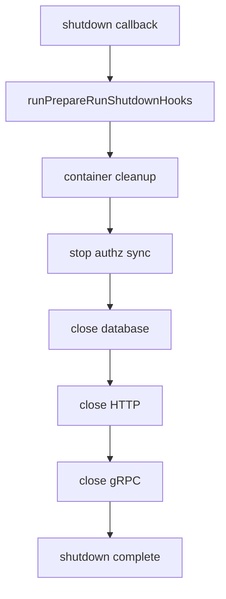

# Lifecycle 与关闭语义

**本文回答**：apiserver runtime 如何注册关闭回调；shutdown 时如何关闭 scheduler/relay、container、authz version subscriber、database、HTTP、gRPC；哪些后台任务必须注册 shutdown hook；哪些错误只记录不阻断关闭。

---

## 30 秒结论

| 阶段 | 关闭动作 |
| ---- | -------- |
| Runtime hooks | 先执行 runtimeOutput.lifecycle 中的 hooks，例如 stop schedulers、stop relay loops |
| Container cleanup | 调 `container.Cleanup()` |
| Authz sync | Stop + Close authzVersionSubscriber |
| Database | `dbManager.Close()` |
| HTTP | `httpServer.Close()` |
| gRPC | `grpcServer.Close()` / GracefulStop |
| 最终日志 | `Hexagonal Architecture server shutdown complete` |

一句话概括：

> **Lifecycle 的核心是：启动时创建的后台任务和资源，必须能在 shutdown callback 中被有序停止。**

---

## 1. Shutdown 注册点

Shutdown Stage 调用：

```text
registerShutdownCallback(buildLifecycleDeps(...))
```

将 shutdown callback 注册到 `s.gs`。

真正收到关闭信号时才执行。

---

## 2. buildLifecycleDeps

根据各 stage 输出构建：

| deps | 来源 |
| ---- | ---- |
| closeDatabase | resources.handles.dbManager.Close |
| containerCleanup | containerOutput.container.Cleanup |
| stopAuthzSync | integrationOutput.authzVersionSubscriber |
| closeHTTP | transportOutput.httpServer.Close |
| closeGRPC | transportOutput.grpcServer.Close |
| runtime.lifecycle | runtimeOutput.lifecycle |

---

## 3. 关闭顺序



---

## 4. Runtime hooks

Runtime Stage 会把后台任务 stop hook 加入 runtime lifecycle。

当前包括：

- stop schedulers。
- stop mongo outbox relay。
- stop assessment outbox relay。

这些 hook 通常通过 cancel context 停止 goroutine。

---

## 5. Scheduler shutdown

Scheduler manager 启动时：

1. 创建 context.WithCancel。
2. AddShutdownHook("stop schedulers", cancel)。
3. manager.Start(ctx)。

关闭时 cancel，runner 应感知 ctx done 并退出。

---

## 6. Relay loop shutdown

Relay loop 启动时：

1. 创建 context.WithCancel。
2. AddShutdownHook(stopHookName, cancel)。
3. goroutine 中 ticker 周期 dispatch。
4. ctx.Done 时退出。

当前 relay：

- answersheet submitted outbox relay。
- assessment outbox relay。

---

## 7. Container cleanup

Container.Cleanup 用于释放容器持有的应用/infra 资源。

如果 Cleanup 返回错误，只记录：

```text
Failed to cleanup container resources
```

不阻断后续关闭。

---

## 8. Authz version subscriber

Integration Stage 若启动 authzVersionSubscriber，Lifecycle 会：

```text
subscriber.Stop()
subscriber.Close()
```

Stop/Close error 只记录，不阻断后续关闭。

---

## 9. DB / HTTP / gRPC

关闭顺序：

1. DB manager Close。
2. HTTP server Close。
3. gRPC server Close。

gRPC Close 内部调用 health shutdown 和 GracefulStop。

---

## 10. RunPreparedServer

Run 阶段：

1. 启动 shutdown manager。
2. 打印 HTTP/gRPC 启动日志。
3. 用 `processruntime.RunGroup` 同时运行 HTTP 和 gRPC。

RunGroup 管理多个 ServiceRunner：

- http。
- grpc。

---

## 11. 常见误区

### 11.1 “shutdownStage 会立即关闭资源”

不会，只注册 callback。

### 11.2 “后台 goroutine 不需要 hook”

需要。否则 shutdown 后可能泄漏或继续运行。

### 11.3 “关闭错误应该 panic”

不应。关闭阶段一般记录错误并继续清理后续资源。

### 11.4 “HTTP/gRPC Close 应该在 DB 前”

当前顺序是 DB 在 HTTP/gRPC 前。若未来要调整，需要评估正在处理请求与 DB 可用性的关系。

---

## 12. 修改指南

新增后台 runtime 必须：

1. 使用 context 控制生命周期。
2. 注册 shutdown hook。
3. hook 名称稳定可读。
4. 关闭错误可记录。
5. 不阻塞无限时间。
6. 补 tests/docs。

新增资源必须：

1. 明确 Close/Stop。
2. 接入 buildLifecycleDeps。
3. 定义关闭顺序。
4. 说明错误语义。

---

## 13. Verify

```bash
go test ./internal/apiserver/process
```
