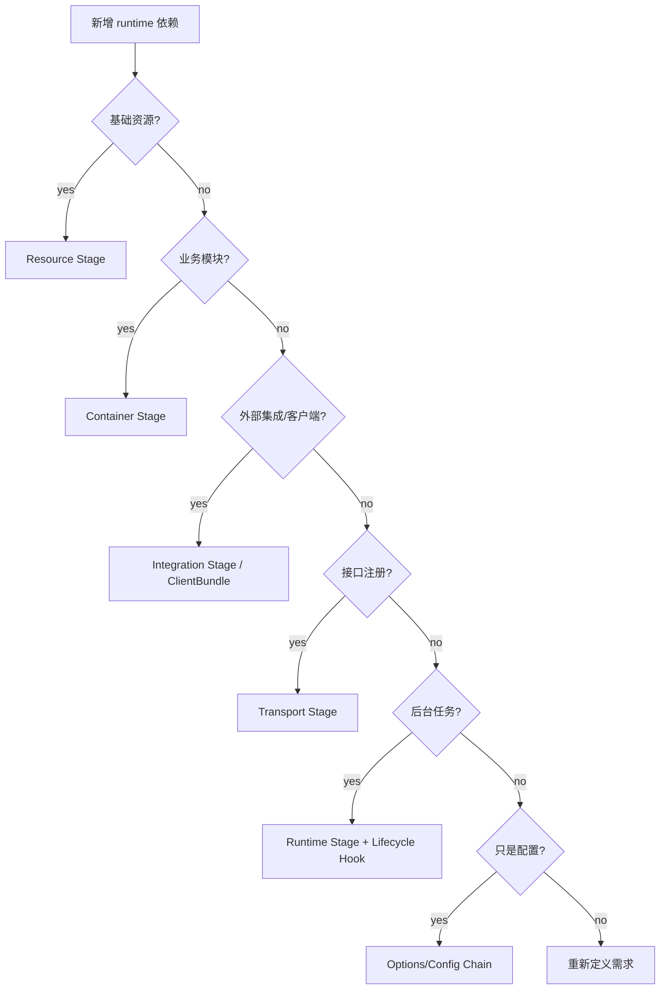

# 新增 Runtime 依赖 SOP

**本文回答**：在 qs-server 中新增资源、配置项、客户端、外部集成、业务模块、transport deps、后台任务或 shutdown hook 时，应该如何落到 runtime composition pipeline 中，避免配置漂移、依赖隐藏和生命周期泄漏。

---

## 30 秒结论

新增 runtime 依赖默认流程：

```text
判断依赖类型
  -> 选择 stage
  -> 定义配置与 options
  -> 定义 deps struct
  -> 注入 Container/Transport/Runtime
  -> 定义失败/降级语义
  -> 定义关闭语义
  -> 补测试和文档
```

| 新增类型 | 推荐落点 |
| -------- | -------- |
| DB/Redis/MQ/EventCatalog/Backpressure 资源 | Resource Stage |
| 业务模块 | Container Stage / Container.Initialize |
| IAM/WeChat/OSS 等外部集成 | Integration Stage 或 Container external service init |
| HTTP/gRPC route/service | Transport Stage |
| scheduler/relay/warmup 后台任务 | Runtime Stage |
| Stop/Close/Cancel | Lifecycle deps + shutdown hook |
| 配置项 | Options → Config → Stage deps → ContainerOptions/Transport config |

---

## 1. 决策树



---

## 2. 新增 Resource Stage 依赖

适用：

- 新 DB/resource manager。
- 新 Redis runtime 子系统。
- 新 MQ publisher/subscriber。
- 新 event catalog。
- 新 backpressure dependency。

步骤：

1. 扩展 resourceStageDeps。
2. 在 buildResourceStageDeps 中构造依赖。
3. 在 prepareResources 中执行。
4. 明确失败是否阻断启动。
5. 如需注入 Container，扩展 ContainerOptions。
6. 补 process tests。
7. 更新 ResourceBootstrap 文档。

---

## 3. 新增 Container 依赖

适用：

- 新业务模块。
- 新 application service。
- 新 infra service 被业务模块依赖。
- 新 shared event publisher/cache dependency。

步骤：

1. Container 增加字段。
2. ContainerOptions 增加输入，如需要。
3. Initialize 中选择顺序。
4. 构造 module/service。
5. 注册 module。
6. 通过 BuildRESTDeps/BuildGRPCDeps 暴露给 transport。
7. 补 container tests。
8. 更新 Container 文档。

---

## 4. 新增 Integration

适用：

- WeChat / OSS / IAM bridge / external SDK。
- authz sync subscriber。
- service auth helper。
- notification sender。

步骤：

1. 明确为什么不是 Resource Stage。
2. 在 integrationStageDeps 增加依赖。
3. 在 buildIntegrationStageDeps 中构造。
4. 在 bootstrapIntegrationStage 执行。
5. 明确 nil/disabled 行为。
6. 明确 Stop/Close。
7. 补 integration tests。
8. 更新 ClientBundle 与 Integrations 文档。

---

## 5. 新增 Transport

适用：

- 新 REST route。
- 新 gRPC service。
- 新 middleware/interceptor。
- 新 transport deps。

步骤：

1. 在 Container 中提供 BuildRESTDeps / BuildGRPCDeps 所需依赖。
2. transportStage 只负责注册，不创建业务对象。
3. REST route 增加 router tests。
4. gRPC registry 增加 service tests。
5. 若新增安全/限流，更新 Security/Resilience 文档。

---

## 6. 新增 Background Runtime

适用：

- scheduler runner。
- relay loop。
- warmup loop。
- repair loop。
- periodic sync。

步骤：

1. 在 runtimeStageDeps 增加依赖。
2. buildRuntimeStageDeps 构造 runner/relay。
3. runRuntimeStage 启动。
4. 使用 context.WithCancel。
5. AddShutdownHook。
6. 明确失败是否阻断启动。
7. 补 lifecycle tests。
8. 更新 RuntimeStage/Lifecycle 文档。

---

## 7. 新增配置项

步骤：

1. 确定 options struct。
2. 配置默认值。
3. 加载到 config.Config。
4. 找到消费 stage。
5. 如需传入 Container，扩展 ContainerOptions。
6. 补配置 contract tests。
7. 更新 ConfigOptions 文档。

---

## 8. 新增 Shutdown 行为

步骤：

1. 明确资源 Close/Stop/Cancel 方法。
2. 扩展 lifecycle deps。
3. buildLifecycleDeps 中绑定。
4. runProcessLifecycleDeps 中执行。
5. 确定顺序。
6. 错误只记录还是返回。
7. 补 tests/docs。

---

## 9. 失败与降级语义必须写清

每个新增依赖必须说明：

| 问题 | 说明 |
| ---- | ---- |
| 初始化失败是否阻断启动 | yes/no |
| 可选 disabled 如何表现 | nil/no-op/skipped |
| 外部不可用如何 fallback | logging/nop/degraded |
| 是否需要告警 | yes/no |
| 是否影响业务正确性 | yes/no |
| 是否需要 shutdown | yes/no |

---

## 10. 反模式

| 反模式 | 后果 |
| ------ | ---- |
| handler 中 new client | 生命周期不可控 |
| Container 字段随便加但不清理 | 泄漏 |
| 配置项只有 YAML 没消费链路 | 配置漂移 |
| 后台 goroutine 不注册 shutdown hook | 退出不干净 |
| post-wire 滥用 | 依赖方向隐藏 |
| transport 创建业务模块 | 组合根边界破坏 |
| fallback 不写文档 | 运维误判 |
| 单测真实外部网络 | flaky |

---

## 11. 合并前检查清单

| 检查项 | 是否完成 |
| ------ | -------- |
| 已选定 stage | ☐ |
| 已定义配置链路 | ☐ |
| 已定义 deps struct | ☐ |
| 已定义失败/降级语义 | ☐ |
| 已定义生命周期关闭 | ☐ |
| 未让 domain/application 直接创建 runtime client | ☐ |
| 已补 tests | ☐ |
| 已更新 runtime 文档 | ☐ |
| 已更新对应子系统文档 | ☐ |

---

## 12. Verify

```bash
go test ./internal/apiserver/process
go test ./internal/apiserver/container
go test ./internal/apiserver/transport/rest
go test ./internal/apiserver/transport/grpc
```

如果修改文档：

```bash
make docs-hygiene
git diff --check
```
