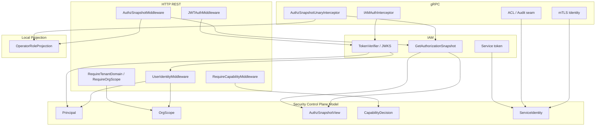
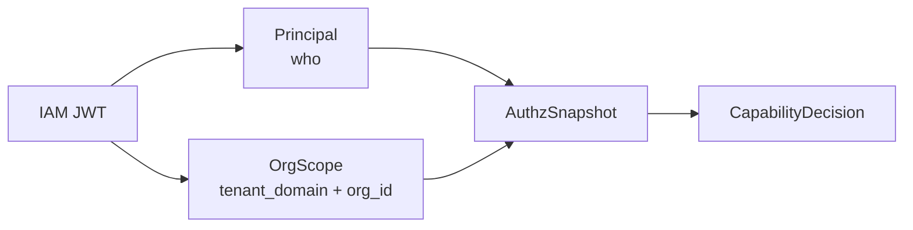

# Security Control Plane 整体架构

**本文回答**：qs-server 的安全控制面如何把用户身份、IAM 授权域、QS 业务组织范围、IAM 授权快照、能力判断、服务身份、mTLS/ACL 和本地 Operator 角色投影串起来；哪些是当前实现，哪些只是后续 seam；为什么 JWT roles 不是业务权限真值。

---

## 30 秒结论

| 维度 | 结论 |
| ---- | ---- |
| 模块定位 | Security Control Plane 是 qs-server 的**安全控制面语言层**，统一描述 Principal、OrgScope、AuthzSnapshot、CapabilityDecision、ServiceIdentity |
| 当前真值 | IAM 是认证和授权真值；AuthzSnapshot 是业务能力判断依据；JWT roles 不是 capability 真值 |
| HTTP 身份 | JWT middleware 验签后，`UserIdentityMiddleware` 投影出 `security_principal` 和 `security_org_scope` |
| OrgScope | JWT `tenant_id` 投影为 IAM 授权域 `TenantDomain`；JWT `org_id` 投影为 QS 业务组织范围 `OrgID` |
| AuthzSnapshot | HTTP/gRPC 都有 snapshot 注入链路；snapshot 加载失败会阻断需要授权的请求 |
| CapabilityDecision | 基于 IAM snapshot 的 resource/action 判断，不依赖 JWT roles |
| ServiceIdentity | service auth bearer metadata 与 mTLS identity 都投影为 ServiceIdentity 视图 |
| mTLS/ACL | gRPC 已有 mTLS identity seam 和身份一致性检查；ACL 文件加载仍偏占位/后续增强 |
| OperatorRoleProjection | 把 IAM snapshot roles 投影回本地 Operator 记录，用于本地展示/协作，不作为权限真值 |
| 关键边界 | securityplane 是 read-only model，不直接执行鉴权；具体鉴权仍在 middleware/interceptor/application authz 中完成 |
| 不做什么 | 不把所有鉴权收进一个大 SecurityService，不改 HTTP/gRPC error envelope，不把 JWT roles 当业务权限来源 |

一句话概括：

> **Security Control Plane 不是新增安全服务，而是给分散在 HTTP、gRPC、IAM、service auth、mTLS 和本地投影里的安全事实建立统一语言。**

---

## 1. 为什么需要 Security Control Plane

qs-server 的安全事实原本散落在多个位置：

```text
HTTP JWT claims
Gin context user_id / tenant_domain / org_id
gRPC metadata bearer token
IAM authorization snapshot
Capability middleware
Service auth bearer metadata
mTLS identity
Operator local roles
```

如果没有统一语言，会出现：

| 问题 | 后果 |
| ---- | ---- |
| HTTP 和 gRPC 身份语义不一致 | 同一个用户在不同入口表现不同 |
| tenant_domain / org_id 到处混用 | 授权域与业务组织范围漂移 |
| JWT roles 被误用为业务权限 | 权限绕过或误拒 |
| AuthzSnapshot 与 Operator roles 混淆 | 本地投影被当成权限真值 |
| service auth 与 mTLS 没有统一模型 | 服务间安全边界不清 |
| ACL seam 不清 | 未来扩展容易越权 |
| capability 缺少可解释结果 | 排障只能看到 permission denied |

Security Control Plane 用只读模型把这些概念统一表达出来。

---

## 2. 总体架构图



---

### 2.1 身份、范围与能力判断输入图



这张图只表达语义输入：

- `Principal` 负责 who。
- `OrgScope` 负责 where：`TenantDomain` 是 IAM/Casbin domain，`OrgID` 是 QS 业务组织范围。
- `AuthzSnapshot` 是请求期 IAM 授权快照。
- `CapabilityDecision` 负责 can do。

---

## 3. Security Plane 只读模型

`internal/pkg/securityplane/model.go` 定义核心模型。

### 3.1 Principal

Principal 表达认证主体：

| 字段 | 说明 |
| ---- | ---- |
| Kind | unknown / user / service |
| Source | unknown / http_jwt / grpc_jwt / service_auth / mtls |
| UserID | IAM user id |
| AccountID | IAM account id |
| TenantDomain | IAM authorization domain |
| OrgID | QS business organization scope |
| HasOrgID | 是否带有效 QS 业务组织范围 |
| SessionID | session id |
| TokenID | token id |
| Username | username |
| Roles | JWT / token roles 视图 |
| AMR | authentication methods |

注意：Principal 中的 Roles 是身份视图，不是业务能力真值。

### 3.2 OrgScope

OrgScope 表达 IAM 授权域和 QS 业务组织范围：

| 字段 | 说明 |
| ---- | ---- |
| TenantDomain | IAM 授权域，来自 JWT `tenant_id` |
| OrgID | QS 业务组织 ID，来自 JWT `org_id` |
| HasOrgID | 是否有正整数业务 org id |
| CasbinDomain | IAM/Casbin domain |
| RawScopeSource | scope 来源 |

`NewOrgScope(tenantDomain, orgID, hasOrg, casbinDomain)` 保存 `TenantDomain + OrgID`，不会从 `tenant_id` 推导业务 `org_id`。

### 3.3 AuthzSnapshotView

AuthzSnapshotView 是 IAM 授权快照只读视图：

| 字段 | 说明 |
| ---- | ---- |
| Roles | IAM snapshot roles |
| Permissions | resource/action permissions |
| AuthzVersion | 授权版本 |
| CasbinDomain | Casbin domain |
| IAMAppName | IAM app name |

### 3.4 CapabilityDecision

CapabilityDecision 是能力判断解释结果：

| 字段 | 说明 |
| ---- | ---- |
| Capability | 能力名 |
| Allowed | 是否允许 |
| Outcome | allowed / denied / missing_snapshot / unknown_capability / invalid_scope |
| Reason | 可读原因 |

### 3.5 ServiceIdentity

ServiceIdentity 表达服务主体：

| 字段 | 说明 |
| ---- | ---- |
| ServiceID | 服务 ID |
| Source | service_auth / mtls |
| TargetAudience | 目标 audience |
| CommonName | mTLS CN |
| Namespace | workload namespace |

---

## 4. Projection 层

`securityprojection` 负责把传输层输入规范化为 Security Plane 只读模型。

### 4.1 PrincipalFromInput

输入 PrincipalInput，输出 Principal。

特点：

- Kind 为空时设为 unknown。
- Source 为空时设为 unknown。
- Roles / AMR defensive copy。

### 4.2 OrgScopeFromIdentity

调用：

```text
securityprojection.OrgScopeFromIdentity(tenantDomain, orgID, hasOrg, casbinDomain)
```

用于统一 HTTP/gRPC 身份投影后的 `TenantDomain + OrgID` 视图。

### 4.3 ServiceIdentityFromInput

输入 ServiceIdentityInput，输出 ServiceIdentity。

特点：

- Source 为空时设为 unknown。
- TargetAudience defensive copy。

### 4.4 Projection 不做什么

Projection 不做：

- JWT 验签。
- IAM snapshot 加载。
- capability 判断。
- ACL 判断。
- DB 查询。
- 权限拒绝。

它只做模型投影。

---

## 5. HTTP 安全链路

HTTP 安全链路大致为：

```text
JWTAuthMiddleware
  -> UserIdentityMiddleware
  -> RequireTenantDomainMiddleware
  -> RequireOrgScopeMiddleware
  -> ActiveOperator / AuthzSnapshotMiddleware
  -> RequireCapabilityMiddleware
  -> Handler
```

### 5.1 UserIdentityMiddleware

它从 JWT claims 投影：

| Gin key | 值 |
| ------- | -- |
| `user_id_str` | claims.UserID |
| `user_id` | parsed uint64 user id |
| `tenant_domain` | claims.TenantDomain，来自 JWT `tenant_id` |
| `org_id` | parsed claims.OrgID，来自 JWT `org_id` |
| `roles` | claims.Roles |
| `security_principal` | securityplane.Principal |
| `security_org_scope` | securityplane.OrgScope |

### 5.2 Scope middlewares

`RequireTenantDomainMiddleware` 要求：

```text
tenant_domain exists
```

`RequireOrgScopeMiddleware` 要求：

```text
org_id claim exists and is a positive QS business org id
```

这保证 QS 业务入口有明确 org scope。

### 5.3 AuthzSnapshotMiddleware

AuthzSnapshotMiddleware：

1. 从 context 取 tenantDomain 和 userID。
2. 调 IAM SnapshotLoader。
3. 加载 `authz.Snapshot`。
4. 写入 gin context：`authz_snapshot`。
5. 写入 request context：`authz.WithSnapshot`。
6. 写入 actorctx granting user。
7. 如果存在 active operator 和 updater，则把 IAM roles 投影回本地 Operator。

### 5.4 Capability middleware

RequireCapabilityMiddleware：

1. 获取 AuthzSnapshot。
2. 调 `authz.DecideCapability`。
3. decision 不允许时返回 permission denied。
4. 允许则继续 handler。

关键点：

```text
能力判断基于 IAM snapshot resource/action；
不信任 JWT roles。
```

---

## 6. gRPC 安全链路

gRPC 安全链路大致为：

```text
mTLS identity seam
  -> IAMAuthInterceptor
  -> AuthzSnapshotUnaryInterceptor
  -> Handler
```

### 6.1 IAMAuthInterceptor

IAMAuthInterceptor：

1. 跳过 health/reflection。
2. 从 metadata 提取 authorization bearer token。
3. 使用 TokenVerifier 验证 token。
4. 如果 requiremTLS，检查 JWT service_id 与 mTLS CN 是否匹配。
5. 将 UserID/AccountID/TenantDomain/OrgID/SessionID/TokenID/Roles/AMR 注入 context。

### 6.2 mTLS identity match

当启用 requiremTLS 时：

1. 从 context 读取 mTLS identity。
2. 取 client common_name。
3. 去掉 `.svc` 后得到 expected service ID。
4. 与 JWT Extra 中 service_id 比较。
5. 不一致返回 PermissionDenied。

### 6.3 AuthzSnapshotUnaryInterceptor

AuthzSnapshotUnaryInterceptor：

1. 跳过 health/reflection。
2. 从 gRPC context 读取 tenantDomain 和 userID。
3. 如果 tenantDomain/userID 缺失，直接 handler，不注入 snapshot。
4. 如果缺少有效 org_id，则 InvalidArgument。
5. 加载 IAM AuthzSnapshot。
6. 如果存在 updater，按 org/user 投影 Operator roles。
7. 写入 authz snapshot 和 granting user。
8. 调 handler。

---

## 7. AuthzSnapshot 与 CapabilityDecision

### 7.1 Capability 清单

当前 application/authz 定义能力：

| Capability | 说明 |
| ---------- | ---- |
| `org_admin` | 机构管理员 |
| `read_questionnaires` | 读取问卷 |
| `manage_questionnaires` | 管理问卷 |
| `read_scales` | 读取量表 |
| `manage_scales` | 管理量表 |
| `read_answersheets` | 读取答卷 |
| `manage_evaluation_plans` | 管理测评计划 |
| `evaluate_assessments` | 触发/重试测评 |

### 7.2 Decision outcomes

| Outcome | 说明 |
| ------- | ---- |
| `allowed` | snapshot 满足 capability |
| `denied` | snapshot 不满足 capability |
| `missing_snapshot` | 缺少授权快照 |
| `unknown_capability` | capability 未注册 |
| `invalid_scope` | scope 无效，当前作为模型 seam |

### 7.3 管理能力映射

能力判断基于 snapshot 的 resource/action，例如：

- `qs:questionnaires` read/list/create/update/publish 等。
- `qs:scales` read/list/create/update/publish 等。
- `qs:answersheets` read/list/statistics。
- `qs:evaluation_plans` 和 `qs:evaluation_plan_tasks`。
- `qs:assessments` retry / batch_evaluate。

管理员能力 `org_admin` 通过 snapshot 的 QS admin 语义判断。

---

## 8. ServiceIdentity 与 mTLS / ACL

### 8.1 serviceauth

`serviceauth.BearerRequestMetadata`：

1. 从 TokenProvider 获取 token。
2. 生成 gRPC PerRPC metadata：

```text
authorization: Bearer {token}
```

`RequireTransportSecurity()` 当前返回 false，表示当前兼容契约不强制 transport security。

### 8.2 ServiceIdentity projection

`serviceauth.ServiceIdentity(serviceID, audience)` 会生成：

```text
ServiceIdentity{
  ServiceID,
  Source: service_auth,
  TargetAudience,
}
```

### 8.3 mTLS

mTLS identity 作为 ServiceIdentity 的另一个来源：

```text
Source: mtls
CommonName
Namespace
```

当前 gRPC interceptor 已有 mTLS identity match seam。

### 8.4 ACL seam

ACL/Audit 在架构中作为服务间访问控制扩展 seam。当前文档层要明确：

- mTLS/ACL 是 service-to-service 安全控制面的一部分。
- ACL 文件加载/细粒度策略仍是后续增强。
- 不应把 ACL 与用户级 capability 混在一起。

---

## 9. OperatorRoleProjection

OperatorRoleProjection 把 IAM snapshot roles 投影回本地 Operator。

### 9.1 触发点

| 入口 | 触发 |
| ---- | ---- |
| HTTP AuthzSnapshotMiddleware | active operator 存在时 PersistFromSnapshot |
| gRPC AuthzSnapshotUnaryInterceptor | orgID/userID 可解析时 PersistFromSnapshotByUser |

### 9.2 PersistFromSnapshot

流程：

1. 根据 operator ID 或 org/user 查询本地 Operator。
2. 读取 IAM snapshot roles。
3. 转成本地 domain.Role。
4. 排序。
5. 与当前 roles 比较。
6. 不同则 ReplaceRolesProjection。
7. repo.Update。

### 9.3 边界

本地 Operator roles 投影不是权限真值。

它用于：

- 本地展示。
- 协作查询。
- 运维查看。
- 降低本地角色漂移。

能力判断仍应以 IAM AuthzSnapshot 为准。

---

## 10. 设计模式

| 模式 | 使用点 | 意图 |
| ---- | ------ | ---- |
| Control Plane Model | securityplane | 统一安全语言 |
| Projection | securityprojection / OperatorRoleProjection | 把传输层/IAM 事实投影到本地视图 |
| Middleware Chain | HTTP | JWT、身份、授权域/组织范围、授权快照、能力判断按顺序执行 |
| Interceptor Chain | gRPC | token、mTLS、authz snapshot 注入 |
| Anti-Corruption Layer | IAM SDK wrapper / serviceauth | 隔离 IAM SDK 与业务代码 |
| Capability Decision | application/authz | 能力判断可解释 |
| Snapshot | AuthzSnapshot | 请求期授权视图 |
| Service Identity | ServiceIdentity | 服务间身份统一表达 |

---

## 11. 设计取舍

| 设计 | 收益 | 代价 |
| ---- | ---- | ---- |
| 安全模型只读 | 不改变现有鉴权行为 | 需要到 middleware/application 查真实执行 |
| AuthzSnapshot 作为权限真值 | 权限来源清晰 | snapshot 加载失败会影响请求 |
| JWT roles 不做 capability 真值 | 防止权限绕过 | 需要每次依赖 snapshot |
| TenantDomain + OrgID 分离 | IAM 授权域和 QS 业务范围明确 | 文档和调用方都要避免把二者混用 |
| Operator roles 本地投影 | 展示和协作方便 | 投影可能滞后 |
| serviceauth 只构建 bearer metadata | 简洁兼容 | 尚未强制传输安全 |
| mTLS/ACL seam 保留 | 后续可扩展 | 当前不是完整 ACL 引擎 |

---

## 12. 当前不做什么

当前不做：

- 不新增统一 SecurityService 接管所有鉴权。
- 不把 JWT roles 升级为权限判断来源。
- 不改变 HTTP/gRPC error envelope。
- 不强制所有 service auth 必须 mTLS。
- 不实现完整 ACL 文件加载和策略引擎。
- 不把本地 Operator roles 当权限真值。
- 不在 domain 层直接依赖 IAM SDK。
- 不把用户 capability 和 service ACL 混在一起。

---

## 13. 关键不变量

1. 请求身份必须先认证，再投影 Principal。
2. QS 业务请求必须同时有 IAM 授权域 `tenant_domain` 和 QS 业务组织范围 `org_id`。
3. Capability 判断必须基于 AuthzSnapshot。
4. JWT roles 只能作为身份视图，不能作为业务权限真值。
5. ServiceIdentity 是服务主体视图，不是用户 Principal。
6. OperatorRoleProjection 是本地投影，不是授权来源。
7. mTLS identity 与 service auth JWT 的关系必须通过显式策略确认。
8. 新 capability 必须补 application/authz mapping 和 middleware tests。

---

## 14. 常见误区

### 14.1 “JWT roles 有 admin 就可以放行”

不应这样。capability 应基于 AuthzSnapshot。

### 14.2 “JWT tenant_id 就一定是 org_id”

错误。JWT `tenant_id` 是 IAM 授权域；JWT `org_id` 才是 QS 业务组织范围。OrgScope 明确保存 `TenantDomain + OrgID`，不再做兼容推导。

### 14.3 “Operator 本地 roles 是权限真值”

不是。它是投影，权限真值仍在 IAM snapshot。

### 14.4 “ServiceIdentity 和 Principal 是一回事”

不是。Principal 表示用户或服务认证主体；ServiceIdentity 专门表达服务间身份。

### 14.5 “mTLS 开了就不需要 bearer token”

当前设计不是这样。mTLS 是传输/服务身份 seam，bearer token 仍用于 IAM auth。

### 14.6 “securityplane 能直接判断权限”

不能。securityplane 是只读模型；判断在 application/authz 和 middleware/interceptor。

---

## 15. 排障入口

| 现象 | 优先看 |
| ---- | ------ |
| HTTP 401 | JWTAuthMiddleware / UserIdentityMiddleware |
| tenant_domain required | RequireTenantDomainMiddleware |
| org_id required | RequireOrgScopeMiddleware / OrgScope |
| authorization snapshot required | AuthzSnapshotMiddleware 是否执行 |
| failed to load authorization snapshot | IAM SnapshotLoader / IAM 服务 |
| permission denied capability | DecideCapability / IAM resource-action |
| gRPC Unauthenticated | IAMAuthInterceptor bearer token |
| gRPC PermissionDenied identity mismatch | mTLS CN 与 JWT service_id |
| Operator roles 不同步 | OperatorRoleProjection / Snapshot roles |
| service auth token 缺失 | serviceauth TokenProvider / metadata |

---

## 16. 修改指南

新增安全能力前先判断：

| 需求 | 落点 |
| ---- | ---- |
| 新身份来源 | PrincipalSource / projection / middleware |
| 新授权域 / 组织范围 scope | OrgScope / scope parser / middleware |
| 新业务能力 | application/authz Capability + mapping + middleware |
| 新服务身份 | ServiceIdentity / serviceauth / mTLS |
| 新服务间 ACL | service identity + ACL policy seam |
| 新本地角色投影 | OperatorRoleProjection |
| 新安全状态观测 | 只读 snapshot / logs / metrics |

详细流程见：

- [05-新增安全能力SOP.md](./05-新增安全能力SOP.md)

---

## 17. 代码锚点

### Model / Projection

- Security model：[../../../internal/pkg/securityplane/model.go](../../../internal/pkg/securityplane/model.go)
- Security projection：[../../../internal/pkg/securityprojection/projection.go](../../../internal/pkg/securityprojection/projection.go)

### HTTP

- HTTP identity：[../../../internal/pkg/httpauth/identity.go](../../../internal/pkg/httpauth/identity.go)
- Authz snapshot middleware：[../../../internal/apiserver/transport/rest/middleware/authz_snapshot_middleware.go](../../../internal/apiserver/transport/rest/middleware/authz_snapshot_middleware.go)
- Capability middleware：[../../../internal/apiserver/transport/rest/middleware/capability_middleware.go](../../../internal/apiserver/transport/rest/middleware/capability_middleware.go)

### gRPC

- IAM auth interceptor：[../../../internal/pkg/grpc/interceptor_auth.go](../../../internal/pkg/grpc/interceptor_auth.go)
- gRPC authz snapshot interceptor：[../../../internal/apiserver/transport/grpc/authz_snapshot_interceptor.go](../../../internal/apiserver/transport/grpc/authz_snapshot_interceptor.go)

### Authz / Service / Operator

- Capability decisions：[../../../internal/apiserver/application/authz/capability.go](../../../internal/apiserver/application/authz/capability.go)
- Service auth bearer：[../../../internal/pkg/serviceauth/bearer.go](../../../internal/pkg/serviceauth/bearer.go)
- Operator role projection：[../../../internal/apiserver/application/actor/operator/role_projection_updater.go](../../../internal/apiserver/application/actor/operator/role_projection_updater.go)

---

## 18. Verify

```bash
go test ./internal/pkg/securityplane
go test ./internal/pkg/securityprojection
go test ./internal/pkg/httpauth
go test ./internal/pkg/grpc
go test ./internal/pkg/serviceauth
go test ./internal/apiserver/application/authz
go test ./internal/apiserver/transport/rest/middleware
go test ./internal/apiserver/transport/grpc
go test ./internal/apiserver/application/actor/operator
```

如果修改安全链路顺序：

```bash
go test ./internal/apiserver/router_matrix_test.go
go test ./internal/collection-server/transport/rest/middleware
```

如果修改文档：

```bash
make docs-hygiene
git diff --check
```

---

## 19. 下一跳

| 目标 | 文档 |
| ---- | ---- |
| Principal 与 OrgScope | [01-Principal与OrgScope.md](./01-Principal与OrgScope.md) |
| AuthzSnapshot 与 CapabilityDecision | [02-AuthzSnapshot与CapabilityDecision.md](./02-AuthzSnapshot与CapabilityDecision.md) |
| ServiceIdentity 与 mTLS-ACL | [03-ServiceIdentity与mTLS-ACL.md](./03-ServiceIdentity与mTLS-ACL.md) |
| OperatorRoleProjection | [04-OperatorRoleProjection.md](./04-OperatorRoleProjection.md) |
| 新增安全能力 SOP | [05-新增安全能力SOP.md](./05-新增安全能力SOP.md) |
| 回到 Security 阅读地图 | [README.md](./README.md) |
