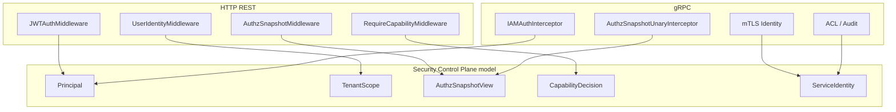
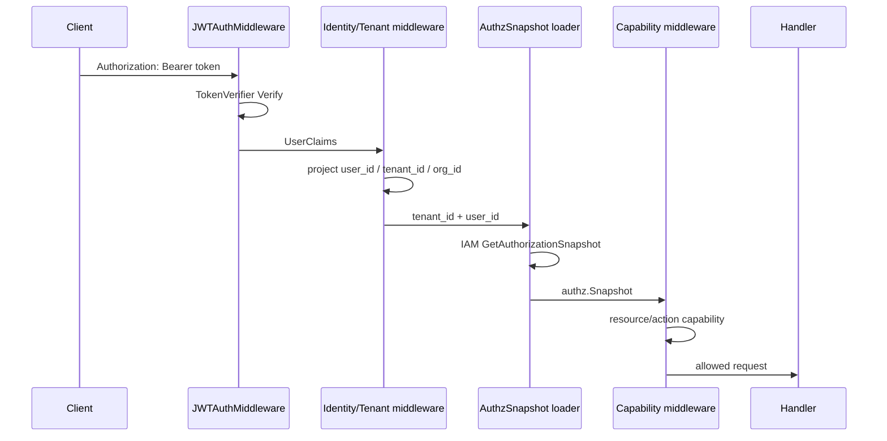

# Security Control Plane 整体架构

**本文回答**：qs-server 的安全控制面如何把用户身份、租户范围、IAM 授权、服务身份和传输层安全串起来；哪些能力已经是当前实现，哪些只是后续 seam。

## 30 秒结论

| 问题 | 当前设计 |
| ---- | -------- |
| 解决什么问题 | 让 HTTP、gRPC、服务间调用和 operator 投影使用同一套安全语言 |
| 关键边界 | 身份认证、租户范围、授权快照、capability、服务身份分层表达 |
| 权限来源 | `AuthzSnapshot` 是业务权限真值，JWT roles 不是 capability 真值 |
| P0 变化 | 新增只读模型和 contract tests，不改变中间件行为 |
| 主要风险 | mTLS/ACL 已有 seam，但 ACL 文件加载仍是默认策略占位；身份一致性后续需收口 |

## 总体架构图



## 模块要解决什么问题

安全控制面不是新增一个安全服务，而是解决“安全事实散落”的问题：

| 散落点 | 当前事实 | 控制面收口方式 |
| ------ | -------- | -------------- |
| JWT claims | HTTP 和 gRPC 各自解析并写 context | 用 `Principal` 描述同一种身份视图 |
| tenant/org | 字符串 `tenant_id` 和数字 `org_id` 在中间件中分散 | 用 `TenantScope` 明确 raw tenant 与 numeric org 的关系 |
| permission | capability middleware 调 `authz.SnapshotSatisfiesCapability` | 用 `CapabilityDecision` 表达结果和原因 |
| service auth | apiserver / collection 有重复 wrapper | 用 `ServiceIdentity` 表达服务身份，后续再收 wrapper |
| mTLS/ACL | gRPC interceptor 链上可选 | 文档和 contract tests 先锁当前边界 |

## 运行时调用链



## 设计模式与取舍

| 模式 | 使用点 | 为什么这样设计 | 取舍 |
| ---- | ------ | -------------- | ---- |
| Pipeline / Interceptor Chain | HTTP middleware、gRPC unary interceptor | 认证、身份投影、授权快照、能力判断天然按顺序发生 | 顺序漂移会造成安全绕过，因此要用 contract tests 锁住 |
| Projection | `AuthzSnapshot`、operator role projection | IAM 是授权真值，本地只保存请求期或展示用投影 | 投影可能滞后，必须通过 version sync / snapshot reload 修正 |
| Anti-Corruption Layer | IAM SDK wrapper、service auth helper | 业务层不直接理解 IAM SDK 细节 | wrapper 重复时会增加维护成本，后续阶段再收口 |
| Value Object | `Principal`、`TenantScope`、`ServiceIdentity` | 让文档、测试和后续 seam 有共同语言 | P0 只读，不直接替换运行时模型 |

## 当前不做什么

- 不把所有鉴权合并成一个大 `SecurityService`。
- 不把 JWT roles 升级成业务权限来源。
- 不改 HTTP / gRPC status、error envelope 或路由。
- 不实现 ACL 文件加载。
- 不强制 service auth `RequireTransportSecurity=true`。

## 代码与测试锚点

| 关注点 | 锚点 |
| ------ | ---- |
| 只读模型 | [`internal/pkg/securityplane`](../../../internal/pkg/securityplane) |
| HTTP JWT | [`internal/pkg/middleware/jwt_auth.go`](../../../internal/pkg/middleware/jwt_auth.go) |
| gRPC IAM | [`internal/pkg/grpc/interceptor_auth.go`](../../../internal/pkg/grpc/interceptor_auth.go) |
| gRPC 链 | [`internal/pkg/grpc/server.go`](../../../internal/pkg/grpc/server.go) |
| apiserver authz snapshot | [`internal/apiserver/interface/restful/middleware/authz_snapshot_middleware.go`](../../../internal/apiserver/interface/restful/middleware/authz_snapshot_middleware.go) |
| gRPC authz snapshot | [`internal/apiserver/transport/grpc/authz_snapshot_interceptor.go`](../../../internal/apiserver/transport/grpc/authz_snapshot_interceptor.go) |

## Verify

```bash
GOTOOLCHAIN=local /Users/yangshujie/.gvm/gos/go1.25.9/bin/go test ./internal/pkg/securityplane ./internal/pkg/grpc ./internal/apiserver/interface/restful/middleware ./internal/apiserver/transport/grpc
```
