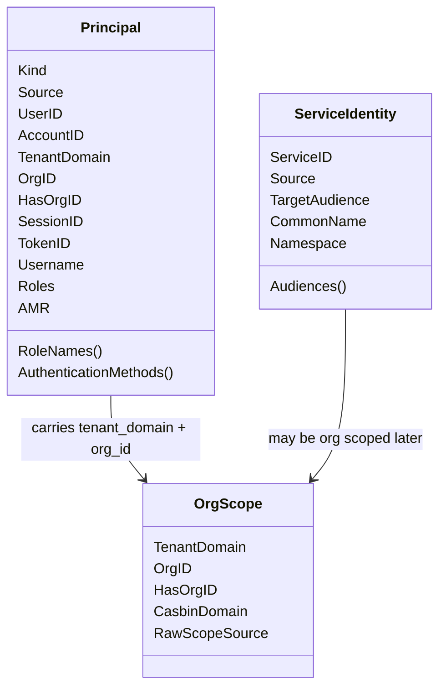
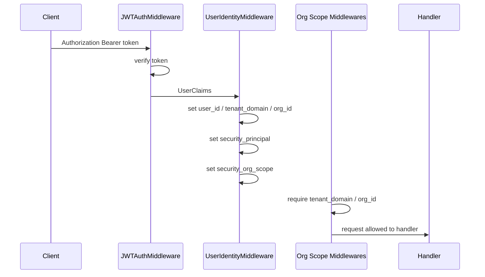
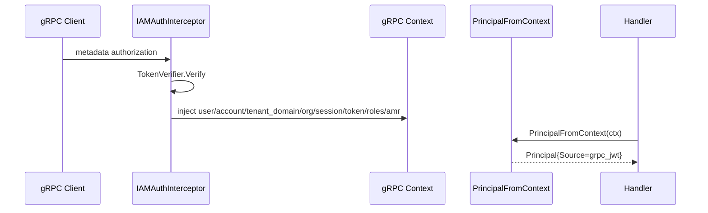
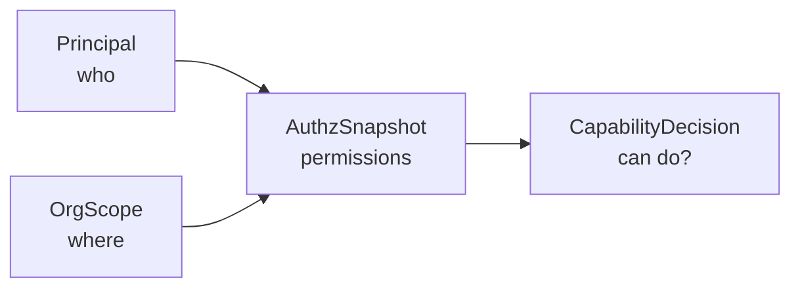

# Principal 与 OrgScope

**本文回答**：qs-server 如何把 HTTP JWT、gRPC JWT、service auth、mTLS 身份统一投影成 Principal / ServiceIdentity；IAM 的 `tenant_id` 如何作为 `tenant_domain` 授权域进入 QS；JWT `org_id` 如何成为 QS 的业务组织范围；为什么 `tenant_domain` 和 `org_id` 不能混为一个字段；这些视图如何在 HTTP/gRPC 中间件中被写入、读取和校验。

---

## 30 秒结论

| 模型 | 回答的问题 | 当前来源 |
| ---- | ---------- | -------- |
| Principal | “谁在调用？” | HTTP JWT claims、gRPC JWT context、service auth |
| OrgScope | “在哪个授权域 / 业务组织范围调用？” | IAM `tenant_id` 作为 `tenant_domain`；IAM `org_id` 作为 QS 业务组织 ID |
| ServiceIdentity | “哪个服务在调用？” | service auth bearer metadata、mTLS certificate identity |

| 维度 | 结论 |
| ---- | ---- |
| Principal 是只读视图 | 统一表达认证主体，不直接执行鉴权 |
| TenantDomain 是 IAM 授权域 | 来自 JWT `tenant_id`，例如 `fangcun` / `platform`，用于 IAM / Casbin domain 语义 |
| OrgID 是 QS 业务组织范围 | 来自 JWT `org_id`，是 QS 业务数据权限、统计、计划、测评归属的组织 ID |
| HTTP 投影 | `UserIdentityMiddleware` 写入 `security_principal` 和 `security_org_scope` |
| gRPC 投影 | `PrincipalFromContext` / `OrgScopeFromContext` 从 IAMAuthInterceptor 注入的 context values 生成 |
| mTLS 投影 | `ServiceIdentityFromMTLSContext` 从 mTLS identity 生成 ServiceIdentity |
| 业务 org 要求 | 需要 QS 组织范围的 REST/gRPC 路径必须要求 `org_id` claim |
| 权限边界 | Principal.Roles 不是业务 capability 真值；能力判断必须走 AuthzSnapshot |
| 常见风险 | 把 JWT roles 当权限、把 `tenant_id` 当 `org_id`、把 ServiceIdentity 当用户 Principal |

一句话概括：

> **Principal 解决“谁”，OrgScope 解决“在哪个 IAM 授权域 + QS 业务组织范围”，但真正“能不能做”要交给 AuthzSnapshot 与 CapabilityDecision。**

---

## 1. 为什么要抽象 Principal

HTTP 和 gRPC 的身份来源不同：

```text
HTTP Authorization: Bearer token
gRPC metadata authorization
service auth token
mTLS certificate
```

但业务和文档需要统一语言：

```text
调用者是谁？
来自哪个认证来源？
用户 ID 是什么？
account_id / tenant_domain / org_id / session_id / token_id 是什么？
是否是服务调用？
```

如果不抽象 Principal，会导致：

- HTTP/gRPC context key 分散。
- 业务代码直接依赖 Gin 或 gRPC metadata。
- 角色字段被误用。
- 服务身份和用户身份混淆。
- IAM 授权域与 QS 业务组织范围混淆。
- 文档与代码无法对齐。

Principal 是只读身份视图，用来统一描述认证结果。

---

## 2. 模型图



---

## 3. Principal

`securityplane.Principal` 字段：

| 字段 | 说明 |
| ---- | ---- |
| Kind | principal 类型：unknown / user / service |
| Source | 来源：http_jwt / grpc_jwt / service_auth / mtls |
| UserID | IAM user id |
| AccountID | IAM account/login identity id |
| TenantDomain | IAM 授权域，例如 `fangcun` / `platform` |
| OrgID | QS 业务组织 ID，只有 JWT `org_id` 可解析时存在 |
| HasOrgID | 是否解析到有效业务 org |
| SessionID | session id |
| TokenID | token id |
| Username | username |
| Roles | token / claims 中的 roles |
| AMR | authentication methods |

### 3.1 PrincipalKind

| 值 | 说明 |
| -- | ---- |
| `unknown` | 未知主体 |
| `user` | 用户主体 |
| `service` | 服务主体 |

### 3.2 PrincipalSource

| 值 | 说明 |
| -- | ---- |
| `unknown` | 未知来源 |
| `http_jwt` | HTTP JWT claims |
| `grpc_jwt` | gRPC JWT context |
| `service_auth` | service auth token |
| `mtls` | mTLS certificate identity |

### 3.3 Defensive Copy

`RoleNames()` 和 `AuthenticationMethods()` 返回 defensive copy。

这避免外部调用者修改 Principal 内部 slice。

---

## 4. Principal 不是什么

Principal 不是：

- 权限判断结果。
- IAM authorization snapshot。
- 本地 Operator。
- 业务角色真值。
- Casbin policy。
- ACL decision。
- session store。

Principal 只能说明：

```text
认证后看到的主体信息
```

不能说明：

```text
该主体能否执行某个业务动作
```

业务动作能力必须走 AuthzSnapshot / CapabilityDecision。

---

## 5. OrgScope

`OrgScope` 字段：

| 字段 | 说明 |
| ---- | ---- |
| TenantDomain | IAM 授权域，来自 JWT `tenant_id`，例如 `fangcun` / `platform` |
| OrgID | QS 业务组织 ID，来自 JWT `org_id` |
| HasOrgID | 是否解析到有效业务组织 ID |
| CasbinDomain | IAM/Casbin domain，通常与 TenantDomain 对齐 |
| RawScopeSource | scope 来源，当前作为扩展字段 |

### 5.1 NewOrgScope

`NewOrgScope(tenantDomain, orgID, hasOrg, casbinDomain)`：

1. 保存 IAM 授权域 `TenantDomain`。
2. 保存 QS 业务组织 ID `OrgID`。
3. `hasOrg=false` 或 `orgID=0` -> `HasOrgID=false`。
4. `hasOrg=true` 且 `orgID>0` -> `HasOrgID=true`。
5. 保存 `CasbinDomain`，用于后续权限快照 / capability 判定。

### 5.2 典型行为

| JWT tenant_id | JWT org_id | TenantDomain | OrgID | HasOrgID | 说明 |
| ------------- | ---------- | ------------ | ----- | -------- | ---- |
| `fangcun` | `1` | `fangcun` | 1 | true | 正常业务请求 |
| `platform` | `` | `platform` | 0 | false | 平台控制域，不一定有 QS 业务 org |
| `fangcun` | `` | `fangcun` | 0 | false | 缺少业务组织范围 |
| `fangcun` | `0` | `fangcun` | 0 | false | 无效 QS org |
| `fangcun` | `abc` | `fangcun` | 0 | false | org_id 无法解析 |

---

## 6. 为什么 tenant_domain 和 org_id 分开

IAM 的 `tenant_id` 是授权域声明，QS 业务中的 `org_id` 是数字业务组织主键。

它们回答的是两个不同问题：

| 概念 | 回答的问题 | 示例 | 类型 |
| ---- | ---------- | ---- | ---- |
| TenantDomain | 这是哪个 IAM 授权域 / Casbin domain？ | `fangcun` / `platform` | string |
| OrgID | 这是哪个 QS 业务组织的数据范围？ | `1` / `2` / `3` | uint64 |

如果把它们混为一个字段，会出现：

| 问题 | 后果 |
| ---- | ---- |
| IAM tenant domain 不是数字 | QS 查询无法执行 |
| org_id 缺失时误用 tenant_id | 业务数据范围被错误扩大 |
| 业务代码直接 ParseUint(tenant_id) | 各处行为不一致 |
| Casbin domain 和 org_id 混用 | 权限边界不清 |
| 平台域 `platform` 无法表达业务组织 | 平台能力与业务数据范围混乱 |

因此当前约定是：

```text
JWT tenant_id = IAM authorization domain
JWT org_id    = QS business organization scope
```

OrgScope 同时保留 `TenantDomain` 和 `OrgID`，明确表达：

```text
IAM 授权域是什么；
QS 是否拿到了业务组织范围。
```

---

## 7. HTTP 投影链路

HTTP 身份链路：



### 7.1 UserIdentityMiddleware

从 `UserClaims` 写入 Gin context：

| Key | 值 |
| --- | -- |
| `user_id_str` | claims.UserID |
| `user_id` | parsed uint64 |
| `tenant_domain` | claims.TenantDomain |
| `org_id` | parsed uint64 org id，如果 JWT `org_id` 可解析 |
| `roles` | claims.Roles |
| `security_principal` | Principal |
| `security_org_scope` | OrgScope |

### 7.2 projectIdentityContext

HTTP Projection 使用：

```text
PrincipalFromInput(
  Kind=user,
  Source=http_jwt,
  UserID,
  AccountID,
  TenantDomain,
  OrgID,
  HasOrgID,
  SessionID,
  TokenID,
  Roles,
  AMR,
)
```

并设置：

```text
OrgScopeFromIdentity(tenantDomain, orgID, hasOrg, "")
```

---

## 8. HTTP Scope 校验

### 8.1 RequireTenantDomainMiddleware

要求：

```text
claims != nil
tenantDomainFromClaims(claims) != ""
```

否则：

```text
401 tenant domain claim is required
```

### 8.2 RequireOrgScopeMiddleware

要求：

```text
GetOrgID(c) != 0
```

否则：

```text
400 org_id claim is required for QS business scope
```

### 8.3 为什么拆成两个 middleware

| Middleware | 解决问题 |
| ---------- | -------- |
| RequireTenantDomainMiddleware | 认证 token 是否携带 IAM 授权域 |
| RequireOrgScopeMiddleware | 当前 QS 业务入口是否要求业务组织范围 |

这样可以避免把 IAM 授权域和 QS 业务组织范围混成一个字段。

---

## 9. HTTP 读取方法

常用读取函数：

| 函数 | 返回 |
| ---- | ---- |
| `GetUserID(c)` | uint64 user id |
| `GetUserIDStr(c)` | string user id |
| `GetOrgID(c)` | uint64 org id |
| `GetTenantDomain(c)` | IAM 授权域 |
| `GetRoles(c)` | roles |
| `GetPrincipal(c)` | Principal |
| `GetOrgScope(c)` | OrgScope |

### 9.1 推荐用法

业务需要 org 查询：

```text
GetOrgID(c)
```

需要完整安全视图或排障：

```text
GetPrincipal(c)
GetOrgScope(c)
```

需要 capability：

```text
GetAuthzSnapshot(c)
DecideCapability(...)
```

不要直接从 roles 判断能力。

---

## 10. gRPC 投影链路

gRPC 身份链路：



### 10.1 IAMAuthInterceptor 注入的 context key

| Key | 说明 |
| --- | ---- |
| user_id | IAM UserID |
| account_id | IAM AccountID |
| tenant_domain | IAM 授权域 |
| org_id | QS 业务组织 ID，如果 token 携带 |
| session_id | SessionID |
| token_id | TokenID |
| roles | Roles |
| amr | AMR |
| username | Username |
| token_metadata | Verify metadata |

### 10.2 PrincipalFromContext

`PrincipalFromContext(ctx)`：

1. 从 gRPC context 读取 user/account/tenant_domain/org/session/token/username/roles/amr。
2. 如果全空，返回 false。
3. 否则生成：
   - Kind=user。
   - Source=grpc_jwt。
   - 对应字段。

### 10.3 OrgScopeFromContext

`OrgScopeFromContext(ctx)`：

1. 读取 tenant_domain。
2. 读取 org_id。
3. 根据是否存在有效 org_id 设置 HasOrgID。
4. 返回 OrgScope。

---

## 11. mTLS ServiceIdentity 投影

`ServiceIdentityFromMTLSContext(ctx)`：

1. 从 context 中读取 mTLS identity。
2. 读取 common_name 和 namespace。
3. serviceID = strings.TrimSuffix(commonName, ".svc")。
4. 生成 ServiceIdentity：
   - Source=mtls。
   - ServiceID。
   - CommonName。
   - Namespace。

### 11.1 它和 Principal 的区别

| Principal | ServiceIdentity |
| --------- | --------------- |
| 表达认证主体，可是 user/service | 专门表达服务身份 |
| 常来自 JWT claims | 常来自 service auth 或 mTLS |
| 包含 UserID/TenantDomain/OrgID/Roles | 包含 ServiceID/CN/Audience/Namespace |
| 用于用户链路 | 用于服务间调用链路 |

---

## 12. ServiceAuth 投影

`serviceauth.ServiceIdentity(serviceID,audience)` 会生成：

```text
ServiceIdentity{
  ServiceID: serviceID,
  Source: service_auth,
  TargetAudience: audience,
}
```

`BearerRequestMetadata(ctx, provider)` 会把 service token 转为：

```text
authorization: Bearer {token}
```

### 12.1 RequireTransportSecurity

当前：

```text
RequireTransportSecurity() == false
```

这是兼容契约，不代表生产上不需要传输安全。服务间 mTLS/ACL 会在后续文档中展开。

---

## 13. Principal / OrgScope / AuthzSnapshot 的关系



| 模型 | 回答 |
| ---- | ---- |
| Principal | 谁在调用 |
| OrgScope | 在哪个 IAM 授权域 / QS 业务组织范围 |
| AuthzSnapshot | 这个主体在这个范围有哪些 resource/action |
| CapabilityDecision | 是否允许某个业务能力 |

---

## 14. 关键不变量

1. Principal 只表示认证后的身份视图。
2. TenantDomain 表达 IAM 授权域，不表达 QS 业务组织。
3. OrgID 表达 QS 业务组织范围，来自 JWT `org_id`。
4. 需要 QS org 的业务入口必须要求 OrgScope。
5. Principal.Roles 不能作为 capability 真值。
6. AuthzSnapshot 才是业务权限判断依据。
7. ServiceIdentity 不等于用户 Principal。
8. gRPC 与 HTTP 应使用同一套安全语言。
9. mTLS identity 与 service auth JWT 的关系必须显式校验。
10. 不允许再从 JWT `tenant_id` 推导 QS `org_id`。

---

## 15. 设计模式与取舍

| 模式 | 当前实现 | 意图 |
| ---- | -------- | ---- |
| Value Object | Principal / OrgScope | 安全事实不可变视图 |
| Projection | securityprojection | 传输层输入转统一模型 |
| Middleware Projection | UserIdentityMiddleware | HTTP context 写入安全视图 |
| Context Projection | PrincipalFromContext | gRPC context 读取安全视图 |
| Scope Split | TenantDomain + OrgID | IAM 授权域与 QS 业务 org 解耦 |
| Defensive Copy | RoleNames / AMR / Audiences | 防止 slice 被外部修改 |
| Compatibility Contract | serviceauth RequireTransportSecurity=false | 兼容现有 service auth |

---

## 16. 常见误区

### 16.1 “Principal.Roles 里有 admin 就能放行”

错误。Principal.Roles 是身份声明视图，能力判断必须看 AuthzSnapshot。

### 16.2 “tenant_id 就是 org_id”

错误。当前约定是：JWT `tenant_id` 是 IAM 授权域；JWT `org_id` 是 QS 业务组织范围。

### 16.3 “GetTenantDomain 和 GetOrgID 可以随便互换”

不能。需要业务 org 查询时用 GetOrgID，并确保经过 RequireOrgScopeMiddleware。

### 16.4 “gRPC 和 HTTP 身份模型不一样”

不应如此。它们输入不同，但最终应该投影到同一套 Principal / OrgScope 语言。

### 16.5 “ServiceIdentity 是登录用户”

不是。ServiceIdentity 表达服务间身份，不能当用户身份使用。

### 16.6 “mTLS 有 CN 就可以替代 JWT”

当前设计不是这样。mTLS 是服务身份 seam，JWT / service token 仍参与认证和授权。

---

## 17. 排障路径

### 17.1 HTTP 返回 user not authenticated

检查：

1. JWTAuthMiddleware 是否执行。
2. TokenVerifier 是否配置。
3. Authorization header。
4. GetUserClaims 是否为空。
5. UserIdentityMiddleware 顺序。

### 17.2 invalid user id format

检查：

1. IAM claims.UserID。
2. 是否为数字字符串。
3. 上游 IAM token 签发。
4. 测试 token 是否构造错误。

### 17.3 tenant domain claim is required

检查：

1. JWT claims.TenantDomain / tenant_id。
2. RequireTenantDomainMiddleware 是否挂载在该路由。
3. IAM token 是否缺授权域。
4. collection/apiserver 中间件顺序。

### 17.4 org_id claim is required for QS business scope

检查：

1. JWT 是否携带 org_id。
2. org_id 是否为正整数。
3. IAM token 签发时是否透传业务 org_id。
4. 当前接口是否确实需要 QS org scope。

### 17.5 gRPC PrincipalFromContext 返回 false

检查：

1. IAMAuthInterceptor 是否启用。
2. 是否是 health/reflection skip method。
3. authorization metadata。
4. TokenVerifier。
5. injectUserContext 是否执行。

### 17.6 mTLS ServiceIdentity 为空

检查：

1. mTLS interceptor 是否注入 identity。
2. context key 是 typed key 还是 `mtls.identity`。
3. certificate common_name。
4. namespace 字段。
5. 是否确实启用了 mTLS。

---

## 18. 修改指南

### 18.1 新增 Principal 字段

必须：

1. 明确来源是 HTTP claims、gRPC context、service auth 还是 mTLS。
2. 更新 securityplane.Principal。
3. 更新 securityprojection.PrincipalInput。
4. 更新 HTTP setSecurityProjection。
5. 更新 gRPC PrincipalFromContext。
6. 补 defensive copy，如是 slice。
7. 补 tests/docs。

### 18.2 新增 OrgScope 语义

必须：

1. 明确 IAM 授权域与 QS 业务 org 的关系。
2. 是否要求 org_id。
3. 更新 NewOrgScope。
4. 更新 middleware 校验。
5. 更新 AuthzSnapshot loader 调用。
6. 补 tests/docs。

### 18.3 新增身份来源

必须：

1. 增加 PrincipalSource 或 ServiceIdentitySource。
2. 定义 projection input。
3. 定义 context/middleware 写入点。
4. 明确与 AuthzSnapshot 的关系。
5. 明确是否需要 org scope。
6. 补 tests/docs。

---

## 19. 代码锚点

### Model / Projection

- Security model：[../../../internal/pkg/securityplane/model.go](../../../internal/pkg/securityplane/model.go)
- Security projection：[../../../internal/pkg/securityprojection/projection.go](../../../internal/pkg/securityprojection/projection.go)

### HTTP

- HTTP identity：[../../../internal/pkg/httpauth/identity.go](../../../internal/pkg/httpauth/identity.go)
- HTTP claims helpers：[../../../internal/pkg/httpauth/claims.go](../../../internal/pkg/httpauth/claims.go)
- JWT middleware：[../../../internal/pkg/middleware/jwt_auth.go](../../../internal/pkg/middleware/jwt_auth.go)

### gRPC

- gRPC context projection：[../../../internal/pkg/grpc/context.go](../../../internal/pkg/grpc/context.go)
- IAMAuthInterceptor：[../../../internal/pkg/grpc/interceptor_auth.go](../../../internal/pkg/grpc/interceptor_auth.go)

### Service

- Service auth bearer：[../../../internal/pkg/serviceauth/bearer.go](../../../internal/pkg/serviceauth/bearer.go)

---

## 20. Verify

```bash
go test ./internal/pkg/securityplane
go test ./internal/pkg/securityprojection
go test ./internal/pkg/httpauth
go test ./internal/pkg/grpc
go test ./internal/pkg/serviceauth
```

如果修改 HTTP 身份中间件顺序：

```bash
go test ./internal/apiserver/router_matrix_test.go
go test ./internal/collection-server/transport/rest/middleware
```

如果修改文档：

```bash
make docs-hygiene
git diff --check
```

---

## 21. 下一跳

| 目标 | 文档 |
| ---- | ---- |
| AuthzSnapshot 与 CapabilityDecision | [02-AuthzSnapshot与CapabilityDecision.md](./02-AuthzSnapshot与CapabilityDecision.md) |
| ServiceIdentity 与 mTLS-ACL | [03-ServiceIdentity与mTLS-ACL.md](./03-ServiceIdentity与mTLS-ACL.md) |
| OperatorRoleProjection | [04-OperatorRoleProjection.md](./04-OperatorRoleProjection.md) |
| 新增安全能力 SOP | [05-新增安全能力SOP.md](./05-新增安全能力SOP.md) |
| 回看整体架构 | [00-整体架构.md](./00-整体架构.md) |
