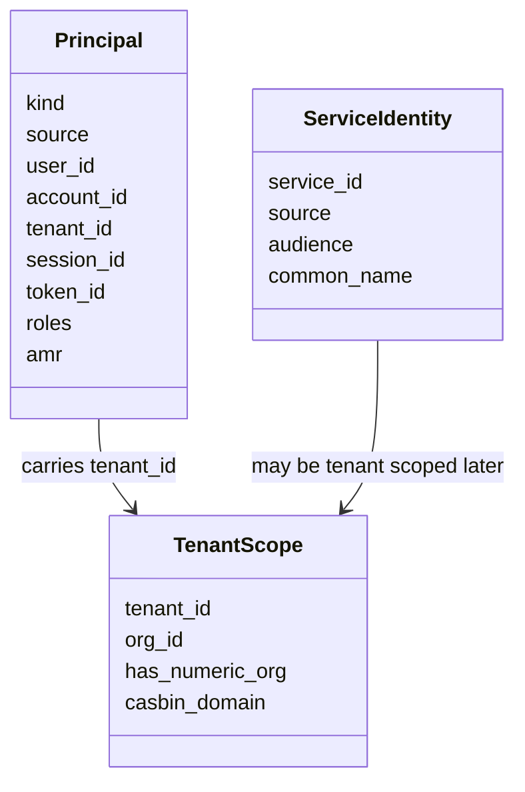
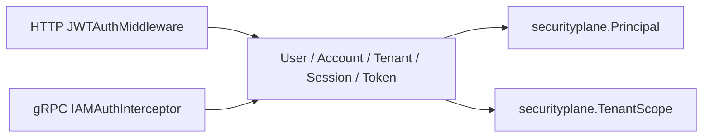

# Principal 与 TenantScope

**本文回答**：qs-server 如何把 HTTP JWT、gRPC JWT 和服务身份投影成可理解的身份模型；`tenant_id` 与业务 `org_id` 为什么不能混为一个字段。

## 30 秒结论

| 模型 | 解决的问题 | 当前代码来源 |
| ---- | ---------- | ------------ |
| `Principal` | “谁在调用” | HTTP `UserClaims`、gRPC context、service auth |
| `TenantScope` | “在哪个租户 / 组织范围内调用” | IAM `tenant_id`，可解析时映射为 QS `org_id` |
| `ServiceIdentity` | “哪个服务在调用” | service token 或 mTLS certificate identity |

## 模型图



## 为什么 tenant_id 和 org_id 分开

IAM 的 `tenant_id` 是字符串声明，QS 业务中大量聚合使用数字 `org_id`。当前中间件策略是：

| 情况 | 行为 |
| ---- | ---- |
| `tenant_id="88"` | 可投影为 `org_id=88` |
| `tenant_id="tenant-alpha"` | 保留原始 tenant，不产生数字 org |
| `tenant_id=""` | 需要租户的接口拒绝 |
| `tenant_id="0"` | 对 QS 数字组织范围无效 |

这个设计避免把 IAM 的租户命名策略强行绑定到 QS 的业务主键。需要数字组织范围的 REST 路由必须继续经过 `RequireNumericOrgScopeMiddleware`。

## HTTP 与 gRPC 对齐



当前运行时已经接入同一类投影：HTTP identity middleware 在保留旧 gin keys 的同时写入 `Principal` / `TenantScope`，gRPC 通过 context getter 从既有 IAMAuth context keys 投影同一模型。

## 设计取舍

| 选择 | 原因 | 代价 |
| ---- | ---- | ---- |
| `Principal` 是只读值对象 | 不让业务层依赖 transport context 细节 | 不承接鉴权策略，只承接运行时视图 |
| 保留 JWT roles | 用于身份声明、兼容旧接口和展示 | capability 不可直接信任 roles |
| `TenantScope` 显式保存 raw tenant | 兼容非数字 IAM tenant | 业务层需要明确是否需要 numeric org |

## 代码与测试锚点

| 能力 | 锚点 |
| ---- | ---- |
| 模型 | [`internal/pkg/securityplane/model.go`](../../../internal/pkg/securityplane/model.go) |
| 运行时投影 | [`internal/pkg/securityprojection/projection.go`](../../../internal/pkg/securityprojection/projection.go) |
| HTTP claims | [`internal/pkg/middleware/jwt_auth.go`](../../../internal/pkg/middleware/jwt_auth.go) |
| HTTP context projection | [`internal/pkg/httpauth/identity.go`](../../../internal/pkg/httpauth/identity.go) |
| gRPC context projection | [`internal/pkg/grpc/context.go`](../../../internal/pkg/grpc/context.go) |
| contract tests | [`internal/pkg/middleware/jwt_auth_test.go`](../../../internal/pkg/middleware/jwt_auth_test.go)、[`internal/pkg/grpc/interceptor_auth_test.go`](../../../internal/pkg/grpc/interceptor_auth_test.go) |

## Verify

```bash
GOTOOLCHAIN=local /Users/yangshujie/.gvm/gos/go1.25.9/bin/go test ./internal/pkg/securityplane ./internal/pkg/securityprojection ./internal/pkg/middleware ./internal/pkg/httpauth ./internal/pkg/grpc
```
