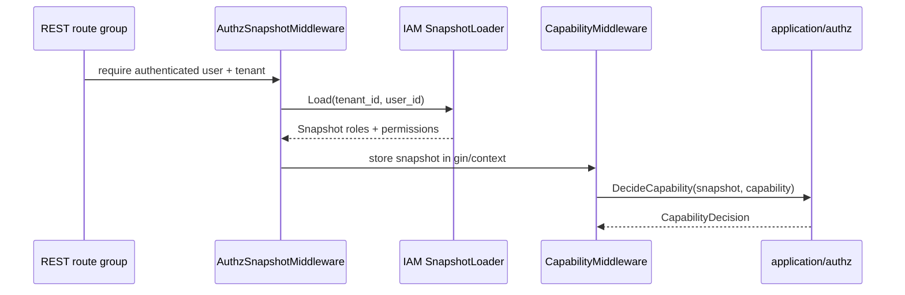
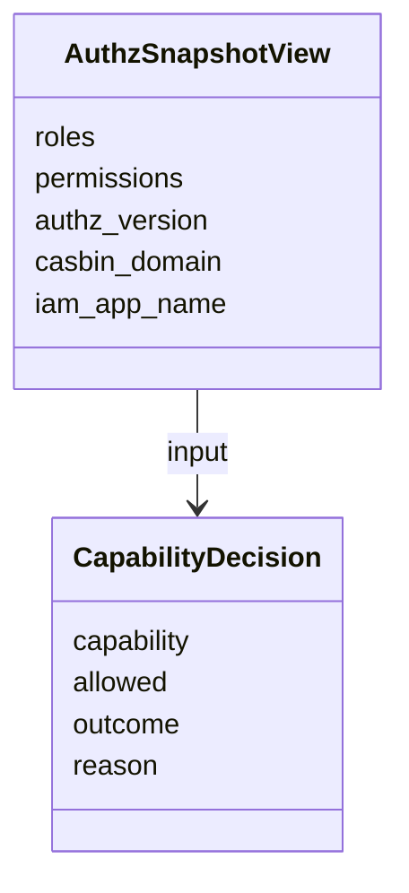

# AuthzSnapshot 与 CapabilityDecision

**本文回答**：为什么 qs-server 的业务权限判断以 IAM authorization snapshot 为真值，而不是直接使用 JWT roles；capability middleware 当前如何保护 REST 路由。

## 30 秒结论

| 主题 | 当前设计 |
| ---- | -------- |
| 权限真值 | [`authz.Snapshot`](../../../internal/apiserver/application/authz/snapshot.go) |
| capability 判断 | [`DecideCapability`](../../../internal/apiserver/application/authz/capability.go) / [`DecideAnyCapability`](../../../internal/apiserver/application/authz/capability.go) |
| REST 保护 | `RequireCapabilityMiddleware` / `RequireAnyCapabilityMiddleware` |
| JWT roles | 只作为身份声明和投影输入，不作为 capability 真值 |
| 运行时模型 | middleware 已消费 `securityplane.CapabilityDecision`，旧 bool API 只作兼容 |

## 能力判断流程



## CapabilityDecision 模型



`CapabilityDecision` 是当前 runtime seam：middleware 通过它获得 `allowed / denied / missing_snapshot / unknown_capability`，但 HTTP 403 envelope 与错误文案保持兼容。`SnapshotSatisfiesCapability` 保留为旧 bool API，不再作为新运行时主路径。

## 为什么不信任 JWT roles

| 方案 | 问题 | 当前选择 |
| ---- | ---- | -------- |
| 用 JWT roles 判断业务权限 | token 可能滞后，无法表达 resource/action，难处理 IAM 授权版本失效 | 不采用 |
| 每次 handler 直接查 IAM | handler 侵入 IAM SDK，性能和失败面扩大 | 不采用 |
| 请求入口加载 AuthzSnapshot | 和 IAM policy 对齐，可缓存、可 version invalidation，可被 middleware 统一消费 | 当前采用 |

## capability 边界

| capability | 典型含义 |
| ---------- | -------- |
| `org_admin` | 组织管理员能力 |
| `read_questionnaires` / `manage_questionnaires` | 问卷读写能力 |
| `read_scales` / `manage_scales` | 量表读写能力 |
| `manage_evaluation_plans` | 计划与任务管理能力 |
| `evaluate_assessments` | 测评评估/重试能力 |

完整映射以 [`capability.go`](../../../internal/apiserver/application/authz/capability.go) 为准。

## 取舍与边界

- snapshot 是请求期投影，不是长期持久化权限副本。
- operator 本地 roles 是展示/兼容投影，不是 capability 真值。
- middleware 返回 `ErrPermissionDenied` envelope，本轮不改错误格式。
- 当前 capability 是粗粒度枚举；更细 ACL 或资源级授权要单独建模。

## 代码与测试锚点

| 能力 | 锚点 |
| ---- | ---- |
| Snapshot | [`internal/apiserver/application/authz/snapshot.go`](../../../internal/apiserver/application/authz/snapshot.go) |
| Capability | [`internal/apiserver/application/authz/capability.go`](../../../internal/apiserver/application/authz/capability.go) |
| REST middleware | [`internal/apiserver/transport/rest/middleware/capability_middleware.go`](../../../internal/apiserver/transport/rest/middleware/capability_middleware.go) |
| route usage | [`internal/apiserver/transport/rest`](../../../internal/apiserver/transport/rest) |
| tests | [`internal/apiserver/application/authz/capability_test.go`](../../../internal/apiserver/application/authz/capability_test.go)、[`internal/apiserver/transport/rest/middleware/capability_middleware_test.go`](../../../internal/apiserver/transport/rest/middleware/capability_middleware_test.go)、[`internal/pkg/securityplane/architecture_test.go`](../../../internal/pkg/securityplane/architecture_test.go) |

## Verify

```bash
GOTOOLCHAIN=local /Users/yangshujie/.gvm/gos/go1.25.9/bin/go test ./internal/apiserver/application/authz ./internal/apiserver/transport/rest/middleware ./internal/pkg/securityplane
```
