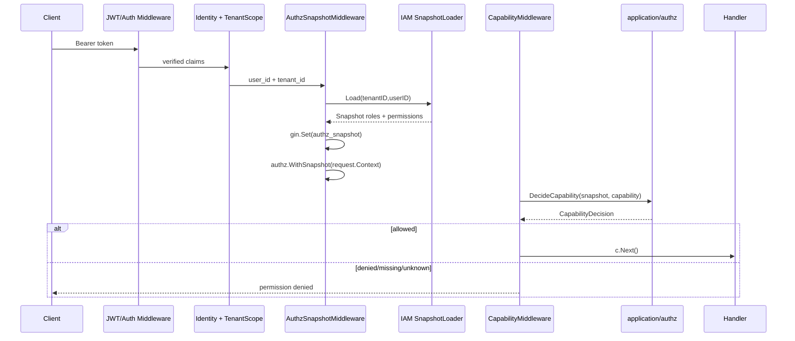

# AuthzSnapshot 与 CapabilityDecision

**本文回答**：qs-server 为什么以 IAM Authorization Snapshot 作为业务权限判断真值，而不是直接使用 JWT roles；`authz.Snapshot`、`AuthzSnapshotView`、`CapabilityDecision`、`RequireCapabilityMiddleware` 如何协作；新增 capability 时应该如何维护 resource/action 映射、测试和文档。

---

## 30 秒结论

| 主题 | 结论 |
| ---- | ---- |
| 权限真值 | `authz.Snapshot` 是 IAM `GetAuthorizationSnapshot` 在单次请求内的授权投影 |
| Snapshot 内容 | roles、permissions(resource/action)、authz_version、casbin_domain、iam_app_name |
| 能力判断 | `DecideCapability` / `DecideAnyCapability` 基于 Snapshot 的 resource/action 判断 |
| REST 保护 | `RequireCapabilityMiddleware` / `RequireAnyCapabilityMiddleware` 读取 Gin context 中的 AuthzSnapshot |
| gRPC 对齐 | `AuthzSnapshotUnaryInterceptor` 在 IAM JWT 后加载 Snapshot 并写入 context |
| JWT roles | 只作为身份声明和展示投影，不作为业务 capability 真值 |
| Operator roles | 本地 Operator roles 是 IAM roles 的投影，不作为 capability 真值 |
| Decision 结果 | allowed / denied / missing_snapshot / unknown_capability / invalid_scope |
| 关键边界 | capability 是粗粒度业务能力枚举；更细资源级 ACL 需要单独建模 |

一句话概括：

> **Principal 说明“你是谁”，TenantScope 说明“你在哪个组织”，AuthzSnapshot + CapabilityDecision 才说明“你能不能做这件事”。**

---

## 1. 为什么不能直接用 JWT roles

JWT roles 看似方便，但不适合作为业务权限真值。

| 问题 | 风险 |
| ---- | ---- |
| Token 可能滞后 | 用户权限变更后旧 token 仍带旧 roles |
| roles 粒度粗 | 很难表达 `qs:questionnaires/read` 这类 resource/action |
| 缺少 authz version | 难判断授权快照是否变化 |
| 与 IAM policy 可能漂移 | QS 本地自行解释 roles 容易和 IAM 不一致 |
| 难支持 Casbin domain | 多租户/组织域边界不清 |
| handler 直接读 roles | 权限逻辑散落，难审计 |

所以当前采用：

```text
请求入口加载 IAM AuthzSnapshot
  -> middleware/application 基于 snapshot 判断 capability
```

JWT roles 可以保留为身份视图、展示字段或投影输入，但不能直接决定业务能力。

---

## 2. 授权链路总图



---

## 3. Snapshot 模型

`authz.Snapshot` 字段：

| 字段 | 说明 |
| ---- | ---- |
| Roles | IAM snapshot roles |
| Permissions | IAM resource/action permissions |
| AuthzVersion | 授权版本 |
| CasbinDomain | Casbin domain |
| IAMAppName | IAM app name |

`Permission` 字段：

| 字段 | 说明 |
| ---- | ---- |
| Resource | 资源，例如 `qs:questionnaires` |
| Action | 动作，例如 `read`，也可能是 `read&update` 组合串 |

### 3.1 WithSnapshot / FromContext

Snapshot 可以写入 request context：

```text
authz.WithSnapshot(ctx, snap)
```

应用层可通过：

```text
authz.FromContext(ctx)
```

读取。

### 3.2 SubjectKey

`SubjectKey(userIDStr)` 固定为：

```text
user:{user_id}
```

与 IAM Assignment / Casbin subject 对齐。

---

## 4. Permission 判断

### 4.1 HasResourceAction

`Snapshot.HasResourceAction(resource,want)` 支持：

- 资源精确匹配。
- `qs:*` 通配资源。
- action 精确匹配。
- action 组合串，例如 `read|update`。
- action 通配：`.*` / `*`。

### 4.2 actionCovers

`actionCovers(have,want)` 逻辑：

| have | want | 结果 |
| ---- | ---- | ---- |
| `read` | `read` | true |
| `read&update` | `update` | true |
| `.*` | `read` | true |
| `*` | `delete` | true |
| `read` | `delete` | false |

### 4.3 IsQSAdmin

`IsQSAdmin()` 判断：

1. roles 包含 `qs:admin`。
2. 或 permissions 包含 `qs:*` 且 action 覆盖 `read`。

注意：这是基于 IAM snapshot 的 admin 判断，不是直接信任 JWT roles。

---

## 5. AuthzSnapshotView

`securityplane.AuthzSnapshotView` 是 transport-agnostic 只读视图。

字段：

| 字段 | 说明 |
| ---- | ---- |
| Roles | snapshot roles |
| Permissions | AuthzPermissionView |
| AuthzVersion | 授权版本 |
| CasbinDomain | Casbin domain |
| IAMAppName | IAM app name |

`SnapshotViewFromSnapshot(s)` 会把 application/authz 的 Snapshot 投影成 securityplane 视图。

用途：

- 文档统一语言。
- 安全状态展示。
- 测试/排障。
- 与 Security Control Plane 其它模型对齐。

它不替代 application/authz.Snapshot 本身。

---

## 6. Capability 清单

当前 `authz.Capability`：

| Capability | 说明 |
| ---------- | ---- |
| `org_admin` | 机构管理员 |
| `read_questionnaires` | 读取问卷 |
| `manage_questionnaires` | 管理问卷 |
| `read_scales` | 读取量表 |
| `manage_scales` | 管理量表 |
| `read_answersheets` | 读取答卷 |
| `manage_evaluation_plans` | 管理测评计划 |
| `evaluate_assessments` | 触发/重试测评 |

### 6.1 capability 是粗粒度业务能力

Capability 是为了路由/middleware 使用的粗粒度能力枚举。

它不是：

- IAM permission 全量模型。
- route path。
- HTTP method。
- Casbin policy。
- service ACL。

更细粒度资源/对象级权限要单独建模。

---

## 7. Capability 到 resource/action 的映射

| Capability | Resource / Action |
| ---------- | ----------------- |
| `org_admin` | `IsQSAdmin()` |
| `read_questionnaires` | `qs:questionnaires` read/list，或 QS admin |
| `manage_questionnaires` | `qs:questionnaires` create/update/delete/publish/unpublish/archive/statistics，或 QS admin |
| `read_scales` | `qs:scales` read/list，或 QS admin |
| `manage_scales` | `qs:scales` create/update/delete/publish/unpublish/archive，或 QS admin |
| `read_answersheets` | `qs:answersheets` read/list/statistics，或 QS admin |
| `manage_evaluation_plans` | 同时具备 evaluation_plans 管理动作与 evaluation_plan_tasks 任务动作，或 QS admin |
| `evaluate_assessments` | `qs:assessments` retry 或 batch_evaluate，或 QS admin |

### 7.1 manage_evaluation_plans 的特殊性

该能力要求两个资源同时满足：

```text
qs:evaluation_plans
+
qs:evaluation_plan_tasks
```

因为计划管理既涉及 plan，也涉及 task 调度/打开/完成/取消等能力。

---

## 8. CapabilityDecision

`securityplane.CapabilityDecision` 字段：

| 字段 | 说明 |
| ---- | ---- |
| Capability | 能力名 |
| Allowed | 是否允许 |
| Outcome | 判断结果枚举 |
| Reason | 可读解释 |

### 8.1 Outcome

| Outcome | 说明 |
| ------- | ---- |
| `allowed` | snapshot 满足 capability |
| `denied` | snapshot 存在，但权限不满足 |
| `missing_snapshot` | 未注入授权快照 |
| `unknown_capability` | capability 未注册 |
| `invalid_scope` | scope 无效，当前为模型 seam |

### 8.2 DecideCapability

流程：

1. snapshot nil -> missing_snapshot。
2. capability 未注册 -> unknown_capability。
3. capabilityAllowed -> allowed。
4. 否则 denied。

### 8.3 DecideAnyCapability

流程：

1. snapshot nil -> missing_snapshot。
2. 遍历多个 capability。
3. 任一 allowed 即 allowed。
4. 如果全部 unknown -> unknown_capability。
5. 有 known 但都 denied -> denied。

---

## 9. REST Capability Middleware

### 9.1 RequireCapabilityMiddleware

流程：

1. `GetAuthzSnapshot(c)`。
2. snapshot nil -> permission denied。
3. `DecideCapability(snap, capability)`。
4. decision not allowed -> permission denied。
5. allowed -> `c.Next()`。

### 9.2 RequireAnyCapabilityMiddleware

流程：

1. 读取 snapshot。
2. `DecideAnyCapability(snap, capabilities...)`。
3. 任一 allowed -> `c.Next()`。
4. 否则 permission denied。

### 9.3 Error envelope

当前 middleware 使用既有 `ErrPermissionDenied` / `core.WriteResponse` 语义。

本轮文档重建不改变 HTTP error envelope。

---

## 10. AuthzSnapshotMiddleware

HTTP `AuthzSnapshotMiddleware`：

1. loader nil -> 503。
2. tenantID/userID 缺失 -> 400。
3. loader.Load(tenantID,userID) 失败 -> 503。
4. 成功后：
   - gin.Set(`authz_snapshot`)。
   - `authz.WithSnapshot(request.Context,snap)`。
   - `actorctx.WithGrantingUserID`。
5. 如果有 OperatorRoleProjectionUpdater 且当前 active operator 存在，则把 IAM roles 投影回本地 Operator。

### 10.1 为什么加载失败是 503

加载 snapshot 失败表示当前系统无法确认授权状态。

为了避免权限绕过，不能默认放行。

---

## 11. gRPC AuthzSnapshotUnaryInterceptor

gRPC interceptor：

1. 跳过 health/reflection。
2. 从 context 读取 tenantID/userID。
3. 如果 tenantID/userID 缺失，直接 handler，不注入 snapshot。
4. tenantID 不是数字 -> InvalidArgument。
5. loader.Load 失败 -> Unavailable。
6. 成功后：
   - authz.WithSnapshot(ctx,snap)。
   - actorctx.WithGrantingUserID。
   - 如有 updater，按 org/user 投影 Operator roles。

### 11.1 与 HTTP 差异

HTTP 对需要授权的 REST 路由通常强制 snapshot。

gRPC interceptor 对缺少身份的 skip/internal/health 等方法会直接 handler，避免对健康检查和反射拉授权快照。

---

## 12. JWT Roles、Snapshot Roles、本地 Operator Roles

| 类型 | 来源 | 用途 | 是否是 capability 真值 |
| ---- | ---- | ---- | ---------------------- |
| JWT roles | token claims | 身份视图、兼容、展示 | 否 |
| Snapshot roles | IAM authorization snapshot | 参与 admin 判断和投影 | 是 snapshot 的一部分 |
| Operator local roles | 本地 Operator projection | 展示/协作/本地查询 | 否 |
| CapabilityDecision | application/authz | 路由能力判断 | 是当前中间件判断结果 |

### 12.1 正确用法

```text
路由鉴权 -> CapabilityDecision
展示 operator 角色 -> Operator local roles
排查 token -> Principal.Roles
排查授权 -> AuthzSnapshot roles + permissions
```

---

## 13. 与 TenantScope 的关系

Capability 判断需要明确租户/组织范围。

当前链路：

```text
Principal.TenantID
  -> TenantScope
  -> tenantID + userID
  -> SnapshotLoader.Load
  -> Snapshot.CasbinDomain / permissions
  -> CapabilityDecision
```

如果 tenant_id 缺失或不是 numeric org：

- HTTP 业务路由会被租户 middleware 拒绝。
- gRPC authz snapshot interceptor 对非数字 tenant 会返回 InvalidArgument。

---

## 14. 设计模式与取舍

| 模式 | 当前实现 | 意图 |
| ---- | -------- | ---- |
| Snapshot | authz.Snapshot | 请求期授权投影 |
| Decision Object | CapabilityDecision | 能力判断可解释 |
| Middleware Guard | RequireCapabilityMiddleware | 路由级保护 |
| Context Injection | authz.WithSnapshot | 应用层可读取授权快照 |
| Projection | SnapshotViewFromSnapshot | 安全控制面统一视图 |
| Anti-Corruption Layer | SnapshotLoader | 隔离 IAM SDK |
| Operator Projection | RoleProjectionUpdater | 本地角色视图同步 |

---

## 15. 设计取舍

| 设计 | 收益 | 代价 |
| ---- | ---- | ---- |
| 请求期加载 snapshot | 权限接近 IAM 真值 | IAM 不可用会影响请求 |
| 不信任 JWT roles | 避免权限滞后/绕过 | 需要 snapshot middleware |
| Capability 粗粒度 | 路由使用简单 | 细粒度 ACL 需另建模 |
| Decision 带 Reason | 排障清楚 | middleware 当前不暴露详细原因 |
| Operator roles 投影 | 本地展示方便 | 投影可能滞后 |
| Snapshot nil 拒绝 | 安全优先 | 可能因 IAM 故障拒绝请求 |

---

## 16. 当前不做什么

当前不做：

- 不用 JWT roles 直接放行业务能力。
- 不把本地 Operator roles 当授权真值。
- 不在 handler 中直接调用 IAM 判断权限。
- 不在 capability middleware 中实现对象级 ACL。
- 不改变 HTTP permission denied envelope。
- 不把 capability 与 service ACL 混用。
- 不把 snapshot 长期持久化为本地权限副本。

---

## 17. 关键不变量

1. 需要 capability 的路由必须先加载 AuthzSnapshot。
2. Snapshot 缺失时不得放行。
3. Capability 必须是已注册枚举。
4. Capability 判断只基于 snapshot resource/action 和 admin 语义。
5. JWT roles 不能作为 capability 真值。
6. Operator local roles 不能作为 capability 真值。
7. gRPC 与 HTTP 的 snapshot 注入语义要尽量对齐。
8. 新 capability 必须补映射、middleware 测试和文档。

---

## 18. 常见误区

### 18.1 “JWT roles 有 qs:admin 就够了”

不够。必须通过 AuthzSnapshot 判断 admin 或 resource/action。

### 18.2 “Snapshot roles 和 JWT roles 一样”

不一样。Snapshot roles 是请求期 IAM 授权快照的一部分，JWT roles 是 token claims。

### 18.3 “Operator 本地 roles 可以拿来鉴权”

不应。它是投影，不是权限真值。

### 18.4 “missing_snapshot 可以默认放行”

不能。无法确认授权时应拒绝或返回服务不可用。

### 18.5 “unknown_capability 可以当 denied 忽略”

不应该只是忽略。unknown 通常说明代码或文档没有同步，需要修复。

### 18.6 “Capability 足够表达所有权限”

不一定。Capability 是路由级粗粒度能力，更细粒度对象 ACL 需要独立设计。

---

## 19. 排障路径

### 19.1 authorization snapshot required

检查：

1. AuthzSnapshotMiddleware 是否挂载。
2. JWT/UserIdentity 是否在它之前执行。
3. tenantID/userID 是否存在。
4. GetAuthzSnapshot 是否读取正确 key。
5. 是否为无需授权的公开路由。

### 19.2 failed to load authorization snapshot

检查：

1. IAM SnapshotLoader 是否配置。
2. IAM 服务是否可用。
3. tenantID/userID 是否正确。
4. IAM app name。
5. Casbin domain。
6. IAM timeout/backpressure。

### 19.3 capability denied

检查：

1. capability 是否正确。
2. Snapshot roles。
3. Snapshot permissions。
4. resource/action 映射。
5. 是否 QS admin。
6. tenant/casbin domain 是否正确。
7. IAM policy 是否已发布/同步。

### 19.4 unknown_capability

检查：

1. capability 是否在 `isKnownCapability` 注册。
2. middleware route 是否引用了错误常量。
3. 文档和能力列表是否同步。
4. 测试是否覆盖新增 capability。

### 19.5 gRPC InvalidArgument tenant_id numeric

检查：

1. gRPC IAMAuthInterceptor 是否注入 tenantID。
2. tenantID 是否数字。
3. 当前 RPC 是否需要 QS org。
4. IAM token 签发策略。

---

## 20. 修改指南

### 20.1 新增 Capability

步骤：

1. 在 `authz.Capability` 增加常量。
2. 更新 `isKnownCapability`。
3. 更新 `capabilityAllowed` 映射。
4. 如需多个资源共同满足，明确 AND/OR 语义。
5. 更新 REST middleware route 使用。
6. 更新 capability tests。
7. 更新本文档和 README。
8. 更新 IAM policy 文档或配置。

### 20.2 修改 resource/action 映射

必须：

1. 对照 IAM Casbin policy。
2. 明确 admin 是否绕过。
3. 补 denied/allowed tests。
4. 更新文档。
5. 检查现有路由是否受影响。

### 20.3 新增对象级权限

不要直接塞进 Capability。

应单独设计：

- 资源对象 ID。
- 资源 owner/org。
- ACL source。
- IAM resource pattern。
- 决策缓存。
- error envelope。
- audit log。

---

## 21. 代码锚点

- Snapshot：[../../../internal/apiserver/application/authz/snapshot.go](../../../internal/apiserver/application/authz/snapshot.go)
- Capability：[../../../internal/apiserver/application/authz/capability.go](../../../internal/apiserver/application/authz/capability.go)
- AuthzSnapshotMiddleware：[../../../internal/apiserver/transport/rest/middleware/authz_snapshot_middleware.go](../../../internal/apiserver/transport/rest/middleware/authz_snapshot_middleware.go)
- Capability middleware：[../../../internal/apiserver/transport/rest/middleware/capability_middleware.go](../../../internal/apiserver/transport/rest/middleware/capability_middleware.go)
- gRPC AuthzSnapshot interceptor：[../../../internal/apiserver/transport/grpc/authz_snapshot_interceptor.go](../../../internal/apiserver/transport/grpc/authz_snapshot_interceptor.go)
- Security model：[../../../internal/pkg/securityplane/model.go](../../../internal/pkg/securityplane/model.go)

---

## 22. Verify

```bash
go test ./internal/apiserver/application/authz
go test ./internal/apiserver/transport/rest/middleware
go test ./internal/apiserver/transport/grpc
go test ./internal/pkg/securityplane
```

如果修改路由 capability：

```bash
go test ./internal/apiserver/router_matrix_test.go
```

如果修改文档：

```bash
make docs-hygiene
git diff --check
```

---

## 23. 下一跳

| 目标 | 文档 |
| ---- | ---- |
| ServiceIdentity 与 mTLS-ACL | [03-ServiceIdentity与mTLS-ACL.md](./03-ServiceIdentity与mTLS-ACL.md) |
| OperatorRoleProjection | [04-OperatorRoleProjection.md](./04-OperatorRoleProjection.md) |
| 新增安全能力 SOP | [05-新增安全能力SOP.md](./05-新增安全能力SOP.md) |
| Principal 与 TenantScope | [01-Principal与TenantScope.md](./01-Principal与TenantScope.md) |
| 回看整体架构 | [00-整体架构.md](./00-整体架构.md) |
