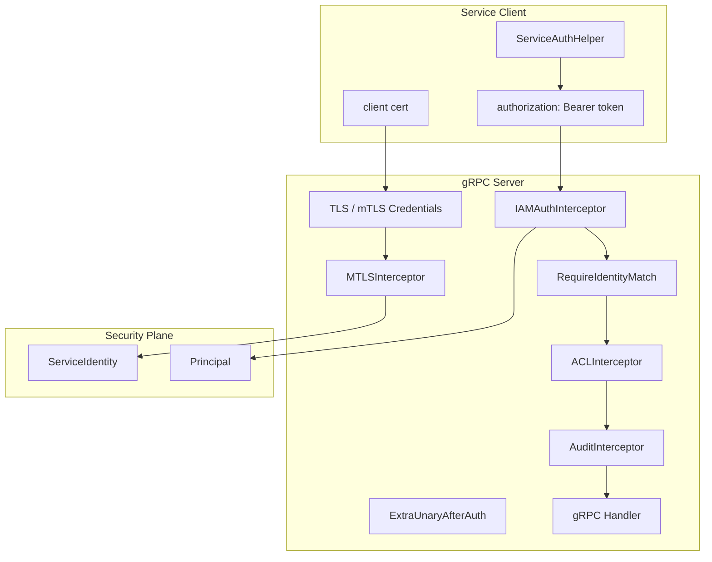

# ServiceIdentity 与 mTLS / ACL

**本文回答**：qs-server 的服务间安全由哪些层组成；service auth bearer metadata、ServiceIdentity 投影、mTLS 身份、JWT service_id 与证书 CN 的一致性校验、gRPC ACL/Audit 拦截器分别负责什么；哪些是当前实现，哪些只是后续 seam；它们和用户级 Principal / Capability 的边界在哪里。

---

## 30 秒结论

| 能力 | 当前状态 |
| ---- | -------- |
| Service Auth | apiserver / collection-server 都有 ServiceAuthHelper，复用共享 bearer metadata helper，向 gRPC metadata 写入 `authorization: Bearer <token>` |
| ServiceIdentity | ServiceAuthHelper 暴露 `ServiceIdentity()` 只读投影，包含 service_id 和 target audience |
| mTLS | gRPC server 通过 component-base mTLS credentials 和 MTLSInterceptor 提取客户端身份 |
| Identity Match | IAMAuthInterceptor 可在 `RequireIdentityMatch` 开启时校验 JWT `service_id` 与 mTLS certificate CN 是否匹配 |
| ACL | gRPC server 支持 ACLInterceptor seam，但 `loadACLConfig` 当前只构造 default policy，文件加载仍是 TODO |
| Audit | gRPC server 支持 AuditInterceptor，用于记录服务调用审计 |
| Transport Security | `serviceauth.RequireTransportSecurity()` 当前返回 false，是兼容契约，不代表长期安全策略 |
| 核心边界 | ServiceIdentity 解决“哪个服务在调用”，Principal/Capability 解决“哪个用户有什么业务能力” |
| 当前不做 | 不把 service auth 当用户权限，不把 mTLS 当完整授权，不把 ACL 文档写成已完整落地的能力 |

一句话概括：

> **service auth 证明服务 token，mTLS 证明连接身份，ACL 限制服务可访问的方法；三者都属于服务间安全，不替代用户级 AuthzSnapshot / CapabilityDecision。**

---

## 1. 为什么需要服务间安全分层

qs-server 存在多类服务间调用：

```text
collection-server -> qs-apiserver
qs-apiserver -> IAM
qs-worker -> qs-apiserver
future service -> internal gRPC
```

这些调用需要回答不同问题：

| 问题 | 对应层 |
| ---- | ------ |
| 调用方是否带了合法服务 token？ | service auth |
| 调用方连接是否来自可信证书？ | mTLS |
| token 里的 service_id 是否和证书 CN 一致？ | identity match |
| 调用方服务能否访问这个 gRPC method？ | ACL |
| 这次调用是否应该被审计？ | Audit |
| 调用方是否代表某个用户？ | Principal / AuthzSnapshot |

如果把这些混在一起，会导致：

- mTLS 被误当业务授权。
- service token 被误当用户身份。
- ACL 被误当 capability。
- JWT service_id 和证书身份不一致仍可访问。
- 内部服务权限边界无法审计。

---

## 2. 服务间安全总图



---

## 3. ServiceAuthHelper

apiserver 和 collection-server 都有 ServiceAuthHelper。

### 3.1 职责

ServiceAuthHelper 负责：

- 使用 IAM SDK 创建 service auth helper。
- 基于 ServiceID 和 TargetAudience 获取服务 token。
- 实现 `credentials.PerRPCCredentials`。
- 为 gRPC 调用生成 bearer metadata。
- 暴露 ServiceIdentity 只读投影。
- 停止后台刷新。
- 返回刷新统计。

### 3.2 不负责

ServiceAuthHelper 不负责：

- 用户身份认证。
- 用户 capability 判断。
- mTLS 证书校验。
- ACL 决策。
- 业务权限。
- token 持久化。
- service-to-service policy。

---

## 4. ServiceAuthConfig

ServiceAuthConfig 字段：

| 字段 | 说明 |
| ---- | ---- |
| ServiceID | 当前服务标识，例如 `collection-server`、`qs-apiserver` |
| TargetAudience | 目标服务 audience，例如 `iam-service`、`qs-apiserver` |
| TokenTTL | token 有效期秒数 |
| RefreshBefore | 提前刷新秒数 |

这些配置会转换成 IAM SDK `ServiceAuthConfig`。

---

## 5. Bearer Metadata 契约

共享 helper：

```text
internal/pkg/serviceauth
```

### 5.1 BearerRequestMetadata

`BearerRequestMetadata(ctx, provider)`：

1. provider nil -> error。
2. `provider.GetToken(ctx)`。
3. 返回：

```text
authorization: Bearer {token}
```

### 5.2 PerRPCCredentials

ServiceAuthHelper 实现：

```go
GetRequestMetadata(ctx,...)
RequireTransportSecurity()
```

用于：

```text
grpc.WithPerRPCCredentials(authHelper)
```

### 5.3 RequireTransportSecurity

当前共享契约：

```go
RequireTransportSecurity() bool { return false }
```

这表示当前保持兼容部署，不强制 gRPC credentials 必须在 TLS 上运行。

注意：这不是安全目标，只是当前代码行为。生产是否要求 mTLS/TLS 需要单独配置和策略。

---

## 6. ServiceIdentity

### 6.1 service auth 投影

`serviceauth.ServiceIdentity(serviceID,audience)` 生成：

```text
ServiceIdentity{
  ServiceID: serviceID,
  Source: service_auth,
  TargetAudience: audience,
}
```

apiserver / collection-server 的 ServiceAuthHelper 都暴露：

```go
ServiceIdentity() securityplane.ServiceIdentity
```

### 6.2 mTLS 投影

`ServiceIdentityFromMTLSContext(ctx)`：

1. 读取 mTLS identity。
2. 取 common_name。
3. `serviceID = strings.TrimSuffix(commonName, ".svc")`。
4. 生成：

```text
ServiceIdentity{
  Source: mtls,
  ServiceID,
  CommonName,
  Namespace,
}
```

### 6.3 ServiceIdentity 不是什么

ServiceIdentity 不是：

- 用户 Principal。
- 业务权限结果。
- AuthzSnapshot。
- Operator。
- JWT claims 全量。
- ACL Decision。

它只表达服务主体身份视图。

---

## 7. mTLS 层

gRPC server 创建时：

1. 如果 `config.MTLS.Enabled`：
   - 使用 component-base mTLS config。
   - 创建 `basemtls.NewServerCredentials`。
   - 加入 gRPC server option。
2. 否则如果 TLS 配置存在：
   - 使用单向 TLS。
3. 否则：
   - insecure 模式启动并输出 warning。

### 7.1 MTLSInterceptor

如果 mTLS enabled，拦截器链加入：

```text
basegrpc.MTLSInterceptor()
```

它负责从连接中提取客户端证书身份并写入 context。

### 7.2 mTLS 的作用

mTLS 证明：

```text
这个连接来自持有可信客户端证书的调用方
```

它不自动证明：

```text
该服务可以访问某个业务方法
```

业务方法访问还需要 service token、ACL 或其他策略。

---

## 8. IAMAuthInterceptor 与 service identity match

IAMAuthInterceptor 做：

1. 跳过 health/reflection。
2. 从 metadata 提取 bearer token。
3. 使用 TokenVerifier 验证。
4. 如果 `requiremTLS` 开启，执行 identity match。
5. 注入用户/服务 claims context。
6. 继续 handler。

### 8.1 verifyIdentityMatch

当前逻辑：

1. 从 context 读取 mTLS identity。
2. 获取 client CN。
3. `expectedServiceID = strings.TrimSuffix(clientCN, ".svc")`。
4. 从 JWT claims Extra 中读取 `service_id`。
5. 如果 service_id 存在且不等于 expectedServiceID，则拒绝。

### 8.2 语义

这解决：

```text
Bearer token 声称 service_id=A
但 mTLS certificate CN=B.svc
```

这种身份不一致问题。

### 8.3 当前限制

- 依赖 claims Extra 中存在 service_id。
- mTLS identity 当前读取 map 形态，也保留 legacy `mtls.identity` fallback。
- 未形成完整服务 ACL。
- 不替代用户级 capability。

---

## 9. gRPC Interceptor Chain

当前 unary interceptor 顺序：

```text
1. Recovery
2. RequestID
3. Logging
4. mTLS Identity
5. IAM Authentication
6. ExtraUnaryAfterAuth
7. ACL
8. Audit
```

### 9.1 为什么顺序重要

| 顺序 | 原因 |
| ---- | ---- |
| Recovery 最外层 | 捕获后续 panic |
| RequestID / Logging 在前 | 所有请求都有追踪和日志 |
| mTLS 在 IAM 前 | IAMAuth 可做 mTLS identity match |
| IAM 在 ACL 前 | ACL 需要知道调用身份 |
| ExtraUnaryAfterAuth | 允许业务注入 AuthzSnapshot 等认证后拦截器 |
| ACL 在 Handler 前 | 服务方法访问控制 |
| Audit 靠近 Handler | 记录最终访问 |

### 9.2 ExtraUnaryAfterAuth

这个 seam 可用于：

- AuthzSnapshotUnaryInterceptor。
- 其它需要认证后执行的安全/业务拦截器。

不要把它用于绕过认证。

---

## 10. ACL 层

gRPC server 支持 component-base ACLInterceptor。

### 10.1 当前实现

如果 `config.ACL.Enabled`：

1. 调 `loadACLConfig(config.ACL.ConfigFile, config.ACL.DefaultPolicy)`。
2. 创建 `basegrpc.ACLInterceptor`。
3. 加入 interceptor chain。

### 10.2 loadACLConfig 当前边界

`loadACLConfig` 当前：

- 构造 `ACLConfig{DefaultPolicy, Services: []}`。
- 如果 configFile 不为空，只打印日志：
  - `loading config ... not yet implemented`
- 返回 default policy ACL。

这意味着：

```text
ACL seam 已接入；
ACL 文件加载未实现；
不能把它写成完整可配置 ACL 能力。
```

### 10.3 DefaultPolicy 风险

如果 default_policy = allow：

- 未配置服务规则也可能放行。

如果 default_policy = deny：

- 未配置服务规则可能全部拒绝。

由于文件加载未实现，当前 ACL 行为很大程度取决于 default policy。

---

## 11. Audit 层

如果 `config.Audit.Enabled`：

- 创建 component-base audit logger。
- 加入 AuditInterceptor。
- 记录 gRPC 访问审计。

Audit 不负责授权，只负责记录。

---

## 12. Service Auth、mTLS、ACL 的边界

| 能力 | 回答 | 不回答 |
| ---- | ---- | ------ |
| Service Auth | 服务 token 是否有效 | 连接证书是否可信、method 是否允许 |
| mTLS | 连接客户端证书是否可信 | 服务是否有业务权限 |
| Identity Match | token service_id 与证书 CN 是否一致 | 该 service 是否能访问 method |
| ACL | service 是否允许访问 method | 用户是否有业务 capability |
| Audit | 谁访问了什么 | 是否应该允许 |
| AuthzSnapshot | 用户在租户内有什么业务权限 | 服务间 ACL |

---

## 13. 与用户级 Principal / Capability 的关系

服务间调用可能同时有：

```text
ServiceIdentity
+
Principal
+
AuthzSnapshot
```

### 13.1 典型场景

collection-server 调用 qs-apiserver：

- ServiceIdentity：collection-server。
- Principal：用户 JWT 中的 user。
- TenantScope：用户 tenant/org。
- AuthzSnapshot：用户在 org 内的业务权限。

### 13.2 不要混用

| 不要这样做 | 正确做法 |
| ---------- | -------- |
| 用 ServiceIdentity 判断用户能否管理量表 | 用 AuthzSnapshot + CapabilityDecision |
| 用 Principal.UserID 判断服务能否访问 gRPC method | 用 ServiceIdentity / ACL |
| 用 mTLS CN 当业务用户 | mTLS CN 是服务身份 |
| 用 JWT service_id 代替 mTLS | 两者是不同层 |

---

## 14. 当前不做什么

当前不做：

- 不强制 service auth 必须走 TLS/mTLS。
- 不实现完整 ACL 文件加载。
- 不把 ACL 写成用户级 capability。
- 不把 mTLS CN 当业务用户。
- 不把 service token 生命周期迁移出 IAM SDK。
- 不在 securityplane 中执行 service auth 校验。
- 不改变 gRPC error envelope。
- 不自动推断所有服务间访问策略。

---

## 15. 关键不变量

1. service auth token 通过 bearer metadata 传递。
2. ServiceIdentity 是只读投影，不持有 token。
3. mTLS identity 必须在 IAMAuth 前提取，才能做 identity match。
4. identity match 只校验 service_id 与证书 CN 的一致性，不代表 ACL 授权。
5. ACL 文件加载未实现，不能依赖其做复杂 service policy。
6. 用户级 capability 仍走 AuthzSnapshot。
7. Audit 只记录，不授权。
8. 新 service auth 能力必须补 contract tests。

---

## 16. 常见误区

### 16.1 “ServiceIdentity 就是用户 Principal”

不是。ServiceIdentity 表达服务，Principal 表达认证主体，二者用途不同。

### 16.2 “有 mTLS 就不用 service token”

当前不是这样。mTLS 和 bearer service token 是两层认证信号。

### 16.3 “ACL 已经完整支持配置文件”

不准确。ACL interceptor seam 已接入，但 config file loading 当前是 TODO。

### 16.4 “RequireTransportSecurity=false 表示不需要 TLS”

不应这样理解。它是当前兼容契约，不是安全目标。

### 16.5 “identity match 等于授权”

不是。identity match 只验证 token service_id 与证书 CN 一致。

### 16.6 “Audit 可以替代 ACL”

不能。Audit 是记录，ACL 是访问控制。

---

## 17. 排障路径

### 17.1 service auth helper not initialized

检查：

1. IAM client 是否 enabled。
2. ServiceAuthConfig 是否 nil。
3. IAM 是否支持 IssueServiceToken。
4. ServiceID / TargetAudience。
5. IAM SDK 初始化错误。

### 17.2 gRPC missing authorization token

检查：

1. GetRequestMetadata 是否执行。
2. PerRPCCredentials 是否挂到 DialOption。
3. metadata key 是否是 authorization。
4. token provider 是否返回 token。
5. client 是否使用了正确连接。

### 17.3 token verification failed

检查：

1. TokenVerifier。
2. service token 是否过期。
3. audience 是否匹配。
4. issuer / algorithm。
5. IAM JWKS / remote verification。
6. service auth helper refresh stats。

### 17.4 identity mismatch

检查：

1. mTLS 是否启用。
2. client certificate CN。
3. JWT claims Extra.service_id。
4. CN 是否带 `.svc`。
5. RequireIdentityMatch 是否开启。
6. service_id 命名约定是否一致。

### 17.5 ACL 拒绝或行为异常

检查：

1. ACL enabled。
2. DefaultPolicy。
3. ConfigFile 是否只是 seam，当前未加载。
4. Service identity 是否被 ACL interceptor 识别。
5. 是否误以为 ACL 文件已生效。

---

## 18. 修改指南

### 18.1 新增 service auth 使用方

必须：

1. 定义 ServiceID。
2. 定义 TargetAudience。
3. 配置 TokenTTL / RefreshBefore。
4. 创建 ServiceAuthHelper。
5. 使用 WithPerRPCCredentials。
6. 确认 RequireTransportSecurity 策略。
7. 暴露 ServiceIdentity 只读投影。
8. 补 contract tests。
9. 更新文档。

### 18.2 开启 mTLS identity match

必须：

1. 确认证书 CN 命名规范。
2. 确认 service token Extra.service_id。
3. 开启 mTLS。
4. 开启 RequireIdentityMatch。
5. 补成功/失败测试。
6. 规划 rollout 与回滚。

### 18.3 实现 ACL 文件加载

必须单独设计：

1. ACL 文件格式。
2. default policy。
3. service name 识别来源。
4. allowed/denied method pattern。
5. reload 策略。
6. audit 记录。
7. 测试覆盖。
8. 文档更新。
9. 生产回滚策略。

不要在本轮文档语义中假设 ACL 文件已生效。

---

## 19. 代码锚点

### Shared

- Shared serviceauth：[../../../internal/pkg/serviceauth/bearer.go](../../../internal/pkg/serviceauth/bearer.go)
- Security model：[../../../internal/pkg/securityplane/model.go](../../../internal/pkg/securityplane/model.go)
- Security projection：[../../../internal/pkg/securityprojection/projection.go](../../../internal/pkg/securityprojection/projection.go)

### ServiceAuth

- Apiserver service auth：[../../../internal/apiserver/infra/iam/service_auth.go](../../../internal/apiserver/infra/iam/service_auth.go)
- Collection service auth：[../../../internal/collection-server/infra/iam/service_auth.go](../../../internal/collection-server/infra/iam/service_auth.go)

### gRPC / mTLS / ACL

- gRPC server chain：[../../../internal/pkg/grpc/server.go](../../../internal/pkg/grpc/server.go)
- IAM auth interceptor：[../../../internal/pkg/grpc/interceptor_auth.go](../../../internal/pkg/grpc/interceptor_auth.go)
- gRPC context projection：[../../../internal/pkg/grpc/context.go](../../../internal/pkg/grpc/context.go)

---

## 20. Verify

```bash
go test ./internal/pkg/serviceauth
go test ./internal/pkg/securityplane
go test ./internal/pkg/securityprojection
go test ./internal/pkg/grpc
go test ./internal/apiserver/infra/iam
go test ./internal/collection-server/infra/iam
```

如果修改 mTLS / ACL chain：

```bash
go test ./internal/pkg/grpc
```

如果修改文档：

```bash
make docs-hygiene
git diff --check
```

---

## 21. 下一跳

| 目标 | 文档 |
| ---- | ---- |
| OperatorRoleProjection | [04-OperatorRoleProjection.md](./04-OperatorRoleProjection.md) |
| 新增安全能力 SOP | [05-新增安全能力SOP.md](./05-新增安全能力SOP.md) |
| Principal 与 TenantScope | [01-Principal与TenantScope.md](./01-Principal与TenantScope.md) |
| AuthzSnapshot 与 CapabilityDecision | [02-AuthzSnapshot与CapabilityDecision.md](./02-AuthzSnapshot与CapabilityDecision.md) |
| 回看整体架构 | [00-整体架构.md](./00-整体架构.md) |
