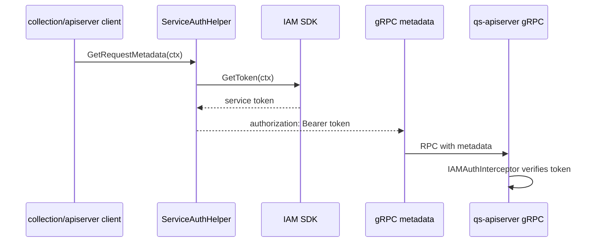
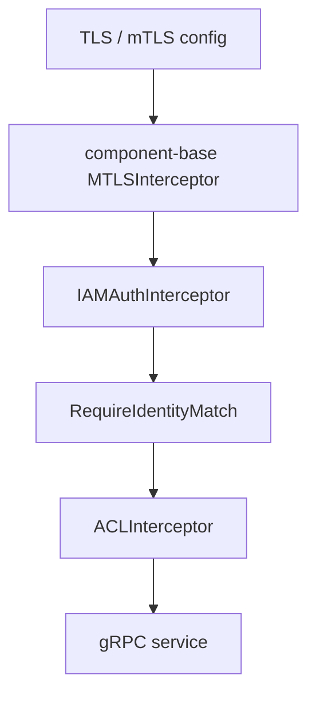

# ServiceIdentity 与 mTLS / ACL

**本文回答**：服务间认证、mTLS 身份和 gRPC ACL 在当前代码中分别解决什么问题；哪些能力已经实现，哪些只是 seam。

## 30 秒结论

| 能力 | 当前状态 |
| ---- | -------- |
| service auth | apiserver / collection 都有 IAM SDK wrapper，写入 `authorization: Bearer <token>` |
| `ServiceIdentity` | P0 新增只读模型，不替换 wrapper |
| mTLS | 由 component-base interceptor 提供，按配置启用 |
| identity match | qs-server 当前 `verifyIdentityMatch` 读取本地 map 形态的 mTLS identity，并保留 legacy `mtls.identity` fallback；P0 只锁事实不改行为 |
| ACL | `loadACLConfig` 当前只创建 default policy，文件加载未实现 |

## 服务调用链



## mTLS / ACL 分层



## 当前设计取舍

| 设计点 | 原因 | 代价 / 后续 |
| ------ | ---- | ----------- |
| service auth wrapper 留在进程 infra | 贴近 IAM client 生命周期和 service config | apiserver / collection 有重复，后续阶段再收口 |
| `RequireTransportSecurity=false` | 保持当前部署兼容 | 不代表长期安全策略，强制 mTLS 需单独决策 |
| ACL 默认策略占位 | 先接入 interceptor seam | 文件加载未实现，不能把 ACL 文档写成完整能力 |
| identity match 不在 P0 修 | 避免改变 mTLS 开启场景行为 | 后续需统一 component-base typed identity 与 qs-server 本地 map 形态 |

## 代码与测试锚点

| 能力 | 锚点 |
| ---- | ---- |
| apiserver service auth | [`internal/apiserver/infra/iam/service_auth.go`](../../../internal/apiserver/infra/iam/service_auth.go) |
| collection service auth | [`internal/collection-server/infra/iam/service_auth.go`](../../../internal/collection-server/infra/iam/service_auth.go) |
| gRPC interceptor chain | [`internal/pkg/grpc/server.go`](../../../internal/pkg/grpc/server.go) |
| IAMAuth identity match | [`internal/pkg/grpc/interceptor_auth.go`](../../../internal/pkg/grpc/interceptor_auth.go) |
| contract tests | [`internal/pkg/grpc/interceptor_auth_test.go`](../../../internal/pkg/grpc/interceptor_auth_test.go)、[`internal/apiserver/infra/iam/service_auth_contract_test.go`](../../../internal/apiserver/infra/iam/service_auth_contract_test.go)、[`internal/collection-server/infra/iam/service_auth_contract_test.go`](../../../internal/collection-server/infra/iam/service_auth_contract_test.go) |

## Verify

```bash
GOTOOLCHAIN=local /Users/yangshujie/.gvm/gos/go1.25.9/bin/go test ./internal/pkg/grpc ./internal/apiserver/infra/iam ./internal/collection-server/infra/iam
```
