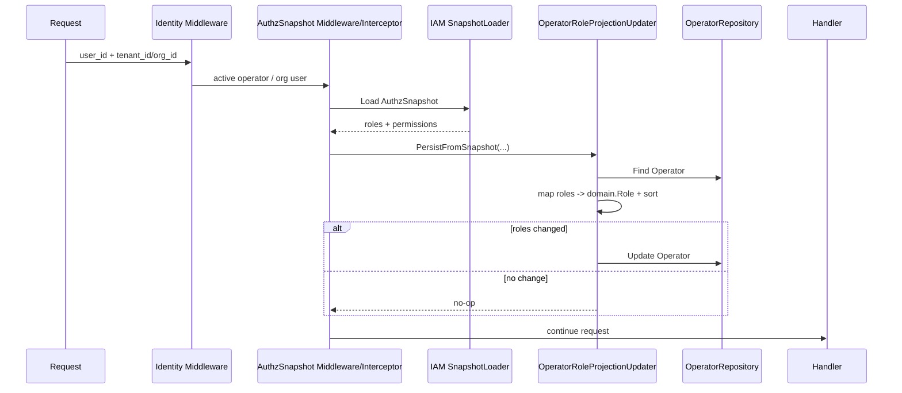

# OperatorRoleProjection

**本文回答**：qs-server 为什么需要把 IAM Authorization Snapshot 中的 roles 投影回本地 Operator；这个投影如何发生；它服务哪些本地展示和查询需求；为什么它不是权限判断真值；HTTP/gRPC 中间件、application updater、infra IAM sync helper 三者如何协作。

---

## 30 秒结论

| 主题 | 结论 |
| ---- | ---- |
| 真值来源 | IAM Authorization Snapshot 的 roles / permissions 是权限来源 |
| 本地 Operator roles | 是 IAM snapshot roles 的本地投影，用于展示、查询和兼容 |
| 写入时机 | HTTP / gRPC AuthzSnapshot 加载成功后，best-effort 持久化本地 Operator roles |
| 应用层 updater | `OperatorRoleProjectionUpdater` 通过 Operator repository 更新本地聚合 |
| infra sync helper | `infra/iam/operator_roles_sync.go` 提供从 IAM 拉快照并替换本地 roles 的 helper |
| 失败策略 | 投影失败只 warning，不阻断当前请求认证/鉴权 |
| 权限判断 | 仍以请求期 AuthzSnapshot + CapabilityDecision 为准，不以本地 Operator roles 为准 |
| 当前重复点 | application updater 与 infra sync helper 有相近投影逻辑，本轮文档固定语义，不强行重构 |
| 后续方向 | 可以收敛成单一 projection service，但不能改变权限真值边界 |

一句话概括：

> **OperatorRoleProjection 是“把 IAM roles 同步到本地 Operator 视图”，不是“用本地 roles 做权限判断”。**

---

## 1. 为什么需要 Operator 本地角色投影

qs-server 中 Operator 是本地业务概念：

```text
某个机构中的后台操作者 / 员工 / 管理员
```

IAM 是身份和授权真值来源：

```text
IAM user
IAM tenant
IAM role assignment
IAM authorization snapshot
```

系统仍然需要本地 Operator roles，是因为：

- 后台人员列表要展示角色。
- Operator 查询要支持本地 role filter。
- 一些页面需要本地资料和角色一起展示。
- 本地 Operator 聚合需要保留与 IAM roles 的同步视图。
- 避免所有展示查询都实时调用 IAM。

但是本地 roles 可能滞后，因此不能作为权限真值。

---

## 2. Projection 总图



---

## 3. 当前触发点

### 3.1 HTTP AuthzSnapshotMiddleware

HTTP 中：

1. AuthzSnapshotMiddleware 加载 IAM snapshot。
2. 写入 gin context 和 request context。
3. 如果 updater 不为空。
4. 如果当前 active operator 存在。
5. 调用：

```text
updater.PersistFromSnapshot(ctx, op, snap)
```

如果失败：

```text
logger.Warnw(...)
请求继续
```

### 3.2 gRPC AuthzSnapshotUnaryInterceptor

gRPC 中：

1. 读取 tenantID/userID。
2. 加载 IAM snapshot。
3. 如果 updater 不为空。
4. tenantID/userID 可解析为数字。
5. 调用：

```text
updater.PersistFromSnapshotByUser(ctx, orgID, userID, snap)
```

如果失败：

```text
logger.Warnw(...)
请求继续
```

---

## 4. OperatorRoleProjectionUpdater 接口

接口定义：

```go
type OperatorRoleProjectionUpdater interface {
    PersistFromSnapshot(ctx, op, snap) error
    PersistFromSnapshotByUser(ctx, orgID, userID, snap) error
    SyncRoles(ctx, orgID, operatorID) error
}
```

注释明确：

```text
这是一种请求期副作用；
失败时只记录日志；
不改变当前请求的认证/鉴权结果。
```

### 4.1 PersistFromSnapshot

输入 active operator result：

1. 根据 operator ID 查询本地 Operator 聚合。
2. 从 snapshot 取 role names。
3. 投影并持久化。

### 4.2 PersistFromSnapshotByUser

输入 orgID + userID：

1. 根据 orgID/userID 查询本地 Operator。
2. 从 snapshot 取 role names。
3. 投影并持久化。

### 4.3 SyncRoles

当前 application updater 中 `SyncRoles` 仍是 no-op seam。

后续可以用于显式同步某个 operator roles。

---

## 5. Application updater 实现

`role_projection_updater.go` 的核心逻辑：

### 5.1 PersistFromSnapshot

```text
repo.FindByID(op.ID)
  -> persistOperatorRolesFromNames(ctx, repo, item, snap.RoleNames())
```

### 5.2 PersistFromSnapshotByUser

```text
repo.FindByUser(orgID, userID)
  -> persistOperatorRolesFromNames(ctx, repo, op, snap.RoleNames())
```

### 5.3 persistOperatorRolesFromNames

流程：

1. roles string -> domain.Role。
2. 按字符串排序。
3. 比较当前 Operator.Roles() 与 projected roles。
4. 如果相同，no-op。
5. 如果不同：
   - `op.ReplaceRolesProjection(projected)`。
   - `repo.Update(ctx, op)`。

### 5.4 为什么排序

排序让 roles 比较稳定，避免 IAM 返回相同 roles 但顺序不同导致重复更新。

---

## 6. Infra IAM sync helper

`infra/iam/operator_roles_sync.go` 提供类似能力。

### 6.1 SyncOperatorRolesFromSnapshot

流程：

1. 根据 orgID 得到 IAM domain。
2. 调 loader.Load(ctx, domainStr, userID)。
3. `ReplaceOperatorRolesProjectionFromSnapshot(op, snap)`。

只替换内存中的 Operator，不持久化。

### 6.2 ReplaceOperatorRolesProjectionFromSnapshot

流程：

1. snap.RoleNames()。
2. role names -> domain.Role。
3. 排序。
4. 与当前 roles 比较。
5. 变化时 `op.ReplaceRolesProjection(out)`。
6. 返回 changed bool。

### 6.3 PersistOperatorRolesProjectionFromSnapshot

流程：

1. Replace。
2. 如果 changed，repo.Update。
3. 返回 changed, error。

### 6.4 SyncAndPersistOperatorRolesFromSnapshot

流程：

1. 从 IAM 拉 snapshot。
2. 替换并持久化本地 Operator roles。
3. 返回 changed, error。

### 6.5 当前重复点

application updater 与 infra helper 都包含：

```text
snapshot role names
  -> domain.Role
  -> sort
  -> compare
  -> ReplaceRolesProjection
  -> repo.Update
```

本轮不重构，只在文档中固定语义：

```text
它们都是 projection；
不是权限真值；
失败不应改变权限判断。
```

---

## 7. Projection 与权限真值的边界

| 模型 | 来源 | 用途 | 是否是权限真值 |
| ---- | ---- | ---- | -------------- |
| AuthzSnapshot permissions | IAM | capability 判断 | 是 |
| AuthzSnapshot roles | IAM | admin 判断、投影来源 | 是 snapshot 一部分 |
| Operator local roles | 本地 DB | 展示、本地查询、兼容 | 否 |
| JWT roles | Token claims | 身份视图、排障 | 否 |
| CapabilityDecision | application/authz | 路由授权结果 | 是当前请求判断结果 |

### 7.1 为什么本地 roles 不能做权限真值

因为：

- 可能滞后。
- 可能投影失败。
- 可能只在请求经过时更新。
- 无法完整表达 resource/action。
- 和 IAM policy 可能漂移。
- 不包含 AuthzVersion / CasbinDomain。

权限判断必须回到 AuthzSnapshot。

---

## 8. Projection 的失败策略

### 8.1 HTTP

Projection 失败时：

```text
logger.Warnw("failed to persist operator roles projection from IAM snapshot")
请求继续
```

### 8.2 gRPC

Projection 失败时：

```text
logger.Warnw("failed to persist operator roles projection from IAM snapshot")
handler 继续
```

### 8.3 为什么不阻断请求

因为当前请求的鉴权已经基于 AuthzSnapshot 完成。

Projection 只是本地副作用。如果因为本地 Operator 更新失败就阻断请求，会把展示/同步问题放大成主链路授权失败。

---

## 9. Projection 何时不会发生

| 场景 | 行为 |
| ---- | ---- |
| updater nil | 不投影 |
| snapshot nil | 不投影 |
| active operator nil | HTTP 不投影 |
| orgID/userID 解析失败 | gRPC 不投影 |
| repo nil | updater no-op |
| operator 不存在 | repo Find error，记录 warning 或返回 error |
| roles 未变化 | no-op |

---

## 10. 与 ActiveOperator 的关系

HTTP projection 依赖当前 active operator。

典型链路：

```text
Identity/Tenant middleware
  -> CurrentOperator middleware
  -> AuthzSnapshotMiddleware
  -> PersistFromSnapshot(currentOperator, snap)
```

如果 route 没有 active operator 语义，则不应强行投影。

---

## 11. 与 OperatorLifecycle / AuthorizationService 的关系

Operator 模块里有不同应用服务：

| 服务 | 职责 |
| ---- | ---- |
| OperatorLifecycleService | 注册、删除、资料维护 |
| OperatorAuthorizationService | 本地角色分配、账号启停 |
| OperatorQueryService | 本地查询 |
| OperatorRoleProjectionUpdater | 从 IAM snapshot 投影 roles |

### 11.1 角色来源的区别

| 来源 | 说明 |
| ---- | ---- |
| Register / AssignRole | 本地 operator 生命周期/授权操作 |
| IAM Snapshot Projection | 外部 IAM 授权快照覆盖本地显示角色 |
| Query Service | 只读取当前本地投影 |

实际权限判断仍走 IAM snapshot。

---

## 12. 数据一致性语义

Operator role projection 是最终一致视图。

### 12.1 可能滞后的情况

- 用户长时间不访问。
- IAM roles 变更后尚未有请求触发 projection。
- projection repo.Update 失败。
- gRPC path 缺少 org/user 投影。
- 本地 Operator 不存在。

### 12.2 修复方式

- 下一次经过 AuthzSnapshotMiddleware 时更新。
- 显式 SyncRoles seam 后续补齐。
- infra helper 可从 IAM 拉取并持久化。
- 运维脚本或后台任务做重同步。

不要通过本地 roles 判断用户是否有权限。

---

## 13. 设计模式与取舍

| 模式 | 当前实现 | 意图 |
| ---- | -------- | ---- |
| Projection | IAM roles -> Operator roles | 本地显示/查询与 IAM 对齐 |
| Best-effort Side Effect | middleware warning only | 不影响主鉴权链路 |
| Repository Update | Operator repository | 本地聚合持久化 |
| Defensive Sort | role names sort | 稳定比较，避免无效更新 |
| Snapshot Source | AuthzSnapshot.RoleNames | IAM 是来源 |
| Seam | SyncRoles no-op | 后续显式同步入口 |

---

## 14. 设计取舍

| 设计 | 收益 | 代价 |
| ---- | ---- | ---- |
| 请求期顺手投影 | 不需要额外同步任务 | 只有请求经过才更新 |
| 失败不阻断请求 | 鉴权链路稳定 | 本地展示可能滞后 |
| 用 snapshot roles 覆盖 | 与 IAM 更一致 | 本地手工角色可能被覆盖 |
| 本地 roles 非真值 | 权限边界清晰 | 查询和授权要分开理解 |
| 两套 helper 暂不合并 | 避免本轮重构风险 | 代码重复 |
| SyncRoles seam | 留后续扩展 | 当前 no-op |

---

## 15. 当前不做什么

当前不做：

- 不把 Operator local roles 作为 capability 判断来源。
- 不在 projection 失败时拒绝请求。
- 不在本轮合并 application updater 与 infra helper。
- 不保证 IAM 变更后立即同步到本地。
- 不实现 SyncRoles。
- 不创建 IAM assignment。
- 不处理角色冲突策略。
- 不做角色审计历史。

---

## 16. 关键不变量

1. Projection 来源必须是 IAM AuthzSnapshot。
2. Projection 失败不能改变当前请求鉴权结果。
3. 本地 Operator roles 不是权限真值。
4. Capability 判断仍走 AuthzSnapshot。
5. role names 转 domain.Role 前必须排序，保证稳定比较。
6. 未变化时不应 repo.Update。
7. operator 不存在时不应创建 operator。
8. 后续同步能力不能改变权限真值边界。

---

## 17. 常见误区

### 17.1 “Operator roles 是权限判断依据”

错误。它是投影，权限判断依据是 AuthzSnapshot。

### 17.2 “Projection 失败应该拒绝请求”

不应。请求鉴权已经由 snapshot 完成，projection 是副作用。

### 17.3 “JWT roles、Snapshot roles、本地 roles 都一样”

不一样。它们来源、时效性和用途不同。

### 17.4 “本地 roles 没更新说明 IAM 权限没变”

不一定。可能只是没有触发 projection 或更新失败。

### 17.5 “SyncRoles 已经可用”

当前 application updater 中 SyncRoles 是 no-op seam，不能当成完整能力。

### 17.6 “Projection 可以顺手创建 Operator”

不应该。Operator lifecycle 有独立服务和业务规则。

---

## 18. 排障路径

### 18.1 本地 Operator roles 没同步

检查：

1. 请求是否经过 AuthzSnapshotMiddleware。
2. updater 是否注入。
3. active operator 是否存在。
4. snapshot roles 是否包含期望角色。
5. repo.FindByID / FindByUser 是否找到 Operator。
6. roles 是否实际上未变化。
7. repo.Update 是否失败。

### 18.2 HTTP projection 不发生

检查：

1. GetCurrentOperator(c) 是否返回 nil。
2. route 是否挂 active operator middleware。
3. AuthzSnapshotMiddleware 是否在 active operator 之后。
4. updater 是否为 nil。
5. snapshot 是否加载成功。

### 18.3 gRPC projection 不发生

检查：

1. tenantID/userID 是否在 gRPC context 中。
2. tenantID/userID 是否可解析为数字。
3. updater 是否为 nil。
4. loader 是否加载 snapshot。
5. repo.FindByUser(orgID,userID) 是否找到 Operator。

### 18.4 本地 roles 与 IAM 不一致

检查：

1. IAM Snapshot roles。
2. AuthzVersion。
3. 最近是否有请求触发 projection。
4. projection warning logs。
5. 本地 Operator roles 更新时间。
6. 是否有本地角色手工修改被覆盖。

---

## 19. 修改指南

### 19.1 收敛 projection 实现

后续如果要合并 application updater 和 infra helper：

1. 提取共同 role projection function。
2. 保持 roles sort + compare 语义。
3. 保持失败不阻断请求。
4. 保持本地 roles 非权限真值。
5. 补 application 和 infra tests。
6. 更新文档。

### 19.2 实现 SyncRoles

必须：

1. 定义调用方和权限。
2. 根据 org/operator 找本地 Operator。
3. 通过 IAM loader 拉 snapshot。
4. 投影并持久化。
5. 返回 changed/error。
6. 记录审计。
7. 补 tests/docs。

### 19.3 改变 projection 失败策略

不建议。如果一定要改为 fail-closed，必须评估：

- 是否会因为本地 DB 写失败阻断所有请求。
- 是否和 AuthzSnapshot 权限判断重复。
- 是否影响 gRPC internal flow。
- 是否需要降级开关。
- 是否需要运维告警。

---

## 20. 代码锚点

- OperatorRoleProjectionUpdater interface：[../../../internal/apiserver/application/actor/operator/interface.go](../../../internal/apiserver/application/actor/operator/interface.go)
- Application updater：[../../../internal/apiserver/application/actor/operator/role_projection_updater.go](../../../internal/apiserver/application/actor/operator/role_projection_updater.go)
- Infra IAM sync helper：[../../../internal/apiserver/infra/iam/operator_roles_sync.go](../../../internal/apiserver/infra/iam/operator_roles_sync.go)
- HTTP AuthzSnapshotMiddleware：[../../../internal/apiserver/transport/rest/middleware/authz_snapshot_middleware.go](../../../internal/apiserver/transport/rest/middleware/authz_snapshot_middleware.go)
- gRPC AuthzSnapshot interceptor：[../../../internal/apiserver/transport/grpc/authz_snapshot_interceptor.go](../../../internal/apiserver/transport/grpc/authz_snapshot_interceptor.go)
- Authz Snapshot：[../../../internal/apiserver/application/authz/snapshot.go](../../../internal/apiserver/application/authz/snapshot.go)
- Operator domain：[../../../internal/apiserver/domain/actor/operator/](../../../internal/apiserver/domain/actor/operator/)

---

## 21. Verify

```bash
go test ./internal/apiserver/application/actor/operator
go test ./internal/apiserver/infra/iam
go test ./internal/apiserver/transport/rest/middleware
go test ./internal/apiserver/transport/grpc
```

如果修改 Operator domain roles：

```bash
go test ./internal/apiserver/domain/actor/operator
go test ./internal/apiserver/infra/mysql/actor
```

如果修改文档：

```bash
make docs-hygiene
git diff --check
```

---

## 22. 下一跳

| 目标 | 文档 |
| ---- | ---- |
| 新增安全能力 SOP | [05-新增安全能力SOP.md](./05-新增安全能力SOP.md) |
| AuthzSnapshot 与 CapabilityDecision | [02-AuthzSnapshot与CapabilityDecision.md](./02-AuthzSnapshot与CapabilityDecision.md) |
| Principal 与 TenantScope | [01-Principal与TenantScope.md](./01-Principal与TenantScope.md) |
| ServiceIdentity 与 mTLS-ACL | [03-ServiceIdentity与mTLS-ACL.md](./03-ServiceIdentity与mTLS-ACL.md) |
| 回看整体架构 | [00-整体架构.md](./00-整体架构.md) |
