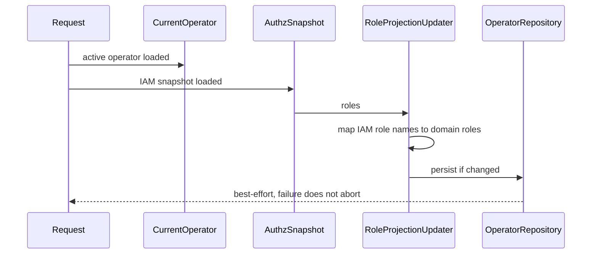

# Operator Role Projection

**本文回答**：为什么 operator 本地 roles 只是 IAM 授权快照的投影；它如何服务展示、兼容和本地查询，而不成为权限真值。

## 30 秒结论

| 主题 | 当前设计 |
| ---- | -------- |
| 真值来源 | IAM authorization snapshot roles / permissions |
| 本地 operator roles | 展示和兼容投影，可由 snapshot 覆盖 |
| 写入时机 | HTTP / gRPC authz snapshot middleware 发现当前 operator 后 best-effort 持久化 |
| 失败策略 | projection 写失败只记录 warning，不阻断请求 |
| 后续方向 | 收敛重复 projection 实现，但不改变权限语义 |

## Projection 流程



## 为什么是 projection，不是权限真值

| 方案 | 问题 | 当前选择 |
| ---- | ---- | -------- |
| 本地 roles 决定权限 | 会和 IAM policy / Casbin 脱节 | 不采用 |
| 每次列表展示都实时查 IAM | 展示路径强依赖 IAM 在线 | 不采用 |
| 请求期 snapshot 覆盖本地 projection | 能保持 UI / 本地查询可用，同时权限仍以 snapshot 为准 | 当前采用 |

## 当前重复点

代码中有两处相近逻辑：

| 路径 | 角色 |
| ---- | ---- |
| [`internal/apiserver/application/actor/operator/role_projection_updater.go`](../../../internal/apiserver/application/actor/operator/role_projection_updater.go) | middleware 注入的应用层 updater |
| [`internal/apiserver/infra/iam/operator_roles_sync.go`](../../../internal/apiserver/infra/iam/operator_roles_sync.go) | IAM infra / bootstrap / service flow 使用的同步 helper |

本轮不收口这两处逻辑，只用文档和 tests 固定语义。后续阶段可以提取单一 projection service。

## 边界

- projection stale 不等于权限失效，权限以请求期 `AuthzSnapshot` 判断。
- updater failure 不改变请求处理结果。
- operator 不存在时不做 projection。
- projection 不负责创建 IAM assignment；assignment 属于 operator lifecycle / IAM 集成。

## 代码与测试锚点

| 能力 | 锚点 |
| ---- | ---- |
| HTTP projection | [`internal/apiserver/transport/rest/middleware/authz_snapshot_middleware.go`](../../../internal/apiserver/transport/rest/middleware/authz_snapshot_middleware.go) |
| gRPC projection | [`internal/apiserver/transport/grpc/authz_snapshot_interceptor.go`](../../../internal/apiserver/transport/grpc/authz_snapshot_interceptor.go) |
| application updater | [`internal/apiserver/application/actor/operator/role_projection_updater.go`](../../../internal/apiserver/application/actor/operator/role_projection_updater.go) |
| infra sync helper | [`internal/apiserver/infra/iam/operator_roles_sync.go`](../../../internal/apiserver/infra/iam/operator_roles_sync.go) |
| tests | [`internal/apiserver/transport/rest/middleware/authz_snapshot_middleware_test.go`](../../../internal/apiserver/transport/rest/middleware/authz_snapshot_middleware_test.go) |

## Verify

```bash
GOTOOLCHAIN=local /Users/yangshujie/.gvm/gos/go1.25.9/bin/go test ./internal/apiserver/transport/rest/middleware ./internal/apiserver/transport/grpc ./internal/apiserver/application/actor/operator ./internal/apiserver/infra/iam
```
