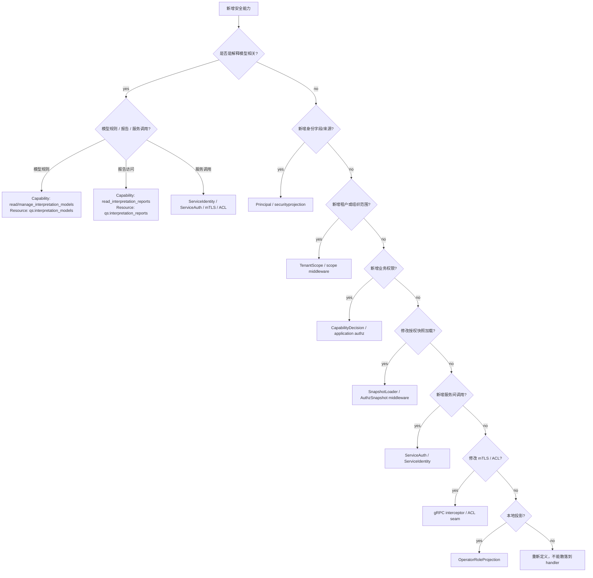

# 新增安全能力 SOP

**本文回答**：在 qs-server 中新增或修改 JWT claims、Principal、TenantScope、AuthzSnapshot、CapabilityDecision、service auth、mTLS、ACL、OperatorRoleProjection 时，应该如何先确定模型边界，再补 contract tests、runtime adapter、文档和 Verify，避免安全事实散落在 handler、middleware、IAM SDK 和本地角色中。

---

## 30 秒结论

新增安全能力默认流程：

```text
定义安全语义
  -> 判断归属模型
  -> 补 contract tests
  -> 更新 runtime adapter
  -> 更新文档与 Verify
  -> 检查否定边界
```

| 新增类型 | 主要落点 | 禁止做法 |
| -------- | -------- | -------- |
| 新 JWT claim / 身份字段 | `securityplane.Principal` + `securityprojection` + HTTP/gRPC context | handler 直接读 raw claim |
| 新 tenant / org scope | `TenantScope` + identity/scope middleware + snapshot loader domain 规则 | 业务服务里各自 Parse tenant_id |
| 新 capability | `application/authz.Capability` + `DecideCapability` + route middleware | 用 JWT roles 判断业务权限 |
| 新解释模型安全能力 | `read_interpretation_models` / `manage_interpretation_models` / `read_interpretation_reports` + IAM resource/action + route middleware | 把模型管理权限、报告访问权限和 JWT roles 混在一起 |
| 新 AuthzSnapshot 行为 | `iamauth.SnapshotLoader` + authz snapshot middleware/interceptor | handler 直接调用 IAM SDK |
| 新 service auth 调用 | service auth wrapper + shared bearer helper + gRPC client wiring | 手写 `authorization` metadata |
| 新 mTLS 规则 | gRPC config + interceptor contract + identity match tests | 把 mTLS 当完整业务授权 |
| 新 ACL 能力 | gRPC ACL config/parser/interceptor tests | 文档声称 ACL 文件已实现但没有 parser/tests |
| 新 Operator projection | RoleProjectionUpdater / IAM sync helper | 把本地 Operator roles 当权限真值 |

一句话原则：

> **安全能力必须先落到 Principal、TenantScope、AuthzSnapshot、CapabilityDecision、ServiceIdentity 或 Projection 之一；否则先别写中间件。**

---

## 1. 新增前先问 12 个问题

| 问题 | 为什么重要 |
| ---- | ---------- |
| 这是身份、租户范围、授权快照、能力判断、服务身份、传输安全、ACL 还是本地投影？ | 决定落点 |
| 它是否改变 HTTP/gRPC 行为？ | 影响 status code、error envelope、兼容性 |
| 它是否改变权限真值来源？ | 高风险，必须审查 |
| 它是否依赖 JWT roles？ | roles 不能直接作为 capability 真值 |
| 它是否需要 tenant_id -> org_id 转换？ | 必须经过 TenantScope |
| 它是否需要 IAM Snapshot？ | 应走 SnapshotLoader，不要 handler 直连 IAM |
| 它是否是 service-to-service？ | 应走 ServiceIdentity / service auth / mTLS / ACL |
| 它是否只是本地展示投影？ | 不能参与权限判断 |
| 它是否需要 contract tests？ | 安全链路必须先锁行为 |
| 它是否新增 context key / metadata / header？ | 要更新投影和 tests |
| 它是否暴露敏感信息？ | token、raw key、权限详情要谨慎 |
| 文档和路由矩阵是否同步？ | 防止安全漂移 |

如果新增的是 MBTI、BigFive、职业兴趣测评等解释模型，还要额外确认：

| 问题 | 为什么重要 |
| ---- | ---------- |
| 它是“模型规则管理”还是“用户报告访问”？ | 二者 privacy 和风险不同，不能共用 capability |
| 它是否需要新的资源命名？ | 例如 `qs:interpretation_models`、`qs:interpretation_reports` |
| 它是否需要新的模型 scope？ | 例如按 model_type、model_code、org_id 做范围控制 |
| 它是否涉及服务间调用？ | 例如 worker / collection-server 触发 Evaluation 或读取报告 |
| 它是否需要 service auth 或 mTLS / ACL？ | 内部服务不能靠用户 JWT 伪装 |
| 它是否需要对象级 ACL？ | capability 是粗粒度能力，不一定能表达单份报告授权 |

---

## 2. 决策树



---

## 3. 通用流程

### 3.1 标准步骤

| 步骤 | 必做 |
| ---- | ---- |
| 1. 定模型 | 明确属于 Principal、TenantScope、AuthzSnapshot、CapabilityDecision、ServiceIdentity、Projection 哪一类 |
| 2. 锁行为 | 先补 contract tests，覆盖成功、失败、缺失、降级、skip、错误码 |
| 3. 选位置 | projection 只做 primitive -> model；transport 只做 adapter；application/authz 做 capability；IAM SDK 留在 infra |
| 4. 接运行时 | 修改 middleware/interceptor/helper/loader，不让 handler 散读安全事实 |
| 5. 补文档 | 更新对应深讲页、README、路由矩阵或能力表 |
| 6. 验证 | go test + docs hygiene + git diff --check |

### 3.2 不要反过来

不要从：

```text
handler 里 if role == "admin"
```

开始。

正确顺序是：

```text
Capability
  -> resource/action mapping
  -> middleware
  -> route usage
  -> tests
```

---

## 4. 新增 Principal / JWT Claim

### 4.1 适用场景

- IAM token 新增 claim。
- 需要在 HTTP/gRPC 中统一读取身份字段。
- 需要在 Security Plane 文档中表达新身份属性。
- 需要支持新 PrincipalSource。

### 4.2 实施步骤

1. 明确 claim 来源和语义。
2. 更新 `securityplane.Principal` 或新增 source/kind。
3. 更新 `securityprojection.PrincipalInput`。
4. 更新 `PrincipalFromInput`。
5. 更新 HTTP `setSecurityProjection`。
6. 更新 gRPC `injectUserContext` / `PrincipalFromContext`。
7. 如果是 slice/map，做 defensive copy。
8. 补 HTTP/gRPC projection tests。
9. 更新 [01-Principal与TenantScope.md](./01-Principal与TenantScope.md)。

### 4.3 禁止

- handler 直接从 JWT raw claims 中读新字段。
- 只支持 HTTP，不支持 gRPC。
- 不写 tests 就新增 context key。
- 把 roles claim 当 capability 真值。

---

## 5. 新增 TenantScope / Scope 规则

### 5.1 适用场景

- tenant_id 与 org_id 关系变化。
- 支持非数字 tenant。
- 新增 CasbinDomain override。
- 新增 org scope 校验。
- gRPC / HTTP scope 行为对齐。

### 5.2 实施步骤

1. 明确 raw tenant 与业务 org 的关系。
2. 更新 `TenantScope` 模型或构造函数。
3. 更新 `TenantScopeFromTenantID`。
4. 更新 HTTP `RequireTenantIDMiddleware` / `RequireNumericOrgScopeMiddleware`。
5. 更新 gRPC `TenantScopeFromContext` 和 AuthzSnapshotUnaryInterceptor。
6. 更新 SnapshotLoader domain 规则，如涉及 domain。
7. 补空 tenant、数字 tenant、非数字 tenant、0 tenant tests。
8. 更新文档。

### 5.3 禁止

- 在业务 service 里直接 `strconv.ParseUint(tenant_id)`。
- 在某个 handler 中定义私有 scope 规则。
- 不更新 gRPC。
- 把 non-numeric tenant 悄悄当 org_id=0。

---

## 6. 新增 Capability

### 6.1 适用场景

- 新 REST 路由需要业务权限。
- 新业务模块需要管理/读取能力。
- 需要将 IAM resource/action 转成粗粒度业务能力。
- 需要 route-level middleware 保护。

### 6.2 实施步骤

1. 在 `application/authz.Capability` 增加常量。
2. 更新 `isKnownCapability`。
3. 更新 `capabilityAllowed`。
4. 明确 resource/action 映射。
5. 明确 admin 是否绕过。
6. 如果有多个 resource，写清 AND/OR 关系。
7. 在 REST route group 挂 `RequireCapabilityMiddleware` 或 `RequireAnyCapabilityMiddleware`。
8. 补 `DecideCapability` tests：
   - allowed。
   - denied。
   - missing_snapshot。
   - unknown_capability。
9. 补 middleware tests。
10. 更新 [02-AuthzSnapshot与CapabilityDecision.md](./02-AuthzSnapshot与CapabilityDecision.md)。

### 6.3 映射模板

```text
CapabilityX:
  if snapshot.IsQSAdmin(): allow
  else require resource/action ...
```

### 6.4 禁止

- 用 JWT roles 判断 capability。
- 用本地 Operator roles 判断 capability。
- 在 handler 内手写 permission 判断。
- capability 常量新增但不更新 isKnownCapability。
- 修改 HTTP error envelope 但不更新接口文档。

### 6.5 新增解释模型 capability

引入 MBTI、BigFive 等解释模型时，建议先拆分三类能力：

| Capability | 面向对象 | 典型资源 |
| ---------- | -------- | -------- |
| `read_interpretation_models` | 读取解释模型目录和详情 | `qs:interpretation_models` read/list |
| `manage_interpretation_models` | 创建、更新、发布、归档解释模型规则 | `qs:interpretation_models` create/update/publish/archive |
| `read_interpretation_reports` | 读取用户解释报告，例如 MBTI 报告 | `qs:interpretation_reports` read/list |

不要把它们合并成一个 `manage_mbti`。

原因：

```text
模型规则管理是配置权限；
报告访问是用户数据权限；
两者风险、审计、隐私边界不同。
```

### 6.6 IAM resource/action 接入流程

新增解释模型 capability 时，IAM 侧也要同步资源和动作。

推荐流程：

```text
1. QS 侧新增 Capability 常量。
2. QS 侧更新 isKnownCapability。
3. QS 侧更新 capabilityAllowed。
4. IAM 侧新增 resource，例如 qs:interpretation_models / qs:interpretation_reports。
5. IAM 侧新增 action，例如 read/list/create/update/publish/archive/statistics。
6. IAM role 绑定 resource/action。
7. IAM 发布策略并推进 authz_version。
8. QS 请求期通过 SnapshotLoader 读取新的 AuthzSnapshot。
9. QS route middleware 使用新 capability。
10. 补 capability / middleware / route matrix tests。
```

资源建议：

| Resource | 说明 |
| -------- | ---- |
| `qs:interpretation_models` | Scale / MBTI / BigFive 等解释模型规则和目录 |
| `qs:interpretation_reports` | Scale / MBTI / BigFive 等解释报告 |
| `qs:scales` | 兼容医学量表规则资源 |
| `qs:reports` | 兼容历史报告访问资源 |

Action 建议：

```text
read
list
create
update
delete
publish
unpublish
archive
statistics
```

### 6.7 MBTI 报告访问示例

目标：允许运营人员查看 MBTI 报告，但不允许其维护 MBTI 规则。

推荐授权：

```text
Capability: read_interpretation_reports
Resource:   qs:interpretation_reports
Action:     read / list
```

不推荐：

```text
Capability: manage_interpretation_models
```

因为 `manage_interpretation_models` 表达的是规则管理，不是报告访问。

## 6.8 新增解释模型 Scope

解释模型可能需要比 org 更细的 scope。

常见 scope：

| Scope | 示例 | 说明 |
| ----- | ---- | ---- |
| `org_id` | `org:1001` | 机构范围 |
| `model_type` | `model_type:mbti` | 模型类型范围 |
| `model_code` | `model_code:MBTI_STANDARD` | 模型编码范围 |
| `model_version` | `model_version:1.0.0` | 模型版本范围 |
| `report_owner` | `testee:xxx` | 报告归属对象范围 |

注意：TenantScope 仍只负责租户 / 机构上下文。

模型级 scope 不应该塞进 `TenantScope`，而应通过以下方式之一表达：

```text
IAM resource pattern；
AuthzSnapshot permission attributes；
application guard；
对象级 ACL；
报告访问服务中的 ownership check。
```

示例：

```text
qs:interpretation_reports:mbti
qs:interpretation_models:mbti:MBTI_STANDARD
```

如果需要对象级权限，例如“只能看自己孩子的 MBTI 报告”，不要只靠 route-level capability。

应在 application 层增加 ownership / relationship guard。

---

## 7. 修改 AuthzSnapshot / SnapshotLoader

### 7.1 适用场景

- IAM GetAuthorizationSnapshot 字段变化。
- authz_version 失效规则变化。
- app_name / domain 规则变化。
- snapshot cache TTL 变化。
- 需要外部版本通知失效。

### 7.2 当前 SnapshotLoader 能力

SnapshotLoader 当前负责：

- 调 IAM `GetAuthorizationSnapshot`。
- 进程内 cache。
- CacheTTL。
- singleflight。
- authz_version 水位失效。
- `ObserveTenantAuthzVersion`。
- `DomainForOrg`。
- CasbinDomainOverride。
- AppName 默认 `qs`。

### 7.3 实施步骤

1. 明确 IAM API 变化。
2. 更新 `authz.Snapshot`。
3. 更新 `SnapshotViewFromSnapshot`。
4. 更新 `SnapshotLoader.Load`。
5. 更新 cache key / version invalidation，如需要。
6. 更新 HTTP/gRPC snapshot middleware tests。
7. 更新 capability tests。
8. 更新文档。

### 7.4 禁止

- handler 直接调用 IAM SDK 查权限。
- 绕过 SnapshotLoader 自己做 cache。
- 忽略 authz_version。
- snapshot load failure 时默认放行。

---

## 8. 新增 Service Auth 调用

### 8.1 适用场景

- 新服务要以服务身份调用 IAM 或 qs-apiserver。
- 新 gRPC client 需要 PerRPCCredentials。
- 新 target audience。
- 新 service ID。

### 8.2 实施步骤

1. 定义 ServiceID。
2. 定义 TargetAudience。
3. 配置 TokenTTL / RefreshBefore。
4. 创建对应进程的 ServiceAuthHelper。
5. 使用 shared `BearerRequestMetadata`。
6. 使用 `grpc.WithPerRPCCredentials`.
7. 暴露 `ServiceIdentity()`。
8. 判断是否要求 TLS/mTLS。
9. 补 token error / metadata tests。
10. 更新 [03-ServiceIdentity与mTLS-ACL.md](./03-ServiceIdentity与mTLS-ACL.md)。

### 8.3 禁止

- 手写 `authorization: Bearer ...` 字符串。
- 把 service token 打日志。
- 把 service identity 当用户 Principal。
- 修改 `RequireTransportSecurity` 但不评估部署兼容性。

---

## 9. 修改 mTLS / Identity Match

### 9.1 适用场景

- 开启 RequireIdentityMatch。
- 更改证书 CN 命名规范。
- 更改 JWT Extra.service_id 规范。
- 引入 typed mTLS identity。
- 统一 legacy `mtls.identity` fallback。

### 9.2 实施步骤

1. 明确证书 CN 格式。
2. 明确 service_id claim 位置。
3. 更新 IAMAuthInterceptor identity match。
4. 更新 `ServiceIdentityFromMTLSContext`。
5. 补：
   - mTLS identity present。
   - missing identity。
   - CN/service_id match。
   - CN/service_id mismatch。
   - legacy fallback。
6. 更新文档。

### 9.3 禁止

- 假设 mTLS CN 就是用户 ID。
- mTLS 开了就跳过 IAMAuth。
- identity match 失败后仍放行。
- 不写 rollout / rollback 策略就强制开启。

---

## 10. 实现 ACL 文件加载

### 10.1 当前边界

gRPC ACLInterceptor seam 已接入，但：

```text
loadACLConfig 目前只构造 default policy；
config file loading 是 TODO。
```

### 10.2 实施步骤

1. 定义 ACL 文件 schema。
2. 明确 default policy。
3. 定义 service identity 解析来源。
4. 定义 method pattern 语法。
5. 实现 YAML/JSON parser。
6. 实现 allowed/denied method tests。
7. 测试 default allow/deny。
8. 测试 config file missing/malformed。
9. 更新 gRPC server docs。
10. 更新 [03-ServiceIdentity与mTLS-ACL.md](./03-ServiceIdentity与mTLS-ACL.md)。

### 10.3 禁止

- 文档声称 ACL 文件已生效但代码没 parser。
- ACL 与用户 capability 混用。
- ACL 拒绝时返回不稳定错误。
- 暴露 service token 或证书详情。

---

## 11. 修改 OperatorRoleProjection

### 11.1 适用场景

- 改变 IAM roles 到本地 Operator roles 的投影规则。
- 实现 SyncRoles。
- 合并 application updater 与 infra sync helper。
- 新增显式同步接口。

### 11.2 实施步骤

1. 明确仍是 projection，不是权限真值。
2. 保持 roles sort + compare。
3. 保持 unchanged no-op。
4. 保持 projection failure 不阻断当前请求，除非单独设计。
5. 更新 application updater。
6. 更新 infra helper，如需要。
7. 补 unchanged/changed/update failure tests。
8. 更新 [04-OperatorRoleProjection.md](./04-OperatorRoleProjection.md)。

### 11.3 禁止

- 用本地 Operator roles 做 capability 判断。
- projection 失败直接拒绝已授权请求。
- projection 中创建 Operator。
- 未授权的用户触发角色同步接口。

---

## 12. 新增安全状态或观测

### 12.1 适用场景

- 暴露当前 service identity。
- 暴露 security projection 状态。
- 暴露 IAM snapshot loader cache 状态。
- 暴露 ACL 当前规则摘要。

### 12.2 原则

必须：

- 只读。
- bounded。
- 不暴露 token。
- 不暴露完整 JWT。
- 不暴露敏感 certificate detail。
- 不暴露完整权限列表给普通用户。
- 需要 internal/admin auth。

### 12.3 禁止

- 在 status endpoint 里刷新 token。
- 触发角色同步。
- 动态修改 ACL。
- 删除 snapshot cache。
- 输出 raw authorization header。

---

## 13. 测试矩阵

| 能力 | 必测 |
| ---- | ---- |
| Principal | HTTP/gRPC 字段投影、默认 unknown、slice defensive copy |
| TenantScope | 数字 tenant、非数字 tenant、空 tenant、0 tenant、numeric org middleware |
| AuthzSnapshot | loader nil、load failure、context injection、authz_version invalidation |
| Capability | allowed、denied、missing_snapshot、unknown_capability、admin bypass |
| Interpretation Capability | read/manage model、read report、IAM resource/action 映射、报告访问 denied、模型管理 denied |
| ServiceAuth | provider nil、token error、metadata header、RequireTransportSecurity |
| mTLS | identity present/missing、CN/service_id match/mismatch、legacy fallback |
| ACL | default allow/deny、file missing/malformed、method allow/deny |
| OperatorProjection | unchanged no-op、changed update、update failure best-effort |
| Docs | docs hygiene、links、Verify 命令 |

---

## 14. 文档同步矩阵

| 变更 | 至少同步 |
| ---- | -------- |
| 新 Principal 字段/source | [01-Principal与TenantScope.md](./01-Principal与TenantScope.md) |
| 新 TenantScope 规则 | [01-Principal与TenantScope.md](./01-Principal与TenantScope.md) |
| 新 Capability | [02-AuthzSnapshot与CapabilityDecision.md](./02-AuthzSnapshot与CapabilityDecision.md) |
| 新解释模型 capability/scope/service auth | [02-AuthzSnapshot与CapabilityDecision.md](./02-AuthzSnapshot与CapabilityDecision.md)、[03-ServiceIdentity与mTLS-ACL.md](./03-ServiceIdentity与mTLS-ACL.md)、`../../02-业务模块/interpretation-model/` |
| SnapshotLoader 变化 | [02-AuthzSnapshot与CapabilityDecision.md](./02-AuthzSnapshot与CapabilityDecision.md) |
| ServiceAuth / mTLS / ACL | [03-ServiceIdentity与mTLS-ACL.md](./03-ServiceIdentity与mTLS-ACL.md) |
| Operator projection | [04-OperatorRoleProjection.md](./04-OperatorRoleProjection.md) |
| 新 route security | 接口与运维文档 / router matrix |
| 新 IAM policy | IAM / deployment 配置文档 |
| 总体边界变化 | [00-整体架构.md](./00-整体架构.md) / README |

---

## 15. 合并前检查清单

| 检查项 | 是否完成 |
| ------ | -------- |
| 已明确能力归属模型 | ☐ |
| 未绕过 AuthzSnapshot 做业务权限判断 | ☐ |
| 未把 JWT roles 当 capability 真值 | ☐ |
| 未把 Operator local roles 当权限真值 | ☐ |
| HTTP/gRPC 行为已对齐或差异已解释 | ☐ |
| context key / metadata 变更有 tests | ☐ |
| 新 capability 已补 allowed/denied/missing/unknown tests | ☐ |
| 如为解释模型，已区分模型规则管理和报告访问权限 | ☐ |
| 如为解释模型，IAM resource/action 已同步 | ☐ |
| 如为解释模型，service auth / mTLS / ACL 已评估 | ☐ |
| 如为报告访问，ownership / relationship guard 已评估 | ☐ |
| 新 service auth 未暴露 token | ☐ |
| 新 mTLS/ACL 行为有 contract tests | ☐ |
| docs 和 Verify 已更新 | ☐ |
| docs hygiene / git diff --check 通过 | ☐ |

---

## 16. 反模式

| 反模式 | 后果 |
| ------ | ---- |
| handler 里判断 `role == admin` | 绕过 IAM AuthzSnapshot |
| 业务 service 里解析 tenant_id | scope 规则漂移 |
| service auth 手写 metadata | token 生命周期和格式漂移 |
| mTLS CN 当用户身份 | 用户/服务身份混淆 |
| ACL 文档先行声称完整支持 | 误导运维和安全评审 |
| Operator roles 做鉴权 | 使用了可能滞后的本地投影 |
| snapshot load 失败默认放行 | 权限绕过 |
| 用 `manage_interpretation_models` 放行 MBTI 报告访问 | 混淆规则管理和用户数据访问 |
| 把 `model_type=mbti` 塞进 TenantScope | 租户范围和模型范围混淆 |
| worker 调解释模型服务时复用用户 JWT | 服务身份和用户身份混淆 |
| 新增 IAM resource 后不推进 authz_version | Snapshot 仍是旧权限，排障困难 |
| context 中塞 raw JWT | 敏感信息泄露 |
| status endpoint 暴露 token/permission 全量 | 安全风险 |

---

## 17. Verify 命令

基础：

```bash
go test ./internal/pkg/securityplane
go test ./internal/pkg/securityprojection
go test ./internal/pkg/serviceauth
go test ./internal/pkg/middleware
go test ./internal/pkg/httpauth
go test ./internal/pkg/grpc
go test ./internal/pkg/iamauth
```

apiserver：

```bash
go test ./internal/apiserver/application/authz
go test ./internal/apiserver/application/actor/operator
go test ./internal/apiserver/transport/rest/middleware
go test ./internal/apiserver/transport/grpc
go test ./internal/apiserver/infra/iam
```

collection：

```bash
go test ./internal/collection-server/infra/iam
go test ./internal/collection-server/transport/rest/middleware
```

解释模型安全能力：

```bash
go test ./internal/apiserver/application/authz
go test ./internal/apiserver/transport/rest/middleware
go test ./internal/apiserver/transport/grpc
go test ./internal/pkg/serviceauth
go test ./internal/pkg/grpc
```

文档：

```bash
make docs-hygiene
git diff --check
```

---

## 18. 代码锚点

- Security model：[../../../internal/pkg/securityplane/model.go](../../../internal/pkg/securityplane/model.go)
- Security projection：[../../../internal/pkg/securityprojection/projection.go](../../../internal/pkg/securityprojection/projection.go)
- HTTP identity：[../../../internal/pkg/httpauth/identity.go](../../../internal/pkg/httpauth/identity.go)
- gRPC context：[../../../internal/pkg/grpc/context.go](../../../internal/pkg/grpc/context.go)
- Authz capability：[../../../internal/apiserver/application/authz/capability.go](../../../internal/apiserver/application/authz/capability.go)
- Interpretation Model docs：[../../02-业务模块/interpretation-model/README.md](../../02-业务模块/interpretation-model/README.md)
- Evaluation docs：[../../02-业务模块/evaluation/README.md](../../02-业务模块/evaluation/README.md)
- Snapshot loader：[../../../internal/pkg/iamauth/snapshot_loader.go](../../../internal/pkg/iamauth/snapshot_loader.go)
- Service auth shared：[../../../internal/pkg/serviceauth/bearer.go](../../../internal/pkg/serviceauth/bearer.go)
- gRPC server chain：[../../../internal/pkg/grpc/server.go](../../../internal/pkg/grpc/server.go)
- Operator projection updater：[../../../internal/apiserver/application/actor/operator/role_projection_updater.go](../../../internal/apiserver/application/actor/operator/role_projection_updater.go)

---

## 19. 下一跳

| 目标 | 文档 |
| ---- | ---- |
| 回看整体架构 | [00-整体架构.md](./00-整体架构.md) |
| Principal 与 TenantScope | [01-Principal与TenantScope.md](./01-Principal与TenantScope.md) |
| AuthzSnapshot 与 CapabilityDecision | [02-AuthzSnapshot与CapabilityDecision.md](./02-AuthzSnapshot与CapabilityDecision.md) |
| 解释模型抽象 | [../../02-业务模块/interpretation-model/README.md](../../02-业务模块/interpretation-model/README.md) |
| ServiceIdentity 与 mTLS-ACL | [03-ServiceIdentity与mTLS-ACL.md](./03-ServiceIdentity与mTLS-ACL.md) |
| OperatorRoleProjection | [04-OperatorRoleProjection.md](./04-OperatorRoleProjection.md) |
