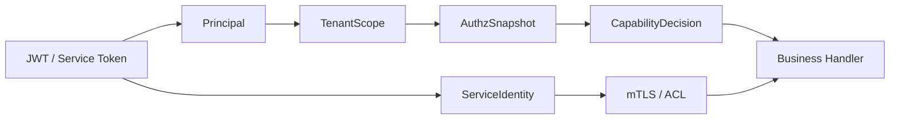

# Security Control Plane 文档中心

**本文回答**：`security/` 是 qs-server 安全控制面的真值入口，用来统一理解 JWT、IAM 授权快照、operator role projection、service auth、mTLS 与 ACL 的边界；它不替代运行时代码，也不把现有鉴权逻辑重写成新框架。

## 30 秒结论

| 维度 | 当前结论 |
| ---- | -------- |
| 核心目标 | 把身份、租户范围、授权快照、能力决策和服务身份用同一套语言解释 |
| 代码模型 | 只读模型在 [`internal/pkg/securityplane`](../../../internal/pkg/securityplane)，运行时投影在 [`internal/pkg/securityprojection`](../../../internal/pkg/securityprojection) |
| 权限真值 | 业务 capability 以 IAM `AuthzSnapshot` 为准，不信任 JWT roles |
| HTTP 路径 | JWT -> identity projection -> tenant/org scope -> authz snapshot -> capability middleware |
| gRPC 路径 | metadata bearer token -> IAMAuth interceptor -> authz snapshot interceptor -> service handler |
| 服务身份 | service auth 写入 bearer token；mTLS / ACL 是 gRPC interceptor 链上的可选能力 |
| 当前边界 | HTTP / gRPC / service-auth 已写入或暴露 security projection；不改鉴权行为 |

## 阅读顺序

1. [00-整体架构.md](./00-整体架构.md) — 安全控制面全局图、调用链和包职责。
2. [01-Principal与TenantScope.md](./01-Principal与TenantScope.md) — 用户身份、服务身份、租户 / org scope 的模型。
3. [02-AuthzSnapshot与CapabilityDecision.md](./02-AuthzSnapshot与CapabilityDecision.md) — IAM 授权快照和 capability 判断。
4. [03-ServiceIdentity与mTLS-ACL.md](./03-ServiceIdentity与mTLS-ACL.md) — service auth、mTLS 身份、ACL 当前边界。
5. [04-OperatorRoleProjection.md](./04-OperatorRoleProjection.md) — operator 本地角色投影为什么是 projection，不是权限真值。
6. [05-新增安全能力SOP.md](./05-新增安全能力SOP.md) — 新增安全能力时的模型、测试、文档门禁。

## 当前模型总图



## 代码与测试锚点

| 能力 | 源码锚点 | 测试锚点 |
| ---- | -------- | -------- |
| 只读模型 | [`internal/pkg/securityplane`](../../../internal/pkg/securityplane) | [`internal/pkg/securityplane/model_test.go`](../../../internal/pkg/securityplane/model_test.go) |
| 运行时投影 | [`internal/pkg/securityprojection`](../../../internal/pkg/securityprojection) | [`internal/pkg/securityprojection/projection_test.go`](../../../internal/pkg/securityprojection/projection_test.go) |
| JWT claims | [`internal/pkg/middleware/jwt_auth.go`](../../../internal/pkg/middleware/jwt_auth.go) | [`internal/pkg/middleware/jwt_auth_test.go`](../../../internal/pkg/middleware/jwt_auth_test.go) |
| HTTP identity | [`internal/pkg/httpauth/identity.go`](../../../internal/pkg/httpauth/identity.go) | [`internal/pkg/httpauth/identity_test.go`](../../../internal/pkg/httpauth/identity_test.go) |
| gRPC auth | [`internal/pkg/grpc/interceptor_auth.go`](../../../internal/pkg/grpc/interceptor_auth.go) | [`internal/pkg/grpc/interceptor_auth_test.go`](../../../internal/pkg/grpc/interceptor_auth_test.go) |
| capability | [`internal/apiserver/application/authz`](../../../internal/apiserver/application/authz) | [`internal/apiserver/transport/rest/middleware/capability_middleware_test.go`](../../../internal/apiserver/transport/rest/middleware/capability_middleware_test.go) |
| operator projection | [`internal/apiserver/application/actor/operator/role_projection_updater.go`](../../../internal/apiserver/application/actor/operator/role_projection_updater.go) | [`internal/apiserver/transport/rest/middleware/authz_snapshot_middleware_test.go`](../../../internal/apiserver/transport/rest/middleware/authz_snapshot_middleware_test.go) |

## Verify

```bash
GOTOOLCHAIN=local /Users/yangshujie/.gvm/gos/go1.25.9/bin/go test ./internal/pkg/securityplane ./internal/pkg/securityprojection ./internal/pkg/serviceauth ./internal/pkg/middleware ./internal/pkg/httpauth ./internal/pkg/grpc ./internal/apiserver/transport/rest/middleware ./internal/apiserver/transport/grpc
python scripts/check_docs_hygiene.py
```
