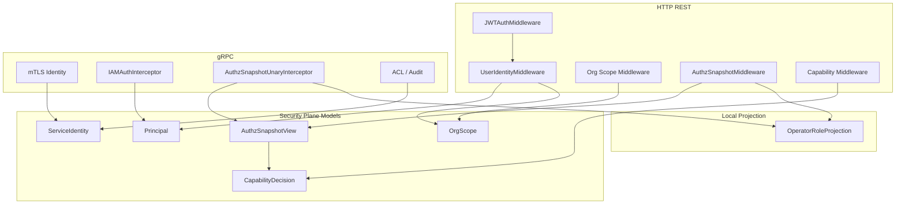

# Security Control Plane 阅读地图

**本文回答**：`security/` 子目录这一组文档应该如何阅读；qs-server 的安全控制面负责什么、不负责什么；Principal、OrgScope、AuthzSnapshot、CapabilityDecision、ServiceIdentity、mTLS/ACL、OperatorRoleProjection 和新增安全能力 SOP 分别应该去哪里看。

---

## 30 秒结论

| 维度 | 结论 |
| ---- | ---- |
| 模块定位 | `security/` 是 qs-server 的**安全控制面文档组**，统一解释身份、IAM 授权域、QS 业务组织范围、授权快照、能力判断、服务身份、传输安全和本地角色投影 |
| 核心模型 | 只读模型在 `internal/pkg/securityplane`：Principal、OrgScope、AuthzSnapshotView、CapabilityDecision、ServiceIdentity |
| 投影层 | `internal/pkg/securityprojection` 负责把 HTTP/gRPC/service/mTLS 输入转换为统一安全视图 |
| 用户身份 | HTTP JWT / gRPC JWT 最终投影为 Principal |
| 授权域 / 组织范围 | IAM JWT `tenant_id` 投影为 `TenantDomain` / `tenant_domain`；IAM JWT `org_id` 投影为 QS `OrgID` / `org_id`；二者共同组成 OrgScope |
| 权限真值 | 业务 capability 以 IAM AuthzSnapshot 的 resource/action 为准，不信任 JWT roles |
| 服务身份 | service auth bearer token 和 mTLS certificate identity 统一投影为 ServiceIdentity |
| 本地角色 | Operator local roles 是 IAM snapshot roles 的本地投影，不是权限真值 |
| 当前边界 | mTLS / ACL seam 已接入，但 ACL 文件加载仍不是完整实现 |
| 推荐读法 | 先读整体架构，再读 Principal/OrgScope、AuthzSnapshot/Capability、ServiceIdentity/mTLS、OperatorRoleProjection，最后读 SOP |

一句话概括：

> **Security Control Plane 不是重写一套安全框架，而是给 HTTP、gRPC、IAM、service auth、mTLS、ACL 和本地投影建立统一安全语言。**

---

## 0. 术语总约定

在 qs-server 中：

- JWT `tenant_id` = IAM authorization domain，例如 `fangcun` / `platform`，进入 `TenantDomain` / `tenant_domain` / Casbin domain 语义。
- JWT `org_id` = QS business organization scope，例如 `1` / `2` / `3`，进入 `OrgID` / `org_id` 语义。
- `OrgScope` 是 `TenantDomain + OrgID` 的只读投影视图。
- 文档和代码不再用 tenant 语义表达 QS 业务组织范围；业务数据范围必须看 `org_id`。

---

## 1. Security Control Plane 负责什么

Security Control Plane 负责统一解释以下安全事实：

```text
HTTP JWT claims
gRPC bearer token
Principal
OrgScope
AuthzSnapshot
CapabilityDecision
ServiceIdentity
mTLS identity
Service ACL seam
Operator local role projection
```

它要回答：

```text
谁在调用？
来自哪个认证来源？
在哪个 IAM 授权域 / QS 业务组织范围？
用户有哪些 IAM resource/action？
某个 REST route 需要哪个 capability？
服务调用方是谁？
mTLS 证书身份和 service token 是否一致？
本地 Operator roles 为什么只是投影？
```

---

## 2. Security Control Plane 不负责什么

| 不属于 Security Control Plane 的内容 | 应归属 |
| ----------------------------------- | ------ |
| IAM token 签发和账户体系 | IAM 系统 |
| IAM policy / Casbin 真值 | IAM / AuthzSnapshot |
| 业务主数据权限之外的领域规则 | 业务模块 |
| 数据库 schema / repository | Data Access |
| 服务限流、背压、锁 | Resilience |
| Redis cache / token cache 治理 | Redis Plane |
| 历史修复和补偿 | Backfill / Repair SOP |
| 完整服务 ACL 文件加载 | 后续 Service ACL 实现 |
| 统一大 SecurityService | 当前不做 |

一句话边界：

```text
Security 文档解释安全事实和控制面边界；
具体认证/授权仍由 middleware、interceptor、IAM SDK 和 application/authz 执行。
```

---

## 3. 本目录文档地图

```text
security/
├── README.md
├── 00-整体架构.md
├── 01-Principal与OrgScope.md
├── 02-AuthzSnapshot与CapabilityDecision.md
├── 03-ServiceIdentity与mTLS-ACL.md
├── 04-OperatorRoleProjection.md
└── 05-新增安全能力SOP.md
```

| 顺序 | 文档 | 先回答什么 |
| ---- | ---- | ---------- |
| 1 | [00-整体架构.md](./00-整体架构.md) | 安全控制面总图、HTTP/gRPC/service/mTLS/Operator 投影边界 |
| 2 | [01-Principal与OrgScope.md](./01-Principal与OrgScope.md) | Principal、OrgScope、HTTP/gRPC 身份投影、TenantDomain 与 OrgID |
| 3 | [02-AuthzSnapshot与CapabilityDecision.md](./02-AuthzSnapshot与CapabilityDecision.md) | IAM 授权快照、resource/action、capability 判断 |
| 4 | [03-ServiceIdentity与mTLS-ACL.md](./03-ServiceIdentity与mTLS-ACL.md) | service auth、mTLS identity、identity match、ACL seam |
| 5 | [04-OperatorRoleProjection.md](./04-OperatorRoleProjection.md) | Operator 本地 roles 投影与权限真值边界 |
| 6 | [05-新增安全能力SOP.md](./05-新增安全能力SOP.md) | 新 capability / scope / service auth / mTLS / ACL / projection 的新增流程 |

---

## 4. 推荐阅读路径

### 4.1 第一次理解 Security Control Plane

按顺序读：

```text
00-整体架构
  -> 01-Principal与OrgScope
  -> 02-AuthzSnapshot与CapabilityDecision
  -> 03-ServiceIdentity与mTLS-ACL
  -> 04-OperatorRoleProjection
```

读完后应能回答：

1. Principal 和 ServiceIdentity 的区别是什么？
2. JWT `tenant_id` 和 JWT `org_id` 分别表达什么？
3. 为什么 JWT roles 不是业务权限真值？
4. AuthzSnapshot 如何支持 capability 判断？
5. mTLS、service auth、ACL 分别负责什么？
6. Operator 本地 roles 为什么只是 projection？

### 4.2 要新增 REST 权限能力

读：

```text
02-AuthzSnapshot与CapabilityDecision
  -> 05-新增安全能力SOP
```

重点看：

- `authz.Capability`。
- `isKnownCapability`。
- `capabilityAllowed`。
- resource/action mapping。
- `RequireCapabilityMiddleware`。
- route matrix tests。

### 4.3 要新增 IAM 授权域 / QS org scope 规则

读：

```text
01-Principal与OrgScope
  -> 05-新增安全能力SOP
```

重点看：

- `TenantDomain`。
- `OrgID`。
- `HasOrgID`。
- `RequireTenantDomainMiddleware`。
- `RequireOrgScopeMiddleware`。
- gRPC org scope。

### 4.4 要新增服务间认证

读：

```text
03-ServiceIdentity与mTLS-ACL
  -> 05-新增安全能力SOP
```

重点看：

- ServiceID。
- TargetAudience。
- ServiceAuthHelper。
- `BearerRequestMetadata`。
- `RequireTransportSecurity`。
- ServiceIdentity。
- mTLS identity match。

### 4.5 要修改本地 Operator roles

读：

```text
04-OperatorRoleProjection
  -> 02-AuthzSnapshot与CapabilityDecision
```

重点看：

- projection 不是权限真值。
- role projection updater。
- infra IAM sync helper。
- projection failure best-effort。
- roles sort + compare。

---

## 5. Security 主图



---

## 6. HTTP / gRPC 安全链路速查

### 6.1 HTTP

```text
JWTAuthMiddleware
  -> UserIdentityMiddleware
  -> RequireTenantDomainMiddleware
  -> RequireOrgScopeMiddleware
  -> AuthzSnapshotMiddleware
  -> RequireCapabilityMiddleware
  -> Handler
```

### 6.2 gRPC

```text
Recovery
  -> RequestID
  -> Logging
  -> mTLS Identity
  -> IAMAuthInterceptor
  -> ExtraUnaryAfterAuth(AuthzSnapshotUnaryInterceptor)
  -> ACL
  -> Audit
  -> Handler
```

---

## 7. 核心模型速查

| 模型 | 回答 | 不是 |
| ---- | ---- | ---- |
| Principal | 谁在调用 | 权限判断结果 |
| OrgScope | 在哪个 IAM 授权域 / QS 业务组织范围 | IAM policy |
| AuthzSnapshotView | IAM 授权快照视图 | 长期本地权限副本 |
| CapabilityDecision | 某个业务能力是否允许 | 完整 ACL 引擎 |
| ServiceIdentity | 哪个服务在调用 | 用户 Principal |
| OperatorRoleProjection | 本地 roles 展示/查询投影 | 权限真值 |

---

## 8. 权限真值边界

| 数据 | 来源 | 是否权限真值 | 用途 |
| ---- | ---- | ------------ | ---- |
| JWT roles | Token claims | 否 | 身份视图、排障、兼容 |
| AuthzSnapshot roles | IAM authorization snapshot | 是 snapshot 一部分 | admin 判断、projection source |
| AuthzSnapshot permissions | IAM authorization snapshot | 是 | capability 判断 |
| Operator local roles | 本地 DB projection | 否 | 展示、本地查询 |
| ServiceIdentity | service auth / mTLS | 服务身份真值之一 | 服务间认证/ACL |
| ACL default policy | gRPC config | 仅服务间方法访问 | 不做用户 capability |

### 8.1 核心规则

```text
业务 capability -> AuthzSnapshot
服务身份 -> ServiceIdentity + mTLS/service auth
本地展示 -> OperatorRoleProjection
```

---

## 9. 常见误区

### 9.1 “JWT roles 有 admin 就可以放行”

错误。必须基于 AuthzSnapshot 与 CapabilityDecision。

### 9.2 “JWT tenant_id 就是 org_id”

错误。JWT `tenant_id` 是 IAM 授权域；JWT `org_id` 才是 QS 业务组织范围。OrgScope 保存 `TenantDomain + OrgID`，不再从授权域推导业务组织。

### 9.3 “Operator local roles 可以鉴权”

不可以。它只是本地投影。

### 9.4 “ServiceIdentity 是用户身份”

不是。它表示服务身份。

### 9.5 “mTLS 开了就不需要 service token”

当前不是这样。mTLS 和 service auth 是两层信号。

### 9.6 “ACL 文件加载已经完整可用”

当前不是。ACL interceptor seam 已接入，但文件加载仍是 TODO。

---

## 10. 排障入口

| 现象 | 优先文档 |
| ---- | -------- |
| HTTP 401 / user not authenticated | [01-Principal与OrgScope.md](./01-Principal与OrgScope.md) |
| tenant_domain 缺失或 org_id 缺失 | [01-Principal与OrgScope.md](./01-Principal与OrgScope.md) |
| permission denied | [02-AuthzSnapshot与CapabilityDecision.md](./02-AuthzSnapshot与CapabilityDecision.md) |
| authorization snapshot load failed | [02-AuthzSnapshot与CapabilityDecision.md](./02-AuthzSnapshot与CapabilityDecision.md) |
| gRPC Unauthenticated | [03-ServiceIdentity与mTLS-ACL.md](./03-ServiceIdentity与mTLS-ACL.md) |
| mTLS identity mismatch | [03-ServiceIdentity与mTLS-ACL.md](./03-ServiceIdentity与mTLS-ACL.md) |
| ACL 行为异常 | [03-ServiceIdentity与mTLS-ACL.md](./03-ServiceIdentity与mTLS-ACL.md) |
| Operator roles 没同步 | [04-OperatorRoleProjection.md](./04-OperatorRoleProjection.md) |
| 要新增安全能力 | [05-新增安全能力SOP.md](./05-新增安全能力SOP.md) |

---

## 11. 维护原则

1. 新身份字段必须进入 Principal / Projection，而不是 handler 私读 raw claim。
2. 新授权域 / 组织范围规则必须进入 OrgScope / middleware，而不是业务服务各自解析。
3. 新业务权限必须进入 CapabilityDecision，而不是 JWT roles 判断。
4. 新 service auth 必须走共享 bearer helper，而不是手写 metadata。
5. 新 mTLS/ACL 行为必须有 contract tests。
6. Operator roles 只能作为 projection。
7. Snapshot load failure 不能默认放行。
8. 安全文档不能把 seam 写成已完整实现能力。

---

## 12. 代码锚点

### Model / Projection

- Security model：[../../../internal/pkg/securityplane/model.go](../../../internal/pkg/securityplane/model.go)
- Security projection：[../../../internal/pkg/securityprojection/projection.go](../../../internal/pkg/securityprojection/projection.go)

### HTTP / gRPC

- HTTP identity：[../../../internal/pkg/httpauth/identity.go](../../../internal/pkg/httpauth/identity.go)
- JWT middleware：[../../../internal/pkg/middleware/jwt_auth.go](../../../internal/pkg/middleware/jwt_auth.go)
- gRPC context：[../../../internal/pkg/grpc/context.go](../../../internal/pkg/grpc/context.go)
- IAMAuthInterceptor：[../../../internal/pkg/grpc/interceptor_auth.go](../../../internal/pkg/grpc/interceptor_auth.go)
- gRPC server chain：[../../../internal/pkg/grpc/server.go](../../../internal/pkg/grpc/server.go)

### Authz / Service / Projection

- Authz Snapshot：[../../../internal/apiserver/application/authz/snapshot.go](../../../internal/apiserver/application/authz/snapshot.go)
- Capability：[../../../internal/apiserver/application/authz/capability.go](../../../internal/apiserver/application/authz/capability.go)
- AuthzSnapshotMiddleware：[../../../internal/apiserver/transport/rest/middleware/authz_snapshot_middleware.go](../../../internal/apiserver/transport/rest/middleware/authz_snapshot_middleware.go)
- Capability middleware：[../../../internal/apiserver/transport/rest/middleware/capability_middleware.go](../../../internal/apiserver/transport/rest/middleware/capability_middleware.go)
- Service auth shared：[../../../internal/pkg/serviceauth/bearer.go](../../../internal/pkg/serviceauth/bearer.go)
- Operator projection：[../../../internal/apiserver/application/actor/operator/role_projection_updater.go](../../../internal/apiserver/application/actor/operator/role_projection_updater.go)

---

## 13. Verify

Foundation：

```bash
go test ./internal/pkg/securityplane
go test ./internal/pkg/securityprojection
go test ./internal/pkg/serviceauth
go test ./internal/pkg/httpauth
go test ./internal/pkg/grpc
go test ./internal/pkg/iamauth
```

Apiserver：

```bash
go test ./internal/apiserver/application/authz
go test ./internal/apiserver/application/actor/operator
go test ./internal/apiserver/transport/rest/middleware
go test ./internal/apiserver/transport/grpc
go test ./internal/apiserver/infra/iam
```

Collection：

```bash
go test ./internal/collection-server/infra/iam
go test ./internal/collection-server/transport/rest/middleware
```

Docs：

```bash
make docs-hygiene
git diff --check
```

---

## 14. 下一跳

| 目标 | 文档 |
| ---- | ---- |
| 整体架构 | [00-整体架构.md](./00-整体架构.md) |
| Principal 与 OrgScope | [01-Principal与OrgScope.md](./01-Principal与OrgScope.md) |
| AuthzSnapshot 与 CapabilityDecision | [02-AuthzSnapshot与CapabilityDecision.md](./02-AuthzSnapshot与CapabilityDecision.md) |
| ServiceIdentity 与 mTLS-ACL | [03-ServiceIdentity与mTLS-ACL.md](./03-ServiceIdentity与mTLS-ACL.md) |
| OperatorRoleProjection | [04-OperatorRoleProjection.md](./04-OperatorRoleProjection.md) |
| 新增安全能力 SOP | [05-新增安全能力SOP.md](./05-新增安全能力SOP.md) |
| 回到基础设施总入口 | [../README.md](../README.md) |
