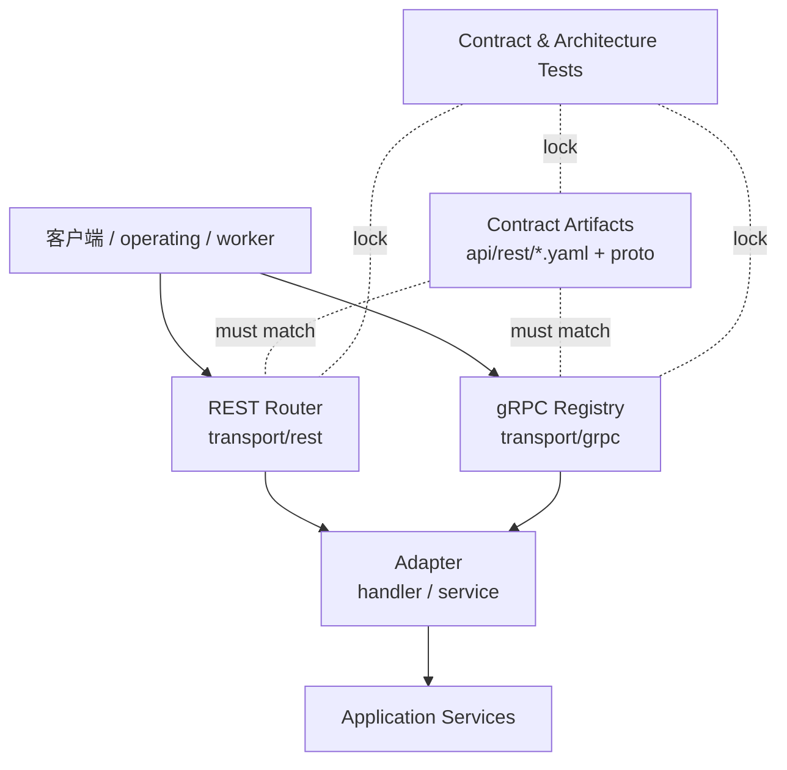

# Transport & Contract Plane 整体架构

**本文回答**：qs-server 为什么需要单独的 Transport & Contract Plane，它和业务模块、运行时、通信系统的边界是什么，以及当前代码如何把 REST/gRPC 契约落到三进程。

## 30 秒结论

Transport & Contract Plane 只负责“请求怎么进来、契约如何被验证、adapter 怎么调用应用服务”，不负责业务状态机。当前目标是让 router/registry、OpenAPI/proto、handler/service adapter 和 contract tests 形成一个闭环。



## 模块要解决什么问题

没有这一层时，接口修改会同时碰 router、handler、OpenAPI、proto、生成物、文档和测试，容易出现“代码已挂载但契约没更新”或“文档还写旧路径”的漂移。Transport & Contract Plane 的核心目标是降低这个修改放大系数。

## 当前架构设计

| 层 | 代码锚点 | 职责 |
| -- | -------- | ---- |
| REST registration | [`internal/apiserver/transport/rest`](../../../internal/apiserver/transport/rest/)、[`internal/collection-server/transport/rest`](../../../internal/collection-server/transport/rest/) | 注册 route、分组 public/protected/internal、组合 middleware |
| gRPC registration | [`internal/apiserver/transport/grpc`](../../../internal/apiserver/transport/grpc/) | 注册 proto service，决定哪些服务随模块可用 |
| Contract artifact | [`api/rest/apiserver.yaml`](../../../api/rest/apiserver.yaml)、[`api/rest/collection.yaml`](../../../api/rest/collection.yaml)、[`interface/grpc/proto`](../../../internal/apiserver/interface/grpc/proto/) | wire contract 的机器可读形式 |
| Adapter | REST handler、gRPC service | 把 HTTP/gRPC 请求转成 application call |
| Contract tests | `*_contract_test.go`、`architecture_test.go` | 锁 route、OpenAPI、proto、依赖方向 |

## 设计模式应用

| 模式 | 使用点 | 为什么 |
| ---- | ------ | ------ |
| Adapter | REST handler、gRPC service | 把传输协议细节隔离在边界层，应用服务不感知 Gin/gRPC |
| Composition Root | process/container 装配 router/registry deps | 传输层只消费显式 deps，不自行 new 业务服务 |
| Contract Test | OpenAPI/proto/route matrix tests | 不靠人工记忆维护契约一致性 |
| Adapter ownership | `transport/rest/{handler,request,response,viewmodel,middleware}`、`transport/grpc/service` | REST/gRPC 实现主路径归属 transport，避免 interface 与 transport 双重真值 |

## 取舍与边界

- 不把 business DTO 直接视为 wire contract；REST/gRPC adapter 仍负责显式映射。
- 本轮不重新生成 proto；历史 `go_package` 漂移先用 allowlist 锁住。
- `interface/grpc/proto` 只保留 generated proto 的历史路径；REST implementation 和 gRPC service adapter 不再放在 `interface/*`。
- internal governance routes 可以不进入 public OpenAPI，但必须有 route contract test。

## 代码与测试锚点

- REST route contract：[openapi_contract_test.go](../../../internal/apiserver/transport/rest/openapi_contract_test.go)
- Collection 依赖 seam：[architecture_test.go](../../../internal/collection-server/transport/rest/architecture_test.go)
- gRPC proto contract：[proto_contract_test.go](../../../internal/apiserver/transport/grpc/proto_contract_test.go)

## Verify

```bash
go test ./internal/apiserver/transport/rest ./internal/apiserver/transport/grpc
go test ./internal/collection-server/transport/rest ./internal/pkg/httpauth
```
