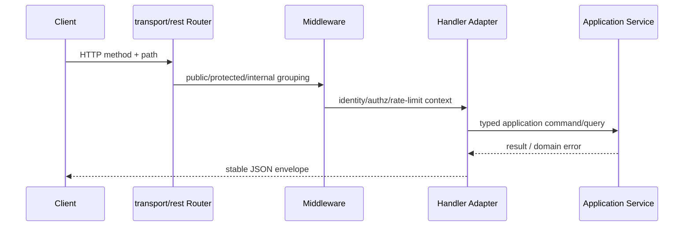
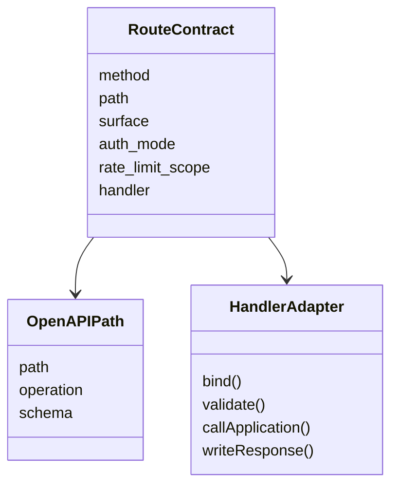

# REST 路由与契约

**本文回答**：REST 路由如何分成 apiserver 与 collection 两个面，OpenAPI 如何和 router 对齐，auth surface 如何被锁住，以及新增 REST 接口时应该补哪些测试。

## 30 秒结论

apiserver 是后台与 internal governance 面，collection-server 是前台 BFF 面。两者都通过 `transport/rest` 注册路由；OpenAPI 是导出契约，必须通过 contract test 与关键路由保持一致。



## 架构设计

| 面 | 前缀 | 典型职责 | 代码锚点 |
| -- | ---- | -------- | -------- |
| collection public/BFF | `/api/v1` | 答卷提交、前台报告查询、只读 scale/questionnaire | [`collection-server/transport/rest/router.go`](../../../internal/collection-server/transport/rest/router.go) |
| apiserver business/admin | `/api/v1` | 后台生命周期、计划、统计、staff/operator | [`apiserver/transport/rest`](../../../internal/apiserver/transport/rest/) |
| apiserver internal | `/internal/v1` | cache/event/resilience 只读状态和内部任务触发 | [`routes_events.go`](../../../internal/apiserver/transport/rest/routes_events.go)、[`routes_resilience.go`](../../../internal/apiserver/transport/rest/routes_resilience.go) |

## 模型设计

REST contract 的最小模型是：



当前代码没有引入运行时 `RouteContract` 框架，而是用 `routeSpec` + contract tests 锁住关键路径。这样避免把 Gin router 变成自研 DSL，同时保留足够的漂移保护。

## 设计模式与取舍

- **Adapter**：handler 是 HTTP adapter，不承载领域规则。
- **Policy / Chain**：auth、capability、rate limit 通过 middleware 链组合，而不是散落到 handler。
- **Contract Test**：OpenAPI test 只锁关键公共 route；internal route 通过专门 route test 锁住。
- **取舍**：OpenAPI 当前不是运行时自动生成真值，所以新增接口时必须同步 YAML 与 test；这是显式维护成本，但避免引入更重的代码生成链。

## Verify

```bash
go test ./internal/apiserver/transport/rest
go test ./internal/collection-server/transport/rest
go test ./internal/apiserver
```
