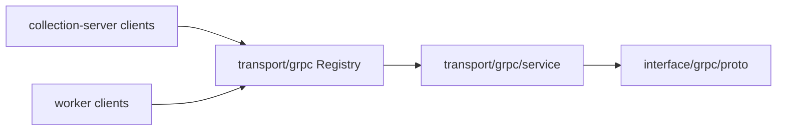

# gRPC 契约与服务适配

**本文回答**：gRPC 在 qs-server 中负责哪些进程间协作，proto、registry、service adapter 怎么分工，以及为什么本轮先不移动 generated proto。

## 30 秒结论

qs-apiserver 是唯一 gRPC server；collection-server 和 worker 是 client。`transport/grpc/registry.go` 是注册真值；`interface/grpc/proto` 暂时保留 generated proto；service adapter 已归属 `transport/grpc/service`。



## 模块要解决什么问题

gRPC 契约的风险不在“有没有 proto”，而在“proto service 是否真的注册、service adapter 是否过宽、generated go_package 是否漂移”。当前用 contract tests 锁 registry/proto/service adapter，后续若要清理 codegen 路径必须单独成轮。

## 服务模型

| Service | 主要调用方 | 职责 |
| ------- | ---------- | ---- |
| `AnswerSheetService` | collection、worker | 答卷写入/查询/分数回写 |
| `QuestionnaireService` | collection | 问卷只读 |
| `ActorService` | collection | 受试者与照护上下文 |
| `EvaluationService` | collection、worker | 测评、报告、趋势 |
| `ScaleService` | collection | 量表只读 |
| `InternalService` | worker | 计分、建测评、评估、打标签、通知等内部回调 |
| `PlanCommandService` | worker/internal | 计划任务命令侧能力 |

## 设计模式与取舍

- **Adapter**：`transport/grpc/service` 承接 concrete service adapter，registry 只依赖 transport-owned service。
- **Parameter Object**：`transport/grpc.Deps` 收口 registry 装配依赖，避免注册器到处读 container。
- **Split Phase**：先锁 proto/registry 契约，再拆宽 `InternalService` 的内部 flow delegate。
- **取舍**：不立即移动 generated proto，避免 codegen、import path、客户端改动混成一个大迁移。

## Verify

```bash
go test ./internal/apiserver/transport/grpc
go test ./internal/apiserver/transport/grpc/service
```
