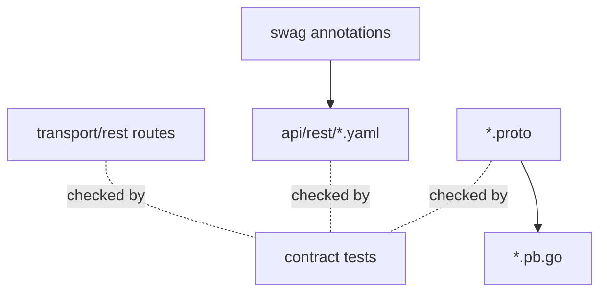

# OpenAPI 与 Proto 生成边界

**本文回答**：哪些文件是生成物，哪些文件是当前运行时真值，为什么本轮不重新生成 proto，以及如何防止接口文档漂移。

## 30 秒结论

REST 的导出物是 `api/rest/*.yaml`，gRPC 的导出物是 `*.pb.go`。本轮不改变生成链；先用 contract tests 锁住关键一致性和历史例外，避免重构时误改 wire contract。



## 当前生成边界

| 类型 | 位置 | 本轮策略 |
| ---- | ---- | -------- |
| REST OpenAPI | [`api/rest`](../../../api/rest/) | 补 drift test，不改生成脚本 |
| gRPC proto source | [`interface/grpc/proto`](../../../internal/apiserver/interface/grpc/proto/) | 保留路径，不移动 |
| gRPC generated Go | `*_pb.go`、`*_grpc.pb.go` | 不重新生成 |
| go_package 历史漂移 | `answersheet`、`questionnaire` | 显式 allowlist，禁止新增漂移 |

## 为什么不立刻重生成 proto

重生成 proto 会同时改变 import path、客户端编译、服务注册、测试快照和文档锚点。当前目标是边界收口，不是 wire contract 迁移；因此先把漂移变成可见 contract，再单独开 codegen cleanup。

## Verify

```bash
go test ./internal/apiserver/transport/grpc -run 'Proto|Registry'
go test ./internal/apiserver/transport/rest -run OpenAPI
go test ./internal/collection-server/transport/rest -run OpenAPI
```
