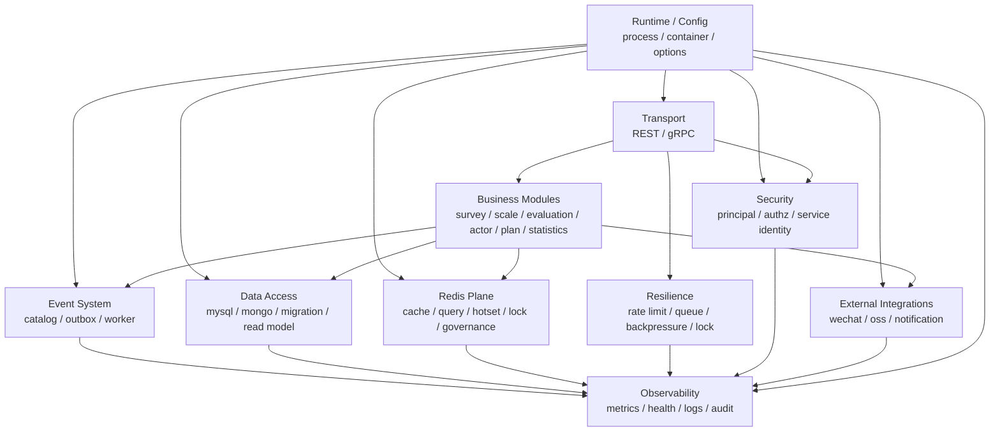
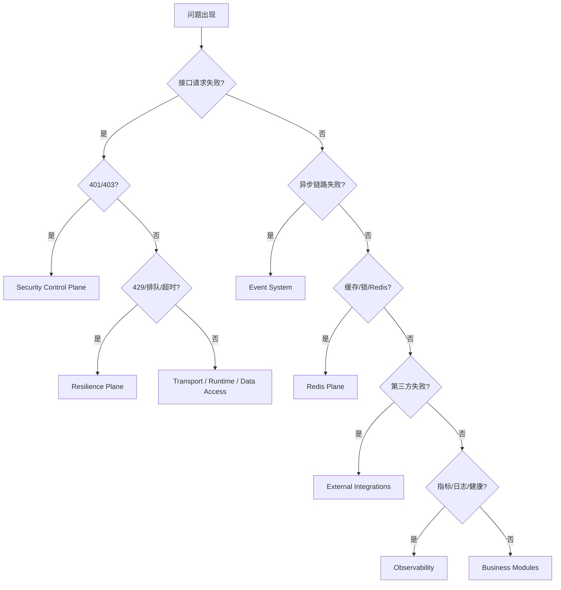

# 横切能力矩阵

**本文回答**：qs-server 的横切基础设施能力如何分层；遇到事件、存储、Redis、限流、权限、外部集成、运行时装配和可观测性问题时，应该先看哪个 plane、哪个状态入口、哪个真值层、哪个测试门禁；哪些治理动作当前只是只读观察，哪些可以执行 warmup / repair。

---

## 30 秒结论

| Plane | 解决什么 | 真值层 | 状态 / 观测入口 | 治理动作边界 |
| ----- | -------- | ------ | --------------- | ------------ |
| Event System | 事件契约、发布、outbox、worker 消费 | `configs/events.yaml` + event/outbox/worker 源码 | event metrics、outbox status、worker outcome | 主要只读；replay/repair 必须单独 SOP |
| Data Access | MySQL、Mongo、migration、read model、outbox store | repository / mapper / migration / PO / document | repository tests、migration、DB metrics | 不提供业务 DB 手工治理 API |
| Redis Plane | cache、query cache、hotset、warmup、locklease | cacheplane / cacheentry / cachequery / locklease / cachegovernance | cache governance status、Redis family status、Prometheus | 允许 cache warmup / repair-complete；不改业务主状态 |
| Resilience Plane | rate limit、SubmitQueue、backpressure、duplicate suppression | resilienceplane vocabulary + 各进程保护点 | resilience metrics、三进程 status endpoint | 当前多为只读摘要，不提供动态调参/drain |
| Security Control Plane | Principal、TenantScope、AuthzSnapshot、capability、service identity | IAM AuthzSnapshot + securityplane/securityprojection | authz contract tests、health/ready、security logs | 权限真值在 IAM，不提供本地权限热修改 |
| Integrations | WeChat、OSS、Notification、第三方 SDK | port / adapter / SDK cache / application service | adapter tests、业务日志、SDK cache status | 不提供第三方治理面板 |
| Runtime / Config | process stage、container graph、ClientBundle、Options | process/container/options/config contract tests | process health、config tests、nil dependency tests | 不动态改启动图 |
| Observability | metrics、healthz、pprof、logging、audit、governance endpoint | metrics registry、handlers、middleware、audit/log conventions | Prometheus、healthz/readyz、pprof、logs、audit | 默认只读，治理动作必须显式受控 |

一句话概括：

> **横切能力矩阵用于先判定问题属于哪个 plane，再进入对应文档和源码；不要从业务模块里直接猜基础设施问题。**

---

## 1. 这张矩阵怎么用

遇到问题时，先按下面顺序定位：

```text
1. 先判断 plane
2. 再找真值层
3. 再看状态/观测入口
4. 再进入对应子目录
5. 最后才进入业务模块
```

例如：

| 现象 | 先看 plane | 再看 |
| ---- | ---------- | ---- |
| 答卷提交后没有报告 | Event System | outbox、worker、assessment lifecycle event |
| 提交接口返回 429 | Resilience Plane | rate limit / SubmitQueue |
| 查询统计很慢 | Statistics + Redis Plane | read model / QueryCache / hotset |
| capability denied | Security Control Plane | AuthzSnapshot / capability decision |
| Mongo 写入超时 | Data Access + Resilience | Mongo repo / backpressure |
| 小程序通知失败 | Integrations + Event | Notification service / task.opened handler |
| Redis lock 抢不到 | Redis + Resilience | locklease / scheduler leader |
| healthz 不通过 | Observability + Runtime | health check / dependencies / container graph |

---

## 2. 总体关系图



这张图表达几个原则：

1. Runtime/Config 是组合根入口。
2. Transport 接入请求后会先经过 Security 和 Resilience。
3. Business Modules 调用 Data/Event/Redis/Integration。
4. Observability 横跨所有 plane。
5. 基础设施 plane 不应该反向定义业务模型。

---

## 3. Plane 详解

---

## 3.1 Event System

### 解决什么

Event System 解决：

```text
事件契约
topic 映射
delivery class
发布方式
outbox 可靠出站
worker 订阅消费
Ack/Nack
poison message
事件观测
```

### 真值层

| 类型 | 位置 |
| ---- | ---- |
| event type / topic / delivery / handler | `configs/events.yaml` |
| event catalog | `internal/pkg/eventcatalog` |
| outbox relay | `internal/apiserver/application/eventing` |
| outbox store | `internal/apiserver/infra/mysql/eventoutbox`、`internal/apiserver/infra/mongo/eventoutbox` |
| worker dispatcher / handlers | `internal/worker/integration/eventing`、`internal/worker/handlers` |

### 状态 / 观测入口

| 入口 | 用途 |
| ---- | ---- |
| outbox status | pending / failed / oldest age |
| worker outcome metrics | consume / ack / nack / handler error |
| event metrics | publish / outbox / dispatch outcome |
| logs | event_id、event_type、handler、outcome |

### 治理边界

当前默认：

- 可以观察 outbox 和 worker 状态。
- 可以按 SOP 设计 repair/replay。
- 不默认提供任意 event replay API。
- 不允许业务服务绕过 delivery class direct publish durable event。

### 排障入口

| 现象 | 优先检查 |
| ---- | -------- |
| durable event 未发布 | outbox stage / relay / publisher |
| worker 没消费 | topic / subscription / handler registry |
| handler 一直失败 | payload / idempotency / downstream |
| event 重复处理 | event_id / checkpoint / handler 幂等 |

### 子目录

- [event/README.md](./event/README.md)

---

## 3.2 Data Access

### 解决什么

Data Access 解决：

```text
领域模型与数据库 schema 的隔离
repository port / adapter
UnitOfWork / transaction
MySQL PO / Mongo document
migration
read model
outbox store
idempotency store
```

### 真值层

| 类型 | 位置 |
| ---- | ---- |
| MySQL repository | `internal/apiserver/infra/mysql/...` |
| Mongo repository | `internal/apiserver/infra/mongo/...` |
| UnitOfWork | `internal/apiserver/application/transaction` |
| migration | `internal/pkg/migration/migrations/...` |
| read model | `internal/apiserver/infra/mysql/statistics/readmodel` |
| outbox store | MySQL/Mongo eventoutbox packages |

### 状态 / 观测入口

| 入口 | 用途 |
| ---- | ---- |
| repository tests | 持久化行为验证 |
| migration files | schema 演进真值 |
| DB metrics | connection、slow query、lock wait |
| healthz/readyz | DB dependency readiness |

### 治理边界

默认：

- 不提供业务 DB 手工治理 API。
- migration 是 schema 变更入口。
- repository 是写入入口。
- read model 不替代主业务写模型。
- 统计读模型可以通过 Sync/Backfill 重建。

### 排障入口

| 现象 | 优先检查 |
| ---- | -------- |
| MySQL 写失败 | repository / transaction / backpressure / schema |
| Mongo durable submit 失败 | document mapper / collection / outbox |
| migration 失败 | migration 顺序 / SQL / lock |
| read model 不准 | source facts / sync / projection |

### 子目录

- [data-access/README.md](./data-access/README.md)

---

## 3.3 Redis Plane

### 解决什么

Redis Plane 解决：

```text
ObjectCache
QueryCache
StaticList cache
Hotset
WarmupTarget
Cache governance
LockLease
Redis runtime family/profile/namespace
degraded behavior
```

### 真值层

| 类型 | 位置 |
| ---- | ---- |
| cacheplane | `internal/pkg/cacheplane` |
| cachebootstrap | `internal/apiserver/cachebootstrap` |
| cacheentry | `internal/apiserver/infra/cacheentry` |
| cachequery | `internal/apiserver/infra/cachequery` |
| cachetarget | `internal/apiserver/cachetarget` |
| cachegovernance | `internal/apiserver/application/cachegovernance` |
| locklease | `internal/pkg/locklease` |
| keyspace | `internal/pkg/cacheplane/keyspace` |

### 状态 / 观测入口

| 入口 | 用途 |
| ---- | ---- |
| cache governance status | family、hotset、warmup 状态 |
| Redis family status | cache / lock / query 等能力摘要 |
| Prometheus metrics | hit/miss/error/degraded/warmup |
| readyz | Redis 依赖是否影响 readiness |

### 治理边界

允许：

- query/object cache warmup。
- repair-complete 后预热。
- manual warmup。
- hotset status 观察。

不允许：

- 通过 Redis 直接改业务主状态。
- 把 cache 当事实源。
- 在 Redis 中做不可重建统计事实。

### 排障入口

| 现象 | 优先检查 |
| ---- | -------- |
| cache miss 高 | key / TTL / warmup / hotset |
| cache stale | read model / version token / TTL / warmup |
| lock contention | lock key / ttl / owner / release |
| Redis degraded | family fallback / readiness / metrics |

### 子目录

- [redis/README.md](./redis/README.md)

---

## 3.4 Resilience Plane

### 解决什么

Resilience Plane 解决：

```text
HTTP rate limit
collection SubmitQueue
downstream backpressure
Redis lock lease
idempotency
duplicate suppression
degraded-open / degraded-continue
bounded outcome observability
```

### 真值层

| 类型 | 位置 |
| ---- | ---- |
| outcome vocabulary | `internal/pkg/resilienceplane` |
| HTTP limiter | middleware / collection limiter |
| SubmitQueue | `internal/collection-server/application/answersheet` |
| backpressure | `internal/pkg/backpressure` + repo/client 注入 |
| locklease | `internal/pkg/locklease` |
| worker duplicate gate | worker handlers / locklease |

### 状态 / 观测入口

| 入口 | 用途 |
| ---- | ---- |
| resilience metrics | rate_limited、queue_full、backpressure_timeout、lock_contention |
| collection governance endpoint | rate limit / SubmitQueue snapshot |
| worker governance endpoint | duplicate suppression / lock capability |
| apiserver internal status | backpressure / scheduler lock capability |

### 治理边界

默认只读：

- 当前不提供动态调参。
- 当前不提供 queue drain。
- 当前不提供 lock release。
- 保护点参数应通过配置和部署变更。

### 排障入口

| 现象 | 优先检查 |
| ---- | -------- |
| 429 | rate limit outcome / Retry-After |
| processing 卡住 | SubmitQueue / gRPC / apiserver |
| DB timeout | backpressure / DB metrics |
| worker 重复处理 | duplicate suppression / locklease |
| scheduler 不运行 | leader lock / Redis degraded |

### 子目录

- [resilience/README.md](./resilience/README.md)

---

## 3.5 Security Control Plane

### 解决什么

Security Control Plane 解决：

```text
Principal
TenantScope
IAM AuthzSnapshot
CapabilityDecision
OperatorRoleProjection
ServiceIdentity
mTLS / ACL
HTTP / gRPC auth boundary
```

### 真值层

| 类型 | 位置 |
| ---- | ---- |
| security model | `internal/pkg/securityplane` |
| runtime projection | `internal/pkg/securityprojection` |
| HTTP JWT | middleware / httpauth |
| gRPC auth | grpc interceptors |
| IAM authz | application authz / IAM gateway |
| operator projection | actor/operator projection updater |
| service auth | `internal/pkg/serviceauth` |

### 状态 / 观测入口

| 入口 | 用途 |
| ---- | ---- |
| authz contract tests | 权限行为验证 |
| capability metrics/logs | allowed / denied / missing snapshot |
| health/ready | IAM dependency readiness |
| audit logs | 权限敏感操作追踪 |

### 治理边界

默认：

- 权限真值在 IAM。
- Operator roles 是本地 projection。
- JWT roles 不作为业务 capability 真值。
- 不提供本地权限热修改入口。
- service auth/mTLS/ACL 是 transport 边界能力。

### 排障入口

| 现象 | 优先检查 |
| ---- | -------- |
| 401 | JWT / service token |
| 403 | AuthzSnapshot / capability |
| org scope 错误 | TenantScope |
| worker gRPC 被拒 | service identity / interceptor |
| Operator 角色不对 | IAM grant + projection |

### 子目录

- [security/README.md](./security/README.md)

---

## 3.6 External Integrations

### 解决什么

External Integrations 解决：

```text
第三方 SDK 隔离
WeChat token / QR / subscribe
ObjectStorage
Notification application service
外部 HTTP 错误语义
SDK cache
```

### 真值层

| 类型 | 位置 |
| ---- | ---- |
| WeChat adapter | `internal/apiserver/infra/wechatapi` |
| ObjectStorage | `internal/apiserver/infra/objectstorage` |
| Notification service | `internal/apiserver/application/notification` |
| task notification worker | `internal/worker/handlers/task_handler.go` |
| external ports | application / port interfaces |

### 状态 / 观测入口

| 入口 | 用途 |
| ---- | ---- |
| adapter tests | SDK/HTTP adapter 行为 |
| business logs | 第三方调用失败 |
| SDK cache status | token/cache 状态 |
| worker outcome | 通知 handler 成功/失败 |

### 治理边界

默认：

- 不抽统一“外部集成框架”。
- 不把第三方失败写成业务成功。
- 外部失败通常只影响副作用，不反向修改主事实。
- 是否重试要由具体业务场景判断。

### 排障入口

| 现象 | 优先检查 |
| ---- | -------- |
| 小程序通知失败 | task handler / notification service / WeChat |
| QR 生成失败 | WeChat adapter / token |
| OSS 上传失败 | objectstorage adapter |
| token 失效 | SDK cache / WeChat credential |

### 子目录

- [integrations/README.md](./integrations/README.md)

---

## 3.7 Runtime / Config

### 解决什么

Runtime / Config 解决：

```text
process stage
container graph
module graph
client bundle
config options
yaml -> options -> runtime dependency
```

### 真值层

| 类型 | 位置 |
| ---- | ---- |
| process stage | process/runtime packages |
| apiserver container graph | `internal/apiserver/container` |
| module graph | `internal/apiserver/container/module_graph.go` |
| options | `internal/apiserver/options` 等 |
| config files | `configs/*.yaml` |
| client bundle | collection / worker integration stage |

### 状态 / 观测入口

| 入口 | 用途 |
| ---- | ---- |
| process health | 进程启动/退出状态 |
| config contract tests | 配置字段是否装配 |
| container nil tests | 依赖是否缺失 |
| logs | stage name / dependency status |

### 治理边界

默认：

- 不动态改启动图。
- 新 dependency 必须进入 container graph。
- 新 config 必须进入 options contract。
- ClientBundle 要一次性装配，不要零散 new client。

### 排障入口

| 现象 | 优先检查 |
| ---- | -------- |
| 进程启动失败 | process stage / config |
| nil dependency | container graph |
| gRPC client 不可用 | ClientBundle |
| events.yaml 不生效 | config options / event catalog loading |

### 子目录

- [runtime/README.md](./runtime/README.md)

---

## 3.8 Observability

### 解决什么

Observability 解决：

```text
metrics
healthz / readyz
pprof
structured logging
audit
governance endpoints
status snapshot
low-cardinality labels
```

### 真值层

| 类型 | 位置 |
| ---- | ---- |
| metrics | Prometheus observers / middleware |
| healthz | health handlers / dependency checks |
| pprof | pprof route/server config |
| logging | logger usage / structured fields |
| audit | audit service / security logs |
| governance endpoint | cache/resilience/status handlers |

### 状态 / 观测入口

| 入口 | 用途 |
| ---- | ---- |
| Prometheus | 时序趋势和告警 |
| `/healthz` / `/readyz` | liveness / readiness |
| pprof | CPU/memory/goroutine 排查 |
| logs | 请求、错误、业务上下文 |
| audit logs | 安全敏感操作 |
| governance endpoints | cache/resilience/event/status snapshot |

### 治理边界

默认：

- metrics/status/logs 是只读。
- pprof 是诊断工具，不是业务接口。
- audit 不能替代业务事件。
- governance endpoint 默认只读；manual warmup 等动作必须有明确权限和 SOP。

### 排障入口

| 现象 | 优先检查 |
| ---- | -------- |
| 延迟升高 | metrics + pprof + logs |
| 依赖不可用 | readyz + dependency metrics |
| goroutine 泄漏 | pprof goroutine |
| 权限敏感操作追踪 | audit |
| cache/resilience 状态 | governance endpoint |

### 子目录

- [observability/README.md](./observability/README.md)

---

## 4. Plane 间边界速查

| 不要这样做 | 正确做法 |
| ---------- | -------- |
| 在 business handler 里直接 publish durable event | application stage outbox，relay 发布 |
| 在 REST handler 里直接写 DB | application service -> repository |
| 把 Redis cache 当业务事实 | 回源 MySQL/Mongo/read model |
| 用 JWT roles 判断业务 capability | 使用 IAM AuthzSnapshot |
| 在 scheduler 里写复杂业务状态机 | scheduler 调 application service，领域层保护状态 |
| 通知失败后回滚业务状态 | 通知是副作用，按事件/补偿处理 |
| metrics label 放 userID/requestID | 使用低基数 outcome/resource labels |
| 修统计时直接改 QueryCache | 修 source/read model，再 warmup cache |

---

## 5. 排障决策树



---

## 6. Verify 总表

| Plane | Verify |
| ----- | ------ |
| Event | `go test ./internal/pkg/eventcatalog ./internal/apiserver/application/eventing ./internal/apiserver/outboxcore ./internal/worker/handlers` |
| Data Access | `go test ./internal/pkg/database/mysql ./internal/apiserver/infra/mongo ./internal/apiserver/infra/mysql/... ./internal/pkg/migration/...` |
| Redis | `go test ./internal/pkg/cacheplane ./internal/pkg/locklease ./internal/apiserver/infra/cache ./internal/apiserver/infra/cachequery ./internal/apiserver/application/cachegovernance` |
| Resilience | `go test ./internal/pkg/resilienceplane ./internal/pkg/middleware ./internal/pkg/backpressure ./internal/collection-server/application/answersheet ./internal/worker/handlers` |
| Security | `go test ./internal/pkg/securityplane ./internal/pkg/securityprojection ./internal/pkg/serviceauth ./internal/pkg/middleware ./internal/pkg/grpc ./internal/apiserver/transport/rest/middleware` |
| Integrations | `go test ./internal/apiserver/infra/wechatapi ./internal/apiserver/infra/objectstorage/... ./internal/apiserver/application/notification` |
| Runtime | `go test ./internal/apiserver/container ./internal/apiserver/runtime/... ./internal/pkg/process` |
| Observability | `go test ./internal/pkg/... ./internal/apiserver/transport/rest ./internal/apiserver/runtime/scheduler` |
| Docs | `make docs-hygiene && git diff --check` |

---

## 7. 维护门禁

新增或修改任何横切能力，必须回答：

1. 属于哪个 plane？
2. 真值层是代码、配置、migration、schema 还是 contract？
3. 是否影响业务主状态？
4. 是否需要新的 metrics / logs / audit？
5. 是否有低基数 outcome vocabulary？
6. 是否需要 governance endpoint？
7. 是否需要 SOP？
8. 是否需要更新本矩阵？
9. 是否需要更新 README 下一跳？
10. 是否补了对应 tests？

---

## 8. 下一跳

| 目标 | 文档 |
| ---- | ---- |
| 回到基础设施总入口 | [README.md](./README.md) |
| 事件系统 | [event/README.md](./event/README.md) |
| 数据访问 | [data-access/README.md](./data-access/README.md) |
| Redis | [redis/README.md](./redis/README.md) |
| 高并发治理 | [resilience/README.md](./resilience/README.md) |
| 安全控制面 | [security/README.md](./security/README.md) |
| 外部集成 | [integrations/README.md](./integrations/README.md) |
| 运行时组合 | [runtime/README.md](./runtime/README.md) |
| 可观测性 | [observability/README.md](./observability/README.md) |
