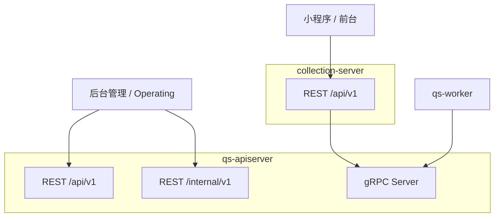

# 接口契约总览

**本文回答**：qs-server 当前有哪些 REST/gRPC 接口面；apiserver REST、collection REST、apiserver gRPC、InternalService 分别服务谁；OpenAPI、proto、路由注册、配置和运维文档之间如何互相验证。

---

## 30 秒结论

| 接口面 | 进程 | 调用方 | 定位 |
| ------ | ---- | ------ | ---- |
| apiserver REST | qs-apiserver | 管理后台、运维、内部 operating | 后台管理、生命周期、统计、治理 |
| collection REST | collection-server | 小程序、前台收集端 | 前台 BFF、答卷提交、报告查询、公开量表/问卷 |
| apiserver gRPC | qs-apiserver | collection-server、worker | 内部进程间 RPC |
| InternalService | qs-apiserver gRPC | worker | 异步事件回调、评估执行、内部任务处理 |
| governance/status | apiserver/collection/worker | operating / 运维 | 只读状态和少量受控治理动作 |

一句话概括：

> **REST 按调用方拆面，gRPC 由 apiserver 统一提供，worker 和 collection 都只是 gRPC 客户端。**

---

## 1. 契约总图



---

## 2. REST 契约真值

REST 契约需要同时核对三层：

| 层 | 说明 |
| -- | ---- |
| 机器导出 | `api/rest/apiserver.yaml`、`api/rest/collection.yaml` |
| 路由注册 | `transport/rest` 的 router / routes 文件 |
| handler 实现 | 具体 `handler/*.go` |

OpenAPI yaml 是导出物，最终“是否真实暴露”仍要回到 route 注册代码。

---

## 3. gRPC 契约真值

gRPC 契约需要同时核对：

| 层 | 说明 |
| -- | ---- |
| proto | `internal/apiserver/interface/grpc/proto` |
| server 注册 | `internal/apiserver/transport/grpc/registry.go` |
| service 实现 | `internal/apiserver/transport/grpc/service` |
| client 调用 | collection / worker 的 grpcclient registry |

---

## 4. 接口分层原则

### 4.1 collection REST 是前台 BFF

适合：

- 前台只读问卷/量表。
- 答卷提交。
- submit status 查询。
- assessment/report 查询。
- wait-report 长轮询。
- testee 前台管理。

不适合：

- 后台发布问卷/量表。
- 管理统计同步。
- cache governance。
- operator/staff 管理。
- internal repair。

### 4.2 apiserver REST 是后台和运维面

适合：

- 问卷/量表生命周期。
- Evaluation 管理。
- Actor/Operator 管理。
- Plan 管理。
- Statistics 管理。
- `/internal/v1/*` 运维/治理入口。

### 4.3 gRPC 是进程间内部契约

适合：

- collection 调用 apiserver。
- worker 回调 apiserver。
- 内部服务通信。

不适合：

- 前端直接调用。
- 替代 OpenAPI。
- 替代 Event/MQ。

---

## 5. 公开、保护、内部路径

| 路径 | 语义 |
| ---- | ---- |
| `/healthz` | GenericAPIServer 通用健康检查 |
| `/health` / `/readyz` / `/ping` | 业务/进程自定义健康和 ready |
| `/api/rest/*` | OpenAPI 静态导出文件，不是业务 API |
| `/swagger-ui/*` / `/swagger` | API UI |
| `/api/v1/public/*` | 公开 API |
| `/api/v1/*` | 业务 API，通常受 IAM/JWT/scope/authz 保护 |
| `/internal/v1/*` | internal 运维/治理 API，通常也走保护中间件 |
| `/governance/*` | 只读治理状态面，collection/worker 等可能暴露 |

---

## 6. Verify 流程

### 6.1 REST

```bash
make docs-swagger
make docs-rest
make docs-verify
go test ./internal/apiserver/transport/rest
go test ./internal/collection-server/transport/rest
```

### 6.2 gRPC

```bash
go test ./internal/apiserver/transport/grpc
go test ./internal/collection-server/integration/grpcclient
go test ./internal/worker/integration/grpcclient
```

### 6.3 部署

```bash
docker compose -f build/docker/docker-compose.prod.yml config
docker ps
curl -s http://127.0.0.1:<port>/healthz
```

---

## 7. 常见误区

### 7.1 “/api/rest 是业务 API 前缀”

不是。它是静态 OpenAPI 文件挂载路径。

### 7.2 “collection 和 apiserver 暴露同一套 REST”

不是。collection 是前台 BFF，apiserver 是后台/运维面。

### 7.3 “worker 有 HTTP/gRPC server”

没有业务 HTTP/gRPC server。worker 是 MQ consumer + gRPC client。

### 7.4 “proto 存在就代表服务注册了”

不一定。gRPC registry 有 nil 判断，模块缺失时会跳过注册。

---

## 8. 下一跳

| 目标 | 文档 |
| ---- | ---- |
| apiserver REST | [01-apiserver-REST.md](./01-apiserver-REST.md) |
| collection REST | [02-collection-REST.md](./02-collection-REST.md) |
| gRPC | [03-gRPC契约.md](./03-gRPC契约.md) |
| Internal gRPC | [04-internal-gRPC.md](./04-internal-gRPC.md) |
