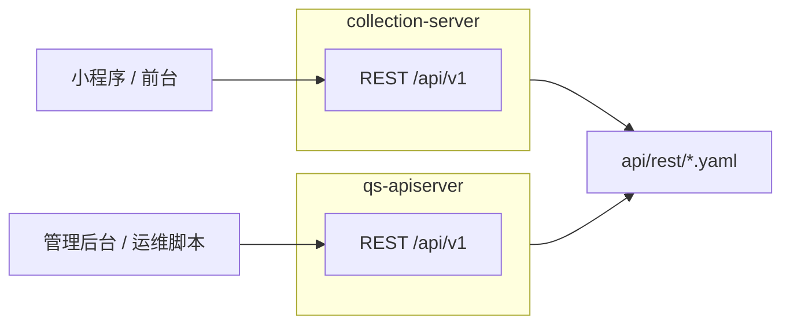

# REST 契约

本文档按 [CONTRIBUTING-DOCS.md](../CONTRIBUTING-DOCS.md) 的讲解维度组织。**业务语义与模块边界**见 [02-业务模块](../02-业务模块/) 各篇；**入口限流键与路由覆盖**见 [03-基础设施/03-缓存与限流](../03-基础设施/03-缓存与限流.md)。本文补齐 **What / Where / Verify**：双 REST 面分工、契约生成链、公开路径与自检方式。

---

## 30 秒了解系统

### 概览

仓库对外暴露 **两套 REST 进程**：**collection-server**（前台 BFF）与 **qs-apiserver**（后台与运维）。业务前缀均为 **`/api/v1`**；**`/api/rest/*`** 仅用于静态挂载 **OpenAPI 导出文件**，不是业务 API。

### 基础设施边界

| | 内容 |
| -- | ---- |
| **负责（摘要）** | 契约文件位置、生成命令、与 `routers.go` 的 Verify 关系；公开与受保护路径约定 |
| **不负责（摘要）** | 各 Handler 字段级说明（见 02）；限流配额数值（见 03-缓存与限流） |
| **关联** | [02-业务模块](../02-业务模块/)、[00-总览/04](../00-总览/04-本地开发与配置约定.md)（`make` 与端口） |

### 契约入口

- **OpenAPI 导出**：[api/rest/apiserver.yaml](../../api/rest/apiserver.yaml)、[api/rest/collection.yaml](../../api/rest/collection.yaml)
- **路由注册**：[internal/apiserver/routers.go](../../internal/apiserver/routers.go)、[internal/collection-server/routers.go](../../internal/collection-server/routers.go)
- **文档生成**：[Makefile](../../Makefile)（`docs-swagger`、`docs-rest`、`docs-verify`）、[scripts/generate_rest_from_swagger.py](../../scripts/generate_rest_from_swagger.py)、[scripts/compare_api_docs.py](../../scripts/compare_api_docs.py)

### 运行时示意图

#### 图说明

**BFF** 与 **主业务 REST** 分离：前台经 collection 收敛 IAM/限流/长轮询等；后台生命周期、统计同步、计划调度等在 apiserver。

### 主要代码入口（索引）

| 关注点 | 路径 |
| ------ | ---- |
| apiserver 路由 | [internal/apiserver/routers.go](../../internal/apiserver/routers.go) |
| collection 路由 | [internal/collection-server/routers.go](../../internal/collection-server/routers.go) |
| 静态挂载 OpenAPI / Swagger UI | 各进程 `server` / `app` 装配（与 [Makefile](../../Makefile) 产物路径一致） |

---

## 核心设计

### 核心分工：collection-server vs qs-apiserver

| 维度 | collection-server | qs-apiserver |
| ---- | ----------------- | ------------ |
| **调用方** | 小程序、前台收集端 | 管理后台、运维、Crontab |
| **典型资源** | `questionnaires`、`scales`、`testees`、`answersheets`、`assessments`（前台子集） | 同上领域在后台的完整生命周期 + `plans`、`statistics`、`staff`、`codes` 等 |
| **典型动作** | `POST /answersheets`、报告/状态查询、`GET .../wait-report` | `POST .../publish`、统计 `sync/*`、`plans/tasks/schedule`、`statistics/validate` |

**结论**：REST **按调用方拆分**，不在 collection 复制一套后台生命周期实现；详细列表以 **OpenAPI + `routers.go`** 为准。

### 核心契约：契约生成与 Verify

**链路**：`swag` 注解 → 各进程 `internal/*/docs/swagger.json` → `generate_rest_from_swagger.py` → `api/rest/*.yaml` → `compare_api_docs.py` 防漂移。

| 命令（见 [Makefile](../../Makefile)） | 作用 |
| ----------------------------------- | ---- |
| `make docs-swagger` | 生成 apiserver / collection 的 swagger.json |
| `make docs-rest` | 生成 `api/rest/*.yaml` |
| `make docs-verify` | 对比 swagger 与 OAS 摘要 |

**Verify**：改路由后 **同时** 跑 `make docs-rest`（或 CI 等价）与 `make docs-verify`；**最终是否挂载**以 **`routers.go`** 为准——YAML 为导出物，可能滞后。

### 核心模式：公开路径与认证

两进程通常保留 **`/health`、`/ping`、Swagger、`/api/rest/*`** 等；业务在 **`/api/v1`** 下，由 IAM 配置决定是否走 JWT 中间件（见 [03-基础设施/04-IAM与认证](../03-基础设施/04-IAM与认证.md)）。

**collection** 侧存在 **显式匿名只读**（如部分 `GET /scales`），便于拉元数据——以 [collection `routers.go`](../../internal/collection-server/routers.go) 为准。

### 核心代码锚点索引

| 关注点 | 路径 |
| ------ | ---- |
| 统计/计划等运维 REST | apiserver `statistics`、`plans` 路由组（[routers.go](../../internal/apiserver/routers.go)） |
| 与异步链路关系 | 运维触发的同步 ≠ MQ 消费；事件见 [03-基础设施/01-事件系统](../03-基础设施/01-事件系统.md) |

---

## 边界与注意事项

- **`/api/rest` 可访问 ≠ 该进程实现 YAML 内全部操作**；两进程镜像可能都带同一份静态目录。  
- **通用 HTTP 观测**（`/healthz`、`/metrics`、`/debug/pprof` 等）由 `GenericAPIServer` 与配置决定，与业务路由独立。  
- **apiserver** 另有如 **`/api/v1/qrcodes/:filename`** 等专用公开路径，以路由注册为准。

---

*写作约定见 [CONTRIBUTING-DOCS.md](../CONTRIBUTING-DOCS.md)。*
