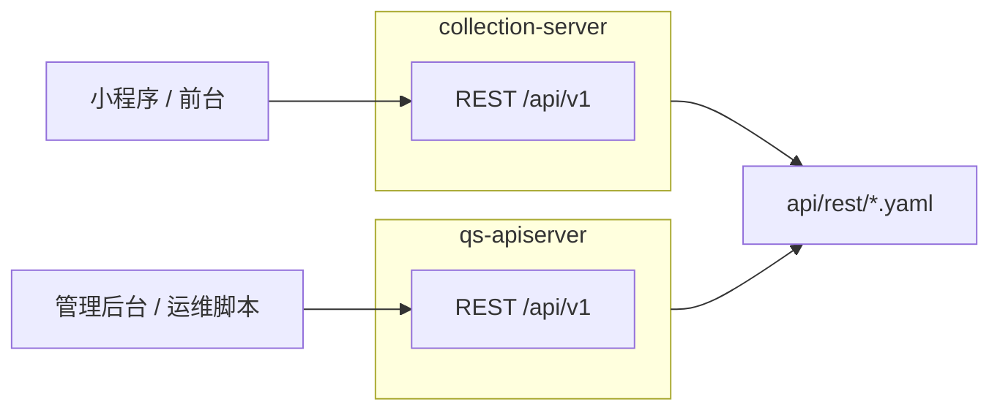

# REST 契约

**本文回答**：这篇文档解释 `qs-server` 的两套 REST 契约分别由谁提供、OpenAPI 文件在哪里、生成与校验链如何工作、公开路径与受保护路径如何区分，以及排障时该从哪些机器文件和路由入口核对；本文先给结论和速查，再展开契约生成链与分工。

本文档按 [CONTRIBUTING-DOCS.md](../CONTRIBUTING-DOCS.md) 的讲解维度组织。**业务语义与模块边界**见 [02-业务模块](../02-业务模块/) 各篇；**入口限流键与路由覆盖**见 [03-基础设施/03-缓存与限流](../03-基础设施/03-缓存与限流.md)。本文补齐 **What / Where / Verify**：双 REST 面分工、契约生成链、公开路径与自检方式。

Transport & Contract 的深讲 truth layer 见 [03-基础设施/transport/README.md](../03-基础设施/transport/README.md)。本文保留运维入口和契约索引，不重复维护 route matrix 的全部设计解释。

---

## 30 秒了解系统

### 概览

仓库对外暴露 **两套 REST 进程**：**collection-server**（前台 BFF）与 **qs-apiserver**（后台与运维）。业务前缀均为 **`/api/v1`**；**`/api/rest/*`** 仅用于静态挂载 **OpenAPI 导出文件**，不是业务 API。

### 重点速查

如果只看一屏，先看下面这张表：

| 维度 | 结论 |
| ---- | ---- |
| 双 REST 面 | `collection-server` 面向前台 / 小程序，`qs-apiserver` 面向后台、运维和内部管理 |
| 契约真值 | 最终以 [api/rest/apiserver.yaml](../../api/rest/apiserver.yaml) 和 [api/rest/collection.yaml](../../api/rest/collection.yaml) 为准 |
| 生成链 | `swag` 先生成 swagger，再由脚本转成 REST yaml，最后用 `compare_api_docs.py` 做校验 |
| 路由真值 | 运行时实际暴露以各进程 `transport/rest` 注册为准，导出文件必须与之持续对齐 |
| 最易混点 | `/api/rest/*` 是静态挂载的导出文档，不是业务 API 前缀 |
| 排障入口 | 先查 OpenAPI 文件和 `Makefile` 生成链，再回到 `transport/rest` 和具体 handler |
| internal 只读面板 | `qs-apiserver` 额外提供缓存治理 `/internal/v1/cache/governance/*`、事件状态 `GET /internal/v1/events/status`、Resilience 状态 `GET /internal/v1/resilience/status`，用于 operating 只读展示 |

### 基础设施边界

| | 内容 |
| -- | ---- |
| **负责（摘要）** | 契约文件位置、生成命令、与 `transport/rest` 的 Verify 关系；公开与受保护路径约定 |
| **不负责（摘要）** | 各 Handler 字段级说明（见 02）；限流配额数值（见 03-缓存与限流） |
| **关联** | [02-业务模块](../02-业务模块/)、[00-总览/04](../00-总览/04-本地开发与配置约定.md)（`make` 与端口） |

### 契约入口

- **OpenAPI 导出**：[api/rest/apiserver.yaml](../../api/rest/apiserver.yaml)、[api/rest/collection.yaml](../../api/rest/collection.yaml)
- **路由注册**：[internal/apiserver/transport/rest](../../internal/apiserver/transport/rest/)、[internal/collection-server/transport/rest/router.go](../../internal/collection-server/transport/rest/router.go)
- **文档生成**：[Makefile](../../Makefile)（`docs-swagger`、`docs-rest`、`docs-verify`）、[scripts/generate_rest_from_swagger.py](../../scripts/generate_rest_from_swagger.py)、[scripts/compare_api_docs.py](../../scripts/compare_api_docs.py)

### 运行时示意图

#### 图说明

**BFF** 与 **主业务 REST** 分离：前台经 collection 收敛 IAM/限流/长轮询等；后台生命周期、统计同步、计划调度等在 apiserver。

### 主要代码入口（索引）

| 关注点 | 路径 |
| ------ | ---- |
| apiserver 路由 | [internal/apiserver/transport/rest](../../internal/apiserver/transport/rest/) |
| collection 路由 | [internal/collection-server/transport/rest/router.go](../../internal/collection-server/transport/rest/router.go) |
| 静态挂载 OpenAPI / Swagger UI | 各进程 `server` / `app` 装配（与 [Makefile](../../Makefile) 产物路径一致） |
| 缓存治理 internal 路由 | [internal/apiserver/transport/rest/handler/statistics.go](../../internal/apiserver/transport/rest/handler/statistics.go) 中 `CacheGovernance*` handler；注册见 [internal/apiserver/transport/rest/routes_statistics.go](../../internal/apiserver/transport/rest/routes_statistics.go) |
| 事件状态 internal 路由 | [internal/apiserver/transport/rest/routes_events.go](../../internal/apiserver/transport/rest/routes_events.go)；只读聚合见 [internal/apiserver/application/eventing/status_service.go](../../internal/apiserver/application/eventing/status_service.go) |
| Transport 深讲 | [transport/README.md](../03-基础设施/transport/README.md) |

---

## 为什么要分成两套 REST 面

| 维度 | collection-server | qs-apiserver |
| ---- | ----------------- | ------------ |
| **调用方** | 小程序、前台收集端 | 管理后台、运维 |
| **典型资源** | `questionnaires`、`scales`、`testees`、`answersheets`、`assessments`（前台子集） | 同上领域在后台的完整生命周期 + `plans`、`statistics`、`staff`、`codes` 等 |
| **典型动作** | `POST /answersheets`、报告/状态查询、`GET .../wait-report` | `POST .../publish`、统计 `sync/*` 手工补跑、`plans/tasks/schedule` 手工触发 |

**结论**：REST **按调用方拆分**，不在 collection 复制一套后台生命周期实现；详细列表以 **OpenAPI + `transport/rest` 注册点** 为准。

## OpenAPI 文件从哪里来，怎样和路由保持一致

**链路**：`swag` 注解 → 各进程 `internal/*/docs/swagger.json` → `generate_rest_from_swagger.py` → `api/rest/*.yaml` → `compare_api_docs.py` 防漂移。

| 命令（见 [Makefile](../../Makefile)） | 作用 |
| ----------------------------------- | ---- |
| `make docs-swagger` | 生成 apiserver / collection 的 swagger.json |
| `make docs-rest` | 生成 `api/rest/*.yaml` |
| `make docs-verify` | 对比 swagger 与 OAS 摘要 |

**Verify**：改路由后 **同时** 跑 `make docs-rest`（或 CI 等价）与 `make docs-verify`；**最终是否挂载**以 **`transport/rest/router.go`、`registrars.go` 与 `routes_*.go`** 为准——YAML 为导出物，可能滞后。

## 公开路径、受保护路径和静态导出应该怎么区分

两进程通常保留 **`/health`、`/ping`、Swagger、`/api/rest/*`** 等；业务在 **`/api/v1`** 下，由 IAM 配置决定是否走 JWT 中间件（见 [03-基础设施/04-IAM与认证](../03-基础设施/04-IAM与认证.md)）。

**collection** 侧存在 **显式匿名只读**（如部分 `GET /scales`），便于拉元数据——以 [collection `transport/rest/router.go`](../../internal/collection-server/transport/rest/router.go) 为准。

## 排障和改动时先看什么

| 关注点 | 路径 |
| ------ | ---- |
| 统计/计划等运维 REST | apiserver `statistics`、`plans` 路由组（[transport/rest](../../internal/apiserver/transport/rest/)） |
| 与异步链路关系 | 运维触发的同步 ≠ MQ 消费；事件见 [03-基础设施/01-事件系统](../03-基础设施/01-事件系统.md) |

### 缓存治理 internal 面板（What / Where / Verify）

`qs-apiserver` 当前提供一组 **internal-only** 缓存治理接口，挂在：

- `GET /internal/v1/cache/governance/status`
- `GET /internal/v1/cache/governance/hotset?kind=...&limit=...`
- `POST /internal/v1/cache/governance/repair-complete`

这组路由的职责不同：

- `status`：查看当前进程对 `static/object/query/meta/sdk/lock` family 的解析结果、namespace、profile、degraded mode，以及最近一次 warmup run 快照；当前响应还包含 `generated_at` 与 `summary`，适合 operating BFF 直接透传给只读治理页
- `hotset`：按 `kind` 查看 top-N 热点 scope 与 score，只做治理预览，不暴露时序或聚合能力
- `repair-complete`：给 `seeddata / repair` 任务结束后触发缓存联动，不是只读面板

**Verify**：

- 路由注册以 [internal/apiserver/transport/rest/routes_statistics.go](../../internal/apiserver/transport/rest/routes_statistics.go) 为准
- 返回结构与查询参数校验以 [internal/apiserver/transport/rest/handler/statistics.go](../../internal/apiserver/transport/rest/handler/statistics.go) 为准
- `status` / `hotset` 口径来自缓存治理服务与 runtime family registry，不是 OpenAPI 静态文件推导出来的文档状态

### 事件状态 internal 面板（What / Where / Verify）

事件系统当前只提供 **只读状态摘要**，挂在：

- `GET /internal/v1/events/status`

这组接口只返回 catalog summary 与 MySQL/Mongo outbox 的 `pending/failed/publishing` backlog / lag 快照，不提供 replay、repair、dead-letter 或手工 mark 操作。详细接入方式见 [10-operating 事件只读状态接入](./10-operating%20事件只读状态接入.md)。

**Verify**：

- 路由注册以 [internal/apiserver/transport/rest/routes_events.go](../../internal/apiserver/transport/rest/routes_events.go) 为准
- 只读聚合以 [internal/apiserver/application/eventing/status_service.go](../../internal/apiserver/application/eventing/status_service.go) 为准
- route contract 以 [internal/apiserver/transport/rest/routes_events_test.go](../../internal/apiserver/transport/rest/routes_events_test.go) 为准

### Resilience 状态 internal 面板（What / Where / Verify）

高并发治理当前也提供 **只读状态摘要**，挂在：

- `GET /internal/v1/resilience/status`

这组接口返回 apiserver 当前 rate limit、backpressure、scheduler leader lock 的 capability snapshot，不提供限流动态配置、queue drain、lock release 或 repair 动作。collection-server 与 worker 各自还在 governance HTTP 面暴露 `/governance/resilience`，供 operating 聚合当前状态。

**Verify**：

- 路由注册以 [internal/apiserver/transport/rest/routes_resilience.go](../../internal/apiserver/transport/rest/routes_resilience.go) 为准
- 状态模型以 [internal/pkg/resilienceplane/status.go](../../internal/pkg/resilienceplane/status.go) 为准
- route contract 以 [internal/apiserver/transport/rest/routes_resilience_test.go](../../internal/apiserver/transport/rest/routes_resilience_test.go) 为准

### Prometheus 观测面（What / Where / Verify）

缓存治理的主观测面不是 internal REST，而是 `/metrics`。当前缓存相关的核心指标包括：

- `qs_cache_get_total`
- `qs_cache_write_total`
- `qs_cache_operation_duration_seconds`
- `qs_cache_payload_bytes`
- `qs_cache_family_available`
- `qs_cache_family_degraded_total`
- `qs_cache_warmup_runs_total`
- `qs_cache_warmup_items_total`
- `qs_cache_warmup_duration_seconds`
- `qs_cache_hotset_records_total`
- `qs_cache_warmup_hot_reads_total`
- `qs_cache_hotset_size`
- `qs_query_cache_version_total`
- `qs_cache_lock_acquire_total`
- `qs_cache_lock_release_total`
- `qs_cache_lock_degraded_total`

这些指标的定义与低基数标签约束在：

- [internal/pkg/cacheobservability](../../internal/pkg/cacheobservability/)

`worker` 不提供 apiserver 风格的 `/internal/v1/...` 路由；metrics server 启用时，Redis 与 Resilience 只读摘要分别通过 `/governance/redis`、`/governance/resilience` 暴露，趋势仍看 `/metrics` 与 Grafana。

---

## 边界与注意事项

- **`/api/rest` 可访问 ≠ 该进程实现 YAML 内全部操作**；两进程镜像可能都带同一份静态目录。  
- **通用 HTTP 观测**（`/healthz`、`/metrics`、`/debug/pprof` 等）由 `GenericAPIServer` 与配置决定，与业务路由独立。  
- **apiserver** 另有如 **`/api/v1/qrcodes/:filename`** 等专用公开路径，以路由注册为准。

---

*写作约定见 [CONTRIBUTING-DOCS.md](../CONTRIBUTING-DOCS.md)。*
