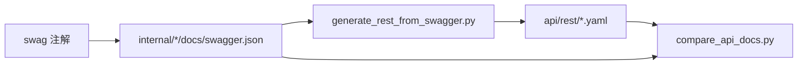

# REST 契约

本文介绍 `qs-server` 当前 REST API 的分工、契约导出方式和运维入口。

## 30 秒了解系统

`qs-server` 当前有两套 REST 面：

- `collection-server` 面向小程序和前台收集端，负责问卷/量表只读查询、受试者管理、答卷提交和报告查询
- `qs-apiserver` 面向后台管理、内部运维和周期任务，负责生命周期管理、统计同步、计划调度和后台查询

仓库里对外导出的 REST 契约文件在：

- [../../api/rest/collection.yaml](../../api/rest/collection.yaml)
- [../../api/rest/apiserver.yaml](../../api/rest/apiserver.yaml)

它们由 `swagger.json` 经过脚本转换得到 OAS 3.1 摘要，最终被两个进程一起静态挂载到 `/api/rest`。

核心代码入口：

- [../../internal/collection-server/routers.go](../../internal/collection-server/routers.go)
- [../../internal/apiserver/routers.go](../../internal/apiserver/routers.go)
- [../../Makefile](../../Makefile)
- [../../scripts/generate_rest_from_swagger.py](../../scripts/generate_rest_from_swagger.py)
- [../../scripts/compare_api_docs.py](../../scripts/compare_api_docs.py)

## 核心架构

```mermaid
flowchart LR
    Mini[Mini Program / 前台]
    Admin[管理后台 / 内部运维]
    Cron[Crontab / 运维脚本]

    Collection[collection-server REST]
    API[qs-apiserver REST]

    OAS[api/rest/*.yaml]
    UI[/swagger-ui]

    Mini -->|/api/v1| Collection
    Admin -->|/api/v1| API
    Cron -->|/api/v1| API

    Collection --> OAS
    API --> OAS
    Collection --> UI
    API --> UI
```

## 核心设计原则

- REST 面按调用者拆分，不按业务模块复制两套实现。前台入口收敛到 `collection-server`，后台和运维入口收敛到 `apiserver`。
- API 契约文件是导出产物，不是手写总表。实际生成链路是 `swagger -> api/rest/*.yaml`。
- 实际是否挂载某条路由，最终以 `routers.go` 为准；契约文件和运行时路由需要一起校验。
- 统一的业务前缀是 `/api/v1`，健康检查、OpenAPI 和 Swagger UI 走独立路径。

## 两套 REST 面如何分工

### collection-server

`collection-server` 负责前台友好的查询和提交入口，主要资源是：

- `/questionnaires`
- `/scales`
- `/testees`
- `/answersheets`
- `/assessments`

最典型的前台接口包括：

- `POST /api/v1/answersheets`
- `GET /api/v1/answersheets/submit-status`
- `GET /api/v1/answersheets/{id}/assessment`
- `GET /api/v1/assessments/{id}/report`
- `GET /api/v1/assessments/{id}/wait-report`

这里的 REST 面本质上是 BFF。它把 IAM 身份、限流、长轮询等待报告、前台友好的查询组合在一起，再通过 gRPC 调 `apiserver`。

### qs-apiserver

`qs-apiserver` 负责后台管理和内部运维入口，主要资源是：

- `/questionnaires`
- `/answersheets`
- `/scales`
- `/evaluations`
- `/plans`
- `/statistics`
- `/testees`
- `/staff`
- `/codes`

最典型的后台和运维接口包括：

- `POST /api/v1/questionnaires/{code}/publish`
- `POST /api/v1/scales/{code}/publish`
- `POST /api/v1/answersheets/admin-submit`
- `POST /api/v1/plans/tasks/schedule`
- `POST /api/v1/statistics/sync/daily`
- `POST /api/v1/statistics/sync/accumulated`
- `POST /api/v1/statistics/sync/plan`
- `POST /api/v1/statistics/validate`

这套 REST 面承接的是主业务生命周期和运维动作，不负责前台 BFF 的那层身份和交互收敛。

## 契约文件如何生成和发布

仓库里的 REST 契约当前走这条链路：



常用命令已经写在 [../../Makefile](../../Makefile)：

- `make docs-swagger`：生成 `internal/apiserver/docs` 和 `internal/collection-server/docs`
- `make docs-rest`：生成 `api/rest/apiserver.yaml` 和 `api/rest/collection.yaml`
- `make docs-verify`：对比 `swagger.json` 和 `api/rest` 是否漂移

两个进程都会把 `./api/rest` 静态目录挂到 `/api/rest`，并把 `./web/swagger-ui/swagger-ui-dist` 挂到 `/swagger-ui`。因此：

- `/api/rest` 是文档静态目录，不是业务 API 前缀
- 某个进程能访问某个 YAML 文件，不代表它实现了这个 YAML 里的全部路由

## 公共路径与认证边界

当前两个进程都保留了几类公开路径：

- `/health`
- `/ping`
- `/api/v1/public/info`
- `/swagger` 和 `/swagger-ui/`
- `/api/rest/*`

`apiserver` 还额外公开：

- `/api/v1/qrcodes/:filename`

受保护业务路径统一挂在 `/api/v1` 下，并根据 IAM 配置决定是否启用 JWT 本地验签中间件。

其中有一个显式例外：`collection-server` 的只读量表列表和分类接口允许跳过认证，便于前台先拉取基础元数据：

- `GET /api/v1/scales`
- `GET /api/v1/scales/categories`

## 关键设计点

### 1. REST 面的拆分按调用者，而不是按“模块完整复制”

`collection-server` 没有再维护一套问卷、量表、测评的主业务实现，它只保留前台真正需要的读写入口。生命周期管理、后台查询和统计运维仍然留在 `apiserver`。

### 2. 周期任务和内部运维入口直接落在 apiserver

统计同步、统计校验和计划调度都通过 `apiserver` 的 REST Handler 暴露，而不是额外再起一套同步服务。这让 Crontab、脚本和运维平台可以直接调用业务接口。

### 3. REST 契约文件是“导出物”，不是最终运行时判定器

`api/rest/*.yaml` 适合给外部对接、网关导入和 Swagger UI 使用；维护时仍然要回到 `routers.go` 和 `make docs-verify` 做交叉检查，避免契约文件和实际路由漂移。

## 边界与注意事项

- 实际业务接口前缀是 `/api/v1`，`/api/rest` 只用于暴露契约文件。
- `collection-server` 和 `apiserver` 都会携带同一份 `api/rest` 静态目录，因此“文件可访问”只说明镜像内包含契约资产，路由是否已实现仍以对应服务的挂载结果为准。
- 公开健康探针除了 `/health` 和 `/ping`，通用服务器还可能根据配置挂出 `/healthz`、`/metrics`、`/debug/pprof` 和 `/version`。
- 当前 REST 契约维护的正确姿势是同时看三处：`api/rest/*.yaml`、`routers.go` 和 `make docs-verify` 的结果。
