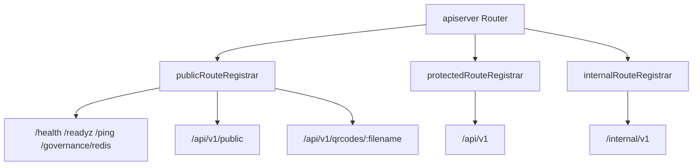

# apiserver REST

**本文回答**：qs-apiserver 的 REST 面如何分成 public、protected、internal 三层；每层注册哪些路由；IAM/JWT/TenantScope/AuthzSnapshot 中间件如何挂载；治理类 internal endpoint 应如何理解和排障。

---

## 30 秒结论

| 分组 | 路径 | 说明 |
| ---- | ---- | ---- |
| Public | `/health`、`/readyz`、`/ping`、`/governance/redis`、`/api/v1/public/*`、`/api/v1/qrcodes/:filename` | 基础健康、公开信息、二维码对象 |
| Protected | `/api/v1/*` | 后台业务 API：User、Questionnaire、AnswerSheet、Scale、Evaluation、Actor、Plan、Statistics、Codes、Admin |
| Internal | `/internal/v1/*` | Plan/Statistics/Cache/Event/Resilience 内部治理和手工操作 |
| Auth chain | Protected/Internal group | JWT → UserIdentity → TenantID → NumericOrgScope → ActiveOperator → AuthzSnapshot |

一句话概括：

> **apiserver REST 是后台管理和 internal governance 面，不是前台提交 BFF。**

---

## 1. 路由注册总图



---

## 2. Public Routes

apiserver public registrar 注册：

| 路径 | 说明 |
| ---- | ---- |
| `GET /health` | 业务健康检查 |
| `GET /readyz` | ready 检查 |
| `GET /ping` | ping |
| `GET /governance/redis` | Redis governance 只读状态 |
| `GET /api/v1/public/info` | 服务信息 |
| actor public routes | Actor 公开路由 |
| `GET /api/v1/qrcodes/:filename` | 二维码对象读取 |

注意：`/governance/redis` 是 governance 面，不等于业务 API。

---

## 3. Protected Routes

Protected group：

```text
/api/v1
```

注册模块：

- User。
- Questionnaire。
- AnswerSheet。
- Scale。
- Evaluation。
- Actor。
- Plan。
- Statistics。
- Codes。
- Admin。

每组 route 的详细业务语义应回到 `02-业务模块/`，这里不重复字段级说明。

---

## 4. Internal Routes

Internal group：

```text
/internal/v1
```

注册：

| 路由组 | 说明 |
| ------ | ---- |
| Plan internal | 计划任务手工调度 |
| Statistics internal | 统计同步手工触发 |
| Cache governance | cache status、hotset、repair-complete |
| Event status | event catalog/outbox 只读状态 |
| Resilience status | rate limit/backpressure/lock 等只读状态 |

Internal 并不等于“无认证”。当前 internal group 也会应用 protected group middleware。

---

## 5. Auth Middleware Chain

当 IAM enabled 且 TokenVerifier 可用时，Protected/Internal group 会挂：

```text
JWTAuthMiddlewareWithOptions
UserIdentityMiddleware
RequireTenantIDMiddleware
RequireNumericOrgScopeMiddleware
RequireActiveOperatorMiddleware
AuthzSnapshotMiddleware
```

含义：

- JWT 负责认证。
- UserIdentity 投影 Principal/TenantScope。
- TenantID/NumericOrgScope 保证组织范围。
- ActiveOperator 检查当前用户是本地有效 operator。
- AuthzSnapshot 加载 IAM 授权快照。

如果 SnapshotLoader 缺失，会打印 warning，authorization snapshot disabled。

---

## 6. IAM disabled 行为

如果 IAM disabled：

```text
routes are unprotected
```

这是高风险开发/测试模式，生产不应依赖。

如果 TokenVerifier 缺失，也会禁用 JWT authentication。

---

## 7. OpenAPI 与 route 注册

apiserver OpenAPI 导出文件：

```text
api/rest/apiserver.yaml
```

但最终是否暴露以 route 注册为准：

```text
internal/apiserver/transport/rest/registrars.go
internal/apiserver/transport/rest/routes_*.go
```

修改路由后必须更新 OpenAPI。

---

## 8. 常见排障

### 8.1 401 / token rejected

检查：

1. IAM enabled。
2. TokenVerifier 是否注入。
3. Authorization header。
4. ForceRemoteVerification。
5. JWT metadata。

### 8.2 tenant_id required / numeric org required

检查：

1. token claims。
2. TenantID。
3. 是否 numeric org。
4. 是否应该挂在 public route。

### 8.3 permission denied

检查：

1. AuthzSnapshot 是否加载。
2. Capability middleware。
3. IAM permissions resource/action。
4. Operator active 状态。

### 8.4 internal route 404

检查：

1. 是否挂在 `/internal/v1`。
2. route 文件是否注册。
3. 是否访问了历史旧路径。
4. OpenAPI 是否滞后。

---

## 9. Verify

```bash
go test ./internal/apiserver/transport/rest
make docs-rest
make docs-verify
```
