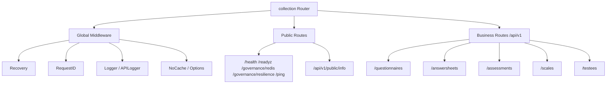

# collection-server REST

**本文回答**：collection-server 的 REST 面如何作为前台 BFF 暴露问卷、量表、答卷、测评、受试者相关接口；公开只读接口如何跳过认证；提交限流、SubmitQueue、submit-status、wait-report 等前台运维关注点在哪里。

---

## 30 秒结论

| 维度 | 结论 |
| ---- | ---- |
| 进程定位 | collection-server 是前台 BFF，面向小程序/收集端 |
| REST 前缀 | 业务 API 在 `/api/v1`，公开信息在 `/api/v1/public` |
| 健康治理 | `/health`、`/readyz`、`/governance/redis`、`/governance/resilience`、`/ping` |
| OpenAPI | `/api/rest` 静态挂载，`/swagger-ui` UI，`/swagger` 跳转 |
| Auth | IAM enabled 时 `/api/v1` 走 JWT + TenantScope + AuthzSnapshot，但 scale read-only 白名单可跳过 |
| RateLimit | submit/query/wait-report 走 global + user/ip 双层限流，优先 Redis backend，fallback local |
| SubmitQueue | `POST /answersheets` 入队后返回 202 + request_id，状态通过 `/answersheets/submit-status` 查 |
| 不负责 | 后台发布、统计同步、cache governance repair、operator 管理 |

一句话概括：

> **collection REST 负责前台收集体验和提交削峰，不承载后台生命周期管理。**

---

## 1. 路由总图



---

## 2. Global Middleware

collection RegisterRoutes 先设置：

- gin.Recovery。
- RequestID。
- Logger。
- APILogger。
- NoCache。
- Options。

这些中间件覆盖公开路由和业务路由。

---

## 3. Public Routes

| 路径 | 说明 |
| ---- | ---- |
| `GET /health` | 健康检查 |
| `GET /readyz` | ready |
| `GET /governance/redis` | Redis family 状态 |
| `GET /governance/resilience` | Resilience 状态 |
| `GET /ping` | ping |
| `GET /api/v1/public/info` | 服务信息 |

---

## 4. Business Routes

| 资源 | 路径 |
| ---- | ---- |
| questionnaire | `GET /api/v1/questionnaires`、`GET /api/v1/questionnaires/:code` |
| answersheet | `POST /api/v1/answersheets`、`GET /api/v1/answersheets/submit-status`、`GET /api/v1/answersheets/:id` |
| assessment | `GET /api/v1/assessments`、`/trend`、`/high-risk`、`/:id`、`/:id/scores`、`/:id/report`、`/:id/wait-report` |
| scale | `GET /api/v1/scales`、`/hot`、`/categories`、`/:code` |
| testee | `POST/GET /api/v1/testees`、`/exists`、`/:id`、`/:id/care-context`、`PUT /:id` |

---

## 5. Auth Skip 白名单

collection 中 `isPublicScaleReadOnly` 允许部分 GET 量表接口跳过 auth：

```text
GET /api/v1/scales
GET /api/v1/scales/hot
GET /api/v1/scales/categories
```

原因：前台可以公开拉取量表元数据。

注意：这不是所有 scale 路由都公开，`/scales/:code` 是否公开以代码和中间件 skip 函数为准。

---

## 6. IAM Auth Chain

当 IAMModule enabled 且 TokenVerifier 可用：

```text
JWTAuthMiddlewareWithOptions
UserIdentityMiddleware
RequireTenantIDMiddleware
RequireNumericOrgScopeMiddleware
AuthzSnapshotMiddleware
```

collection 不做 ActiveOperator 校验，因为它面向前台用户，不是后台 operator。

---

## 7. RateLimit

collection 对 submit/query/wait-report 有双层限流：

```text
global limiter
  -> user/ip keyed limiter
  -> handler
```

优先使用 Redis distributed limiter；如果 backend nil，则 fallback local/local_key limiter。

Scope：

- `submit`。
- `query`。
- `wait-report`。

Key：

- userID 存在：`user:{userID}`。
- 否则：`ip:{clientIP}`。

---

## 8. SubmitQueue 运维语义

`POST /api/v1/answersheets` 不是简单同步保存。

它会进入：

```text
RateLimit
  -> SubmitQueue
  -> SubmitGuard
  -> apiserver gRPC
```

成功入队：

```text
HTTP 202 accepted + request_id
```

队列满：

```text
HTTP 429 submit queue full
```

状态查询：

```text
GET /api/v1/answersheets/submit-status?request_id=...
```

---

## 9. wait-report

`GET /api/v1/assessments/:id/wait-report` 是长轮询类查询，使用单独 `wait-report` 限流 scope。

排障时要区分：

- 普通 query 429。
- wait-report 429。
- report 未生成。
- worker 事件处理延迟。

---

## 10. OpenAPI 与静态文档

collection 静态挂载：

- `/api/rest` -> `./api/rest`。
- `/swagger-ui`。
- `/swagger` redirect。

注意：`/api/rest` 是 OpenAPI 文件，不是业务 API。

---

## 11. 常见排障

### 11.1 前台请求 401

检查：

1. 是否命中 auth skip。
2. IAMModule 是否 enabled。
3. TokenVerifier。
4. JWT。
5. tenant_id numeric org。

### 11.2 submit 429

检查：

1. 是 RateLimit 还是 SubmitQueue full。
2. `qs_resilience_decision_total`。
3. queue depth。
4. apiserver gRPC 延迟。
5. Mongo durable submit。

### 11.3 submit-status not found

可能是：

- request_id 错误。
- status TTL 过期。
- 请求落到另一个 collection 实例。
- collection 重启。
- 原请求没有入队成功。

### 11.4 用户收不到报告

检查：

1. answerSheet 是否提交成功。
2. assessment 是否创建。
3. worker 是否消费 answersheet.submitted。
4. report generated。
5. wait-report timeout。

---

## 12. Verify

```bash
go test ./internal/collection-server/transport/rest
go test ./internal/collection-server/application/answersheet
make docs-rest
make docs-verify
```
