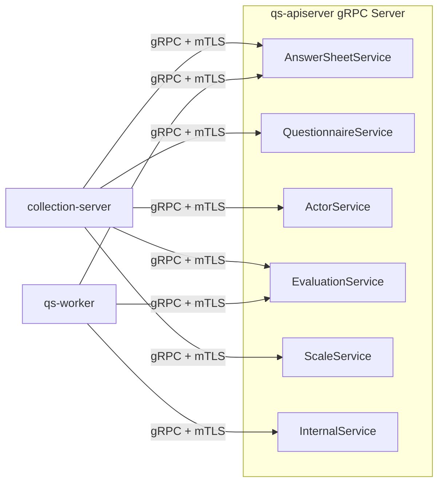

# gRPC 契约

本文介绍 `qs-server` 当前 gRPC 服务的职责划分、调用方和安全边界。

## 30 秒了解系统

当前仓库只有 `qs-apiserver` 对外提供 gRPC 服务。

它提供两类接口：

- 给 `collection-server` 用的查询/提交类服务
- 给 `worker` 用的内部回调服务

`collection-server` 和 `worker` 都只实现 gRPC 客户端，不对外暴露 gRPC 服务器。

核心代码入口：

- [../../internal/apiserver/interface/grpc/proto](../../internal/apiserver/interface/grpc/proto)
- [../../internal/apiserver/grpc_registry.go](../../internal/apiserver/grpc_registry.go)
- [../../internal/pkg/grpc/server.go](../../internal/pkg/grpc/server.go)
- [../../internal/collection-server/grpc_client_registry.go](../../internal/collection-server/grpc_client_registry.go)
- [../../internal/worker/grpc_client_registry.go](../../internal/worker/grpc_client_registry.go)
- [../../internal/worker/infra/grpcclient/internal_client.go](../../internal/worker/infra/grpcclient/internal_client.go)

## 核心架构

## 核心设计原则

- gRPC 只在内部服务之间使用，不直接替代对外 REST。
- gRPC 服务注册统一收敛在 `apiserver` 的 `GRPCRegistry`，而不是分散在各模块自启动。
- `InternalService` 和前台查询类服务分开，避免把事件回调接口和 BFF 查询接口混在一起。
- 传输安全优先通过 TLS 和 mTLS 保证，应用层 IAM gRPC 认证是可选补充。

## 当前服务矩阵

| 服务 | 主要调用方 | 作用 |
| --- | --- | --- |
| `AnswerSheetService` | `collection-server`、`worker` | 保存答卷、读取答卷、回写分数 |
| `QuestionnaireService` | `collection-server` | 问卷只读查询 |
| `ActorService` | `collection-server` | `Testee` 创建、查询、更新 |
| `EvaluationService` | `collection-server` | 我的测评、报告、趋势、高风险因子查询 |
| `ScaleService` | `collection-server` | 量表只读查询和分类查询 |
| `InternalService` | `worker` | 计分、创建 Assessment、执行评估、打标签，以及备用同步/调度接口 |

这套划分和运行时角色是一致的：

- `collection-server` 通过 gRPC 组合前台所需能力
- `worker` 通过 `InternalService` 回调主业务服务推进异步链路

## 契约如何定义和注册

### proto 定义职责

`.proto` 文件当前位于 `internal/apiserver/interface/grpc/proto/*/*.proto`，分别描述：

- `actor/actor.proto`
- `answersheet/answersheet.proto`
- `evaluation/evaluation.proto`
- `questionnaire/questionnaire.proto`
- `scale/scale.proto`
- `internalapi/internal.proto`

它们定义了方法名、请求/响应消息，以及给调用方看的接口语义。

### 注册器决定最终暴露哪些服务

实际启动时，`apiserver` 由 [../../internal/apiserver/grpc_registry.go](../../internal/apiserver/grpc_registry.go) 完成注册。

这里有两个重要事实：

- 当前只有 `apiserver` 启动 gRPC Server
- 如果某个模块没有完成装配，注册器会跳过对应服务

因此，`.proto` 是契约定义入口，`GRPCRegistry` 是运行时暴露入口。排查“为什么客户端调不到某个服务”时，两处都要看。

## InternalService 的定位

`InternalService` 不是给前台或后台管理界面准备的公共 API，它是事件驱动运行时的内部回调接口。

它当前承接的主路径包括：

- `CalculateAnswerSheetScore`
- `CreateAssessmentFromAnswerSheet`
- `EvaluateAssessment`
- `TagTestee`
- `GenerateQuestionnaireQRCode`
- `GenerateScaleQRCode`

同时它还保留了几组备用接口：

- `SyncDailyStatistics`
- `SyncAccumulatedStatistics`
- `SyncPlanStatistics`
- `ValidateStatistics`
- `SchedulePendingTasks`

这些接口是存在的，但 `internal.proto` 里的注释已经明确表达了当前推荐路径：定时任务优先走 REST API，而不是直接走 gRPC。

## 安全与传输

当前 gRPC Server 统一由 [../../internal/pkg/grpc/server.go](../../internal/pkg/grpc/server.go) 构建，主要能力有：

- Recovery、RequestID、Logging 拦截器
- mTLS 身份提取
- 可选 IAM gRPC 认证拦截器
- 可选 ACL 和审计拦截器
- gRPC health service
- 可选 reflection

从当前配置看：

- 开发环境 `apiserver` gRPC 默认已经启用 TLS 和 mTLS，便于本地联调真实链路
- 生产环境继续使用 mTLS，并默认关闭 reflection
- 生产环境下，`collection-server` 和 `worker` 都按客户端证书去连 `apiserver:9090`

## 关键设计点

### 1. gRPC 只在 apiserver 汇总暴露

这样做的结果是：所有内部 RPC 能力都围绕主业务装配点暴露，`collection-server` 和 `worker` 不会再各自长出一套服务网格。

### 2. InternalService 把“事件回调接口”和“前台查询接口”硬分开

前台查询只关心问卷、量表、答卷、测评结果；事件回调则关心计分、建 Assessment、评估、打标签和生成二维码。这两类方法的调用方、幂等要求和失败语义都不同，拆开更稳定。

### 3. gRPC 是内部协作主通道，但不是运维调度主通道

同步统计和计划调度在 gRPC 里有备用方法，是为了内部回调和兜底；日常运维仍然推荐用 REST + Crontab 的方式触发。

## 边界与注意事项

- `collection-server` 和 `worker` 都没有 gRPC Server，只有客户端注册和连接配置。
- `.proto` 定义了契约语义，但真正是否注册仍取决于 `GRPCRegistry` 和容器装配结果。
- gRPC health service 当前注册在主 gRPC Server 上；`reflection` 和认证拦截器是否启用由配置决定。
- 运行时排障时，优先一起看四处：`.proto`、`GRPCRegistry`、客户端注册器和对应环境配置。
