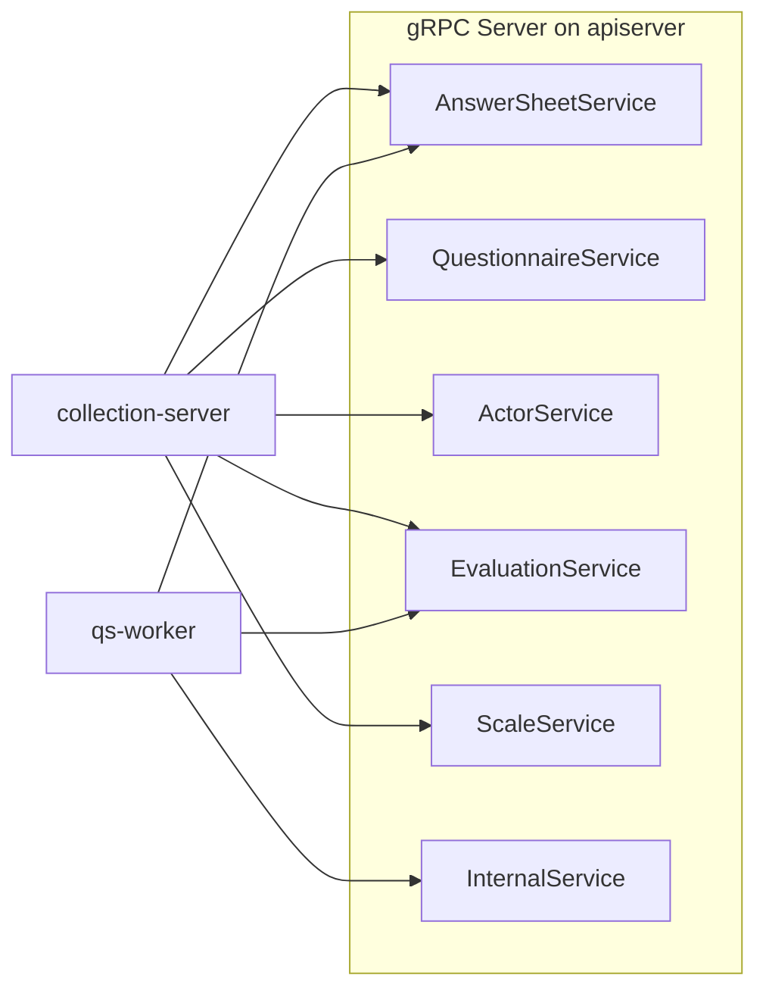

# gRPC 契约

**本文回答**：这篇文档解释 `qs-server` 的 gRPC 契约由谁提供、哪些进程是服务端或客户端、`.proto` 和注册器落在哪里、`InternalService` 的定位是什么，以及核对 gRPC 调用关系时应从哪些文件入手；本文先给结论和速查，再展开服务矩阵与注册方式。

本文档按 [CONTRIBUTING-DOCS.md](../CONTRIBUTING-DOCS.md) 的讲解维度组织。**传输安全与 IAM 拦截器链**见 [03-基础设施/04-IAM与认证](../03-基础设施/04-IAM与认证.md)；**进程间调用关系**见 [01-运行时/04-进程间通信](../01-运行时/04-进程间通信.md)。本文补齐 **proto 位置、注册器、调用方矩阵、InternalService 定位、Verify**。

---

## 30 秒了解系统

### 概览

仅 **qs-apiserver** 对外提供 **gRPC Server**。**collection-server** 与 **qs-worker** 仅实现 **gRPC 客户端**。对内协作不替代对外 REST；**InternalService** 面向 **worker 回调**及部分与统计/调度重叠的能力，与前台查询类 RPC 区分。

### 重点速查

如果只看一屏，先看下面这张表：

| 维度 | 结论 |
| ---- | ---- |
| 服务端角色 | 只有 `qs-apiserver` 暴露 gRPC Server |
| 客户端角色 | `collection-server` 和 `qs-worker` 都是 gRPC 客户端，但调用的 Service 集合不同 |
| 契约真值 | `.proto` 以 [internal/apiserver/interface/grpc/proto](../../internal/apiserver/interface/grpc/proto/) 为准 |
| 注册真值 | 服务端注册以 [grpc_registry.go](../../internal/apiserver/grpc_registry.go) 为准，客户端以各自 `grpc_client_registry.go` 为准 |
| `InternalService` 定位 | 它主要服务 worker 回调和部分内部运维能力，不等价于对外查询型服务 |
| 排障入口 | 先看 proto 和注册器，再看对应 service 实现与 client 调用点 |

### 基础设施边界

| | 内容 |
| -- | ---- |
| **负责（摘要）** | `.proto` 布局、`GRPCRegistry` 注册条件、各调用方用到的 Service |
| **不负责（摘要）** | 业务状态机细节（见 02-evaluation 等）；**ACL 规则全文**（见配置与 [internal/pkg/grpc/server.go](../../internal/pkg/grpc/server.go)） |
| **关联** | [03-基础设施/04-IAM与认证](../03-基础设施/04-IAM与认证.md)、[01-事件系统](../03-基础设施/01-事件系统.md) |

### 契约入口

- **Proto**：[internal/apiserver/interface/grpc/proto](../../internal/apiserver/interface/grpc/proto/)（`actor`、`answersheet`、`evaluation`、`questionnaire`、`scale`、`internalapi`）
- **服务端注册**：[internal/apiserver/grpc_registry.go](../../internal/apiserver/grpc_registry.go)
- **通用 Server 与拦截器**：[internal/pkg/grpc/server.go](../../internal/pkg/grpc/server.go)
- **客户端**：collection [grpc_client_registry.go](../../internal/collection-server/grpc_client_registry.go)；worker [grpc_client_registry.go](../../internal/worker/grpc_client_registry.go)

### 运行时示意图

#### 图说明

**collection** 注册五类前台客户端；**worker** 另需 **AnswerSheet、Evaluation、Internal**（计分/建测评/评估/打标签等异步回调）。

### 主要代码入口（索引）

| 关注点 | 路径 |
| ------ | ---- |
| 服务实现桩 | [internal/apiserver/interface/grpc/service](../../internal/apiserver/interface/grpc/service/) |
| worker Internal 调用 | [internal/worker/infra/grpcclient/internal_client.go](../../internal/worker/infra/grpcclient/internal_client.go) |

---

## gRPC 在整体里负责什么

| gRPC 服务 | collection | worker | 作用（摘要） |
| --------- | ------------ | ------ | ------------ |
| `AnswerSheetService` | ✓ | ✓ | 答卷写入/查询、分数回写等 |
| `QuestionnaireService` | ✓ | — | 问卷只读 |
| `ActorService` | ✓ | — | 受试者相关 |
| `EvaluationService` | ✓ | ✓ | 测评/报告/趋势等查询与提交侧能力 |
| `ScaleService` | ✓ | — | 量表只读与分类 |
| `InternalService` | — | ✓ | 计分、创建 Assessment、执行评估、打标签、二维码；**统计同步/校验/计划调度 RPC**（与 REST 并存） |

**Verify**：若某模块未装配，`GRPCRegistry` 会 **跳过** 对应服务（见 [`grpc_registry.go`](../../internal/apiserver/grpc_registry.go) 内 `nil` 判断与日志）。排障需 **proto + 注册器 + 容器装配** 一起看。

## 哪些进程是服务端，哪些进程是客户端

这篇只保留**契约视角**下最需要记住的分工；如果你关心“请求在三个进程之间怎么穿过”，优先回看 [01-运行时/04-进程间通信](../01-运行时/04-进程间通信.md)。

- **服务端只有 `qs-apiserver`**，因此所有 proto 和实现最终都收口在 apiserver 的注册器与 service 实现。
- **`collection-server` 只消费面向前台的查询/写入 RPC**，不接 `InternalService`。
- **`qs-worker` 只消费异步回调需要的 RPC**，包括 `AnswerSheetService`、`EvaluationService` 和 `InternalService`。

### `InternalService` 为什么单独存在

- **`.proto`**：方法名与消息类型的契约来源。  
- **`GRPCRegistry.RegisterServices`**：运行时唯一注册入口；**InternalService** 依赖 `EvaluationModule`、`ScaleModule`、`SurveyModule`、`ActorModule` 等同时满足，且统计/计划相关依赖可为 nil（内部再类型断言）。

**InternalService** 中 **同步统计、校验、计划调度** 与 **REST**（及 Crontab）指向同一套应用服务；proto 注释通常标明 **推荐运维入口为 REST**。详见 [internalapi/internal.proto](../../internal/apiserver/interface/grpc/proto/internalapi/internal.proto)。

## gRPC 的安全和元数据该怎么理解

这里只保留契约层需要知道的两点：

- **TLS / mTLS** 决定“这条 gRPC 连接怎么建立”，监听地址、证书路径和宿主机是否暴露见 [03-部署与端口](./03-部署与端口.md)。
- **`grpc.auth.enabled`** 决定“建立连接后业务 RPC 是否还要走 IAM JWT 拦截器”，拦截器顺序、`skipMethods`、worker 是否附加 `authorization` metadata 等细节见 [03-基础设施/04-IAM与认证](../03-基础设施/04-IAM与认证.md) 与 [01-运行时/05-IAM认证与身份链路](../01-运行时/05-IAM认证与身份链路.md)。

## 排障和改动时先看什么

| 关注点 | 路径 |
| ------ | ---- |
| 拦截器顺序 | [internal/pkg/grpc/server.go](../../internal/pkg/grpc/server.go) `buildUnaryInterceptors` |
| IAM 拦截器 | [internal/pkg/grpc/interceptor_auth.go](../../internal/pkg/grpc/interceptor_auth.go) |

---

## 边界与注意事项

- **collection / worker 均无 gRPC Server**，仅有客户端与连接配置。  
- **gRPC health / reflection** 是否开启由 `grpc` 配置决定；与 IAM **skip** 列表的关系见 03-IAM。  
- **「备用 gRPC 同步接口」** 与 **Crontab 调 REST** 并存时，避免运维侧混用导致重复触发（需结合 `statistics_sync` 进程内 ticker，见 [04-调度与后台任务](./04-调度与后台任务.md)）。

---

*写作约定见 [CONTRIBUTING-DOCS.md](../CONTRIBUTING-DOCS.md)。*
