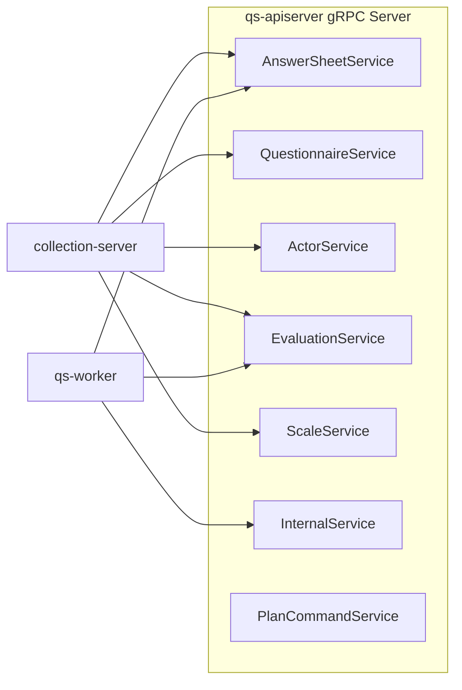

# gRPC 契约

**本文回答**：qs-server 的 gRPC 契约由谁提供；proto、server registry、collection client、worker client 分别落在哪里；哪些 service 面向 collection，哪些 service 面向 worker；gRPC 安全与 mTLS/ACL 的边界在哪里。

---

## 30 秒结论

| 维度 | 结论 |
| ---- | ---- |
| 服务端 | 只有 qs-apiserver 暴露 gRPC Server |
| 客户端 | collection-server 和 qs-worker 都是 gRPC client |
| Proto 真值 | `internal/apiserver/interface/grpc/proto` |
| 注册真值 | `internal/apiserver/transport/grpc/registry.go` |
| 注册方式 | Registry 按依赖是否 nil 决定是否注册服务，缺模块会 skip |
| collection 调用 | AnswerSheet、Questionnaire、Actor、Evaluation、Scale |
| worker 调用 | AnswerSheet、Evaluation、Internal |
| 安全 | gRPC server 支持 TLS/mTLS、IAM auth、AuthzSnapshot interceptor、ACL/Audit |

一句话概括：

> **gRPC 是内部进程间契约；proto 存在不等于服务一定注册，最终要看 Registry 和 Container deps。**

---

## 1. gRPC 总图



---

## 2. 服务注册矩阵

| Service | 注册条件摘要 | 主要调用方 |
| ------- | ------------ | ---------- |
| AnswerSheetService | AnswerSheet submission/management service 非 nil | collection、worker |
| QuestionnaireService | Questionnaire query service 非 nil | collection |
| ActorService | Testee/Clinician 相关 service 非 nil | collection |
| EvaluationService | Submission/Report/Score service 非 nil | collection、worker |
| ScaleService | Scale query/category service 非 nil | collection |
| InternalService | Survey/Scale/Evaluation/Actor/Plan/Statistics/Warmup/QR/Notification 等依赖满足 | worker |
| PlanCommandService | Plan command service 非 nil | internal usage / client |

Registry 里如果依赖缺失，会记录 warning 并 skip 注册，不直接 panic。

---

## 3. Proto 与实现

| 层 | 路径 |
| -- | ---- |
| proto | `internal/apiserver/interface/grpc/proto` |
| service implementation | `internal/apiserver/transport/grpc/service` |
| registry | `internal/apiserver/transport/grpc/registry.go` |
| grpc server config | `internal/pkg/grpc/server.go` |
| transport bootstrap | `internal/apiserver/process/transport_bootstrap.go` |

---

## 4. gRPC Server 启动链路

Transport Stage：

1. 从 Container 构建 `ServerGRPCBootstrapDeps`。
2. `buildGRPCServer(config, deps)`。
3. 应用 GRPCOptions。
4. 注入 AuthzSnapshotUnaryInterceptor。
5. 注入 TokenVerifier。
6. `grpcConfig.Complete().New(deps.TokenVerifier)`。
7. `NewRegistry(container.BuildGRPCDeps(grpcServer)).RegisterServices()`。

---

## 5. gRPC 安全链路

gRPC server 支持：

- TLS。
- mTLS。
- IAM bearer token auth。
- ForceRemoteVerification。
- AuthzSnapshotUnaryInterceptor。
- ACL。
- Audit。
- Reflection。
- HealthCheck。

安全细节归属：

- `03-基础设施/security/03-ServiceIdentity与mTLS-ACL.md`
- `03-基础设施/security/02-AuthzSnapshot与CapabilityDecision.md`

---

## 6. collection client 与 worker client

collection 作为前台 BFF，主要通过 gRPC 调用 apiserver 读写业务。

worker 作为 MQ consumer，主要通过 gRPC 回调 apiserver 执行内部动作。

排障时要查：

- client connection config。
- mTLS cert。
- service auth metadata。
- apiserver gRPC registry。
- proto method。
- service implementation。

---

## 7. 常见排障

### 7.1 Unimplemented

检查：

1. proto method 是否存在。
2. apiserver registry 是否注册对应 service。
3. Container deps 是否 nil。
4. client 是否连到正确 apiserver。

### 7.2 Unauthenticated

检查：

1. Authorization metadata。
2. service auth token。
3. TokenVerifier。
4. mTLS identity match。
5. skipMethods 是否匹配。

### 7.3 PermissionDenied

检查：

1. mTLS CN 和 service_id。
2. ACL default policy。
3. AuthzSnapshot。
4. user tenant/org。

### 7.4 deadline exceeded

检查：

1. apiserver gRPC 健康。
2. downstream DB/Mongo/IAM backpressure。
3. network。
4. worker/collection max in-flight。

---

## 8. Verify

```bash
go test ./internal/apiserver/transport/grpc
go test ./internal/pkg/grpc
```
