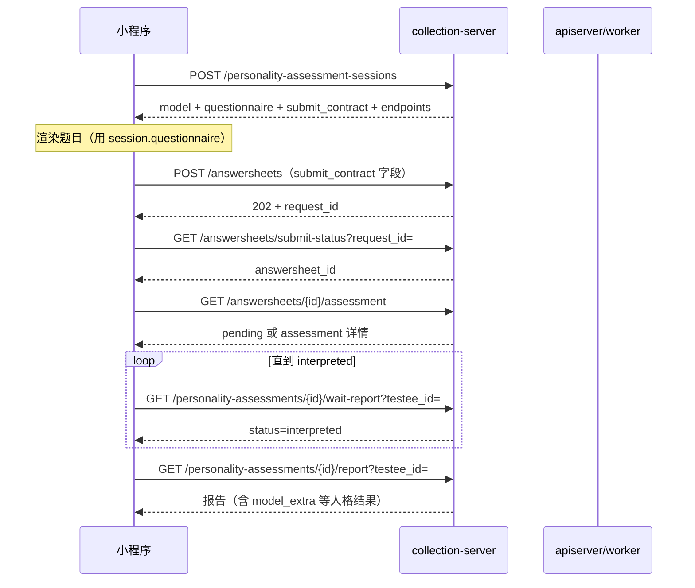

# 小程序人格测评接入说明

**本文回答**：小程序如何通过 collection-server REST 完成「选模型 → 拿题 → 提交 → 等报告 → 看结果」全链路；哪些接口必须带登录态、`testee_id`、精确题版 `version`。

---

## 30 秒结论

| 维度 | 结论 |
| ---- | ---- |
| 推荐入口 | `POST /api/v1/personality-assessment-sessions`（一次拿齐模型、题版、提交字段、后续 URL 模板） |
| 鉴权 | 除模型目录只读外，业务接口需 IAM JWT（`Authorization: Bearer <token>`） |
| 提交 | 仍走通用 `POST /api/v1/answersheets`（202 异步入队），**必须**带 `questionnaire_code` + `questionnaire_version` |
| 测评创建 | 服务端异步：答卷事件 → worker → 人格评估，**不要**在 session 阶段期待已有 `assessment_id` |
| 报告安全 | `interpretation` / `wait-report` / `详情` 均要求 `testee_id`，且必须与测评归属一致 |
| 不推荐 | 用 `algorithm=mbti/sbti` 做产品分支；用 `/api/v2/assessments` 作为稳定契约 |

一句话：

> **先 session 锁定题版，再 submit，再按答卷查测评，最后带 testee_id 拉报告。**

---

## 1. 环境与鉴权

| 项 | 值 |
| -- | -- |
| 业务前缀 | `/api/v1` |
| 生产示例 | `https://collect.fangcunmount.cn/api/v1` |
| OpenAPI | `GET /api/rest`（或仓库 `api/rest/collection.yaml`） |
| Swagger UI | `/swagger-ui` |

### 1.1 需要登录的接口

session、答卷提交、测评查询、报告查询等 **均需 JWT**。

### 1.2 可匿名访问（仅目录）

```text
GET /api/v1/personality-models
GET /api/v1/personality-models/categories
```

浏览模型列表/分类可不登录；**开始答题仍建议登录后走 session**。

---

## 2. 推荐时序（Happy Path）



---

## 3. 步骤详解

### 3.1 开始会话（推荐）

**`POST /api/v1/personality-assessment-sessions`**

请求：

```json
{
  "model_code": "MBTI_OEJTS",
  "testee_id": "618855887087350318"
}
```

`testee_id` 支持 **字符串或数字**；小程序侧建议用字符串，避免 JS 大整数精度丢失。

响应 `data` 主要字段：

| 字段 | 说明 |
| ---- | ---- |
| `model` | 模型摘要（`code` / `version` / `title` / `questionnaire_code` …） |
| `questionnaire` | **精确题版**（含 `questions`） |
| `submit_contract` | 提交答卷必填三元组 |
| `endpoints` | 后续 REST 路径模板（含 `testee_id` 占位） |

`submit_contract` 示例：

```json
{
  "questionnaire_code": "MBTI_OEJTS",
  "questionnaire_version": "1.0.0",
  "testee_id": "1001"
}
```

**注意**

- `model_code` 为已发布模型编码（如 `MBTI_OEJTS`），未知/未发布返回 404。
- session **不创建** assessment，只聚合读取契约。
- 题版 `version` 必须与模型绑定一致，否则后续评估会版本校验失败。

---

### 3.2 提交答卷

**`POST /api/v1/answersheets`**

请求头建议：

- `Authorization: Bearer <token>`
- `X-Request-Id: <uuid>`（用于幂等与状态查询）

请求体（字段来自 `submit_contract` + 用户作答）：

```json
{
  "questionnaire_code": "MBTI_OEJTS",
  "questionnaire_version": "1.0.0",
  "testee_id": 1001,
  "idempotency_key": "mp-submit-20250626-001",
  "answers": [
    {
      "question_code": "Q1",
      "question_type": "Radio",
      "score": 1,
      "value": "{\"option\":\"A\"}"
    }
  ]
}
```

响应：**HTTP 202**

```json
{
  "code": 0,
  "data": {
    "status": "queued",
    "request_id": "<与 X-Request-Id 对应>"
  }
}
```

查询受理结果：

**`GET /api/v1/answersheets/submit-status?request_id=<request_id>`**

成功后可得 `answersheet_id`，用于下一步。

---

### 3.3 按答卷查测评

**`GET /api/v1/answersheets/{answersheet_id}/assessment`**

| 情况 | 行为 |
| ---- | ---- |
| worker 尚未创建测评 | 返回 `status: "pending"`（可短轮询） |
| 已创建 | 返回测评详情（含 `id`、`status`） |

拿到 `assessment_id` 后进入报告等待。

---

### 3.4 等待报告

**前端接入（契约全集）**：[12-小程序报告等待接入指南.md](./12-小程序报告等待接入指南.md)

**推荐（方案 E）**：WebSocket 推送 + **report-status 降级**

**`WSS /api/v1/report-events`**（需 `report_events.enabled=true`）

连接时带 `Authorization: Bearer <token>`。连接后发送订阅帧：

```json
{"op":"subscribe","assessment_id":"123","kind":"personality","testee_id":"456"}
```

| 服务端帧 | 含义 |
| -------- | ---- |
| `subscribed` | 订阅成功 |
| `status` | 当前/变更状态（`data.status` 与 report-status 一致） |
| `pong` | 心跳响应 |
| `error` | 订阅失败（如 `forbidden` / `rate_limited`） |

**降级**：`onClose` / 15s 无 `status` → 切 **`GET .../report-status`** 短轮询（按 `next_poll_after_ms` 退避）。

**兼容（长轮询）**：`GET /api/v1/personality-assessments/{id}/wait-report?testee_id={testee_id}&timeout=20`

| 参数 | 必填 | 说明 |
| ---- | ---- | ---- |
| `testee_id` | 是 | 必须与测评归属受试者一致 |
| `timeout` | 否 | 秒，默认 20 |

`status` 常见值：

| status | 含义 |
| ------ | ---- |
| `pending` / `submitted` | 评估进行中，按 `next_poll_after_ms` 再请求 |
| `interpreted` | 报告已就绪，可拉 report |
| `failed` | 评估失败，看 `reason` |

---

### 3.5 获取报告

**`GET /api/v1/personality-assessments/{id}/report?testee_id={testee_id}`**

| 场景 | HTTP |
| ---- | ---- |
| 缺 `testee_id` | 400 |
| `testee_id` 不匹配 | 404（不泄漏他人报告） |
| 报告未生成 | 404 |
| 成功 | 200，`data` 含 `conclusion`、`dimensions`、`model_extra` 等 |

人格结果重点关注 `model_extra`（类型码、一句话、稀有度等）。

---

## 4. 备选 / 拆分调用（不推荐作为主路径）

若不用 session，需自行编排：

| 步骤 | 接口 |
| ---- | ---- |
| 模型详情 | `GET /api/v1/personality-models/{code}` → 读 `questionnaire_code` / `questionnaire_version` |
| 精确题版 | `GET /api/v1/questionnaires/{code}?version={version}` |
| 提交 | 同上 `POST /answersheets` |
| 列表 | `GET /api/v1/personality-assessments?testee_id=&page=` |
| 详情 | `GET /api/v1/personality-assessments/{id}?testee_id=` |

**legacy 参数**：列表可用 `algorithm` 过滤，但产品侧应优先用 `model.code` 与 `categories`，不要硬编码 `mbti`/`sbti` 分支。

---

## 5. 错误与重试建议

| 阶段 | 建议 |
| ---- | ---- |
| session 404 | 检查 `model_code` 是否已发布 |
| submit 429 | 退避重试；保留同一 `X-Request-Id` 保证幂等 |
| assessment pending | 短轮询 `answersheets/{id}/assessment`，间隔 ≥ 1s |
| wait-report / WS 断连 | WS 优先；断连后走 `report-status` + `next_poll_after_ms` |
| report 404 | 先确认状态已到 `interpreted`（WS 或 report-status） |

---

## 6. 小程序侧最小状态机

```text
idle
  → session_ok
  → submitting（202）
  → submit_done（有 answersheet_id）
  → assessment_pending
  → assessment_ready（有 assessment_id）
  → ws_subscribe（优先）或 waiting_report（HTTP 降级）
  → report_ready
```

本地持久化建议：`model_code`、`testee_id`、`answersheet_id`、`assessment_id`、`request_id`。

---

## 7. 相关文档

- collection REST 总览：`docs/04-接口与运维/02-collection-REST.md`
- OpenAPI 源文件：`api/rest/collection.yaml`
- 人格模型/评估后端逻辑：apiserver typology 模块（与前台契约通过 gRPC 隔离）

---

## 8. 联调检查清单

- [ ] IAM 登录态可访问 `/api/v1/personality-assessment-sessions`
- [ ] session 返回的 `questionnaire.questions` 非空
- [ ] submit 使用 session 的 `questionnaire_version`（非“当前最新”）
- [ ] `answersheets/{id}/assessment` 最终能拿到 `assessment_id`
- [ ] `wait-report` / `interpretation` 均带同一 `testee_id`
- [ ] 错误 `testee_id` 无法读到他人报告（应 404）
