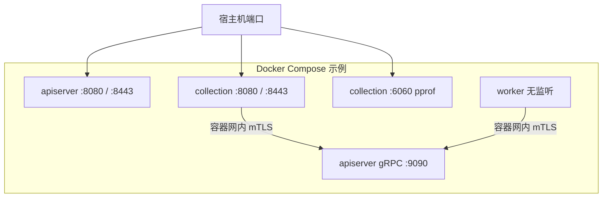

# 部署与端口

**本文回答**：这篇文档解释 `qs-server` 各进程在开发和部署时分别监听哪些端口、Compose 如何把容器内端口映射到宿主机、TLS / mTLS 证书通常挂在哪里，以及排障时如何区分配置监听地址、容器内端口和宿主机映射三层事实；本文先给结论和速查，再展开配置与部署细节。

本文档按 [CONTRIBUTING-DOCS.md](../CONTRIBUTING-DOCS.md) 的讲解维度组织。**本地 `make` / 环境变量**见 [00-总览/04-本地开发与配置约定](../00-总览/04-本地开发与配置约定.md)；**IAM 与 gRPC 认证**见 [03-基础设施/04-IAM与认证](../03-基础设施/04-IAM与认证.md)。本文补齐 **监听地址、Compose 映射、TLS/mTLS 挂载、观测入口**。

---

## 30 秒了解系统

### 概览

**qs-apiserver** 同时暴露 **HTTP(S)** 与 **gRPC**；**collection-server** 暴露 **HTTP(S)**，仅作为 **gRPC 客户端**连 apiserver；**qs-worker** **不监听**业务 HTTP/gRPC，只连 **MQ** 与 **apiserver gRPC**。排障时需区分：**配置文件监听地址**、**容器内端口**、**宿主机映射** 三层。

### 重点速查

如果只看一屏，先看下面这张表：

| 维度 | 结论 |
| ---- | ---- |
| 进程监听 | `qs-apiserver` 监听 HTTP(S) + gRPC；`collection-server` 监听 HTTP(S)；`qs-worker` 不暴露业务端口 |
| 三层端口事实 | 配置文件里的监听地址、容器内实际端口、宿主机映射是三层不同概念，排障时不能混用 |
| 最易误解点 | 生产 Compose 常不把 apiserver gRPC 暴露到宿主机，collection / worker 通过容器网络直连 |
| 真值文件 | `configs/*.yaml` 负责监听配置；`build/docker/*.yml` 负责容器映射；HTTP/gRPC server 代码负责最终生效 |
| TLS / mTLS | 证书路径和是否启用由配置与挂载共同决定，不是仅靠端口号推断 |
| 排障入口 | 先看配置 yaml，再看 Compose 映射，最后回到 server 代码确认监听和健康检查 |

### 基础设施边界

| | 内容 |
| -- | ---- |
| **负责（摘要）** | dev/prod yaml 与 Compose 中的端口表；证书挂载约定；观测路径 |
| **不负责（摘要）** | 云上 LB / Ingress 细则；**业务 REST 列表**（见 [01-REST契约](./01-REST契约.md)） |
| **关联** | [build/docker](../../build/docker/)、[configs](../../configs/) |

### 契约入口

- **配置**：[configs/apiserver.dev.yaml](../../configs/apiserver.dev.yaml)、[configs/apiserver.prod.yaml](../../configs/apiserver.prod.yaml)、[configs/collection-server.*.yaml](../../configs/)、[configs/worker.*.yaml](../../configs/)
- **Compose**：[build/docker/docker-compose.dev.yml](../../build/docker/docker-compose.dev.yml)、[build/docker/docker-compose.prod.yml](../../build/docker/docker-compose.prod.yml)
- **通用 HTTP 服务器**：[internal/pkg/server/genericapiserver.go](../../internal/pkg/server/genericapiserver.go)
- **gRPC Server**：[internal/pkg/grpc/server.go](../../internal/pkg/grpc/server.go)

### 运行时示意图

#### 图说明

生产 Compose 常 **不把 gRPC 暴露到宿主机**；collection/worker 在 **overlay 网络** 内访问 `qs-apiserver:9090`。

### 主要代码入口（索引）

| 关注点 | 路径 |
| ------ | ---- |
| collection 应用装配 | [internal/collection-server/app.go](../../internal/collection-server/app.go) |

---

## 核心设计

### 核心契约：本地开发（dev yaml 典型值）

| 进程 | HTTP | HTTPS | gRPC | 备注 |
| ---- | ---- | ----- | ---- | ---- |
| qs-apiserver | `127.0.0.1:18082` | `127.0.0.1:18442` | `127.0.0.1:9090` | gRPC 常与 TLS+mTLS 联调 |
| collection-server | `127.0.0.1:18083` | `127.0.0.1:18443` | （客户端→`127.0.0.1:9090`） | 无 gRPC Server |
| qs-worker | — | — | — | 出站-only |

**Verify**：以当前 **[configs/*.dev.yaml](../../configs/)** 为准；变更端口后同步 [00-总览/04](../00-总览/04-本地开发与配置约定.md) 若文档化了默认端口。

### 核心契约：生产配置（容器内监听典型值）

| 进程 | HTTP | HTTPS | gRPC |
| ---- | ---- | ----- | ---- |
| qs-apiserver | `0.0.0.0:8080` | `0.0.0.0:8443` | `0.0.0.0:9090` |
| collection-server | `0.0.0.0:8080` | `0.0.0.0:8443` | — |
| qs-worker | — | — | — |

### 核心模式：Docker Compose 宿主机映射（当前仓库）

**production**（[docker-compose.prod.yml](../../build/docker/docker-compose.prod.yml)）：

| 服务 | 映射 |
| ---- | ---- |
| qs-apiserver | `8081→8080`、`9445→8443` |
| qs-collection-server | `8082→8080`、`9446→8443`、`6060→6060`（pprof） |
| qs-worker | 无 |

**development**（[docker-compose.dev.yml](../../build/docker/docker-compose.dev.yml)）：

| 服务 | 映射 |
| ---- | ---- |
| qs-apiserver | `8081→8080`、`8444→8443` |
| collection-server | `8082→8080`、`8445→8443` |
| qs-worker | 无 |

**结论**：gRPC **通常不映射到宿主机**；HTTPS 宿主机端口 **prod 与 dev 文件不一致**（`9445/9446` vs `8444/8445`），运维脚本勿混用。

### 核心模式：TLS、mTLS 与证书路径

- **REST HTTPS**：Web 证书路径见各进程 yaml（如 `secure.serving` / `insecure.serving` 相关段）。  
- **gRPC mTLS**：apiserver 服务端证书、`mtls.ca-file` 与 **allowed-cns** 等；collection/worker 挂载 **CA + 客户端证书** 访问 apiserver。生产 Compose 示例将 gRPC 材料挂到 **`/etc/qs-server/ssl/grpc`**（以实际 compose 与 yaml 为准）。

### 核心模式：健康检查与观测

- **GenericAPIServer**：可配置 **`/healthz`、`/metrics`、`/debug/pprof`、`/version`** 等（取决于完成配置）。  
- **业务探针**：常见 **`/health`、`/ping`**。  
- **collection**：可额外监听 **`:6060` pprof**（生产 Compose 已映射时需注意内网隔离）。

### 核心代码锚点索引

| 关注点 | 路径 |
| ------ | ---- |
| gRPC 监听与配置绑定 | apiserver 启动路径中创建 `grpc.Server`（与 [configs](../../configs/) 中 `grpc` 段对应） |

---

## 边界与注意事项

- **配置里的 `grpc.healthz-port` 等**若存在，需与**实际是否单独 Listen**对照；当前以 **主 gRPC Server 上注册的 health service** 为准更可靠。  
- **worker** 可观测性依赖 **日志、MQ、出站 gRPC**，无对外端口。  
- **6060** 为诊断端口，**勿当业务依赖**。

---

*写作约定见 [CONTRIBUTING-DOCS.md](../CONTRIBUTING-DOCS.md)。*
