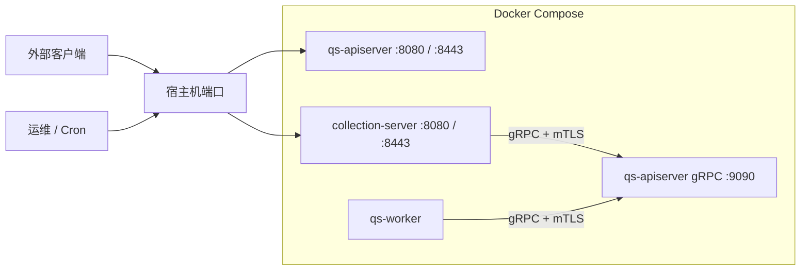

# 部署与端口

本文介绍 `qs-server` 当前在开发、容器和生产配置中的端口分布，以及 REST TLS、gRPC mTLS 和观测入口的放置方式。

## 30 秒了解系统

`qs-server` 当前的端口策略很简单：

- `qs-apiserver` 同时暴露 HTTP、HTTPS 和 gRPC
- `collection-server` 只暴露 HTTP 和 HTTPS，对内作为 gRPC 客户端调用 `apiserver`
- `worker` 不对外开业务端口，只连接 MQ 和 `apiserver` gRPC

从当前代码和配置看，真正需要重点区分的是三层地址：

- 本地开发配置里的监听端口
- 容器内服务端口
- Docker Compose 暴露到宿主机的端口映射

核心代码和配置入口：

- [../../configs/apiserver.dev.yaml](../../configs/apiserver.dev.yaml)
- [../../configs/apiserver.prod.yaml](../../configs/apiserver.prod.yaml)
- [../../configs/collection-server.dev.yaml](../../configs/collection-server.dev.yaml)
- [../../configs/collection-server.prod.yaml](../../configs/collection-server.prod.yaml)
- [../../configs/worker.dev.yaml](../../configs/worker.dev.yaml)
- [../../configs/worker.prod.yaml](../../configs/worker.prod.yaml)
- [../../build/docker/docker-compose.dev.yml](../../build/docker/docker-compose.dev.yml)
- [../../build/docker/docker-compose.prod.yml](../../build/docker/docker-compose.prod.yml)
- [../../internal/pkg/server/genericapiserver.go](../../internal/pkg/server/genericapiserver.go)
- [../../internal/pkg/grpc/server.go](../../internal/pkg/grpc/server.go)
- [../../internal/collection-server/app.go](../../internal/collection-server/app.go)

## 核心架构

## 核心设计原则

- REST 对外入口和内部 gRPC 入口分开部署。对外关注 HTTP/HTTPS，对内关注 gRPC + mTLS。
- `collection-server` 永远是 gRPC 客户端，不承担 gRPC 服务端职责。
- 生产 Compose 默认只暴露 REST 端口到宿主机，gRPC 保留在容器网络内部。
- 端口表必须同时看配置文件和 Compose 映射，不能只看其中一层。

## 本地开发端口

### 开发配置文件中的监听值

| 进程 | HTTP | HTTPS | gRPC | 备注 |
| --- | --- | --- | --- | --- |
| `qs-apiserver` | `127.0.0.1:18082` | `127.0.0.1:18442` | `127.0.0.1:9090` | gRPC 默认启用 TLS + mTLS |
| `collection-server` | `127.0.0.1:18083` | `127.0.0.1:18443` | 无 | gRPC 客户端默认连 `127.0.0.1:9090` |
| `qs-worker` | 无 | 无 | 无 | 只作为 MQ 消费者和 gRPC 客户端 |

对应配置文件：

- [../../configs/apiserver.dev.yaml](../../configs/apiserver.dev.yaml)
- [../../configs/collection-server.dev.yaml](../../configs/collection-server.dev.yaml)
- [../../configs/worker.dev.yaml](../../configs/worker.dev.yaml)

## 生产配置中的容器内端口

### 进程内监听值

| 进程 | HTTP | HTTPS | gRPC | 备注 |
| --- | --- | --- | --- | --- |
| `qs-apiserver` | `0.0.0.0:8080` | `0.0.0.0:8443` | `0.0.0.0:9090` | 内部服务主入口 |
| `collection-server` | `0.0.0.0:8080` | `0.0.0.0:8443` | 无 | 前台 REST 入口 |
| `qs-worker` | 无 | 无 | 无 | 只发起出站连接 |

对应配置文件：

- [../../configs/apiserver.prod.yaml](../../configs/apiserver.prod.yaml)
- [../../configs/collection-server.prod.yaml](../../configs/collection-server.prod.yaml)
- [../../configs/worker.prod.yaml](../../configs/worker.prod.yaml)

## Docker Compose 当前宿主机映射

### production compose

`build/docker/docker-compose.prod.yml` 当前把这些端口映射到宿主机：

| 服务 | 宿主机 -> 容器 |
| --- | --- |
| `qs-apiserver` | `8081 -> 8080`、`9445 -> 8443` |
| `qs-collection-server` | `8082 -> 8080`、`9446 -> 8443`、`6060 -> 6060` |
| `qs-worker` | 无 |

### development compose

`build/docker/docker-compose.dev.yml` 当前把这些端口映射到宿主机：

| 服务 | 宿主机 -> 容器 |
| --- | --- |
| `qs-apiserver` | `8081 -> 8080`、`8444 -> 8443` |
| `collection-server` | `8082 -> 8080`、`8445 -> 8443` |
| `qs-worker` | 无 |

这意味着当前 Compose 默认并不会把 `apiserver` 的 gRPC 端口暴露到宿主机；`collection-server` 和 `worker` 都是通过容器网络里的服务名去连 `qs-apiserver:9090`。

## TLS、mTLS 与证书挂载

### REST TLS

两个 REST 进程都支持 HTTP 和 HTTPS：

- HTTP 主要用于内网、调试和 Compose 内部访问
- HTTPS 主要用于外部入口或经过反向代理后的安全访问

当前生产 Compose 把 Web 证书目录挂载到：

- `/etc/qs-server/ssl/certs`
- `/etc/qs-server/ssl/private`

### gRPC mTLS

`apiserver` 当前是唯一的 gRPC 服务端，`collection-server` 和 `worker` 都通过客户端证书访问它。

生产环境当前约定：

- gRPC 证书目录挂载到 `/etc/qs-server/ssl/grpc`
- `apiserver` 服务端使用 `qs-apiserver.crt/key`
- `collection-server` 和 `worker` 分别使用自己的客户端证书

从配置上看：

- 开发环境通过 `allowed-cns` 和 `localhost` 做联调白名单
- 生产环境更偏向按 `OU=QS` 做简化白名单

## 健康检查与观测入口

### 通用 HTTP 入口

`GenericAPIServer` 会根据配置安装：

- `/healthz`
- `/metrics`
- `/debug/pprof/*`
- `/version`

业务层还会额外注册：

- `/health`
- `/ping`
- `/api/v1/public/info`

### collection-server 的独立 pprof

`collection-server` 当前会在进程内额外启动一个 `:6060` 的 `net/http/pprof` 监听器，生产 Compose 也把这个端口映射到了宿主机。它是运维诊断入口，不是业务 API。

## 关键设计点

### 1. 对外端口和内部端口是两层概念

配置文件定义的是进程在容器或本机里的监听值，Compose 决定的是它们是否暴露到宿主机。排查“为什么访问不到某个端口”时，两层都要看。

### 2. 生产环境当前不把 gRPC 暴露到宿主机

这和运行时角色是一致的：gRPC 只给内部服务协作使用，不给浏览器、外部调用方或 Crontab 直接访问。

### 3. gRPC 健康检查当前仍以主 gRPC Server 内置 health service 为主

配置和选项里保留了 `grpc.healthz-port`，默认值是 `9091`，但当前代码路径里没有看到单独启动一个独立 `9091` 监听器。现阶段更可靠的判断是：gRPC health service 注册在主 gRPC 服务器上，而独立 `9091` 仍然停留在配置层约定。

## 边界与注意事项

- 旧端口印象容易过时，尤其是宿主机 HTTPS 端口；当前生产 Compose 映射的是 `9445` 和 `9446`，不是开发 Compose 里的 `8444` 和 `8445`。
- `worker` 没有对外 HTTP 或 gRPC 监听端口，它的可观测性主要来自日志、MQ 消费状态和对下游的出站调用。
- `collection-server` 的 `:6060` 是诊断端口，不应作为业务依赖。
- 证书路径、宿主机卷挂载和端口暴露是部署约定的一部分，写运维脚本时要同时对齐配置文件和 Compose 文件。
