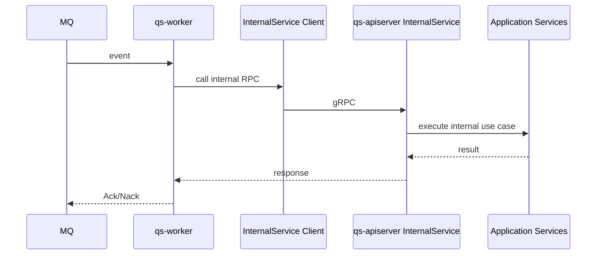

# internal gRPC

**本文回答**：InternalService 在 qs-server 中服务谁、为什么单独存在、当前承载哪些 worker 回调能力、哪些历史运维动作已经不应再假设走 InternalService，以及如何排查 worker 调 apiserver 的内部 RPC 问题。

---

## 30 秒结论

| 维度 | 结论 |
| ---- | ---- |
| 服务端 | qs-apiserver |
| 主要客户端 | qs-worker |
| 定位 | worker 异步事件处理后的内部回调 service |
| 不等于 | 不等于 REST internal 运维入口，不等于前台查询 service |
| 注册条件 | Evaluation、Scale、Survey、Actor、Plan、Statistics、Warmup、QR/Notification 等依赖满足 |
| 安全 | 仍经过 gRPC server 的 IAM/mTLS/ACL/Audit 链路 |
| 典型用途 | 计算分数、创建 Assessment、执行评估、标签/计划/通知/二维码等内部动作 |

一句话概括：

> **InternalService 是 worker 回调 apiserver 的内部 RPC 面，不是通用运维 API。**

---

## 1. InternalService 总图



---

## 2. 为什么单独存在

worker 处理事件时需要调用 apiserver 内部 use case，例如：

- answersheet submitted 后计算分数。
- 创建 assessment。
- 运行 evaluation engine。
- 更新标签。
- 计划任务内部回调。
- 通知或二维码相关内部动作。

这些动作不适合暴露为前台 REST，也不适合让 worker 直接访问 DB。

InternalService 提供了受控的 gRPC 内部契约。

---

## 3. 与 public gRPC service 的区别

| 类型 | 调用方 | 定位 |
| ---- | ------ | ---- |
| AnswerSheetService | collection/worker | 答卷写入/读取/分数相关 |
| EvaluationService | collection/worker | 测评、报告、分数查询 |
| InternalService | worker | 异步事件内部回调 |
| PlanCommandService | internal/client | 计划命令能力 |

InternalService 的方法通常更接近内部用例，不是对外稳定前台查询 API。

---

## 4. 与 internal REST 的区别

| Internal gRPC | Internal REST |
| ------------- | ------------- |
| worker 调用 | 运维/operating/手工触发 |
| 事件驱动 | 人工或系统管理驱动 |
| gRPC proto 契约 | REST handler 契约 |
| 不直接给前端使用 | 也不应暴露公网 |

不要把 statistics sync、plan schedule 等 REST internal 运维入口误认为 InternalService。

---

## 5. 注册条件

Registry 中 `registerInternalService` 需要多个依赖：

- Evaluation submission / management / engine。
- Scale query。
- Survey answersheet scoring。
- Actor tagging/operator services。
- Plan task resolver / command service。
- Statistics behavior projector。
- Warmup coordinator。
- QRCode service。
- MiniProgram notification service。

任一关键依赖缺失可能导致 InternalService skip。

---

## 6. 排障路径

### 6.1 worker 调用 Unimplemented

检查：

1. apiserver registry 是否注册 InternalService。
2. Container deps 是否满足。
3. worker proto client 是否匹配。
4. 是否连到旧版本 apiserver。

### 6.2 worker 调用 Unauthenticated

检查：

1. worker service auth metadata。
2. gRPC auth enabled。
3. mTLS 证书。
4. IAMAuthInterceptor。
5. skipMethods。

### 6.3 worker handler Nack

检查：

1. InternalService 返回错误。
2. application use case 错误。
3. DB/Mongo/IAM backpressure。
4. event handler retry/Nack 语义。
5. 是否应幂等跳过。

### 6.4 评估没生成

检查：

1. answersheet.submitted event。
2. worker 是否消费。
3. InternalService 是否可调用。
4. Evaluation engine。
5. Assessment/Report 持久化。

---

## 7. Verify

```bash
go test ./internal/apiserver/transport/grpc
go test ./internal/worker/handlers
go test ./internal/worker/infra/grpcclient
```
