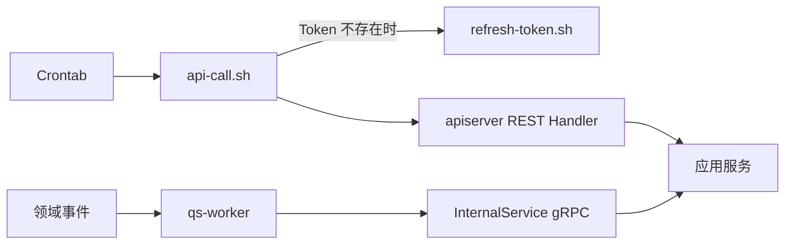

# 调度与后台任务

本文介绍 `qs-server` 当前周期任务的触发方式，以及它和 `worker` 事件型后台任务之间的分工。

## 30 秒了解系统

`qs-server` 当前有两类后台工作：

- 周期任务：由外部 `Crontab + Shell` 调用 `apiserver` 的 REST 接口触发
- 事件任务：由 `worker` 消费领域事件，再通过 gRPC 回调 `apiserver`

对运维来说，周期任务的主入口在：

- [../../configs/crontab/qs-scheduler](../../configs/crontab/qs-scheduler)
- [../../configs/crontab/api-call.sh](../../configs/crontab/api-call.sh)
- [../../configs/crontab/refresh-token.sh](../../configs/crontab/refresh-token.sh)

对运行时来说，事件型后台任务的主入口在：

- [../../configs/events.yaml](../../configs/events.yaml)
- [../../internal/worker/server.go](../../internal/worker/server.go)
- [../../internal/worker/handlers](../../internal/worker/handlers)
- [../../internal/worker/infra/grpcclient/internal_client.go](../../internal/worker/infra/grpcclient/internal_client.go)

## 核心架构

## 核心设计原则

- 周期任务不单独起“调度服务”，而是直接调用已经存在的业务 REST 接口。
- 业务逻辑仍然放在应用服务层，Crontab 只负责触发，不承载业务规则。
- `worker` 负责事件驱动的异步工作，不负责代替 Crontab 扫描计划任务或发起统计同步。
- gRPC 里的同步/调度接口保留为备用能力，日常运维入口仍然优先 REST。

## 当前周期任务清单

`configs/crontab/qs-scheduler` 当前配置了 5 个任务：

| 时间 | 接口 | 作用 |
| --- | --- | --- |
| 每小时 `00` 分 | `POST /api/v1/statistics/sync/daily` | 将每日统计从 Redis 同步到 MySQL |
| 每小时 `05` 分 | `POST /api/v1/statistics/sync/accumulated` | 将累计统计从 Redis 同步到 MySQL |
| 每小时 `10` 分 | `POST /api/v1/statistics/sync/plan` | 同步计划统计数据 |
| 每小时 `15` 分 | `POST /api/v1/statistics/validate` | 校验 Redis 和 MySQL 的统计一致性 |
| 每小时 `20` 分 | `POST /api/v1/plans/tasks/schedule` | 扫描并开放待调度任务 |

这些接口都挂在 `apiserver` 的 REST 面下，由各自模块的 Handler 和应用服务处理。

## 周期任务是如何触发的

### REST + Token 脚本是当前主路径

当前 Crontab 的执行链路是：

1. `cron` 调用 `qs-api-call.sh`
2. 如果本地 Token 不存在，脚本再调用 `qs-refresh-token.sh`
3. `refresh-token.sh` 通过 IAM 登录接口获取 Token
4. `api-call.sh` 带上 Bearer Token 调用 `apiserver` REST 接口
5. Handler 再转到 `SyncService`、`ValidatorService` 或 `TaskSchedulerService`

这个方案的直接好处是：运维入口和业务接口保持同一套权限、日志和中间件链路。

### gRPC 备用接口仍然存在

[../../internal/apiserver/interface/grpc/proto/internalapi/internal.proto](../../internal/apiserver/interface/grpc/proto/internalapi/internal.proto) 里保留了这些方法：

- `SyncDailyStatistics`
- `SyncAccumulatedStatistics`
- `SyncPlanStatistics`
- `ValidateStatistics`
- `SchedulePendingTasks`

它们是内部兜底入口，但当前契约注释已经明确推荐 REST 作为定时任务入口。

## 事件型后台任务如何推进

与 Crontab 不同，事件型后台任务由 `worker` 推进，主路径是：

- `answersheet.submitted -> CalculateAnswerSheetScore -> CreateAssessmentFromAnswerSheet`
- `assessment.submitted -> EvaluateAssessment`
- `report.generated -> TagTestee`
- `questionnaire.published -> GenerateQuestionnaireQRCode`
- `scale.published -> GenerateScaleQRCode`

这类工作不由运维脚本按时间触发，而是由领域事件驱动。

## 关键设计点

### 1. 周期任务直接调用业务接口，而不是增加一层独立调度服务

这让计划调度、统计同步和数据校验天然复用现有 Handler、应用服务、权限和日志链路。新增任务时，也可以直接在现有模块里补 Handler 和 Service，而不是先设计一套额外的调度框架。

### 2. 计划调度和测评执行是两段不同的后台工作

`POST /api/v1/plans/tasks/schedule` 只负责扫描待开放任务、生成入口并推进任务状态；真正的答卷提交和评估仍然会在后续进入 `survey -> evaluation -> worker` 主链路。

### 3. 统计同步除了外部 Crontab，还有进程内 ticker 兜底

`apiserver` 当前在启动过程中还会按配置启动统计同步 ticker：

- `SyncDailyStatistics`
- `SyncAccumulatedStatistics`
- `SyncPlanStatistics`

这说明统计模块既支持外部周期触发，也保留了进程内定时兜底能力。但从仓库里的 Crontab 配置、REST Handler 和 `internal.proto` 注释看，当前更明确的推荐路径仍然是外部 Crontab 调 REST。

## 边界与注意事项

- `qs-scheduler` 里的执行频率是当前运维默认值，不是协议约束；真正的入口是 REST 接口本身。
- `SchedulePendingTasks` 是计划任务开放入口，不负责过期扫描、通知下发或评估执行全流程。
- `worker` 负责事件型后台任务，不应和周期同步、周期调度混为一类。
- Token 文件路径、IAM 账号和 `API_BASE_URL` 是部署约定的一部分，迁移环境时要一起调整。
