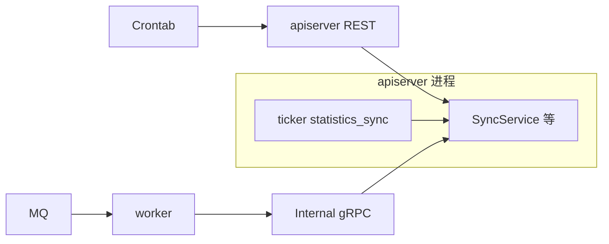

# 调度与后台任务

**本文回答**：这篇文档解释 `qs-server` 的后台动作为什么分成 Crontab 触发的 REST、apiserver 进程内 ticker、以及 MQ 驱动的事件型后台三类，以及这些路径分别由谁触发、调用到哪里、如何互相兜底；本文先给结论和速查，再展开各自的代码入口和 Verify 方式。

本文档按 [CONTRIBUTING-DOCS.md](../CONTRIBUTING-DOCS.md) 的讲解维度组织。**领域事件与 Topic / handler**见 [03-基础设施/01-事件系统](../03-基础设施/01-事件系统.md)；**统计模块业务语义**见 [02-业务模块/06-statistics](../02-业务模块/06-statistics.md)。本文区分 **Crontab 触发的 REST**、**apiserver 进程内统计同步 ticker**、**worker 事件驱动 gRPC** 三条路径。

---

## 30 秒了解系统

### 概览

| 类型 | 触发方式 | 主入口 |
| ---- | -------- | ------ |
| **周期任务** | 宿主机 **Crontab + Shell** 调 **apiserver REST** | [configs/crontab/qs-scheduler](../../configs/crontab/qs-scheduler)、[api-call.sh](../../configs/crontab/api-call.sh)、[refresh-token.sh](../../configs/crontab/refresh-token.sh) |
| **进程内兜底** | apiserver 启动 **statistics_sync** ticker（Redis→MySQL） | [internal/apiserver/server.go](../../internal/apiserver/server.go) `startStatisticsSyncScheduler`、[options StatisticsSyncOptions](../../internal/apiserver/options/options.go) |
| **事件型后台** | **MQ → worker handler → gRPC（含 InternalService）** | [configs/events.yaml](../../configs/events.yaml)、[internal/worker/handlers](../../internal/worker/handlers/)、[internal/worker/infra/grpcclient](../../internal/worker/infra/grpcclient/) |

### 重点速查

如果只看一屏，先看下面这张表：

| 维度 | 结论 |
| ---- | ---- |
| 三类后台 | `Crontab -> REST` 负责按时间触发；进程内 ticker 负责统计兜底同步；`MQ -> worker -> gRPC` 负责事件型异步后台 |
| 最重要的认识 | 它们不是同一机制的三个实现，而是职责不同的三条后台路径 |
| 共用服务 | 同一套同步服务可能同时被 REST、ticker 和 internal gRPC 复用 |
| 真值入口 | Crontab 看 `configs/crontab`；事件看 `configs/events.yaml`；ticker 看 `server.go` 和 `options` |
| 最易误解点 | 事件型后台不是“调度系统”，Crontab 也不是 MQ 的替代；它们面向的问题不同 |
| 排障入口 | 先判断问题属于按时间触发、进程内兜底还是事件驱动，再查对应入口 |

### 基础设施边界

| | 内容 |
| -- | ---- |
| **负责（摘要）** | Crontab 与 REST 路径对齐；ticker 默认与配置键；与 gRPC 备用接口的关系 |
| **不负责（摘要）** | Handler 内业务规则全文；**IAM 登录脚本密钥**（脚本内占位符，勿提交真实值） |
| **关联** | [02-gRPC契约](./02-gRPC契约.md)（Internal 备用 RPC）、[05-专题分析](../05-专题分析/) 异步叙事 |

### 契约入口

- **Crontab 示例**：[configs/crontab/qs-scheduler](../../configs/crontab/qs-scheduler)（**占位 IAM 与 API_BASE_URL**，部署时替换）
- **事件配置**：[configs/events.yaml](../../configs/events.yaml)
- **worker**：[internal/worker/server.go](../../internal/worker/server.go)、handlers 目录

### 运行时示意图

#### 图说明

**同一套同步服务**可被 **REST**、**ticker**、（可选）**gRPC Internal** 调用；**事件链**与 **按时间触发** 解耦。

### 主要代码入口（索引）

| 关注点 | 路径 |
| ------ | ---- |
| 统计 Handler（REST） | [internal/apiserver/interface/restful/handler/statistics.go](../../internal/apiserver/interface/restful/handler/statistics.go) |
| 计划任务调度 REST | plan 模块 Handler（路由见 [routers.go](../../internal/apiserver/routers.go)） |

---

## 核心设计

### 核心契约：Crontab 与 REST 路径（Verify）

[`qs-scheduler`](../../configs/crontab/qs-scheduler) 当前示例（每小时错开）：

| 时间偏移 | 路径 | 作用（摘要） |
| -------- | ---- | ------------ |
| `:00` | `POST /api/v1/statistics/sync/daily` | 每日统计 Redis→MySQL |
| `:05` | `POST /api/v1/statistics/sync/accumulated` | 累计统计同步 |
| `:10` | `POST /api/v1/statistics/sync/plan` | 计划统计同步 |
| `:15` | `POST /api/v1/statistics/validate` | 一致性校验 |
| `:20` | `POST /api/v1/plans/tasks/schedule` | 扫描并开放待调度任务 |

**Verify**：变更 Crontab 时与 **[routers.go](../../internal/apiserver/routers.go)** 注册路径一致；脚本通过 **`api-call.sh`** 带 Bearer Token（Token 由 **`refresh-token.sh`** 写入文件）。

### 核心模式：进程内 statistics_sync ticker

[server.go](../../internal/apiserver/server.go) 在 **`StatisticsSync.Enable`** 且统计模块可用时启动 **三个 ticker**，分别调用 `SyncDailyStatistics`、`SyncAccumulatedStatistics`、`SyncPlanStatistics`（默认间隔见 [NewStatisticsSyncOptions](../../internal/apiserver/options/options.go)：如 daily **10m**、plan **30m** 等）。

**结论**：存在 **「外部每小时 Crontab」** 与 **「进程内周期 ticker」** 叠加可能；运维需根据环境 **关闭其一或调间隔**，避免重复同步（以运行策略为准）。

### 核心模式：事件型后台（与 Crontab 对比）

worker 消费 **`configs/events.yaml`** 中订阅，经 **gRPC** 回调 apiserver（计分、建测评、评估、打标签、二维码等）。**不按墙钟统一扫描**，由 **事件投递** 驱动。

**与计划调度的关系**：`plans/tasks/schedule` 处理 **任务开放与扫描**；答卷提交与评估仍在 **survey → evaluation → worker** 主链路（见 [03-基础设施/01-事件系统](../03-基础设施/01-事件系统.md)）。

### 核心模式：gRPC 备用接口

[internal.proto](../../internal/apiserver/interface/grpc/proto/internalapi/internal.proto) 中 **Sync*/Validate/SchedulePendingTasks** 与 REST 并存；**推荐运维默认走 REST**（与脚本、网关策略一致）。详见 [02-gRPC契约](./02-gRPC契约.md)。

### 核心代码锚点索引

| 关注点 | 路径 |
| ------ | ---- |
| 统计同步应用服务 | [internal/apiserver/application/statistics/sync_service.go](../../internal/apiserver/application/statistics/sync_service.go)（接口见 `interfaces.go`） |

---

## 边界与注意事项

- **Crontab 频率**是示例运维默认值，**非协议**；接口本身定义幂等与副作用。  
- **`SchedulePendingTasks`** 不包办评估执行、通知等全链路。  
- **worker 与 Crontab** 是两类后台，**勿混为一谈**。  
- 部署时替换 **`IAM_*`、`API_BASE_URL`、Token 路径** 等，**勿将真实密钥写入仓库**。

---

*写作约定见 [CONTRIBUTING-DOCS.md](../CONTRIBUTING-DOCS.md)。*
