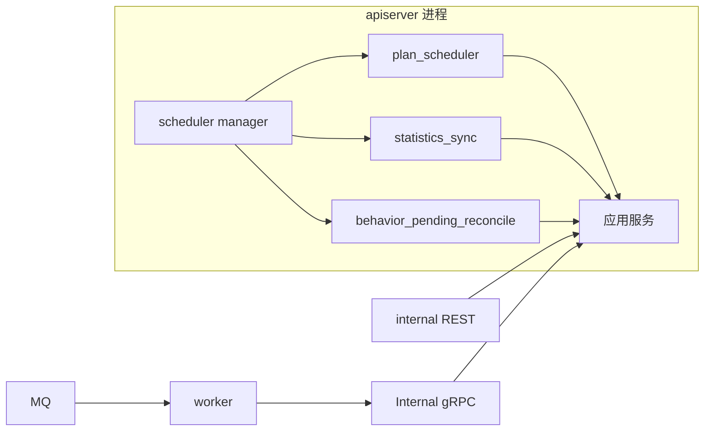

# 调度与后台任务

**本文回答**：`qs-server` 现在的周期任务默认由 `apiserver` 进程内统一调度，`worker` 负责事件驱动型异步后台；历史上的 `宿主机 crontab + shell -> apiserver internal REST` 方案已经从仓库和默认部署链中移除，不再作为生产默认方案。

本文档按 [CONTRIBUTING-DOCS.md](../CONTRIBUTING-DOCS.md) 的讲解维度组织。**领域事件与 Topic / handler** 见 [03-基础设施/01-事件系统](../03-基础设施/01-事件系统.md)，**统计模块业务语义** 见 [02-业务模块/06-statistics](../02-业务模块/06-statistics.md)。

---

## 30 秒了解系统

### 概览

| 类型 | 触发方式 | 主入口 |
| ---- | -------- | ------ |
| **周期任务** | `qs-apiserver` 启动后在进程内统一调度 | [internal/apiserver/server.go](../../internal/apiserver/server.go) `startSchedulers`、[internal/apiserver/runtime/scheduler](../../internal/apiserver/runtime/scheduler/) |
| **事件型后台** | `MQ -> worker handler -> gRPC` | [configs/events.yaml](../../configs/events.yaml)、[internal/worker/handlers](../../internal/worker/handlers/)、[internal/worker/infra/grpcclient](../../internal/worker/infra/grpcclient/) |
| **手工触发入口** | internal REST，仅用于运维手工执行或排障 | [internal/apiserver/routers.go](../../internal/apiserver/routers.go)、[internal/apiserver/interface/restful/handler](../../internal/apiserver/interface/restful/handler/) |

### 重点速查

| 维度 | 结论 |
| ---- | ---- |
| 周期任务真值入口 | 看 `apiserver` 配置和 `runtime/scheduler`，不是看宿主机 crontab |
| 统一调度器 | `plan_scheduler`、`statistics_sync`、`behavior_pending_reconcile` 都由 `startSchedulers()` 统一启动 |
| 多实例互斥 | 三个 scheduler 都通过 Redis leader lock 避免多实例重复执行 |
| 事件型后台 | 仍然是 `MQ -> worker -> gRPC`，和周期调度是两条不同链路 |
| 历史遗留 | 旧的宿主机 cron / shell 部署链已经从仓库移除，只需清理线上残留文件 |

### 运行时示意图

#### 图说明

默认生产路径是 **apiserver 内建 scheduler**。  
`internal REST` 仍保留，但定位已经变成 **手工执行 / 运维排障入口**，不是宿主机定时调度入口。

---

## 现在有哪些 scheduler

### 统一启动入口

[internal/apiserver/server.go](../../internal/apiserver/server.go) 中的 `startSchedulers()` 会统一组装并启动 scheduler manager。

当前纳管的 runner 有：

- `plan_scheduler`
- `statistics_sync`
- `behavior_pending_reconcile`

对应实现都在 [internal/apiserver/runtime/scheduler](../../internal/apiserver/runtime/scheduler/)。

### 配置入口

apiserver 配置文件中有三块顶层配置：

- `plan_scheduler`
- `statistics_sync`
- `behavior_pending_reconcile`

生产示例见 [configs/apiserver.prod.yaml](../../configs/apiserver.prod.yaml)，定义见 [internal/apiserver/options/options.go](../../internal/apiserver/options/options.go)。

### 各 scheduler 的职责

| 名称 | 作用 | 关键代码 |
| ---- | ---- | -------- |
| `plan_scheduler` | 扫描并开放/轮转 plan task | [plan_scheduler.go](../../internal/apiserver/runtime/scheduler/plan_scheduler.go) |
| `statistics_sync` | 按计划执行 daily / accumulated / plan 统计同步 | [statistics_sync.go](../../internal/apiserver/runtime/scheduler/statistics_sync.go) |
| `behavior_pending_reconcile` | 补偿 pending behavior 事件归因 | [behavior_pending_reconcile.go](../../internal/apiserver/runtime/scheduler/behavior_pending_reconcile.go) |

---

## internal REST 现在还做什么

internal REST 仍然保留了部分系统动作入口，但定位已经变化：

- 可以被运维或管理员手工触发
- 可以用于一次性补跑或排障验证
- 不再建议由宿主机 crontab 周期调用

当前仍保留的 internal route 主要包括：

- `POST /internal/v1/statistics/sync/daily`
- `POST /internal/v1/statistics/sync/accumulated`
- `POST /internal/v1/statistics/sync/plan`
- `POST /internal/v1/plans/tasks/schedule`

路由注册见 [internal/apiserver/routers.go](../../internal/apiserver/routers.go)，handler 见：

- [internal/apiserver/interface/restful/handler/statistics.go](../../internal/apiserver/interface/restful/handler/statistics.go)
- [internal/apiserver/interface/restful/handler/plan.go](../../internal/apiserver/interface/restful/handler/plan.go)

注意：历史 cron 配置中的 `POST /internal/v1/statistics/validate` 已不再是当前 router 注册的一部分，不能继续按旧脚本假设它存在。

---

## worker 在这里承担什么角色

`worker` 现在主要负责 **事件驱动型异步后台**：

- 消费 MQ topic
- 执行 handler
- 通过 Internal gRPC 回调 `apiserver`

也就是说：

- **按时间触发** 归 `apiserver` scheduler
- **按事件触发** 归 `worker`

详见 [03-基础设施/01-事件系统](../03-基础设施/01-事件系统.md) 和 [02-gRPC契约](./02-gRPC契约.md)。

---

## 历史 crontab 方案怎么处理

历史上的宿主机 cron / shell 链路虽然已经从仓库移除，但线上环境仍可能残留这些文件：

- `/etc/cron.d/qs-scheduler`
- `/usr/local/bin/qs-api-call.sh`
- `/usr/local/bin/qs-refresh-token.sh`
- `/etc/logrotate.d/qs-scheduler`

对应的 GitHub Actions workflow、crontab 样例和 shell 脚本都已从仓库移除。  
如果线上还残留这条链路，应停用它，避免与 `apiserver` 内建 scheduler 重复执行。

---

## 排障时先看什么

| 场景 | 先看 |
| ---- | ---- |
| 周期任务没有跑 | `configs/apiserver.prod.yaml` 中三个 scheduler 开关与参数 |
| 多实例重复执行 | Redis lock 配置、scheduler 的 `lock_key` / `lock_ttl` |
| 统计没有同步 | [internal/apiserver/runtime/scheduler/statistics_sync.go](../../internal/apiserver/runtime/scheduler/statistics_sync.go) 和 [internal/apiserver/application/statistics/sync_service.go](../../internal/apiserver/application/statistics/sync_service.go) |
| 任务没有按时开放 | [internal/apiserver/runtime/scheduler/plan_scheduler.go](../../internal/apiserver/runtime/scheduler/plan_scheduler.go) 和 [internal/apiserver/application/plan/task_scheduler_service.go](../../internal/apiserver/application/plan/task_scheduler_service.go) |
| 行为事件积压 | [internal/apiserver/runtime/scheduler/behavior_pending_reconcile.go](../../internal/apiserver/runtime/scheduler/behavior_pending_reconcile.go) 和 behavior projector |
| 异步事件没处理 | `configs/events.yaml`、`worker` handlers、Internal gRPC |

---

## 边界与注意事项

- scheduler 的运行策略以 `apiserver` 配置为准，不再以宿主机 crontab 为准。
- `internal REST` 保留不代表应该继续做外部周期调度。
- `worker` 不是周期任务宿主，它处理的是事件驱动后台。
- 如果线上同时保留旧 crontab 和新 scheduler，会出现重复执行或无效调用。

---

*写作约定见 [CONTRIBUTING-DOCS.md](../CONTRIBUTING-DOCS.md)。*
