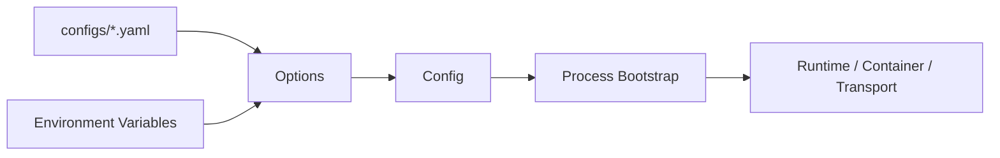

# 配置与环境变量

**本文回答**：qs-server 的接口与运维相关配置分别在哪里；apiserver、collection-server、worker 的配置边界是什么；哪些配置来自 YAML，哪些适合环境变量覆盖；敏感项如何管理；修改配置后如何验证。

---

## 30 秒结论

| 配置类型 | 典型位置 |
| -------- | -------- |
| apiserver | `configs/apiserver.dev.yaml` / `configs/apiserver.prod.yaml` |
| collection-server | `configs/collection-server.*.yaml` |
| worker | `configs/worker.*.yaml` |
| event catalog | `configs/events.yaml` |
| docker env | compose `env_file` / environment |
| secrets | GitHub Actions / server env / secret manager |
| runtime defaults | options/config code |

一句话概括：

> **YAML 描述进程行为，环境变量覆盖部署差异，敏感项不应写进文档和仓库。**

---

## 1. 配置分层



---

## 2. 进程配置边界

| 进程 | 主要配置 |
| ---- | -------- |
| apiserver | HTTP/gRPC、DB、Mongo、RedisRuntime、Cache、Messaging、Backpressure、IAM、Scheduler、Statistics、WeChat/OSS |
| collection-server | HTTP、RateLimit、SubmitQueue、gRPC client、IAM、Redis ops/runtime |
| worker | MQ subscriber、worker concurrency、gRPC client、IAM/service auth、DB/Redis 如需要 |

---

## 3. 关键配置类别

### 3.1 Serving

- insecure serving。
- secure serving。
- TLS cert/key。
- healthz/metrics/profiling。
- middleware。

### 3.2 gRPC

- bind address/port。
- insecure。
- TLS。
- mTLS。
- auth。
- ACL。
- audit。
- reflection。
- health check。
- max message size。
- connection age。

### 3.3 Redis / Cache

- Redis connection。
- RedisRuntime family/profile。
- cache TTL。
- warmup。
- hotset。
- sdk_token。
- lock_lease。

### 3.4 Resilience

- rate limit。
- submit queue。
- backpressure。
- gRPC max in-flight。
- worker concurrency。

### 3.5 Event / MQ

- messaging enabled。
- provider。
- topic/channel。
- event catalog。
- outbox relay。

### 3.6 Security

- IAM enabled。
- JWT verification。
- ForceRemoteVerification。
- AuthzSnapshot loader。
- service auth。
- authz sync。

---

## 4. 环境变量原则

建议用于：

- host。
- port。
- username。
- password。
- access key。
- token。
- secret。
- profile name。
- deployment mode。

不建议用于：

- 大型结构化规则。
- 复杂 policy。
- 事件目录。
- 路由定义。
- 业务枚举。

---

## 5. 敏感项

禁止提交到仓库：

- MySQL password。
- Mongo password。
- Redis password。
- JWT secret。
- IAM secret。
- WeChat appSecret。
- OSS access key secret。
- service token。
- TLS private key。

文档中只写变量名，不写值。

---

## 6. 修改配置 Verify

```bash
# 检查 compose 最终配置
docker compose -f build/docker/docker-compose.prod.yml config

# 本地启动前检查配置能加载
go test ./internal/apiserver/options ./internal/apiserver/config
go test ./internal/collection-server/options
go test ./internal/worker/options
```

启动后检查：

```bash
curl -s http://127.0.0.1:<port>/healthz
curl -s http://127.0.0.1:<port>/governance/redis
```

---

## 7. 常见误区

### 7.1 “改 YAML 就一定生效”

不一定。要确认配置链路是否读取、是否进入 Config、是否被 Stage 消费。

### 7.2 “环境变量可以覆盖所有结构”

不建议。复杂结构应留在 YAML。

### 7.3 “secret 可以放进文档示例”

不可以。示例只能用占位符。

### 7.4 “dev/prod 端口可以混用”

不应。以对应环境配置和 compose 文件为准。

---

## 8. 新增配置项流程

1. 定义 Options 字段。
2. 绑定 YAML/env。
3. 设置默认值。
4. 写入 Config。
5. 找到使用 stage。
6. 补 tests。
7. 更新本文档和对应模块文档。
