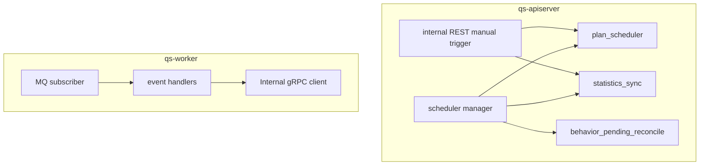

# 调度任务

**本文回答**：qs-server 中哪些后台任务由 apiserver 内建 scheduler 触发，哪些由 worker 事件驱动；internal REST 手工触发的定位是什么；旧 crontab 方案为什么不再作为默认生产路径。

---

## 30 秒结论

| 类型 | 触发方式 | 运行进程 |
| ---- | -------- | -------- |
| 周期任务 | apiserver 内建 scheduler | qs-apiserver |
| 事件型后台 | MQ -> worker handler -> gRPC | qs-worker |
| 手工运维触发 | internal REST | qs-apiserver |
| 历史 crontab | 已不作为默认生产方案 | 线上若残留应清理 |

一句话概括：

> **按时间触发的是 apiserver scheduler；按事件触发的是 worker；internal REST 是手工运维入口。**

---

## 1. 调度总图



---

## 2. apiserver scheduler

当前纳管：

| Runner | 作用 |
| ------ | ---- |
| plan_scheduler | 扫描并开放/轮转 plan task |
| statistics_sync | daily / org snapshot / plan 统计同步 |
| behavior_pending_reconcile | pending behavior 事件归因补偿 |

这些由 runtime stage 启动 scheduler manager。

---

## 3. 多实例互斥

scheduler 使用 Redis leader lock：

- 抢到锁：执行本轮。
- 抢不到：skip。
- release 失败：记录，不覆盖业务结果。

多实例部署时，contention 是正常现象。

---

## 4. internal REST 手工触发

内部 REST 保留：

- statistics sync daily。
- statistics org snapshot。
- statistics plan。
- plans tasks schedule。
- cache repair complete / warmup。
- event/resilience status。

定位：

```text
手工补跑
排障验证
operating 内部入口
```

不建议恢复宿主机 crontab 周期调用。

---

## 5. worker 事件后台

worker 处理：

```text
MQ event
  -> handler
  -> internal gRPC
  -> apiserver application service
```

典型：

- answersheet.submitted。
- assessment lifecycle。
- report generated。
- plan/task related events。

事件后台不等同周期任务。

---

## 6. 历史 crontab 残留

线上可能残留：

- `/etc/cron.d/qs-scheduler`
- `/usr/local/bin/qs-api-call.sh`
- `/usr/local/bin/qs-refresh-token.sh`
- `/etc/logrotate.d/qs-scheduler`

如果存在，应检查是否与内建 scheduler 重复触发。

---

## 7. 常见排障

### 7.1 周期任务不跑

检查：

1. scheduler config enabled。
2. apiserver runtime logs。
3. Redis lock_lease。
4. leader lock contention。
5. scheduler manager runner_count。
6. app service 错误。

### 7.2 任务重复跑

检查：

1. 多实例 lock 配置。
2. Redis lock TTL。
3. 是否残留 crontab。
4. 是否手工 internal REST 同时触发。
5. task idempotency。

### 7.3 worker 不处理

检查：

1. MQ topic/channel。
2. worker concurrency。
3. handler registry。
4. internal gRPC。
5. duplicate suppression。
6. Ack/Nack。

---

## 8. Verify

```bash
go test ./internal/apiserver/runtime/scheduler
go test ./internal/apiserver/process
go test ./internal/worker/handlers
```
