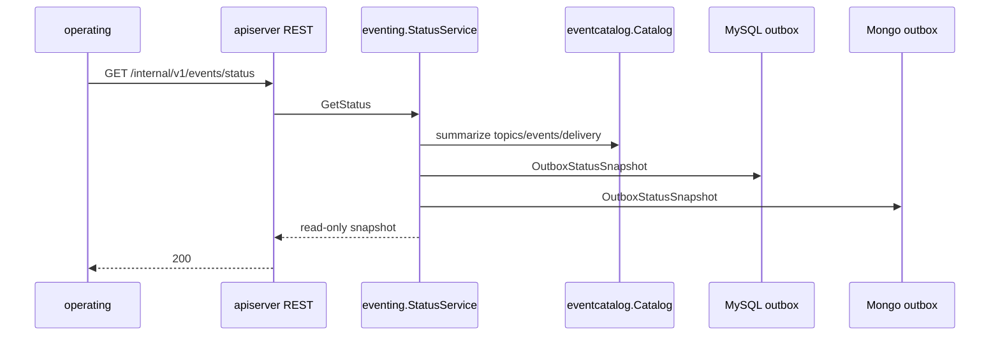
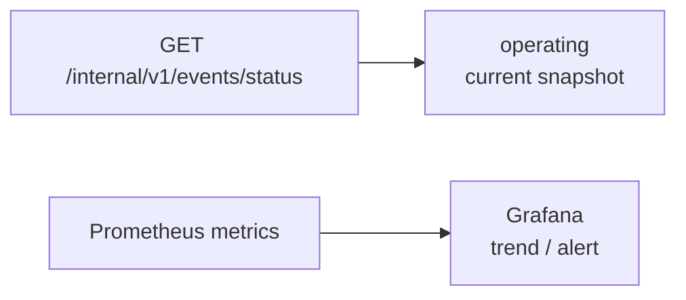

# operating 事件只读状态接入

**本文回答**：operating 平台如何读取事件系统当前状态，哪些字段来自 catalog，哪些字段来自 MySQL/Mongo outbox，哪些能力当前明确不提供。

## 30 秒结论

| 维度 | 当前事实 |
| ---- | -------- |
| REST 入口 | `GET /internal/v1/events/status` |
| 目标读者 | operating 后台和运维排障页面 |
| 数据来源 | [`eventcatalog`](../../internal/pkg/eventcatalog/catalog.go) + [`application/eventing.StatusService`](../../internal/apiserver/application/eventing/status_service.go) + outbox `StatusReader` |
| 返回内容 | catalog summary、每个 outbox store 的 `pending/failed/publishing` bucket |
| 降级语义 | 单个 outbox status reader 失败时，该 outbox 标记 `degraded=true`，整体 HTTP 仍返回 `200` |
| 明确不支持 | replay、repair、dead-letter、手工 mark published/failed、动态修改 delivery class |

## 调用图



## 返回模型

```json
{
  "generated_at": "2026-04-25T12:00:00Z",
  "catalog": {
    "topic_count": 4,
    "event_count": 19,
    "best_effort_count": 6,
    "durable_outbox_count": 13
  },
  "outboxes": [
    {
      "name": "assessment-mysql-outbox",
      "store": "assessment-mysql-outbox",
      "degraded": false,
      "generated_at": "2026-04-25T12:00:00Z",
      "buckets": [
        {"status": "pending", "count": 0, "oldest_age_seconds": 0},
        {"status": "failed", "count": 0, "oldest_age_seconds": 0},
        {"status": "publishing", "count": 0, "oldest_age_seconds": 0}
      ]
    }
  ]
}
```

`oldest_age_seconds` 是当前时间减去该 status 最老 `created_at`。空 bucket 返回 `0`，用于和 Prometheus gauge 对齐。

## Grafana 分工



operating 页面只做当前状态摘要；趋势、历史曲线和告警仍以 Prometheus + Grafana 为准。相关指标定义见 [事件观测与排障](../03-基础设施/event/05-观测与排障.md)。

## 代码锚点与测试锚点

- Route：[`transport/rest/routes_events.go`](../../internal/apiserver/transport/rest/routes_events.go)
- Service：[`application/eventing/status_service.go`](../../internal/apiserver/application/eventing/status_service.go)
- DB-neutral status model：[`port/outbox/outbox.go`](../../internal/apiserver/port/outbox/outbox.go)、[`outboxcore/core.go`](../../internal/apiserver/outboxcore/core.go)
- MySQL reader：[`infra/mysql/eventoutbox/store.go`](../../internal/apiserver/infra/mysql/eventoutbox/store.go)
- Mongo reader：[`infra/mongo/eventoutbox/store.go`](../../internal/apiserver/infra/mongo/eventoutbox/store.go)
- Route tests：[`routes_events_test.go`](../../internal/apiserver/transport/rest/routes_events_test.go)
- Status service tests：[`status_service_test.go`](../../internal/apiserver/application/eventing/status_service_test.go)

## Verify

```bash
GOTOOLCHAIN=local /Users/yangshujie/.gvm/gos/go1.25.9/bin/go test ./internal/apiserver/application/eventing ./internal/apiserver/transport/rest ./internal/apiserver/infra/mysql/eventoutbox ./internal/apiserver/infra/mongo/eventoutbox
python scripts/check_docs_hygiene.py
```
