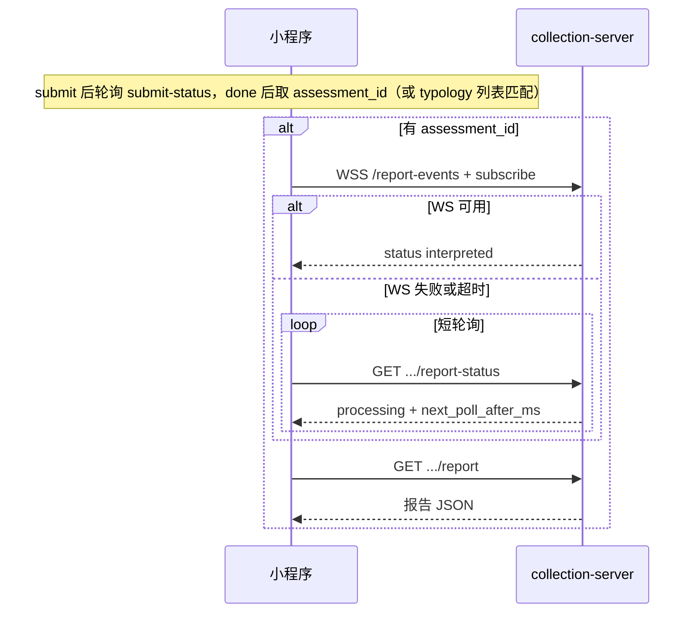

# 小程序报告等待接入指南（后端契约）

**读者**：前端 / 小程序（Taro 等）  
**服务**：collection-server（`https://collect.fangcunmount.cn/api/v1`）  
**OpenAPI**：`api/rest/collection.yaml`（`GET /api/rest`）

> **R121 破坏性变更**：`GET /api/v1/answersheets/{id}/assessment` 与过渡期 `/api/v2/assessments*` 均已下线。`assessment_id` 推荐：`GET /answersheets/submit-status` 在 `status=done` 且测评落库后返回 `assessment_id`（未就绪可继续轮询）；人格亦可 `GET /typology-assessments` 列表按 `answer_sheet_id` 匹配。

---

## 30 秒结论

| 维度 | 结论 |
| ---- | ---- |
| 推荐路径 | **WebSocket 推送** → 失败则 **`report-status` 短轮询** |
| 不推荐新接 | `wait-report` 长轮询（legacy，高并发下易占连接；仅作旧版兼容） |
| 业务线 | 人格与医学**共用同一套状态载荷**与 WS 协议，仅 URL 前缀与 `kind` 不同 |
| 鉴权 | 全部需 `Authorization: Bearer <JWT>` |
| 安全 | `testee_id` 必填，且必须与测评归属一致；错误 ID 返回 404 |
| ID 类型 | `testee_id`、`assessment_id` 建议全程**字符串**，避免 JS 大整数精度丢失 |
| 生产现状 | `report_events.enabled` **默认 false**（WS 404）；**短轮询必须可独立跑通** |

一句话：

> **拿到 `assessment_id` 后，优先 WS 订阅；不可用则按 `next_poll_after_ms` 轮询 `report-status`；终态 `interpreted` 再拉报告正文（人格 `GET .../typology-assessments/.../report`；医学见 §2）。**

人格测评全链路（session → submit → assessment）见 [13-小程序人格测评前端接入指南.md](./13-小程序人格测评前端接入指南.md)（R128b）；历史稿 [03-小程序人格测评接入.md](./03-小程序人格测评接入.md)。

---

## 1. 三种感知方式对照

| 方案 | 方法 | 路径 | 客户端行为 | 服务端并发特征 |
| ---- | ---- | ---- | ---------- | -------------- |
| **E WebSocket** | `GET` 升级 WS | `/api/v1/report-events` | 连接后发 `subscribe`，收 `status` 帧 | 每用户 1 长连接 |
| **A 短轮询** | `GET` | `.../report-status?testee_id=` | 立即返回；非终态按 `next_poll_after_ms` sleep 再请求 | 短 HTTP 请求 |
| **Legacy 长轮询** | `GET` | `.../wait-report?testee_id=&timeout=` | 单次请求阻塞至多 `timeout` 秒 | 长 HTTP 连接 |

**前端策略（推荐）**：

```text
若 report_events 已开启 → 尝试 WS（首包超时建议 15s）
  → 失败 / 断连 / error → report-status 短轮询
勿在 WS 与 HTTP 轮询之间并发双跑
```

---

## 2. URL 模板（人格 / 医学）

占位：`{base}` = `https://collect.fangcunmount.cn/api/v1`，`{id}` = assessment_id，`{testee}` = testee_id。

| 用途 | 人格 (`kind=personality`) | 医学 (`kind=medical`) |
| ---- | ------------------------- | --------------------- |
| 短轮询状态 | `{base}/typology-assessments/{id}/report-status?testee_id={testee}` | `{base}/assessments/{id}/report-status?testee_id={testee}` |
| 长轮询（legacy） | `{base}/typology-assessments/{id}/wait-report?testee_id={testee}&timeout=20` | `{base}/assessments/{id}/wait-report?testee_id={testee}&timeout=20` |
| 报告正文 | `{base}/typology-assessments/{id}/report?testee_id={testee}` | **不在 collection**：`https://qs.fangcunmount.cn/api/v1/evaluations/assessments/{id}/report`（R110 已下线 `GET /assessments/{id}/report`） |
| WebSocket | `wss://collect.fangcunmount.cn/api/v1/report-events` | 同左 |

`typology-assessment-sessions` 返回的 `endpoints` 目前含 `wait_report`、`interpretation`，**不含** `report_status` / `report_events`；前端按上表自行拼接即可。

---

## 3. 公共状态载荷 `ReportStatus`

HTTP `report-status` 的 `data` 与 WS `status` 帧的 `data` **字段一致**。

```json
{
  "status": "processing",
  "stage": "queued",
  "message": "报告排队生成中",
  "reason": "",
  "next_poll_after_ms": 3000,
  "total_score": null,
  "risk_level": null,
  "updated_at": 1719750000
}
```

### 3.1 `status` 取值

| status | 含义 | 是否终态 |
| ------ | ---- | -------- |
| `processing` | 生成中（含排队） | 否 |
| `interpreted` | 报告已就绪 | **是** |
| `failed` | 生成失败 | **是** |
| `completed` | 医学内部映射后的完成态（HTTP 层可能出现） | **是**（等同 `interpreted`） |

终态判断（前端统一写法）：

```ts
const terminal = ['interpreted', 'failed', 'completed'].includes(status);
```

### 3.2 `stage`（展示用，可选）

常见：`queued` → `processing` → `scoring` / `interpreting` → 终态。等待页文案优先用 `message`。

### 3.3 `next_poll_after_ms`

- 非终态时由服务端给出建议间隔（通常 2000–5000ms）。
- 客户端退避：`sleep(max(next_poll_after_ms, 500))`。
- 响应头可能带 `Retry-After`（秒），与 body 字段同时存在时**取较大退避**。

### 3.4 人格 `report-status` 额外字段

终态 `interpreted` 时，人格接口可能在状态响应中带 `model`、`level` 摘要（可选）；完整结果仍以 `GET .../report` 为准。

---

## 4. WebSocket 协议（`/api/v1/report-events`）

### 4.1 前置

- 特性开关：`report_events.enabled=true` 时可用；否则 **HTTP 404**。
- 连接 Header：`Authorization: Bearer <token>`。
- 生产默认 **关闭**（见 `configs/collection-server.prod.yaml`）；预发/开发可开。

### 4.2 订阅（客户端 → 服务端）

连接成功后发送**一次** JSON 文本帧：

```json
{
  "op": "subscribe",
  "assessment_id": "614333603412718126",
  "kind": "personality",
  "testee_id": "618855887087350318"
}
```

| 字段 | 必填 | 说明 |
| ---- | ---- | ---- |
| `assessment_id` | 是 | 字符串数字 |
| `testee_id` | 是 | 字符串数字 |
| `kind` | 是 | `personality` 或 `medical` |

**限制**：每条连接仅允许 **1 次** `subscribe`；重复订阅返回 `already_subscribed`。

### 4.3 服务端帧（服务端 → 客户端）

| op | 说明 |
| -- | ---- |
| `subscribed` | 订阅成功，随后紧跟当前 `status` |
| `status` | `data` 为 §3 的 `ReportStatus` |
| `pong` | 心跳（约 30s 一次）；客户端可发 `{"op":"ping"}` |
| `error` | 见下表 |

`status` 帧示例：

```json
{
  "op": "status",
  "data": {
    "status": "interpreted",
    "message": "报告已生成",
    "next_poll_after_ms": 0,
    "updated_at": 1719750000
  }
}
```

### 4.4 `error` 码

| code | 含义 | 前端建议 |
| ---- | ---- | -------- |
| `forbidden` | 鉴权或 testee 不匹配 | 降级短轮询；仍失败则提示无权限 |
| `invalid_kind` | kind 非法 | 检查 personality / medical |
| `rate_limited` | 订阅被限流 | **勿**立即重连 WS；降级短轮询 |
| `capacity_exhausted` | 连接数满 | 降级短轮询 |
| `bad_request` | 帧格式或 ID 非法 | 检查参数 |
| `already_subscribed` | 重复订阅 | 忽略或重连 |

### 4.5 断连与降级

以下情况切换 **`report-status` 短轮询**：

- `onClose` / 网络错误
- 连接后 **15s 内**未收到任何 `status`
- 收到上述可恢复 `error`（`rate_limited`、`capacity_exhausted` 等）

终态后服务端会主动关闭连接（正常 closure）。

---

## 5. HTTP 短轮询（`report-status`）

```http
GET /api/v1/typology-assessments/{id}/report-status?testee_id={testee_id}
Authorization: Bearer <token>
```

```json
{
  "code": 0,
  "message": "success",
  "data": { "...": "见 §3" }
}
```

循环逻辑：

```text
loop:
  GET report-status
  if status 为终态 → break
  sleep(next_poll_after_ms ?? 3000)
```

限流：走 **query** scope；429 时按 `Retry-After` 或 `next_poll_after_ms` 退避。

---

## 6. Legacy 长轮询（`wait-report`）

```http
GET /api/v1/typology-assessments/{id}/wait-report?testee_id={testee_id}&timeout=20
```

| 参数 | 默认 | 说明 |
| ---- | ---- | ---- |
| `timeout` | 20 | 秒，单次最长阻塞时间 |

- 报告已就绪：立即 200 + 终态 `status`。
- 超时未就绪：200 + 非终态 + `next_poll_after_ms`（应继续短轮询或重试，**不要**无脑紧循环 wait-report）。
- 高负载槽位不足：200 + `processing` + `message: 系统繁忙...` + `Retry-After`（行为等同短轮询降级）。

**新客户端不要默认走此路径**；仅保留给未升级的旧版小程序。

---

## 7. 获取报告正文

终态为 `interpreted`（或 `completed`）后：

**人格（collection）**

```http
GET /api/v1/typology-assessments/{id}/report?testee_id={testee_id}
Authorization: Bearer <token>
```

**医学（apiserver，非 collection）**

```http
GET https://qs.fangcunmount.cn/api/v1/evaluations/assessments/{id}/report
Authorization: Bearer <token>
```

> R110 起 collection 不再提供 `GET /api/v1/assessments/{id}/report`；医学线等待状态仍在 collection 的 `report-status` / `wait-report`，报告 JSON 走 apiserver。

| HTTP | 含义 |
| ---- | ---- |
| 200 | 成功，`data` 含 `conclusion`、`dimensions`、`model_extra`（人格）等 |
| 400 | 缺 `testee_id` |
| 404 | 未生成、不存在或 testee 不匹配（不泄漏他人报告） |

**不要在非终态时轮询 report**（会持续 404）。

---

## 8. 推荐时序（提交后 → 看到报告）



---

## 9. 本地状态机（建议）

```text
assessment_id_pending  → submit-status 已 done 但尚无 assessment_id，继续轮询
assessment_ready       → 持有 assessment_id（优先 submit-status；人格可 typology 列表兜底）
report_waiting         → WS 或 report-status
report_ready           → GET report
report_failed          → status=failed，展示 reason
```

建议持久化：`kind`、`testee_id`、`answersheet_id`、`assessment_id`、`request_id`。

---

## 10. 环境与能力探测

| 环境 | `report_events.enabled` | 前端建议 |
| ---- | ----------------------- | -------- |
| 生产 | `false` | 仅 `report-status`；或远端配置关闭 WS |
| 预发/开发 | 可 `true` | 走 WS + 降级 |

探测方式：

1. **推荐**：远端配置 / 发布单告知是否开启 WS。
2. **兜底**：尝试 `connectSocket`，握手 **404** 则缓存「WS 不可用」并只用短轮询。

---

## 11. 联调检查清单

- [ ] JWT 可访问 `report-status` 与报告正文（人格 collection `/report`；医学 apiserver `/evaluations/assessments/{id}/report`）
- [ ] 人格、`medical` 两条线 `kind` 与 URL 前缀正确
- [ ] `testee_id` 与提交时一致（字符串传参；医学 apiserver report 按当前 OpenAPI 仅需 path `id`）
- [ ] 非终态不请求报告正文
- [ ] 短轮询遵守 `next_poll_after_ms`（≥ 500ms）
- [ ] WS 404 / 断连后自动降级短轮询，无请求风暴
- [ ] 错误 `testee_id` 无法看到他人报告（404）
- [ ] 预发 WS 开启时：subscribe → status → interpreted → report 全通

---

## 12. 相关文档

- 人格测评全链路：[13-小程序人格测评前端接入指南.md](./13-小程序人格测评前端接入指南.md)
- collection REST 总览：[02-collection-REST.md](./02-collection-REST.md)
- OpenAPI：`api/rest/collection.yaml`（`/report-events`、`/report-status`、`/wait-report`、`/typology-assessments/.../report`）；医学报告见 `api/rest/apiserver.yaml`（`/evaluations/assessments/{id}/report`）
