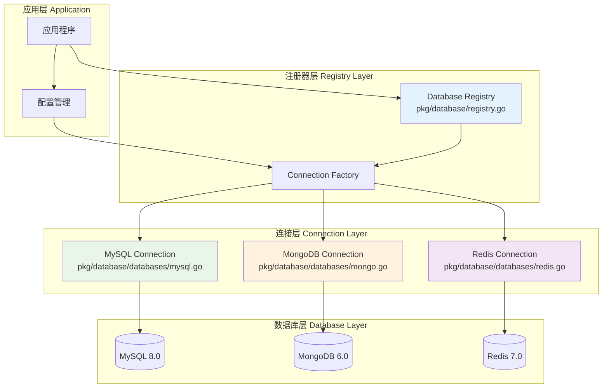
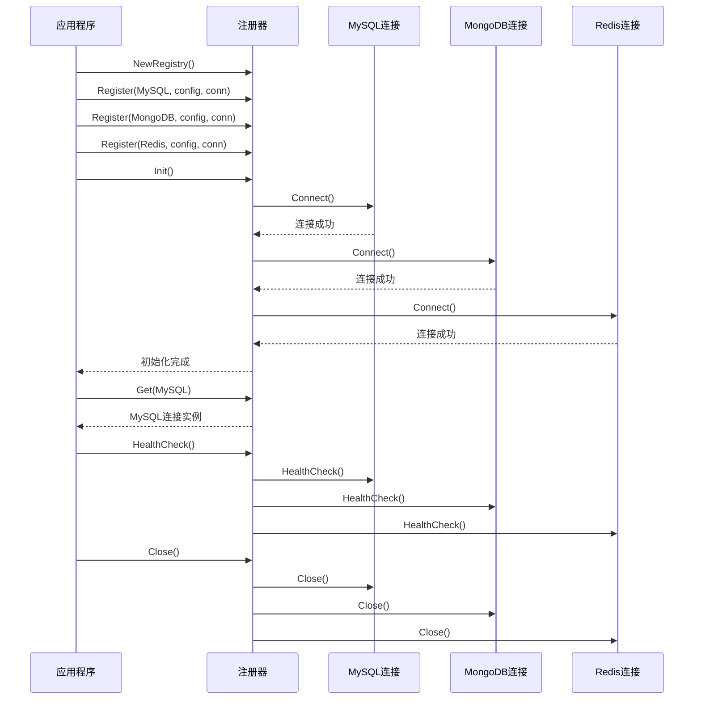

# 🗄️ 数据库注册器设计

## 📋 目录

- [设计概述](#design-overview)
- [注册器核心架构](#registry-core-architecture)
- [连接管理策略](#connection-management-strategy)
- [健康检查机制](#health-check-mechanism)
- [多数据源支持](#multi-datasource-support)
- [实际应用案例](#practical-use-cases)

## 🎯 设计概述 {#design-overview}

数据库注册器是一个集中化的数据库连接管理系统，采用**注册器模式**和**工厂模式**，实现了多种数据库的统一管理、连接池优化和健康监控。

### 🏗️ 设计目标

1. **统一管理**: 集中管理多种数据库连接
2. **类型安全**: 通过泛型和接口保证类型安全
3. **连接复用**: 高效的连接池管理
4. **健康监控**: 实时监控数据库连接状态
5. **优雅关闭**: 支持优雅的资源清理

### 🎨 核心设计原则

- **单一职责**: 专注于数据库连接管理
- **开闭原则**: 支持新数据库类型扩展
- **依赖倒置**: 基于接口而非具体实现
- **线程安全**: 支持并发访问

## 🏛️ 注册器核心架构 {#registry-core-architecture}

### 📦 核心结构

```go
// pkg/database/registry.go

// Registry 数据库注册器
type Registry struct {
    mu          sync.RWMutex                           // 读写锁保护
    connections map[dbs.DatabaseType]dbs.Connection    // 连接映射
    configs     map[dbs.DatabaseType]interface{}       // 配置映射
    initialized bool                                   // 初始化状态
}
```

### 🔧 数据库类型与连接接口

```go
// pkg/database/databases/connections.go

// DatabaseType 数据库类型枚举
type DatabaseType string

const (
    MySQL   DatabaseType = "mysql"
    MongoDB DatabaseType = "mongodb"
    Redis   DatabaseType = "redis"
)

// Connection 数据库连接接口
type Connection interface {
    Type() DatabaseType                    // 返回数据库类型
    Connect() error                        // 建立连接
    Close() error                          // 关闭连接
    GetClient() interface{}               // 获取客户端实例
    HealthCheck(ctx context.Context) error // 健康检查
}
```

### 🚀 架构流程图



## 🔗 连接管理策略 {#connection-management-strategy}

### 📝 注册器API设计

#### 1. 注册器创建和初始化

```go
// NewRegistry 创建新的数据库注册器
func NewRegistry() *Registry {
    return &Registry{
        connections: make(map[dbs.DatabaseType]dbs.Connection),
        configs:     make(map[dbs.DatabaseType]interface{}),
    }
}

// Register 注册数据库连接
func (r *Registry) Register(dbType dbs.DatabaseType, config interface{}, connection dbs.Connection) error {
    r.mu.Lock()
    defer r.mu.Unlock()

    // 防止重复初始化后注册
    if r.initialized {
        return fmt.Errorf("registry already initialized, cannot register new connections")
    }

    // 验证连接有效性
    if connection == nil {
        return fmt.Errorf("connection cannot be nil")
    }

    // 验证类型匹配
    if connection.Type() != dbType {
        return fmt.Errorf("connection type mismatch: expected %s, got %s", 
            dbType, connection.Type())
    }

    // 存储连接和配置
    r.connections[dbType] = connection
    r.configs[dbType] = config

    log.Printf("Registered database connection: %s", dbType)
    return nil
}
```

#### 2. 连接获取和管理

```go
// Get 获取指定类型的数据库连接
func (r *Registry) Get(dbType dbs.DatabaseType) (dbs.Connection, error) {
    r.mu.RLock()
    defer r.mu.RUnlock()

    connection, exists := r.connections[dbType]
    if !exists {
        return nil, fmt.Errorf("database connection not found: %s", dbType)
    }

    return connection, nil
}

// GetClient 获取指定类型的数据库客户端
func (r *Registry) GetClient(dbType dbs.DatabaseType) (interface{}, error) {
    connection, err := r.Get(dbType)
    if err != nil {
        return nil, err
    }

    return connection.GetClient(), nil
}
```

#### 3. 批量初始化

```go
// Init 初始化所有已注册的数据库连接
func (r *Registry) Init() error {
    r.mu.Lock()
    defer r.mu.Unlock()

    if r.initialized {
        return nil
    }

    // 逐个初始化数据库连接
    for dbType, connection := range r.connections {
        log.Printf("Initializing database connection: %s", dbType)
        if err := connection.Connect(); err != nil {
            return fmt.Errorf("failed to connect to %s: %w", dbType, err)
        }
    }

    r.initialized = true
    log.Println("All database connections initialized successfully")
    return nil
}
```

### 🔄 连接生命周期管理



## 💊 健康检查机制 {#health-check-mechanism}

### 🔍 健康检查实现

```go
// HealthCheck 对所有数据库连接进行健康检查
func (r *Registry) HealthCheck(ctx context.Context) error {
    r.mu.RLock()
    defer r.mu.RUnlock()

    var errs []error

    // 并发检查所有连接
    for dbType, connection := range r.connections {
        if err := connection.HealthCheck(ctx); err != nil {
            errs = append(errs, fmt.Errorf("%s health check failed: %w", dbType, err))
        }
    }

    if len(errs) > 0 {
        return fmt.Errorf("database health check failed: %v", errs)
    }

    return nil
}
```

### 📊 健康检查策略

#### 1. MySQL健康检查

```go
// pkg/database/databases/mysql.go

// HealthCheck MySQL健康检查
func (m *MySQLConnection) HealthCheck(ctx context.Context) error {
    if m.client == nil {
        return fmt.Errorf("mysql client is nil")
    }

    // 获取底层数据库连接
    sqlDB, err := m.client.DB()
    if err != nil {
        return fmt.Errorf("failed to get mysql db: %w", err)
    }

    // Ping检查
    if err := sqlDB.PingContext(ctx); err != nil {
        return fmt.Errorf("mysql ping failed: %w", err)
    }

    // 连接池状态检查
    stats := sqlDB.Stats()
    if stats.OpenConnections == 0 {
        return fmt.Errorf("no open mysql connections")
    }

    return nil
}
```

#### 2. MongoDB健康检查

```go
// pkg/database/databases/mongo.go

// HealthCheck MongoDB健康检查  
func (m *MongoConnection) HealthCheck(ctx context.Context) error {
    if m.client == nil {
        return fmt.Errorf("mongodb client is nil")
    }

    // Ping检查
    if err := m.client.Ping(ctx, nil); err != nil {
        return fmt.Errorf("mongodb ping failed: %w", err)
    }

    // 检查连接状态
    if err := m.client.Connect(ctx); err != nil {
        return fmt.Errorf("mongodb connection check failed: %w", err)
    }

    return nil
}
```

#### 3. Redis健康检查

```go
// pkg/database/databases/redis.go

// HealthCheck Redis健康检查
func (r *RedisConnection) HealthCheck(ctx context.Context) error {
    if r.client == nil {
        return fmt.Errorf("redis client is nil")
    }

    // Ping检查
    pong, err := r.client.Ping(ctx).Result()
    if err != nil {
        return fmt.Errorf("redis ping failed: %w", err)
    }

    if pong != "PONG" {
        return fmt.Errorf("redis ping response invalid: %s", pong)
    }

    // 连接池状态检查
    stats := r.client.PoolStats()
    if stats.TotalConns == 0 {
        return fmt.Errorf("no redis connections in pool")
    }

    return nil
}
```

## 🔧 多数据源支持 {#multi-datasource-support}

### 📊 MySQL连接实现

```go
// pkg/database/databases/mysql.go

// MySQLConfig MySQL数据库配置
type MySQLConfig struct {
    Host                  string        `json:"host" mapstructure:"host"`
    Username              string        `json:"username" mapstructure:"username"`
    Password              string        `json:"password" mapstructure:"password"`
    Database              string        `json:"database" mapstructure:"database"`
    MaxIdleConnections    int           `json:"max-idle-connections" mapstructure:"max-idle-connections"`
    MaxOpenConnections    int           `json:"max-open-connections" mapstructure:"max-open-connections"`
    MaxConnectionLifeTime time.Duration `json:"max-connection-life-time" mapstructure:"max-connection-life-time"`
    LogLevel              int           `json:"log-level" mapstructure:"log-level"`
}

// MySQLConnection MySQL连接实现
type MySQLConnection struct {
    config *MySQLConfig
    client *gorm.DB
}

// Connect 连接MySQL数据库
func (m *MySQLConnection) Connect() error {
    dsn := fmt.Sprintf("%s:%s@tcp(%s)/%s?charset=utf8mb4&parseTime=True&loc=Local",
        m.config.Username,
        m.config.Password,
        m.config.Host,
        m.config.Database,
    )

    db, err := gorm.Open(mysql.Open(dsn), &gorm.Config{
        Logger: logger.New(
            log.New(os.Stdout, "\r\n", log.LstdFlags),
            logger.Config{
                SlowThreshold: time.Second,
                LogLevel:      logger.LogLevel(m.config.LogLevel),
                Colorful:      true,
            },
        ),
    })
    if err != nil {
        return fmt.Errorf("failed to connect to mysql: %w", err)
    }

    // 配置连接池
    sqlDB, err := db.DB()
    if err != nil {
        return fmt.Errorf("failed to get mysql db: %w", err)
    }

    sqlDB.SetMaxIdleConns(m.config.MaxIdleConnections)
    sqlDB.SetMaxOpenConns(m.config.MaxOpenConnections)
    sqlDB.SetConnMaxLifetime(m.config.MaxConnectionLifeTime)

    m.client = db
    return nil
}
```

### 📄 MongoDB连接实现

```go
// pkg/database/databases/mongo.go

// MongoConfig MongoDB配置
type MongoConfig struct {
    URI          string        `json:"uri" mapstructure:"uri"`
    Database     string        `json:"database" mapstructure:"database"`
    Timeout      time.Duration `json:"timeout" mapstructure:"timeout"`
    MaxPoolSize  uint64        `json:"max-pool-size" mapstructure:"max-pool-size"`
    MinPoolSize  uint64        `json:"min-pool-size" mapstructure:"min-pool-size"`
}

// MongoConnection MongoDB连接实现
type MongoConnection struct {
    config   *MongoConfig
    client   *mongo.Client
    database *mongo.Database
}

// Connect 连接MongoDB
func (m *MongoConnection) Connect() error {
    ctx, cancel := context.WithTimeout(context.Background(), m.config.Timeout)
    defer cancel()

    // 客户端选项
    clientOptions := options.Client().
        ApplyURI(m.config.URI).
        SetMaxPoolSize(m.config.MaxPoolSize).
        SetMinPoolSize(m.config.MinPoolSize).
        SetMaxConnIdleTime(30 * time.Second)

    // 连接数据库
    client, err := mongo.Connect(ctx, clientOptions)
    if err != nil {
        return fmt.Errorf("failed to connect to mongodb: %w", err)
    }

    // 验证连接
    if err := client.Ping(ctx, nil); err != nil {
        return fmt.Errorf("failed to ping mongodb: %w", err)
    }

    m.client = client
    m.database = client.Database(m.config.Database)
    return nil
}
```

### 🔴 Redis连接实现

```go
// pkg/database/databases/redis.go

// RedisConfig Redis配置
type RedisConfig struct {
    Addr         string        `json:"addr" mapstructure:"addr"`
    Password     string        `json:"password" mapstructure:"password"`
    DB           int           `json:"db" mapstructure:"db"`
    DialTimeout  time.Duration `json:"dial-timeout" mapstructure:"dial-timeout"`
    ReadTimeout  time.Duration `json:"read-timeout" mapstructure:"read-timeout"`
    WriteTimeout time.Duration `json:"write-timeout" mapstructure:"write-timeout"`
    PoolSize     int           `json:"pool-size" mapstructure:"pool-size"`
    MinIdleConns int           `json:"min-idle-conns" mapstructure:"min-idle-conns"`
}

// RedisConnection Redis连接实现
type RedisConnection struct {
    config *RedisConfig
    client *redis.Client
}

// Connect 连接Redis
func (r *RedisConnection) Connect() error {
    rdb := redis.NewClient(&redis.Options{
        Addr:         r.config.Addr,
        Password:     r.config.Password,
        DB:           r.config.DB,
        DialTimeout:  r.config.DialTimeout,
        ReadTimeout:  r.config.ReadTimeout,
        WriteTimeout: r.config.WriteTimeout,
        PoolSize:     r.config.PoolSize,
        MinIdleConns: r.config.MinIdleConns,
    })

    // 验证连接
    ctx, cancel := context.WithTimeout(context.Background(), 5*time.Second)
    defer cancel()

    if err := rdb.Ping(ctx).Err(); err != nil {
        return fmt.Errorf("failed to ping redis: %w", err)
    }

    r.client = rdb
    return nil
}
```

## 🛠️ 注册器工具方法

### 📋 状态查询

```go
// ListRegistered 列出所有已注册的数据库类型
func (r *Registry) ListRegistered() []dbs.DatabaseType {
    r.mu.RLock()
    defer r.mu.RUnlock()

    types := make([]dbs.DatabaseType, 0, len(r.connections))
    for dbType := range r.connections {
        types = append(types, dbType)
    }

    return types
}

// IsRegistered 检查指定类型的数据库是否已注册
func (r *Registry) IsRegistered(dbType dbs.DatabaseType) bool {
    r.mu.RLock()
    defer r.mu.RUnlock()

    _, exists := r.connections[dbType]
    return exists
}

// IsInitialized 检查注册器是否已初始化
func (r *Registry) IsInitialized() bool {
    r.mu.RLock()
    defer r.mu.RUnlock()

    return r.initialized
}
```

### 🔒 优雅关闭

```go
// Close 关闭所有数据库连接
func (r *Registry) Close() error {
    r.mu.Lock()
    defer r.mu.Unlock()

    var errs []error

    // 逐个关闭连接
    for dbType, connection := range r.connections {
        log.Printf("Closing database connection: %s", dbType)
        if err := connection.Close(); err != nil {
            errs = append(errs, fmt.Errorf("failed to close %s: %w", dbType, err))
        }
    }

    if len(errs) > 0 {
        return fmt.Errorf("errors closing databases: %v", errs)
    }

    r.initialized = false
    log.Println("All database connections closed successfully")
    return nil
}
```

## 📚 实际应用案例 {#practical-use-cases}

### 🏗️ 在API服务器中的使用

```go
// internal/apiserver/database.go

// 数据库初始化
func initDatabases(cfg *config.Config) (*database.Registry, error) {
    registry := database.NewRegistry()

    // 注册MySQL连接
    if cfg.MySQLOptions != nil {
        mysqlConn := databases.NewMySQLConnection(cfg.MySQLOptions)
        if err := registry.Register(databases.MySQL, cfg.MySQLOptions, mysqlConn); err != nil {
            return nil, fmt.Errorf("failed to register mysql: %w", err)
        }
    }

    // 注册MongoDB连接
    if cfg.MongoDBOptions != nil {
        mongoConn := databases.NewMongoConnection(cfg.MongoDBOptions)
        if err := registry.Register(databases.MongoDB, cfg.MongoDBOptions, mongoConn); err != nil {
            return nil, fmt.Errorf("failed to register mongodb: %w", err)
        }
    }

    // 注册Redis连接
    if cfg.RedisOptions != nil {
        redisConn := databases.NewRedisConnection(cfg.RedisOptions)
        if err := registry.Register(databases.Redis, cfg.RedisOptions, redisConn); err != nil {
            return nil, fmt.Errorf("failed to register redis: %w", err)
        }
    }

    // 初始化所有连接
    if err := registry.Init(); err != nil {
        return nil, fmt.Errorf("failed to initialize databases: %w", err)
    }

    return registry, nil
}
```

### 🎯 在容器中的集成

```go
// internal/apiserver/container/container.go

// Container 主容器
type Container struct {
    registry    *database.Registry
    mysqlDB     *gorm.DB
    mongoClient *mongo.Client
    redisClient *redis.Client
}

// NewContainer 创建容器
func NewContainer(registry *database.Registry) (*Container, error) {
    container := &Container{registry: registry}

    // 获取MySQL客户端
    if registry.IsRegistered(databases.MySQL) {
        mysqlConn, err := registry.Get(databases.MySQL)
        if err != nil {
            return nil, fmt.Errorf("failed to get mysql connection: %w", err)
        }
        container.mysqlDB = mysqlConn.GetClient().(*gorm.DB)
    }

    // 获取MongoDB客户端
    if registry.IsRegistered(databases.MongoDB) {
        mongoConn, err := registry.Get(databases.MongoDB)
        if err != nil {
            return nil, fmt.Errorf("failed to get mongodb connection: %w", err)
        }
        container.mongoClient = mongoConn.GetClient().(*mongo.Client)
    }

    // 获取Redis客户端
    if registry.IsRegistered(databases.Redis) {
        redisConn, err := registry.Get(databases.Redis)
        if err != nil {
            return nil, fmt.Errorf("failed to get redis connection: %w", err)
        }
        container.redisClient = redisConn.GetClient().(*redis.Client)
    }

    return container, nil
}
```

### 🔧 配置文件示例

```yaml
# configs/apiserver.yaml
mysql:
  host: localhost:3306
  username: root
  password: password
  database: questionnaire_scale
  max-idle-connections: 10
  max-open-connections: 100
  max-connection-life-time: 10s
  log-level: 4

mongodb:
  uri: mongodb://localhost:27017
  database: questionnaire_scale
  timeout: 10s
  max-pool-size: 100
  min-pool-size: 10

redis:
  addr: localhost:6379
  password: ""
  db: 0
  dial-timeout: 5s
  read-timeout: 3s
  write-timeout: 3s
  pool-size: 10
  min-idle-conns: 5
```

## 🎯 设计总结

数据库注册器设计实现了：

### 1. **统一管理**

- 多种数据库类型的统一接口
- 集中化的连接配置和生命周期管理
- 一致的错误处理和日志记录

### 2. **高可用性**

- 完善的健康检查机制
- 连接池优化配置
- 优雅的故障恢复

### 3. **易扩展性**

- 基于接口的设计支持新数据库类型
- 插件化的连接实现
- 配置驱动的连接管理

### 4. **线程安全**

- 读写锁保护并发访问
- 原子操作保证数据一致性
- 无锁设计的性能优化

### 5. **生产就绪**

- 完整的错误处理
- 详细的操作日志
- 资源清理和内存管理

这种设计为构建企业级应用的数据层提供了坚实的基础。
