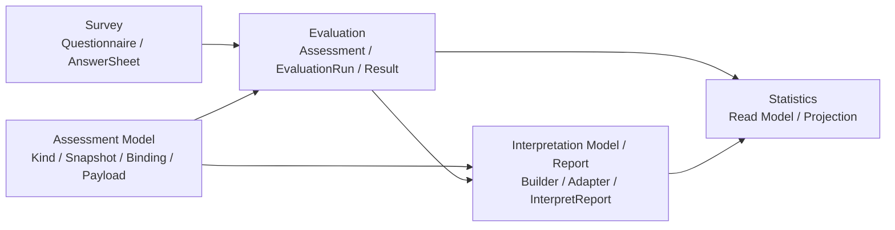

# 01-为什么拆分 Survey / Assessment Model / Evaluation / Interpretation Model

**本文回答**：为什么 qs-server 不把“问卷、答卷、量表、人格模型、计分、解释、报告”做成一个大模块，也不继续用旧的 `Survey / Scale / Evaluation` 三段式叙事，而是拆分为 `Survey -> Assessment Model -> Evaluation -> Interpretation Model / Report` 这条核心链路。

> 文件名中的 `InterpretationModel-Evaluation` 是历史命名。当前正文以 `Survey / Assessment Model / Evaluation / Interpretation Model` 为准，后续可以单独做文件重命名和链接迁移。

---

## 30 秒结论

| 边界 | 负责 | 不负责 | 当前代码落点 |
| ---- | ---- | ------ | ------------ |
| Survey | 问卷模板、题目结构、提交规格、答案校验、`AnswerSheet` 答卷事实、答卷提交事件 | 不负责模型资产、医学量表规则、人格模型规则、Assessment 状态机、最终报告 | `domain/survey`、`application/survey`、`container/modules/survey` |
| Assessment Model | `AssessmentKind`、发布快照、模型绑定、模型 payload、Scale / MBTI / SBTI 等模型资产 | 不保存用户答卷事实，不维护一次测评执行状态，不持久化最终报告 | `domain/modelcatalog`、`application/modelcatalog`、`container/modules/modelcatalog` |
| Evaluation | `Assessment`、`EvaluationRun`、执行状态机、规则加载、模型执行、Evaluation Result、失败重试、执行事件 | 不编辑问卷，不发布模型资产，不维护最终报告模板和聚合 | `domain/evaluation`、`application/evaluation`、`container/modules/evaluation` |
| Interpretation Model / Report | `InterpretReport`、报告 builder registry、score/personality adapter、解释文案、报告聚合与持久化 | 不负责作答提交、测评执行状态机、模型资产发布、读侧统计 | 当前代码包仍是 `domain/interpretation`、`container/modules/interpretation` |

一句话概括：

> **Survey 解决“用户提交了什么事实”，Assessment Model 解决“按什么模型解释”，Evaluation 解决“一次测评如何执行和追踪”，Interpretation Model / Report 解决“执行结果如何成为最终报告”。**

这个拆分不是为了目录好看，而是因为这四类对象的生命周期、变化原因、存储形态、权限边界、故障边界和扩展方向都不同。

---

## 1. 为什么旧的 Survey / Scale / Evaluation 叙事不够了

早期系统只支持医学量表时，可以简化描述为：

```text
Survey
    管问卷和答卷

Scale
    管怎么算和怎么解释

Evaluation
    管测评结果和报告
```

这个说法在只有医学量表时基本可用，因为当时“测评模型资产”几乎等同于 Scale。

但当系统支持人格模型、SBTI、MBTI 或后续 BigFive 后，Scale 不能继续作为核心模块中心：

```text
MBTI 不是 MedicalScale；
SBTI / BigFive 不天然拥有 Factor / RiskLevel / InterpretationRules 这些医学量表语义；
人格模型更关注 Dimension / TypeCode / TypeProfile / Trait；
如果把人格模型塞进 Scale，会污染 MedicalScale 的领域模型；
如果让 Evaluation 直接依赖 Scale，就无法成为通用测评执行层。
```

因此，新的主线必须升级为：

```text
Survey
  -> Assessment Model
  -> Evaluation
  -> Interpretation Model / Report
```

其中 Scale 是 `Assessment Model` 下的一类医学量表模型资产，不再是与 Survey、Evaluation 同级的核心模块。

---

## 2. 新边界总览



关键点：

- Survey 不直接执行模型，也不直接生成报告。
- Assessment Model 管模型资产和发布快照，不保存某次执行结果。
- Evaluation 管一次执行、状态机、失败重试和结果事实。
- Interpretation Model / Report 管报告聚合、builder、adapter 和持久化。
- Statistics 只做读侧投影，不反向成为写模型事实源。

---

## 3. Survey：作答事实层

Survey 的核心对象是：

```text
Questionnaire
SubmissionSpec
Question
Option
AnswerSheet
AnswerValue
AnswerSheetSubmittedEvent
```

它关注：

- 问卷模板创建。
- 题目、选项、提交规格维护。
- 题型扩展。
- 答案合法性校验。
- 用户提交答卷。
- 答卷持久化。
- 发出 `answersheet.submitted`。

Survey 的结束点通常是：

```text
AnswerSheet saved
answersheet.submitted staged/published
```

它不应该同步执行 Scale、MBTI、SBTI 或其它模型，也不应该同步生成最终报告。

---

## 4. Assessment Model：测评模型资产层

Assessment Model 的核心对象是：

```text
AssessmentKind
AssessmentModelSnapshot
PublishedModelSnapshot
QuestionnaireBinding
Model Payload
Model Descriptor
EvaluatorKey
```

它关注：

- 当前支持哪些模型 Kind / SubKind / Algorithm。
- 某个模型版本如何发布、冻结和查询。
- 模型如何绑定问卷版本。
- Evaluation 执行时需要读取哪份 payload。
- Scale、MBTI、SBTI、BigFive 等模型资产如何同级治理。

它不保存用户答卷事实，也不保存某次测评执行状态。

需要特别注意：

```text
scale/typologymodel 是 modelcatalog 的 legacy register name（R108 后 `personalitymodel` 注册名已改为 `typologymodel`）；
application/scale 与 collection `application/typologymodel` 等为能力路径；
它们不再表示文档层的独立核心模块。
```

---

## 5. Evaluation：测评执行层

Evaluation 的核心对象是：

```text
Assessment
EvaluationRun
EvaluationResult
AssessmentOutcome
FailureReason
RetryPolicy
AssessmentInterpretedEvent
```

它关注：

- 一次测评是否创建。
- 使用哪个模型快照和执行 payload。
- 测评状态如何流转。
- 执行器是否成功。
- 执行结果如何保存。
- 失败如何记录、重试和补偿。
- 完成事件如何可靠出站。

Evaluation 的生命周期是过程型 + 结果型。它不是问卷模板，不是答卷本身，也不是模型资产发布系统。

---

## 6. Interpretation Model / Report：解释模型与报告产出层

文档中的 `interpretation`，对应当前代码中的 `interpretation` module。

它的核心对象是：

```text
InterpretReport
ReportBuilder
ReportBuilderRegistry
ModelExtra
score adapter
personality adapter
Suggestion
ReportGeneratedOutcome
```

它关注：

- Evaluation 结果如何变成最终可读报告。
- score-based 模型和 personality 模型如何通过 adapter 组装报告。
- 报告 builder 如何注册与选择。
- `InterpretReport` 如何聚合、持久化和查询。
- 报告生成事件需要哪些 outcome 数据。

它不负责作答提交，不负责 Assessment 状态机，不负责模型资产发布，也不替代 Statistics。

---

## 7. 拆分依据一：生命周期不同

| 生命周期 | 典型流转 | 稳定点 |
| -------- | -------- | ------ |
| Survey | `Questionnaire draft -> published -> AnswerSheet submitted` | 用户提交了某份问卷版本的答卷事实 |
| Assessment Model | `model draft -> payload maintained -> snapshot published -> catalog read` | 发布后的模型快照和 payload 可追溯 |
| Evaluation | `answersheet.submitted -> assessment created -> running -> completed/failed` | 某次测评执行状态和结果事实 |
| Interpretation Model / Report | `result/outcome -> builder/adapter -> InterpretReport saved -> report.generated` | 最终解释报告可查询、可投影 |

如果把这些生命周期混在一个模块里，会出现：

- 问卷模板变化影响模型资产发布。
- 模型 payload 变化影响历史执行状态。
- 执行失败重试污染报告聚合。
- 报告 adapter 变更反向影响作答提交。

这些都不是合理耦合。

---

## 8. 拆分依据二：变化原因不同

DDD 中，一个边界是否应该拆开，核心问题是：

```text
它们是否因为同一种原因变化？
```

答案是否定的。

| 变化原因 | 应落到 |
| -------- | ------ |
| 新增题型 | Survey |
| 修改答案校验规则 | Survey |
| 修改提交规格 | Survey |
| 新增医学量表因子 | Assessment Model / Scale |
| 修改量表计分规则 | Assessment Model / Scale |
| 新增 MBTI 维度规则 | Assessment Model / Personality |
| 修改模型发布 payload | Assessment Model |
| 修改执行状态机 | Evaluation |
| 修改失败重试策略 | Evaluation |
| 修改模型执行注册 | Evaluation + Assessment Model descriptor |
| 修改报告 builder | Interpretation Model / Report |
| 修改人格报告 adapter | Interpretation Model / Report |
| 新增统计口径 | Statistics |

如果不拆，新增一个 MBTI TypeProfile 可能影响 Scale；修改一个医学量表风险等级可能影响 Evaluation 主表；增加评估重试可能影响问卷模板发布。这些都是边界不清造成的耦合。

---

## 9. 拆分依据三：存储形态不同

Survey 更接近文档型作答事实：

```text
Questionnaire
  questions[]
  options[]
  validation rules[]
  submission spec

AnswerSheet
  answers[]
  questionnaire code/version
  filler/testee
```

Assessment Model 是规则资产和发布快照：

```text
PublishedModelSnapshot
  kind
  sub_kind
  algorithm
  payload
  questionnaire_binding
  published_at
```

Evaluation 是过程状态和结果事实：

```text
Assessment
EvaluationRun
EvaluationResult
FailureReason
Outbox
Retry state
```

Interpretation Model / Report 是最终展示聚合：

```text
InterpretReport
DimensionInterpret
Suggestion
ModelExtra
ReportGeneratedOutcome
```

这些对象的读写频率、版本语义、审计要求和缓存策略都不同，不应该强行塞进一个聚合或一张主表。

---

## 10. 拆分依据四：提交与执行时序不同

用户提交答卷时，必须同步完成的是：

1. 验证提交参数。
2. 加载问卷。
3. 校验答案合法性。
4. 构造 AnswerSheet。
5. 持久化 AnswerSheet。
6. 发出答卷已提交事件。

这些属于 Survey。

而下面这些不应该阻塞前台提交：

1. 创建 Assessment。
2. 加载模型快照。
3. 解析执行器。
4. 执行 Scale / MBTI / SBTI / BigFive 等模型。
5. 保存 Evaluation Result。
6. 生成 InterpretReport。
7. 发布完成事件。
8. 通知等待报告的请求。

这些属于 Evaluation 和 Interpretation Model / Report。

因此：

```text
同步提交 AnswerSheet
异步执行 Evaluation
异步或后置生成 InterpretReport
```

这个时序决定了 Survey、Evaluation 和 Report 必须拆开。

---

## 11. 为什么 Scale 不能继续作为核心模块

Scale 有强医学量表语义：

```text
MedicalScale
Factor
ScoringSpec
InterpretationRules
RiskLevel
```

这些概念适合医学量表，但不适合所有人格或心理模型。MBTI / SBTI / BigFive 更自然的概念可能是：

```text
Dimension
Preference
TypeCode
TypeProfile
Trait
Outcome
```

如果硬塞进 Scale，会出现：

```text
Factor 被滥用成 Dimension；
RiskLevel 被滥用成 TypeCode；
InterpretationRules 被滥用成 TypeProfile；
MedicalScale 变成“万能模型资产”。
```

更合理的是：

```text
Assessment Model
  -> Scale payload
  -> Personality payload
  -> BigFive payload

Evaluation
  -> 根据 descriptor / evaluator key 执行对应模型

Interpretation Model / Report
  -> 根据 result / outcome 选择对应 report builder 和 adapter
```

---

## 12. 为什么不马上重命名代码包

文档应该先统一业务语言，但代码包名不一定马上改。

当前代码仍有：

```text
modelcatalog
report
statistics
application/scale
application/modelcatalog/typology/consumer
```

如果马上把它们改成：

```text
model-catalog
interpretationmodel
statistic
```

会牵扯：

- container registry。
- route / wire / module install。
- REST 和 gRPC 对外命名。
- worker handler 和事件契约。
- 测试、生成文档和历史兼容。

更合理的策略是：

1. 第一阶段：文档统一业务语言。
2. 第二阶段：README 明确“业务名称 vs 代码包名”映射。
3. 第三阶段：等模块边界稳定后，再决定是否重命名代码包。

---

## 13. 设计不变量

后续演进应坚持以下不变量：

1. Survey 不直接生成报告。
2. Survey 不直接执行 Scale / MBTI / SBTI / BigFive。
3. Scale 是 Assessment Model 下的医学量表模型资产，不是独立核心模块。
4. Personality / MBTI / SBTI 与 Scale 同级，都是具体模型资产。
5. Assessment Model 不保存 AnswerSheet。
6. Assessment Model 不保存 Assessment 执行状态。
7. Evaluation 不直接修改 Questionnaire / Assessment Model 聚合。
8. Evaluation 不把 MedicalScale / Factor / RiskLevel 这类具体模型语义塞进主表。
9. Evaluation 通过模型快照、descriptor、payload 和 evaluator key 执行模型。
10. Interpretation Model / Report 不维护执行状态机。
11. AnswerSheet 提交成功不等于 Assessment 完成。
12. 规则变化事件不等于某次测评完成事件。
13. 规则变化不默认触发历史 Assessment 重算。
14. Redis / ReadModel / Metrics 不成为业务写模型事实源。
15. 报告访问权限和模型规则管理权限必须拆开。

---

## 14. 常见误区

### 14.1 “问卷和量表是一回事”

不是。问卷是收集载体，量表是医学模型资产。

### 14.2 “Scale 管解释，所以 MBTI 放进 Scale 就行”

不行。Scale 是医学量表模型资产，MBTI / SBTI / BigFive 是其它模型资产。它们应该归入 Assessment Model 的统一资产层，而不是互相继承。

### 14.3 “答卷提交成功就应该立刻有报告”

不一定。提交是 Survey 完成，报告是 Evaluation 和 Report 后续完成。

### 14.4 “Evaluation 读取了 Survey / Model 数据，所以边界没拆开”

读取不等于拥有。Evaluation 读取输入和快照，但不修改 Survey 或 Assessment Model 聚合。

### 14.5 “文档叫 report，代码就必须马上叫 interpretationmodel”

不需要。当前代码包仍叫 `interpretation`，文档会显式标注映射关系，避免读者找不到代码。

---

## 15. 代码锚点

### Survey

- `internal/apiserver/container/modules/survey/assemble.go`
- `internal/apiserver/application/survey/questionnaire`
- `internal/apiserver/application/survey/answersheet`
- `internal/apiserver/domain/survey/questionnaire`
- `internal/apiserver/domain/survey/answersheet`

### Assessment Model

- `internal/apiserver/container/modules/modelcatalog`
- `internal/apiserver/container/modules/modelcatalog/module.go`
- `internal/apiserver/domain/modelcatalog`
- `internal/apiserver/domain/modelcatalog/scale`
- `internal/apiserver/application/modelcatalog`
- `internal/apiserver/application/scale`
- `internal/apiserver/application/modelcatalog/typology/consumer`
- `internal/apiserver/port/modelcatalog`

### Evaluation

- `internal/apiserver/container/modules/evaluation/assemble.go`
- `internal/apiserver/application/evaluation`
- `internal/apiserver/application/evaluation/execute`
- `internal/apiserver/application/evaluation/result`
- `internal/apiserver/domain/evaluation`

### Interpretation Model / Report

- `internal/apiserver/container/modules/interpretation`
- `internal/apiserver/domain/interpretation`
- `internal/apiserver/domain/interpretation/score`
- `internal/apiserver/domain/interpretation/personality`
- `internal/apiserver/container/modules/modelcatalog/report_builders.go`

### Cross-boundary Infrastructure

- `configs/events.yaml`
- `docs/03-基础设施/event/02-领域事件设计.md`
- `docs/03-基础设施/data-access/README.md`
- `docs/03-基础设施/cache/03-L2-Redis缓存设计.md`
- `docs/03-基础设施/security/05-安全边界与降级.md`
- `docs/03-基础设施/observability/06-告警与故障定位.md`

---

## 16. Verify

如果修改业务模块边界相关代码：

```bash
go test ./internal/apiserver/container/modules/...
go test ./internal/apiserver/application/survey/...
go test ./internal/apiserver/application/modelcatalog/...
go test ./internal/apiserver/application/evaluation/...
go test ./internal/apiserver/domain/...
```

如果只修改文档：

```bash
make docs-hygiene
git diff --check
```

---

## 17. 下一跳

| 目标 | 文档 |
| ---- | ---- |
| 业务模块总览 | `../02-业务模块/README.md` |
| Survey 模块模型 | `../02-业务模块/10-survey/README.md` |
| Assessment Model 模块模型 | `../02-业务模块/20-model-catalog/README.md` |
| Evaluation 模块模型 | `../02-业务模块/30-evaluation/README.md` |
| Interpretation Model / Report 模块模型 | `../02-业务模块/40-interpretation/README.md` |
| 旧 Scale 兼容入口 | `../02-业务模块/20-model-catalog/README.md` |
| 为什么同步提交但异步测评执行 | `02-为什么同步提交但异步测评执行.md` |
| 多解释模型扩展专题 | `08-多解释模型扩展专题--从Scale到MBTI.md` |
| Evaluation 通用执行引擎专题 | `09-Evaluation通用执行引擎专题.md` |
