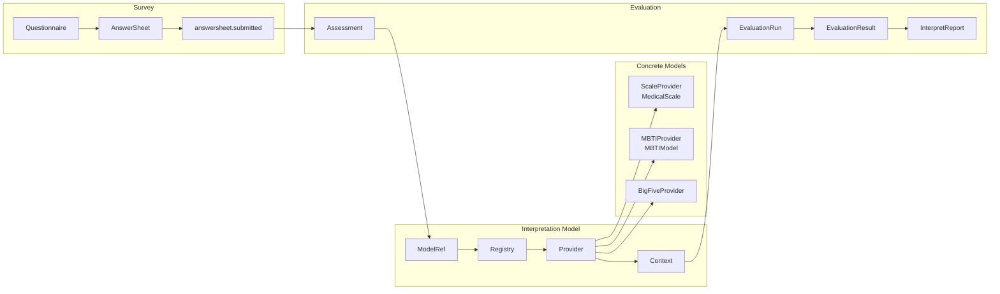

# 01-为什么拆分 Survey / Interpretation Model / Evaluation

**本文回答**：为什么 qs-server 不把“问卷、答卷、量表、MBTI、计分、解释、报告”做成一个大模块，而是拆分为 Survey、Interpretation Model、Concrete Models、Evaluation 这几个边界；这些边界分别稳定什么、变化什么、协作什么；这种拆分带来了哪些收益、代价和约束。

---

## 30 秒结论

| 边界 | 负责 | 不负责 |
| ---- | ---- | ------ |
| Survey | 问卷模板、题目、选项、提交规格、答案校验、答卷事实、答卷提交事件 | 不负责医学量表因子、MBTI 类型、解释模型规则、Assessment 状态机、报告生成 |
| Interpretation Model | 解释模型接入抽象：ModelRef、Provider、Context、Registry、统一执行协议 | 不保存具体模型规则，不保存本次测评结果，不生成业务报告事实 |
| Concrete Models | 具体解释模型规则，例如 Scale、MBTI、BigFive | 不拥有 AnswerSheet，不拥有 Assessment 状态机，不直接决定报告生命周期 |
| Evaluation | Assessment、EvaluationRun、EvaluationResult、InterpretReport、失败重试、测评事件 | 不直接修改问卷定义，不直接修改具体模型规则，不把 Scale / MBTI 规则塞进主表 |

一句话概括：

> **Survey 解决“作答事实如何定义和提交”，Interpretation Model 解决“不同解释模型如何统一接入测评执行”，Concrete Models 解决“具体规则如何表达”，Evaluation 解决“一次测评如何执行、追踪、失败、重试、产出结果和报告”。**

这不是为了“目录好看”而拆分，而是因为这些对象的 **生命周期、变化原因、存储形态、并发风险、权限边界、事件语义和演进方向都不同**。

---

## 1. 背景：为什么原来的 Survey / Scale / Evaluation 叙事不够了

早期 qs-server 可以用三段式描述：

```text
Survey
    管问卷和答卷

Scale
    管怎么算和怎么解释

Evaluation
    管测评结果和报告
```

在系统只支持医学量表时，这个说法基本够用。因为当时“解释模型”几乎等同于 Scale。

但当系统准备支持 MBTI 后，这个说法会出现明显问题：

```text
MBTI 不是 MedicalScale；
MBTI 不天然拥有 Factor / RiskLevel / InterpretationRules 这些医学量表语义；
MBTI 的核心结果更像 DimensionPreference / TypeCode / TypeProfile；
如果把 MBTI 塞进 Scale，会污染 Scale 的领域模型；
如果让 Evaluation 直接依赖 Scale，就无法成为通用测评执行引擎。
```

因此，新的主线必须升级为：

```text
Survey
  -> Interpretation Model
  -> Concrete Models
  -> Evaluation
```

其中 Scale 不再是“所有解释能力的中心”，而是 Concrete Models 中的一个具体模型：

```text
Concrete Models
├── Scale
│   └── MedicalScale / Factor / ScoringSpec / InterpretationRules
├── MBTI
│   └── DimensionRule / TypeCode / TypeProfile
└── BigFive
    └── TraitRule / ScoreRange / ProfileText
```

---

## 2. 如果不拆，会发生什么

如果把所有内容放到一个“大测评模块”中，表面上会很简单：

```text
Questionnaire
  + AnswerSheet
  + MedicalScale
  + MBTIModel
  + Assessment
  + EvaluationResult
  + InterpretReport
```

但很快会出现几个问题：

| 问题 | 后果 |
| ---- | ---- |
| 问卷模板变化影响解释模型 | 修改题型字段可能误伤模型执行 |
| Scale 规则和 MBTI 规则混在一起 | MedicalScale 被 TypeCode / TypeProfile 污染 |
| 答卷提交同步等待模型解释 | 用户提交体验差，峰值下容易超时 |
| 答案校验和解释规则混在一起 | 新题型、新模型、新报告互相牵连 |
| Assessment 状态和 AnswerSheet 状态混淆 | “已提交答卷”和“已完成测评”无法区分 |
| 具体模型字段进入 Assessment 主表 | 每新增一个模型都要改 Evaluation 主结构 |
| 规则变化事件和执行完成事件混用 | 容易误触发历史重算或错误报告生成 |
| 前台提交权限和报告访问权限混杂 | 模型规则管理和用户报告隐私无法拆开授权 |

这些问题本质上不是“代码没组织好”，而是 **领域边界没有分开**。

---

## 3. 新边界总览

### 3.1 Survey：作答事实层

Survey 的核心对象是：

```text
Questionnaire
SubmissionSpec
Question
Option
AnswerSheet
AnswerValue
```

它关注：

- 问卷模板创建。
- 题目、选项、提交规格维护。
- 题型扩展。
- 答案合法性校验。
- 用户提交答卷。
- 答卷持久化。
- 发出 `answersheet.submitted`。

Survey 的结束点通常是：

```text
AnswerSheet saved
answersheet.submitted staged/published
```

它不应该同步执行 Scale、MBTI 或其它解释模型。

---

### 3.2 Interpretation Model：解释模型抽象层

Interpretation Model 的核心对象是：

```text
ModelRef
InterpretationProvider
InterpretationContext
InterpretationRegistry
EvaluationInput
EvaluationResult contract
```

它关注：

- 一次 Assessment 应该使用哪个模型。
- 如何用统一协议加载模型上下文。
- 如何用统一 Provider 执行解释。
- 如何让 Scale、MBTI、BigFive 同级接入。
- 如何避免 Evaluation 直接依赖某个具体模型。

它不保存具体规则事实。

它也不保存本次测评结果。

它更像一层 **接入协议和执行契约**。

---

### 3.3 Concrete Models：具体解释模型

Concrete Models 是具体规则资产。

当前和未来可以包括：

```text
Scale
MBTI
BigFive
职业兴趣测评
AI 解读增强模型
```

以 Scale 为例，它关注：

```text
MedicalScale
Factor
ScoringSpec
InterpretationRules
RiskLevel
QuestionnaireRef
```

以 MBTI 为例，它可能关注：

```text
MBTIModel
DimensionRule
QuestionMapping
TypeCode
TypeProfile
ReportTemplate
```

Concrete Models 负责规则事实，不负责一次测评执行生命周期。

---

### 3.4 Evaluation：通用测评执行引擎

Evaluation 的核心对象是：

```text
Assessment
EvaluationRun
EvaluationResult
InterpretReport
FailureReason
RetryPolicy
AssessmentInterpretedEvent
InterpretReportGeneratedEvent
```

它关注：

- 一次测评是否创建。
- 使用哪个 ModelRef。
- 测评状态如何流转。
- Provider 是否执行成功。
- EvaluationResult 如何保存。
- InterpretReport 如何生成。
- 失败如何记录。
- 是否可重试。
- 事件如何可靠出站。

Evaluation 的生命周期是 **过程型 + 结果型**。

它不是问卷模板，不是答卷本身，也不是某个具体解释模型规则。

---

## 4. 拆分依据一：生命周期不同

### 4.1 Survey 生命周期

Survey 生命周期围绕“作答事实”展开：

```text
Questionnaire draft
  -> Questionnaire published
  -> AnswerSheet submitted
  -> AnswerSheetSubmittedEvent
```

Survey 的稳定点是：

```text
用户提交了某份答卷；
答卷引用了明确的 QuestionnaireCode / QuestionnaireVersion；
答案通过了题型和提交规格校验。
```

Survey 不负责后续解释模型是否存在，也不负责报告是否生成。

---

### 4.2 Concrete Model 生命周期

具体解释模型生命周期围绕“规则资产”展开。

以 Scale 为例：

```text
MedicalScale draft
  -> maintain factors / scoring specs / interpretation rules
  -> bind questionnaire
  -> publish
  -> changed event
```

以 MBTI 为例：

```text
MBTIModel draft
  -> maintain dimension rules / question mappings / type profiles
  -> bind questionnaire
  -> publish
  -> changed event
```

这类对象不是高频写入对象，更像规则配置和模型资产。

它们的生命周期与 AnswerSheet 完全不同。

---

### 4.3 Evaluation 生命周期

Evaluation 生命周期围绕“一次测评执行”展开：

```text
answersheet.submitted
  -> assessment.created
  -> assessment.completed
  -> interpretation.completed / interpretation.failed
  -> report.generated
```

它关注的是：

```text
这一次测评有没有创建；
用了哪个 ModelRef；
执行到了哪个阶段；
失败是否可重试；
结果和报告是否可靠保存。
```

这不是 Survey 或 Scale 的职责。

---

## 5. 拆分依据二：变化原因不同

DDD 中，一个边界是否应该拆开，核心问题是：

```text
它们是否因为同一种原因变化？
```

答案是否定的。

| 变化原因 | 应落到 |
| -------- | ------ |
| 新增题型 | Survey |
| 修改答案校验规则 | Survey |
| 修改提交规格 | Survey |
| 新增医学量表因子 | Scale |
| 修改量表计分规则 | Scale |
| 修改风险等级文案 | Scale |
| 新增 MBTI 维度规则 | MBTI Concrete Model |
| 修改 MBTI TypeProfile | MBTI Concrete Model |
| 新增 BigFive TraitRule | BigFive Concrete Model |
| 新增 Provider 接入协议 | Interpretation Model |
| 修改 Assessment 状态机 | Evaluation |
| 修改失败重试策略 | Evaluation |
| 修改报告生成流程 | Evaluation |
| 新增解释模型统计口径 | Statistics ReadModel / Observability |

如果不拆，新增一个 MBTI TypeProfile 可能影响 Scale；修改一个医学量表风险等级可能影响 Evaluation 主表；增加评估重试可能影响问卷模板发布。这些都是不合理的耦合。

---

## 6. 拆分依据三：存储形态不同

### 6.1 Survey 更接近文档型作答事实

Questionnaire 和 AnswerSheet 都有明显的文档特征：

```text
Questionnaire
  questions[]
  options[]
  validation rules[]
  submission spec

AnswerSheet
  answers[]
  questionnaire code/version
  filler/testee
```

它们结构嵌套、字段变化相对频繁，更适合文档模型承载。

---

### 6.2 Concrete Models 是规则资产

Scale 规则资产：

```text
MedicalScale
  factors[]
    question_codes[]
    scoring_spec
    interpretation_rules[]
```

MBTI 规则资产：

```text
MBTIModel
  dimensions[]
  question_mappings[]
  type_profiles[]
  report_template
```

这类对象通常需要：

- 版本化。
- 发布后冻结。
- 整体加载。
- Context cache。
- 发布态列表缓存。

它们不应该塞进 Evaluation 的 Assessment 主表。

---

### 6.3 Evaluation 是过程状态 + 结果快照

Evaluation 涉及：

```text
Assessment
EvaluationRun
EvaluationResult
InterpretReport
Outbox
Retry state
Failure reason
```

它明显不是一个规则定义文档，也不是答卷本身。

它更像 **测评执行过程和结果事实** 的组合。

因此，存储边界也支持拆分：

```text
Survey
    问卷 / 答卷事实

Concrete Models
    解释模型规则事实

Evaluation
    执行状态 / 执行结果 / 报告事实 / 事件出站

Statistics ReadModel
    查询优化投影

Redis
    可回源缓存和运行时治理状态
```

---

## 7. 拆分依据四：提交与测评执行时序不同

用户提交答卷时，真正必须同步完成的是：

1. 验证提交参数。
2. 加载问卷。
3. 校验答案合法性。
4. 构造 AnswerSheet。
5. 持久化 AnswerSheet。
6. 发出答卷已提交事件。

这些属于 Survey。

而下面这些不应该阻塞前台提交：

1. 创建 Assessment。
2. 加载 ModelRef。
3. 解析 Interpretation Provider。
4. 加载 Provider Context。
5. 执行 Scale / MBTI / BigFive 等解释模型。
6. 保存 EvaluationResult。
7. 生成 InterpretReport。
8. 发布完成事件。
9. 通知等待报告的请求。

这些属于 Evaluation。

因此：

```text
同步提交 AnswerSheet
异步执行 Evaluation
```

这个时序决定了 Survey 和 Evaluation 必须拆开。

如果它们合成一个模块，提交链路很容易被解释模型拖慢，甚至在高峰下出现用户提交超时。

---

## 8. 四个边界的协作方式

拆分后，它们不是互相不知道，而是通过 **稳定协议、快照和事件** 协作。



关键点：

- Survey 不调用 Evaluation engine。
- Evaluation 不直接拥有 Questionnaire / AnswerSheet / Concrete Model 聚合。
- Evaluation 通过 ModelRef 和 Provider 执行具体模型。
- Scale 和 MBTI 不互相继承，不互相污染。
- Event / Outbox 负责把“答卷提交”从“测评执行”中解耦出来。

---

## 9. 为什么需要 Interpretation Model 抽象

如果没有 Interpretation Model 抽象，Evaluation 很容易写成：

```text
if model_type == scale:
    load MedicalScale
    calculate FactorScore
    interpret RiskLevel
elif model_type == mbti:
    load MBTIModel
    calculate TypeCode
    build TypeProfile
```

这会导致 Evaluation 被具体模型污染。

Interpretation Model 抽象要解决的是：

```text
不同模型的规则不同；
不同模型的结果结构不同；
但 Evaluation 的执行生命周期是相同的。
```

统一抽象后：

```text
ModelRef
  -> Registry.Resolve(model_type)
  -> Provider.LoadContext(model_ref)
  -> Provider.Evaluate(input, context)
  -> EvaluationResult
```

ScaleProvider、MBTIProvider、BigFiveProvider 就可以同级接入。

---

## 10. 为什么 Scale 不能继续作为解释能力中心

早期可以说：

```text
Scale 管怎么算和怎么解释
```

但支持 MBTI 后，这句话会变得不准确。

### 10.1 Scale 有强医学量表语义

Scale 中的核心概念通常是：

```text
MedicalScale
Factor
ScoringSpec
InterpretationRules
RiskLevel
```

这些概念适合医学量表，但不适合所有人格或心理模型。

### 10.2 MBTI 的语义不等于 Factor / RiskLevel

MBTI 更自然的概念是：

```text
Dimension
Preference
TypeCode
TypeProfile
```

如果硬塞进 Scale，会出现：

```text
Factor 被滥用成 Dimension；
RiskLevel 被滥用成 TypeCode；
InterpretationRules 被滥用成 TypeProfile；
MedicalScale 变成“万能解释模型”。
```

这会破坏 Scale 模型的纯度。

### 10.3 更合理的方案

更合理的是：

```text
ScaleProvider implements InterpretationProvider
MBTIProvider implements InterpretationProvider
BigFiveProvider implements InterpretationProvider
```

也就是：

```text
Scale 是一个具体解释模型；
MBTI 是另一个具体解释模型；
Interpretation Model 才是抽象层。
```

---

## 11. 为什么 Evaluation 不能并入具体模型

另一种方案是把 Evaluation 并入 Scale 或 MBTI，因为解释规则来自具体模型。

这个方案不合适。

### 11.1 具体模型是规则定义，Evaluation 是执行实例

Scale / MBTI 描述：

```text
这套规则是什么？
```

Evaluation 描述：

```text
某个人某次答卷按某个 ModelRef 执行后的结果是什么？
```

规则和执行结果是两个生命周期。

### 11.2 Evaluation 有状态机和失败重试

Assessment 会有：

```text
created
running
completed
failed
retrying
report_generated
```

这些过程状态不应该由 Scale 或 MBTI 规则模块承载。

### 11.3 Evaluation 涉及统一结果和报告事实

Evaluation 会写：

```text
Assessment
EvaluationRun
EvaluationResult
InterpretReport
Outbox
Query cache invalidation
Waiter notification
```

这些不是任何一个具体模型规则定义的一部分。

### 11.4 Evaluation 是异步执行边界

Evaluation 是 event / worker 驱动的执行过程。

Scale / MBTI 是后台配置与规则资产。

把二者合并会让具体模型模块既管规则又管执行流，边界过重。

---

## 12. 为什么 Evaluation 不能并入 Survey

也不能把 Evaluation 并入 Survey。

### 12.1 AnswerSheet 不是 Assessment

AnswerSheet 表示：

```text
用户提交了哪些答案
```

Assessment 表示：

```text
系统基于这些答案和某个 ModelRef 创建了一次测评执行
```

提交答卷成功，不等于测评完成。

### 12.2 Survey 不应关心解释模型执行

Survey 的职责到 AnswerSheet 持久化和提交事件即可。

解释模型执行涉及：

```text
ModelRef
Provider
Context
EvaluationRun
EvaluationResult
InterpretReport
Retry
```

这些都不是 Survey 的内聚职责。

### 12.3 同步提交需要轻量

如果 Survey 同步生成报告，提交链路会变成：

```text
提交答案
  -> 校验答案
  -> 查具体模型规则
  -> 解析 Provider
  -> 加载 Context
  -> 执行模型
  -> 生成报告
  -> 写多个结果
```

这会显著增加提交耗时和失败面。

---

## 13. 拆分后的模块职责边界

### 13.1 Survey

Survey 应该保证：

- 问卷结构合法。
- 答案符合题型与提交规格。
- 答卷引用明确的问卷 code/version。
- 答卷保存具有 durable 语义。
- 答卷提交事件可出站。

Survey 不保证：

- 测评一定完成。
- 报告一定生成。
- Scale / MBTI 规则一定存在。
- 模型解释一定成功。

---

### 13.2 Interpretation Model

Interpretation Model 应该保证：

- ModelRef 可以表达模型类型、编码和版本。
- Registry 可以解析模型类型到 Provider。
- Provider 接口稳定。
- Context 是只读执行上下文。
- 新模型有统一接入协议。

Interpretation Model 不保证：

- 具体模型规则如何存储。
- 具体模型算法如何实现。
- 本次执行结果如何持久化。
- 报告如何渲染。

---

### 13.3 Concrete Models

Concrete Models 应该保证：

- 规则结构合法。
- 发布版本稳定。
- 与 QuestionnaireRef 绑定清楚。
- Provider 能加载执行所需 Context。
- 规则变化事件可出站。

Concrete Models 不保证：

- 用户一定提交答卷。
- 某次测评一定成功。
- 报告一定生成。
- 前台提交如何削峰。

---

### 13.4 Evaluation

Evaluation 应该保证：

- Assessment 创建与状态流转。
- EvaluationRun 记录执行尝试。
- Provider 执行结果可保存。
- EvaluationResult 可追溯。
- InterpretReport 可生成和持久化。
- 失败可记录、可重试、可补偿。
- 关键事件可通过 Outbox 出站。

Evaluation 不保证：

- 问卷定义如何编辑。
- 答案如何校验。
- Scale / MBTI 规则如何维护。
- 前台提交如何削峰。

---

## 14. 拆分带来的收益

### 14.1 可独立演进

- 新题型主要影响 Survey。
- 新医学量表计分策略主要影响 Scale。
- 新 MBTI 维度规则主要影响 MBTI 模型。
- 新 Provider 接入方式主要影响 Interpretation Model。
- 新重试策略主要影响 Evaluation。
- 新提交保护主要影响 collection / Survey。

### 14.2 可独立测试

| 测试目标 | 模块 |
| -------- | ---- |
| 答案校验 | Survey |
| 医学量表因子规则 | Scale |
| MBTI TypeCode 规则 | MBTI Concrete Model |
| Provider contract | Interpretation Model |
| Assessment 状态机 | Evaluation |
| EvaluationRun / Retry | Evaluation |
| Outbox relay | Event infra |
| wait-report | Evaluation / collection |

### 14.3 可独立优化读侧

- PublishedScaleListCache。
- MBTIModelListCache。
- Questionnaire cache。
- Assessment list query cache。
- Interpretation model distribution read model。
- MBTI TypeCode distribution read model。
- Hotset / warmup。

### 14.4 可独立处理故障

- 答卷提交成功但测评失败：Evaluation 重试。
- Provider 找不到：Interpretation Registry 排障。
- MBTI 规则缺失：具体模型 repository / Context cache 排障。
- 问卷版本不匹配：Survey input failure。
- Report 生成慢：Evaluation / report pipeline 排障。
- 前台提交高峰：collection / SubmitQueue 排障。

---

## 15. 拆分带来的代价

拆分不是免费的。

| 代价 | 表现 |
| ---- | ---- |
| 协作链路更长 | Survey -> Event -> Evaluation -> Provider -> Report |
| 一致性变成最终一致 | 答卷提交和报告生成不在一个同步事务中 |
| 需要更多接口 | ModelRef、Provider、Registry、Context、ReadModel ports |
| 排障需要跨模块 | 提交成功但报告未生成要查多个点 |
| 文档复杂度上升 | 需要明确每个边界和失败语义 |
| 测试矩阵更大 | 单元、集成、事件、Provider contract、pipeline 都要覆盖 |
| 演进纪律要求更高 | 不能为了快把模型字段塞进 Assessment 或 Scale |

这些代价是可以接受的，因为它换来了更强的演进能力和更清晰的故障隔离。

---

## 16. 替代方案分析

### 16.1 方案 A：单体 Evaluation 模块

```text
Evaluation 包含 Questionnaire、AnswerSheet、Scale、MBTI、Assessment、Report
```

优点：

- 初期代码少。
- 调用链短。
- 无需 Provider 抽象。

缺点：

- 模块过重。
- 修改题型影响报告。
- 修改模型规则影响提交。
- 难以做异步执行。
- 存储边界混乱。
- 新增模型不断污染主结构。

结论：不适合长期演进。

---

### 16.2 方案 B：Survey + Concrete Models 合并，Evaluation 独立

优点：

- 模板与规则放一起，前期理解简单。

缺点：

- 问卷展示模型和解释规则资产耦合。
- 新题型和新模型规则互相影响。
- 前台答卷提交和后台模型发布耦合。

结论：仍然边界不清。

---

### 16.3 方案 C：Concrete Models + Evaluation 合并

优点：

- 规则和执行在一起。

缺点：

- 具体模型模块变得过重。
- 规则定义和运行实例混合。
- 发布规则与执行失败重试互相牵连。
- MBTI / Scale / BigFive 之间难以保持同级。

结论：不利于规则资产治理，也不利于 Evaluation 成为通用引擎。

---

### 16.4 方案 D：当前方案

```text
Survey / Interpretation Model / Concrete Models / Evaluation
```

优点：

- 生命周期清晰。
- 改动原因清晰。
- 存储边界清晰。
- 异步测评自然。
- 多解释模型扩展自然。
- 故障隔离好。

缺点：

- 协作接口更多。
- 文档和测试要求更高。
- Provider contract 需要维护。
- 事件、缓存、统计、权限、观测需要同步模型维度。

结论：当前系统复杂度和下一阶段 MBTI 扩展目标下，这是更稳妥的工程边界。

---

## 17. 设计不变量

后续演进应坚持以下不变量：

1. Survey 不直接生成报告。
2. Survey 不直接执行 Scale / MBTI / BigFive。
3. Scale 是医学量表解释模型，不是解释模型抽象层。
4. MBTI 与 Scale 同级，都是具体解释模型。
5. Interpretation Model 不保存具体规则事实。
6. Concrete Models 不保存 Assessment 执行状态。
7. Evaluation 不直接修改 Questionnaire / Concrete Model 聚合。
8. Evaluation 不依赖 MedicalScale / Factor / RiskLevel 这类具体模型语义。
9. Evaluation 通过 ModelRef / Provider / Context 执行模型。
10. AnswerSheet 提交成功不等于 Assessment 完成。
11. 规则变化事件不等于某次测评完成事件。
12. 规则变化不默认触发历史 Assessment 重算。
13. Redis / ReadModel / Metrics 不成为规则事实源。
14. 新解释模型不能反向污染 Assessment 主表。
15. 报告访问权限和模型规则管理权限必须拆开。

---

## 18. 常见误区

### 18.1 “问卷和量表是一回事”

不是。问卷是收集载体，量表是医学规则资产。

### 18.2 “Scale 管解释，所以 MBTI 放进 Scale 就行”

不行。Scale 是医学量表模型，MBTI 是另一类解释模型。二者应该通过 Provider 同级接入 Evaluation。

### 18.3 “答卷提交成功就应该立刻有报告”

不一定。提交是 Survey 完成，报告是 Evaluation 异步完成。

### 18.4 “Evaluation 读取了 Survey / Model 数据，所以边界没拆开”

读取不等于拥有。Evaluation 通过 ModelRef、Provider、Context 或只读快照读取输入，不修改 Survey 或具体模型聚合。

### 18.5 “规则改了，历史报告应该自动变”

不应默认如此。历史测评应以当时引用的 ModelRef / RuleSnapshotRef 解释。规则演进要考虑版本、不可变性和审计。

### 18.6 “拆分只是为了代码目录漂亮”

不是。拆分是因为生命周期、变化原因、存储形态、提交时序、权限边界和故障边界都不同。

---

## 19. 代码锚点

### Survey

- `internal/apiserver/container/assembler/survey.go`
- `internal/apiserver/application/survey/questionnaire`
- `internal/apiserver/application/survey/answersheet`
- `internal/apiserver/domain/survey/questionnaire`
- `internal/apiserver/domain/survey/answersheet`

### Scale

- `internal/apiserver/container/assembler/scale.go`
- `internal/apiserver/application/scale`
- `internal/apiserver/domain/assessmentmodel/scale/definition`

### Interpretation Model

- `docs/02-业务模块/interpretation-model/README.md`
- `docs/02-业务模块/interpretation-model/01-解释模型抽象--ModelRef-Provider-Context模型设计.md`
- `docs/02-业务模块/interpretation-model/02-解释模型接入链路--注册-加载-执行-结果返回.md`
- `docs/02-业务模块/interpretation-model/03-新增解释模型链路--以MBTI接入为例.md`

### Evaluation

- `internal/apiserver/container/assembler/evaluation.go`
- `internal/apiserver/application/evaluation`
- `internal/apiserver/domain/evaluation`
- `docs/02-业务模块/evaluation/README.md`
- `docs/02-业务模块/evaluation/03-Evaluation引擎链路--模型解析-规则加载-执行-报告生成.md`

### Cross-boundary Infrastructure

- `docs/03-基础设施/event/01-事件目录与契约.md`
- `docs/03-基础设施/data-access/05-新增持久化能力SOP.md`
- `docs/03-基础设施/redis/04-QueryCache与StaticList.md`
- `docs/03-基础设施/security/05-新增安全能力SOP.md`
- `docs/03-基础设施/observability/04-GovernanceEndpoint与排障SOP.md`

---

## 20. Verify

```bash
go test ./internal/apiserver/container/assembler
go test ./internal/apiserver/application/survey/...
go test ./internal/apiserver/application/scale/...
go test ./internal/apiserver/application/evaluation/...
go test ./internal/apiserver/domain/...
```

如果修改事件链路：

```bash
go test ./internal/apiserver/application/eventing
go test ./internal/worker/handlers
```

如果修改解释模型接入：

```bash
go test ./internal/apiserver/application/...
go test ./internal/apiserver/infra/mongo/...
go test ./internal/apiserver/infra/cachequery
```

如果修改文档：

```bash
make docs-hygiene
git diff --check
```

---

## 21. 下一跳

| 目标 | 文档 |
| ---- | ---- |
| 为什么同步提交但异步测评执行 | `02-为什么同步提交但异步测评执行.md` |
| 为什么需要 collection 保护层 | `03-为什么需要collection保护层.md` |
| 为什么使用 Outbox | `04-为什么使用Outbox.md` |
| 多解释模型扩展专题 | `08-多解释模型扩展专题--从Scale到MBTI.md` |
| Evaluation 通用执行引擎专题 | `09-Evaluation通用执行引擎专题.md` |
| 解释模型事件与缓存治理专题 | `10-解释模型事件与缓存治理专题.md` |
| Survey 模块模型 | `../02-业务模块/survey/README.md` |
| Scale 模块模型 | `../02-业务模块/scale/README.md` |
| Interpretation Model 模块模型 | `../02-业务模块/interpretation-model/README.md` |
| Evaluation 模块模型 | `../02-业务模块/evaluation/README.md` |
