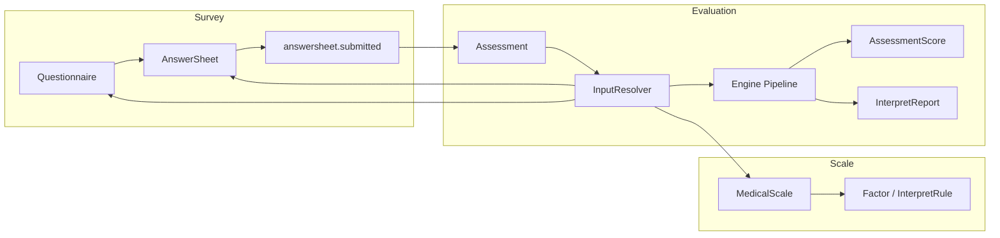

# 为什么拆分 Survey / Scale / Evaluation

**本文回答**：为什么 qs-server 不把“问卷、量表、答卷、计分、解读、报告”做成一个大模块，而是拆分为 Survey、Scale、Evaluation 三个边界；这三个边界分别稳定什么、变化什么、协作什么；拆分带来了哪些收益、代价和约束。

---

## 30 秒结论

| 边界 | 负责 | 不负责 |
| ---- | ---- | ------ |
| Survey | 问卷模板、题目、选项、答卷提交、答案校验、答卷持久化、答卷提交事件 | 不负责医学量表因子、风险解读、评估状态机、报告生成 |
| Scale | 医学量表、因子、因子计分规则、解释规则、风险等级、量表与问卷绑定 | 不负责答卷填写过程，不负责生成 Assessment/Report |
| Evaluation | Assessment 状态、评估执行、分数落库、风险判定、解读报告、评估事件出站 | 不直接修改问卷/量表定义，不拥有答卷聚合 |

一句话概括：

> **Survey 解决“收集什么答案”，Scale 解决“这些答案如何被医学规则解释”，Evaluation 解决“一次测评如何执行、落库、出报告”。**

这不是为了“目录好看”而拆分，而是因为三者的**生命周期、变化原因、存储形态、并发风险、权限边界和异步链路都不同**。

---

## 1. 背景：如果不拆，会发生什么

如果把所有内容放到一个“大测评模块”中，表面上会很简单：

```text
Questionnaire
  + Scale
  + AnswerSheet
  + Assessment
  + Score
  + Report
```

但很快会出现几个问题：

| 问题 | 后果 |
| ---- | ---- |
| 问卷模板变化会影响评估报告 | 修改题目字段可能误伤报告生成 |
| 量表规则变化会影响答卷提交 | 发布新量表规则时前台提交链路被迫变复杂 |
| 答卷提交同步等待评估完成 | 用户提交体验差，峰值下容易超时 |
| 计分/解读规则和答案校验混在一起 | 新题型、新计分策略、新解读规则互相牵连 |
| Assessment 状态和 AnswerSheet 状态混淆 | “已提交答卷”和“已完成评估”无法区分 |
| Mongo 大文档和 MySQL 读模型混用 | 存储边界不清，事务/一致性/查询优化困难 |
| 前台和后台权限混杂 | 小程序用户提交与后台运营管理难以隔离 |

这些问题本质上不是“代码没组织好”，而是**领域边界没有分开**。

---

## 2. 拆分依据一：三者生命周期不同

### 2.1 Survey 生命周期

Survey 的核心对象是：

```text
Questionnaire
AnswerSheet
```

它关注：

- 问卷模板创建。
- 题目、选项、校验规则维护。
- 问卷发布。
- 用户提交答卷。
- 答案合法性校验。
- 答卷持久化。
- 发出答卷提交事件。

Survey 的结束点通常是：

```text
AnswerSheet saved
answersheet.submitted staged/published
```

它不应该同步生成完整评估报告。

### 2.2 Scale 生命周期

Scale 的核心对象是：

```text
MedicalScale
Factor
InterpretRule
ScoringRule
```

它关注：

- 量表定义。
- 因子建模。
- 因子题目映射。
- 因子计分规则。
- 风险等级。
- 解读文案。
- 与问卷模板绑定。
- 发布后规则稳定。

Scale 的生命周期不像答卷那样高频写入。它更像**规则资产**。

### 2.3 Evaluation 生命周期

Evaluation 的核心对象是：

```text
Assessment
AssessmentScore
InterpretReport
EvaluationResult
```

它关注：

- 一次评估是否创建。
- 评估状态流转。
- 是否已完成计分。
- 是否已生成报告。
- 是否失败、可否重试。
- 是否通知前台等待者。
- 是否发出后续事件。

Evaluation 的生命周期是**过程型**和**结果型**的：它不是模板，也不是答卷本身，而是“基于某次答卷和某个量表规则执行出来的一次测评结果”。

---

## 3. 拆分依据二：三者变化原因不同

DDD 中，一个边界是否应该拆开，核心问题是：

```text
它们是否因为同一种原因变化？
```

答案是否定的。

| 变化原因 | 应落到 |
| -------- | ------ |
| 新增题型 | Survey |
| 修改答案校验规则 | Survey |
| 修改答卷提交字段 | Survey |
| 新增量表因子 | Scale |
| 修改因子计分规则 | Scale |
| 修改风险等级文案 | Scale |
| 修改评估状态机 | Evaluation |
| 修改报告生成流程 | Evaluation |
| 增加评估失败重试 | Evaluation |
| 增加报告等待通知 | Evaluation |

如果不拆，新增一个题型可能影响报告 pipeline；修改一个风险文案可能影响答卷提交；增加评估重试可能影响问卷模板发布。这些都是不合理的耦合。

---

## 4. 拆分依据三：三者存储形态不同

Survey、Scale、Evaluation 的数据形态不同。

### 4.1 Survey 更接近文档型数据

Questionnaire 和 AnswerSheet 都有明显的文档特征：

```text
Questionnaire
  questions[]
  options[]
  validation rules[]
  scoring metadata[]

AnswerSheet
  answers[]
  questionnaire code/version
  filler/testee
```

它们结构嵌套、字段变化相对频繁，更适合 Mongo 文档模型承载。

### 4.2 Scale 是规则资产

Scale 既有结构化生命周期，也有嵌套规则：

```text
MedicalScale
  factors[]
    question_codes[]
    scoring_strategy
    interpretation_rules[]
```

它既要支持后台管理，也要支持评估引擎读取稳定快照。

### 4.3 Evaluation 是过程状态 + 结果读模型

Evaluation 同时涉及：

- Assessment 状态。
- Score 明细。
- Report 文档。
- Outbox。
- Waiter registry。
- Query cache。
- MySQL transaction。
- Mongo report durable save。

它明显不只是一个文档，也不只是一个规则定义。它更像**业务过程和结果投影**的组合。

因此，存储边界也支持三者拆分：

```text
Survey: 问卷/答卷文档与答卷提交事件
Scale: 量表规则资产与列表/查询缓存
Evaluation: Assessment/Score/Report/Outbox/QueryCache
```

---

## 5. 拆分依据四：提交与评估的时序不同

用户提交答卷时，真正必须同步完成的是：

1. 验证提交参数。
2. 加载问卷。
3. 校验答案合法性。
4. 构造 AnswerSheet。
5. 持久化 AnswerSheet。
6. 发出答卷已提交事件。

这些属于 Survey。

而下面这些不应该阻塞前台提交：

1. 加载量表规则。
2. 按因子计算得分。
3. 判定风险等级。
4. 生成解读内容。
5. 生成报告。
6. 写入评估结果。
7. 通知等待报告的请求。

这些属于 Evaluation。

因此：

```text
同步提交 AnswerSheet
异步执行 Evaluation
```

这个时序决定了 Survey 和 Evaluation 必须拆开。如果它们合成一个模块，提交链路很容易被评估引擎拖慢，甚至在高峰下出现用户提交超时。

---

## 6. 三个边界的协作方式

拆分后，它们不是互相不知道，而是通过**稳定接口和快照**协作。



关键点：

- Survey 不调用 Evaluation pipeline。
- Evaluation 不直接拥有 Questionnaire / AnswerSheet / MedicalScale 聚合。
- Evaluation 通过 `evaluationinput.Resolver` 获取 Scale、AnswerSheet、Questionnaire 的输入快照。
- Scale 和 Survey 通过绑定关系协作，不把对方聚合并入自己内部。
- Event / Outbox 负责把“答卷提交”从“评估执行”中解耦出来。

---

## 7. 为什么 Evaluation 使用 InputSnapshot，而不是直接依赖三个聚合

Evaluation 的输入不是活的聚合对象，而是一次评估需要的**稳定快照**：

```text
InputSnapshot
  MedicalScale snapshot
  AnswerSheet snapshot
  Questionnaire snapshot
```

这有几个好处：

### 7.1 避免跨聚合修改

Evaluation 读取 Survey/Scale 数据，但不应该修改它们。快照模型天然表达：

```text
只读输入
```

### 7.2 降低依赖强度

Evaluation pipeline 只需要：

- 量表因子。
- 因子题目映射。
- 解读规则。
- 答卷答案。
- 问卷题目/选项。

不需要完整 Survey/Scale 聚合行为。

### 7.3 支持未来读模型优化

当前 resolver 可以从 repository 读取，未来也可以切换为：

- read model。
- cache。
- snapshot table。
- versioned document。
- materialized input view。

Evaluation pipeline 不需要知道来源变化。

### 7.4 让失败原因更明确

InputResolver 可以区分：

- scale_not_found。
- answersheet_not_found。
- questionnaire_not_found。
- questionnaire_version_mismatch。

这比在 pipeline 里混合查三个聚合更清楚。

---

## 8. 为什么 Scale 不能并入 Survey

直觉上，量表可能只是“问卷的一种”。但在 qs-server 中不能这样合并。

### 8.1 量表是医学规则资产

问卷关心“题目如何展示与填写”；量表关心“这些题目如何组成因子、如何计分、如何解释风险”。

这是两个不同问题。

### 8.2 一个量表需要绑定问卷，但不等于问卷

Scale 中有：

```text
QuestionnaireCode
QuestionnaireVersion
Factor
InterpretRule
ScoringStrategy
```

说明量表引用问卷作为收集载体，但量表自身还有独立规则。

### 8.3 量表发布后规则稳定性更强

发布后的量表规则不能被随意修改，否则历史评估解释会漂移。

而问卷草稿可能频繁编辑、保存、发布。二者变化节奏不同。

### 8.4 查询场景不同

前台可能需要：

- 热门量表。
- 量表分类。
- 量表详情。
- 问卷详情。
- 答卷提交。

Scale 有自己的 list cache、hot rank、category service；Survey 有自己的 questionnaire/answersheet 服务。合并后读侧优化会互相牵连。

---

## 9. 为什么 Evaluation 不能并入 Scale

另一种方案是把 Evaluation 并入 Scale，因为评估规则来自 Scale。这个方案也不合适。

### 9.1 Scale 是规则定义，Evaluation 是执行实例

Scale 描述：

```text
这套规则是什么？
```

Evaluation 描述：

```text
某个人某次答卷按这套规则执行后的结果是什么？
```

规则和执行结果是两个生命周期。

### 9.2 Evaluation 有状态机和失败重试

Assessment 会有：

- created。
- evaluating。
- completed。
- failed。
- retry。
- report generated。

Scale 不应该承载这些过程状态。

### 9.3 Evaluation 涉及多种持久化产物

Evaluation 会写：

- Assessment。
- Score。
- Report。
- Outbox。
- Query cache invalidation。
- Waiter notification。

这些不是 Scale 规则定义的一部分。

### 9.4 Evaluation 有异步执行边界

Evaluation 是 worker / event 驱动的执行过程。Scale 是后台配置与查询资产。把两者合并会让 Scale 模块变成既管规则又管执行流，边界过重。

---

## 10. 为什么 Evaluation 不能并入 Survey

也不能把 Evaluation 并入 Survey。

### 10.1 AnswerSheet 不是 Assessment

AnswerSheet 表示：

```text
用户提交了哪些答案
```

Assessment 表示：

```text
系统基于这些答案创建了一次评估任务/结果
```

提交答卷成功，不等于评估完成。

### 10.2 Survey 不应关心报告生成

Survey 的职责到 AnswerSheet 持久化和提交事件即可。报告生成涉及：

- Scale 因子。
- 风险等级。
- 解读规则。
- 建议文案。
- 评估 pipeline。
- 报告持久化。

这些都不是 Survey 的内聚职责。

### 10.3 同步提交需要轻量

如果 Survey 同步生成报告，提交链路会变成：

```text
提交答案
  -> 校验答案
  -> 查量表
  -> 计分
  -> 解释
  -> 生成报告
  -> 写多个结果
```

这会显著增加提交耗时和失败面。

---

## 11. 拆分后的模块职责边界

### 11.1 Survey

Survey 应该保证：

- 问卷结构合法。
- 答案符合题型与校验规则。
- 答卷引用明确的问卷 code/version。
- 答卷保存具有 durable 语义。
- 答卷提交事件可出站。

Survey 不保证：

- 评估一定完成。
- 报告一定生成。
- 量表规则一定存在。
- 风险等级一定可判定。

### 11.2 Scale

Scale 应该保证：

- 量表规则结构合法。
- 因子与题目映射合法。
- 计分策略可解释。
- 解读规则区间合理。
- 发布版本稳定。
- 与问卷绑定清楚。

Scale 不保证：

- 用户一定提交答卷。
- 某次评估一定成功。
- 报告一定生成。
- 答卷答案一定完整。

### 11.3 Evaluation

Evaluation 应该保证：

- Assessment 创建与状态流转。
- 从输入快照执行 pipeline。
- 分数落库。
- 风险等级判定。
- 报告生成。
- 失败可记录/可重试。
- 等待报告请求可被通知。

Evaluation 不保证：

- 问卷定义如何编辑。
- 答案如何校验。
- 量表规则如何维护。
- 前台提交如何削峰。

---

## 12. 拆分带来的收益

### 12.1 可独立演进

- 新题型主要影响 Survey。
- 新计分策略主要影响 Scale / ruleengine。
- 新报告格式主要影响 Evaluation。
- 新重试策略主要影响 Evaluation。
- 新提交保护主要影响 collection / Survey。

### 12.2 可独立测试

| 测试目标 | 模块 |
| -------- | ---- |
| 答案校验 | Survey |
| 因子规则 | Scale |
| pipeline handler | Evaluation |
| input resolver | Evaluation infra |
| outbox relay | Event infra |
| wait-report | Evaluation |

### 12.3 可独立优化读侧

- Scale list cache。
- Questionnaire cache。
- Assessment list query cache。
- Report read model。
- Hotset / warmup。

### 12.4 可独立处理故障

- 答卷提交成功但评估失败：Evaluation 重试。
- 量表规则缺失：Evaluation input failure。
- 问卷版本不匹配：InputResolver failure。
- report 生成慢：Evaluation pipeline 排障。
- 前台提交高峰：collection / Survey / SubmitQueue 排障。

---

## 13. 拆分带来的代价

拆分不是免费的。

| 代价 | 表现 |
| ---- | ---- |
| 协作链路更长 | Survey -> Event -> Evaluation |
| 一致性变成最终一致 | 答卷提交和报告生成不在一个同步事务中 |
| 需要更多接口 | InputResolver、ScaleCatalog、ReadModel ports |
| 排障需要跨模块 | 提交成功但报告未生成要查多个点 |
| 文档复杂度上升 | 需要明确每个边界和失败语义 |
| 测试矩阵更大 | 单元、集成、事件、pipeline 都要覆盖 |

这些代价是可以接受的，因为它换来了更强的演进能力和更清晰的故障隔离。

---

## 14. 替代方案分析

### 14.1 方案 A：单体 Evaluation 模块

```text
Evaluation 包含 Questionnaire、Scale、AnswerSheet、Assessment、Report
```

优点：

- 初期代码少。
- 调用链短。
- 无需 InputResolver。

缺点：

- 模块过重。
- 修改题型影响报告。
- 修改量表影响提交。
- 难以做异步评估。
- 存储边界混乱。

结论：不适合长期演进。

### 14.2 方案 B：Survey + Scale 合并，Evaluation 独立

优点：

- 模板与规则放一起，前期理解简单。

缺点：

- 问卷展示模型和量表规则资产耦合。
- 分类/热门量表/cache 与问卷提交混杂。
- 新题型和新风险规则互相影响。

结论：仍然边界不清。

### 14.3 方案 C：Survey 独立，Scale + Evaluation 合并

优点：

- 评估规则和执行在一起。

缺点：

- Scale 变得过重。
- 规则定义和运行实例混合。
- 发布规则与评估失败重试互相牵连。

结论：不利于规则资产治理。

### 14.4 当前方案：Survey / Scale / Evaluation 三分

优点：

- 生命周期清晰。
- 改动原因清晰。
- 存储边界清晰。
- 异步评估自然。
- 故障隔离好。

缺点：

- 协作接口更多。
- 文档和测试要求更高。

结论：当前系统复杂度下，这是更稳妥的工程边界。

---

## 15. 设计不变量

后续演进应坚持以下不变量：

1. Survey 不直接生成报告。
2. Scale 不直接保存 Assessment。
3. Evaluation 不直接修改 Questionnaire / MedicalScale 聚合。
4. Evaluation 通过 InputSnapshot 读取评估输入。
5. AnswerSheet 提交成功不等于 Assessment 完成。
6. Scale 规则发布后应尽量保持历史稳定。
7. 新题型优先落 Survey/ruleengine，而不是 Evaluation pipeline。
8. 新解读规则优先落 Scale/interpretation，而不是 AnswerSheet。
9. 新评估状态优先落 Evaluation，而不是 Survey。
10. 跨模块协作优先通过 port、read model、event，而不是互相拿聚合写权限。

---

## 16. 常见误区

### 16.1 “问卷和量表是一回事”

不是。问卷是收集载体，量表是医学规则资产。

### 16.2 “答卷提交成功就应该立刻有报告”

不一定。提交是 Survey 完成，报告是 Evaluation 异步完成。

### 16.3 “Evaluation 读取了 Survey/Scale，所以边界没拆开”

读取不等于拥有。Evaluation 通过 InputResolver 读取快照，不修改 Survey/Scale 聚合。

### 16.4 “Scale 规则改了，历史报告应该自动变”

不应默认如此。历史评估应以当时引用的规则/版本解释，规则演进要考虑版本和不可变性。

### 16.5 “拆成三个模块只是为了代码目录漂亮”

不是。拆分是因为生命周期、变化原因、存储形态、提交时序和故障边界都不同。

---

## 17. 代码锚点

### Survey

- `internal/apiserver/container/assembler/survey.go`
- `internal/apiserver/application/survey/questionnaire`
- `internal/apiserver/application/survey/answersheet`
- `internal/apiserver/domain/survey/questionnaire`
- `internal/apiserver/domain/survey/answersheet`

### Scale

- `internal/apiserver/container/assembler/scale.go`
- `internal/apiserver/application/scale`
- `internal/apiserver/domain/scale`

### Evaluation

- `internal/apiserver/container/assembler/evaluation.go`
- `internal/apiserver/application/evaluation/assessment`
- `internal/apiserver/application/evaluation/engine`
- `internal/apiserver/application/evaluation/engine/pipeline`
- `internal/apiserver/domain/evaluation/assessment`
- `internal/apiserver/domain/evaluation/report`

### Cross-boundary Ports

- `internal/apiserver/port/evaluationinput`
- `internal/apiserver/infra/evaluationinput`
- `internal/apiserver/port/surveyreadmodel`
- `internal/apiserver/port/scalereadmodel`

---

## 18. Verify

```bash
go test ./internal/apiserver/container/assembler
go test ./internal/apiserver/application/survey/...
go test ./internal/apiserver/application/scale/...
go test ./internal/apiserver/application/evaluation/...
go test ./internal/apiserver/infra/evaluationinput
```

如果修改事件链路：

```bash
go test ./internal/apiserver/application/eventing
go test ./internal/worker/handlers
```

如果修改文档：

```bash
make docs-hygiene
git diff --check
```

---

## 19. 下一跳

| 目标 | 文档 |
| ---- | ---- |
| 为什么同步提交但异步评估 | `02-为什么同步提交但异步评估.md` |
| 为什么需要 collection 保护层 | `03-为什么需要collection保护层.md` |
| 为什么使用 Outbox | `04-为什么使用Outbox.md` |
| Survey 模块模型 | `../02-业务模块/survey/README.md` |
| Scale 模块模型 | `../02-业务模块/scale/README.md` |
| Evaluation 模块模型 | `../02-业务模块/evaluation/README.md` |
