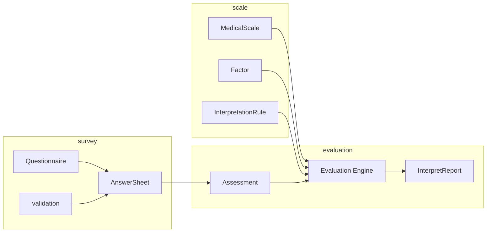
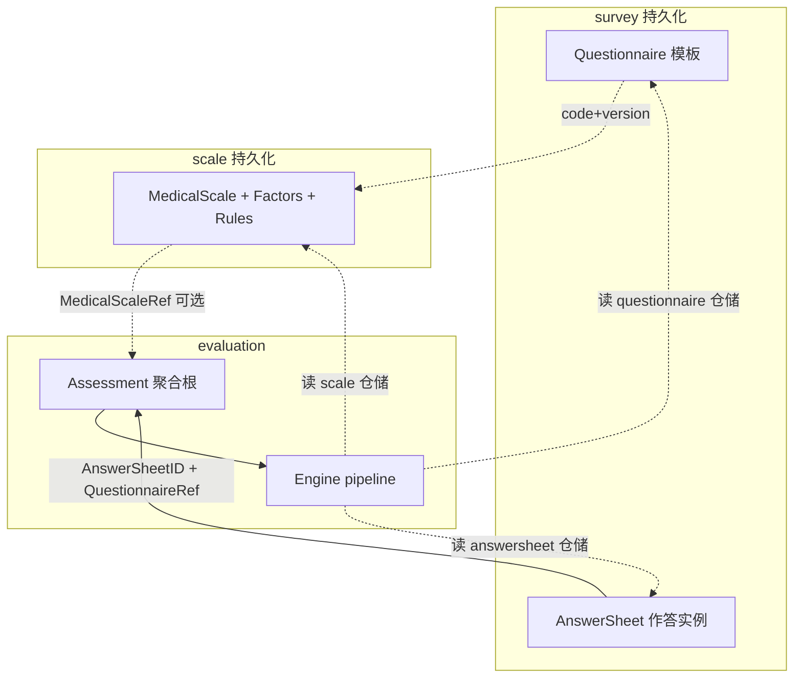

# 测评业务模型：survey、scale、evaluation 为什么分离

本文介绍 `qs-server` 最核心的业务设计：为什么系统会把测评拆成 `survey / scale / evaluation` 三段。

**与前后专题互参**：运行时主链路与事件见 [02-异步评估链路：从答卷提交到报告生成.md](./02-异步评估链路：从答卷提交到报告生成.md)；入口保护、下游背压与读侧缓存见 [03-保护层与读侧架构：限流、背压、缓存、统计预聚合.md](./03-保护层与读侧架构：限流、背压、缓存、统计预聚合.md)。evaluation 模块清单与接口边界见 [../02-业务模块/03-evaluation.md](../02-业务模块/03-evaluation.md)；总览见 [../00-总览/01-系统地图.md](../00-总览/01-系统地图.md)、[../00-总览/03-核心业务链路.md](../00-总览/03-核心业务链路.md)。

## 三分钟读毕（总表）

| 维度 | 一句话抓住重点 |
| ---- | ---------------- |
| **survey** | 管 **问卷模板 + 答卷事实**（作答不可变）；题型与校验扩展落在此域。 |
| **scale** | 管 **量表规则**（因子、计分、解读）；用问卷 code/version **绑定**采集模板，但不存某次测评结果。 |
| **evaluation** | 管 **一次测评实例**（`Assessment`、状态、报告）；引擎组合 **问卷/答卷/量表** 仓储产出结论，**不**反向定义问卷或量表结构。 |
| **三者关系** | 答卷与测评 **引用**（code+version）钉死时点；量表在评估时多按 **code 取当前配置**；异步与 MQ 见 [02](./02-异步评估链路：从答卷提交到报告生成.md)。 |
| **接口与流程真值** | 问卷/答卷的 API、版本与事件以 **[业务模块 survey](../02-业务模块/01-survey.md)** 为准（见下节）；evaluation 接口以 **[业务模块 evaluation](../02-业务模块/03-evaluation.md)** 为准。 |
| **还要往下读** | 需要 **代码路径、校验链、版本兼容、反模式** 时，跟目录走「代码锚点索引 → 三界咬合 → 问卷版本专节」。 |

## 与业务模块文档的单一真值声明

- **[../02-业务模块/01-survey.md](../02-业务模块/01-survey.md)** 是 **`survey` 域的单一真值**：问卷生命周期、答卷提交校验、REST/gRPC 面、事件名与配置键、与 `validation` 的衔接等，**以该文 + 代码为准**。  
- **[../02-业务模块/03-evaluation.md](../02-业务模块/03-evaluation.md)** 是 **`evaluation` 模块的单一真值**：测评/报告相关接口与订阅、与 worker 的边界等，**以该文 + 代码为准**。  
- **本篇（05-专题/01）**：只承担 **设计理由、对象边界、与 02/03 专题交叉视角**；若与业务模块文档在「接口或步骤」上不一致，**优先改本篇或加互链说明**，不在这里复制一份会过期的接口表。

## 开篇摘要（先读这几条）

1. **三界分工**：`survey` 管作答事实，`scale` 管量表/因子/计分/解读规则，`evaluation` 管一次测评实例（`Assessment`）与引擎产出的得分与报告。  
2. **与异步专题分工**：答卷提交与「建测评、跑引擎」的**时间解耦**在 [02](./02-异步评估链路：从答卷提交到报告生成.md)；本篇只建立**领域对象边界**，不展开 MQ/worker。  
3. **反模式**：把采集、规则、结果揉成「一个大测评模块」会污染扩展点与生命周期——见下文专节。  
4. **扩展落点**：题型与校验 → `survey`；因子与计分规则 → `scale`；流水线步骤 → `evaluation` engine。  
5. **核对**：领域命名与模块装配以代码与 [业务模块 `evaluation`](../02-业务模块/03-evaluation.md) 为准；本篇解释 **Why**，不替代接口表。更深一层的 **包级锚点、引用与校验、引擎 pipeline** 见下文「代码锚点索引」与「三界在代码里如何咬合」。  
6. **版本与历史答卷**：问卷版本递增规则在 `survey`；**答卷钉死提交时 version**；评估时 **`FindByCodeVersion`** 取历史模板，失败可降级；量表 **`FindByCode` 为当前配置**——见专节「问卷版本演进与已提交答卷的兼容策略」。

## 延伸阅读与互链

| 想核对什么 | 去哪里 |
| ---------- | ------ |
| 事件 Topic、`answersheet.submitted` → `EvaluateAssessment` 顺序 | [02](./02-异步评估链路：从答卷提交到报告生成.md) |
| 限流/缓存/统计预聚合与读路径 | [03](./03-保护层与读侧架构：限流、背压、缓存、统计预聚合.md) |
| evaluation 作为模块的 REST/gRPC、事件订阅 | [../02-业务模块/03-evaluation.md](../02-业务模块/03-evaluation.md) |
| 进程与模块在一页图上的位置 | [../00-总览/01-系统地图.md](../00-总览/01-系统地图.md) |
| 问卷版本、提交校验、答卷事件 | [../02-业务模块/01-survey.md](../02-业务模块/01-survey.md) |
| 专题内：版本与历史答卷/评估读路径 | 本篇 [问卷版本演进与已提交答卷的兼容策略](#问卷版本演进与已提交答卷的兼容策略) |

---

<!-- markdownlint-disable MD051 -->

## 目录

1. [三分钟读毕（总表）](#三分钟读毕总表)
2. [与业务模块文档的单一真值声明](#与业务模块文档的单一真值声明)
3. [开篇摘要（先读这几条）](#开篇摘要先读这几条)
4. [延伸阅读与互链](#延伸阅读与互链)
5. [30 秒了解系统](#30-秒了解系统)
6. [代码锚点索引（关注点）](#代码锚点索引关注点)
7. [核心架构](#核心架构)
8. [核心设计判断](#核心设计判断)
9. [三段式模型各自管理什么](#三段式模型各自管理什么)
10. [三界在代码里如何咬合（引用、校验与闭环）](#三界在代码里如何咬合引用校验与闭环)
11. [问卷版本演进与已提交答卷的兼容策略](#问卷版本演进与已提交答卷的兼容策略)
12. [为什么不做成一个“大测评模块”](#为什么不做成一个大测评模块)
13. [这种分离如何支撑扩展](#这种分离如何支撑扩展)
14. [关键设计点](#关键设计点)
15. [边界与注意事项](#边界与注意事项)

锚点以常见 Markdown 渲染器（如 GitHub）自动生成规则为准；若本地预览无法跳转，请用编辑器大纲视图导航。

<!-- markdownlint-enable MD051 -->

---

## 30 秒了解系统

`qs-server` 的核心不是“做问卷”，而是把一次作答转成一次可解释的测评结果。

为了完成这件事，系统把业务本体拆成三层：

- `survey`
  - 采集事实，管理问卷和答卷
- `scale`
  - 定义规则，管理因子、计分和解读配置
- `evaluation`
  - 产出结果，把事实和规则组合成测评、得分、风险等级和报告

这不是简单的目录拆分，而是业务语义上的边界划分；下文用 **代码锚点** 把「概念」落到 **包与类型**，便于与仓库对照。

## 代码锚点索引（关注点）

| 关注点 | 路径（相对 `internal/apiserver/`） | 说明 |
| ------ | ----------------------------------- | ---- |
| 问卷结构、题型工厂、版本递增规则 | [domain/survey/questionnaire](../../internal/apiserver/domain/survey/questionnaire)、[versioning.go](../../internal/apiserver/domain/survey/questionnaire/versioning.go) | 模板侧：题目与题型扩展；`Versioning` 约定草稿/发布与版本号 |
| 答卷聚合、作答事实 | [domain/survey/answersheet](../../internal/apiserver/domain/survey/answersheet) | 实例侧：一次作答 |
| 提交与校验编排 | [application/survey/answersheet/submission_service.go](../../internal/apiserver/application/survey/answersheet/submission_service.go) | 接入 `validation`、落库、发领域事件等 |
| 答案校验领域 | [domain/validation](../../internal/apiserver/domain/validation) | 与题型解耦的校验 |
| 量表聚合、问卷绑定字段 | [domain/scale/medical_scale.go](../../internal/apiserver/domain/scale/medical_scale.go) | `questionnaireCode` + `questionnaireVersion` 与因子列表同构 |
| 因子与解读规则 | [domain/scale/factor.go](../../internal/apiserver/domain/scale/factor.go) 等 | `questionCodes`、计分策略、规则 |
| 计分领域服务 | [domain/scale/scoring_service.go](../../internal/apiserver/domain/scale/scoring_service.go) | 规则侧计分，与引擎内因子聚合配合 |
| 量表仓储契约 | [domain/scale/repository.go](../../internal/apiserver/domain/scale/repository.go) | 含 `FindByQuestionnaireCode`（问卷→量表） |
| 测评聚合根、引用值对象 | [domain/evaluation/assessment/assessment.go](../../internal/apiserver/domain/evaluation/assessment/assessment.go)、[types.go](../../internal/apiserver/domain/evaluation/assessment/types.go) | `QuestionnaireRef` / `AnswerSheetRef` / `MedicalScaleRef` |
| 跨聚合创建 | [domain/evaluation/assessment/creator.go](../../internal/apiserver/domain/evaluation/assessment/creator.go) | `AssessmentCreator`：受试者、问卷、答卷、量表一致性 |
| 报告 | [domain/evaluation/report](../../internal/apiserver/domain/evaluation/report) | 解读结果载体 |
| 评估引擎与 pipeline | [application/evaluation/engine/service.go](../../internal/apiserver/application/evaluation/engine/service.go)、[pipeline/](../../internal/apiserver/application/evaluation/engine/pipeline/) | `buildPipeline` 顺序即运行时步骤 |
| 从答卷创建测评（worker 回调） | [interface/grpc/service/internal.go](../../internal/apiserver/interface/grpc/service/internal.go) | `CreateAssessmentFromAnswerSheet`：解析量表、写 `CreateAssessmentDTO` |

## 核心架构

上图强调**概念归属**；运行时还有一条「先落事实、再建测评、再跑引擎」的链：**答卷与问卷在 survey 侧持久化** → **按问卷编码解析量表规则（scale）** → **Assessment 只记引用** → **引擎按 assessmentId 拉齐问卷/答卷/量表仓储再算分与解读**。与 MQ/worker 的先后关系见 [02](./02-异步评估链路：从答卷提交到报告生成.md)。

## 核心设计判断

- 作答事实、评估规则和评估结果不是同一种业务对象，应该由不同模块管理。
- 问卷和量表之间可以绑定，但不能互相吞并，否则采集模型会被规则模型污染。
- 评估流程必须围绕 `Assessment` 这种流程对象展开，而不是直接在答卷或量表上生成结果。
- 可扩展点要分别落在各自边界里：题型扩展放在 `survey`，规则扩展放在 `scale`，评估流水线扩展放在 `evaluation`。

## 三段式模型各自管理什么

### survey：采集事实

`survey` 关心的是“用户回答了什么”，因此它负责：

- 问卷结构
- 题型定义
- 题目排序和生命周期
- 答案值构造
- 题目校验和答卷提交

它的核心对象是：

- `Questionnaire`
- `AnswerSheet`
- `AnswerValue`

这层最重要的特点是：它保存的是作答事实，不保存测评结论。

### scale：定义规则

`scale` 关心的是“这些答案应该如何被解释”，因此它负责：

- 问卷和量表的绑定关系
- 因子划分
- 每个因子的题目映射
- 计分策略和参数
- 分数区间到风险等级、结论、建议的映射

它的核心对象是：

- `MedicalScale`
- `Factor`
- `InterpretationRule`

这层保存的是规则定义，不保存任何一次具体测评的结果。

### evaluation：产出结果

`evaluation` 关心的是“一次测评经历了什么流程，最终产出了什么结果”，因此它负责：

- 从答卷创建 `Assessment`
- 管理测评状态流转
- 调用评估引擎
- 保存因子分、风险等级和报告
- 对外提供结果查询

它的核心对象是：

- `Assessment`
- `AssessmentScore`
- `InterpretReport`

这层保存的是一次测评实例及其结果，而不是问卷模板或量表规则。

## 三界在代码里如何咬合（引用、校验与闭环）

这一节回答：**领域上拆成三界之后，在创建测评与执行引擎时，代码如何把三者对齐**，避免停留在抽象口号。

### 1. 引用模型：Assessment 不内嵌问卷/量表聚合

[`Assessment`](../../internal/apiserver/domain/evaluation/assessment/assessment.go) 对 `survey` / `scale` 侧使用的是 **值对象引用**（`QuestionnaireRef`、`AnswerSheetRef`、可选的 `MedicalScaleRef`），注释中写明了「关联实体引用，不直接持有对象」。这样：

- **持久化与生命周期**仍由各聚合根的仓储管理；
- **测评**只表达「这一次测评指向谁」，而不是复制一份问卷树或量表树。

[`MedicalScale`](../../internal/apiserver/domain/scale/medical_scale.go) 则在量表聚合上持有 **问卷编码 + 版本**（`WithQuestionnaire` / `GetQuestionnaireCode` 等），表达的是**规则侧**对采集模板的绑定，与 `Assessment` 上的引用是**不同方向**：前者服务「量表配置」，后者服务「一次测评实例」。

### 2. 问卷 → 量表：仓储解析，而非问卷上长量表子树

内部 gRPC [`CreateAssessmentFromAnswerSheet`](../../internal/apiserver/interface/grpc/service/internal.go) 在创建测评前会调用 `scaleRepo.FindByQuestionnaireCode(ctx, req.QuestionnaireCode)`：

- 若找到量表，则把 **量表 ID/code/name** 填入 `CreateAssessmentDTO`，后续写入 `Assessment` 的 `MedicalScaleRef`；
- 若**未找到**（`err != nil` 或 `medicalScale == nil`），日志会说明 **「问卷未关联量表，将创建纯问卷模式的测评」**，此时 `MedicalScaleID` 等保持为空，即 **测评可以存在「无量表」模式**——这是三界模型在实现上的重要边界：**没有规则层 ≠ 不能建测评**，但 **引擎侧**能否走完整因子/解读链路由 pipeline 与数据是否齐全决定。

### 3. 创建测评时的跨聚合校验（AssessmentCreator）

[`DefaultAssessmentCreator.validate`](../../internal/apiserver/domain/evaluation/assessment/creator.go) 按顺序串起 **actor / survey / evaluation** 的约束（与「三界」对应的是问卷、答卷、量表三段）：

1. **受试者**存在（`testee` 域，测评对象）  
2. **问卷**存在且已发布（`QuestionnaireRef`）  
3. **答卷**存在且属于该问卷（`AnswerSheetRef` + `BelongsToQuestionnaire`）  
4. 若传了 **量表引用**，则量表存在且 **`IsLinkedToQuestionnaire`** 与当前问卷引用一致  

因此「量表绑定在 `MedicalScale` 上」与「创建测评时仍要校验链接」是两层：**配置层**可以改绑定，**创建测评**时仍要防止 DTO 与真实绑定不一致。  
另：**[`SimpleAssessmentCreator`](../../internal/apiserver/domain/evaluation/assessment/creator.go)** 跳过跨聚合校验，仅用于测试或上层已保证一致性的场景——文档读者若看到测试代码路径，勿与生产默认路径混淆。

### 4. 评估引擎：单进程内同时依赖问卷、答卷、量表仓储

[`engine.NewService`](../../internal/apiserver/application/evaluation/engine/service.go) 注入 `assessmentRepo`、`scoreRepo`、`reportRepo`、**`scaleRepo`**、**`answerSheetRepo`**、**`questionnaireRepo`** 等；[`buildPipeline`](../../internal/apiserver/application/evaluation/engine/service.go) 组装的职责链与领域含义大致为：

| 顺序 | 处理器 | 作用（语义） |
| ---- | ------ | ------------- |
| 1 | `ValidationHandler` | 引擎内前置校验 |
| 2 | `FactorScoreHandler` | 因子分（从答卷与规则聚合） |
| 3 | `RiskLevelHandler` | 风险等级并写分数仓储 |
| 4 | `InterpretationHandler` | 解读与报告 |
| 5 | `EventPublishHandler` | 发布领域/应用事件（无 `eventPublisher` 时仍可依赖仓储侧行为，见代码注释） |

这说明 **evaluation 运行时**并不是「只读 Assessment 一张表」，而是**显式组合**三界数据；三界拆分避免的是**模型污染与错误扩展点**，不是「引擎不访问其它域」。

### 5. 与专题 02 的分工

- **本篇**写到：**对象边界、引用、创建时校验、引擎依赖**。  
- **异步边界**（何时 gRPC 创建测评、何时 `EvaluateAssessment`、NSQ topic）见 [02](./02-异步评估链路：从答卷提交到报告生成.md)，此处不重复。

## 问卷版本演进与已提交答卷的兼容策略

「三界」拆开后，**版本**主要压在 `survey.Questionnaire` 上；已提交答卷与后续评估能否与**新版问卷/量表**共存，要看代码里**三处读路径**如何取数。

### 1. 问卷版本号从哪来（领域约定）

[`questionnaire.Versioning`](../../internal/apiserver/domain/survey/questionnaire/versioning.go) 注释中约定的规则可概括为：

- 新建初始化：**`0.0.1`**
- **存草稿**：小版本递增（如 `0.0.1 → 0.0.2`，`1.0.5 → 1.0.6`）
- **发布**：大版本递增并重置为 **`x.0.1`**（如 `0.0.x → 1.0.1`，`1.0.x → 2.0.1`）

具体何时调用 `IncrementMinorVersion` / `IncrementMajorVersion` 在应用服务与聚合方法中衔接，细节可与 [业务模块 survey](../02-业务模块/01-survey.md) 对照。

### 2. 已提交答卷：不可变 + 钉死「当时」的 code / version

[`AnswerSheet`](../../internal/apiserver/domain/survey/answersheet/answersheet.go) 注释写明 **答卷不可修改**；其 [`QuestionnaireRef`](../../internal/apiserver/domain/survey/answersheet/types.go) 含 **`code`、`version`、`title`**，且 `Validate()` 要求 **version 非空**。  
因此：**兼容策略的第一条**是——历史作答的解释应以卷面上携带的 **`(questionnaire_code, questionnaire_version)`** 为准，而不是以后台「当前最新问卷」为准。

[`Assessment`](../../internal/apiserver/domain/evaluation/assessment/assessment.go) 上的 `QuestionnaireRef` 与创建测评请求中的版本字段，与上述答卷引用一致，用于在测评域固定**同一次业务闭环**内的问卷版本。

### 3. 提交时：按 code 取问卷，再与客户端声明版本对齐

[`fetchAndValidateQuestionnaire`](../../internal/apiserver/application/survey/answersheet/submission_service.go) 使用 **`FindByCode`** 加载问卷，再取 **`qnr.GetVersion()`** 与 DTO 中的 `QuestionnaireVer` 比较：

- 若客户端未传版本，则用**当前库里的问卷版本**并写回 DTO（日志为「使用最新问卷版本」）；
- 若传了版本且与当前库不一致，则 **拒绝提交**（「问卷版本不匹配」）。

含义：**提交时刻**只允许在「客户端声明的版本」与「`FindByCode` 所指向的那份问卷文档的版本字段」一致时落卷；运营发布新版本后，旧版客户端若仍声明旧版本，会提交失败。  
（`FindByCode` 的 Mongo 实现仅按 `code` 过滤；若存储上同一 `code` 允许多文档并存，需由数据与运维策略保证「按 code 查询」与产品语义一致，否则会出现非预期匹配。）

### 4. 评估时：按答卷上的 version 取问卷；失败则降级

[`engine` 评估入口](../../internal/apiserver/application/evaluation/engine/service.go) 在加载答卷后，用 **`answerSheet.QuestionnaireInfo()`** 得到 `qCode`、`qVersion`，再调用 **`questionnaireRepo.FindByCodeVersion(ctx, qCode, qVersion)`**。

- **成功**：把完整问卷（含题目列表）放进 `evalCtx.Questionnaire`，供需要题目结构或 `question_count` 的规则使用。  
- **失败**：代码 **不中断评估**，将 `Questionnaire` 置为 **`nil`**，并打日志说明 **「加载问卷失败，将使用降级计分策略」**（注释写明：无法使用 **cnt 等高级计分规则**）。

因此：**历史版本问卷文档若仍可按 `(code, version)` 查到，则评估与提交时结构一致；若已被删除或合并导致查不到，评估仍可能继续，但依赖问卷结构的计分能力会削弱。** 是否接受这种降级属于**产品与质控**决策，而非领域层自动「迁移答卷」。

### 5. 量表：按 scale **code** 取「当前」配置；校验不比问卷 **version**

同一评估流程里，量表通过 **`scaleRepo.FindByCode(scaleCode)`** 加载，即 **始终读取当前持久化的 `MedicalScale`**（含当前因子、`questionCodes`、以及量表上绑定的 `questionnaireCode` / `questionnaireVersion` 字段）。

[`ValidationHandler.validateMedicalScale`](../../internal/apiserver/application/evaluation/engine/pipeline/validation.go) 只校验量表与测评的 **问卷编码** 一致（`GetQuestionnaireCode()` vs `Assessment.QuestionnaireRef().Code()`），**不**校验「量表上登记的问卷版本」与「答卷/测评上的问卷版本」是否一致。

**策略含义（代码事实）**：

- **问卷模板**：可通过 `FindByCodeVersion` **尽量对齐提交时刻**（在数据仍在库中的前提下）。  
- **量表规则**：评估运行用的是 **量表 code 对应的最新规则**；若运营修改了因子题目映射或量表绑定的问卷版本，**历史答卷上的题目编码**仍可能与**新规则**不一致，引擎层**没有**自动版本对齐或回滚量表配置——需在运营流程上控制「breaking 变更」，或接受计分/解读异常风险。

### 6. 小结表

| 阶段 | 问卷怎么取 | 量表怎么取 | 对已提交答卷的「兼容」含义 |
| ---- | ---------- | ---------- | -------------------------- |
| 提交 | `FindByCode` + 与 DTO 版本对齐 | （本阶段不加载量表聚合） | 只允许与**当前库中该 code 文档版本**一致的提交 |
| 评估 | `FindByCodeVersion(答卷上的 version)`，失败则问卷 `nil` | `FindByCode` → **当前**量表行 | 卷面版本可追溯到**历史问卷文档**；量表为**当前态**，与历史版本无硬绑定校验 |

更细的问卷生命周期与 REST 行为见 [01-survey](../02-业务模块/01-survey.md)。

## 为什么不做成一个“大测评模块”

如果把三层强行合成一个“大测评模块”，系统会立刻失去三个关键边界。

第一，采集模型会被规则模型污染。  
问卷结构、答案值和题型扩展会被因子、风险等级、结论文案这些概念反向侵入。

第二，规则模型会被实例结果污染。  
一次评估产生的 `Assessment / Report` 会和长期存在的 `MedicalScale` 混在一起，生命周期无法分离。

第三，扩展点会变得模糊。  
新增题型、新增计分策略、新增解读规则、新增评估步骤，看起来都像在改同一个大对象，最终会把核心模型改成一团条件分支。

当前三段式分离的目的，就是让这三种变化各自落在自己的边界里。

## 这种分离如何支撑扩展

### 题型和答案扩展落在 survey

`survey` 当前已经把题型扩展和答案校验拆开：

- 题型通过注册器和工厂扩展
  - [../../internal/apiserver/domain/survey/questionnaire/factory.go](../../internal/apiserver/domain/survey/questionnaire/factory.go)
- 答案校验通过独立 `validation` 领域执行
  - [../../internal/apiserver/domain/validation/validator.go](../../internal/apiserver/domain/validation/validator.go)
- 答案值通过适配层进入校验体系
  - [../../internal/apiserver/application/survey/answersheet/submission_service.go](../../internal/apiserver/application/survey/answersheet/submission_service.go)

这说明“新增题型”和“新增校验规则”并不是同一件事，也不应该落在同一个对象里。

### 规则扩展落在 scale

`scale` 当前把“题目如何聚成因子”和“因子如何解释”拆成了两层：

- `Factor.questionCodes` 决定聚合哪些题目
- `Factor.scoringStrategy` 和 `scoringParams` 决定如何计分
- `InterpretationRule` 决定分数如何映射成风险等级和文案

因此新增规则时，系统优先改的是量表配置层，而不是答卷或报告层。

### 流程扩展落在 evaluation

`evaluation` 当前通过 [`buildPipeline`](../../internal/apiserver/application/evaluation/engine/service.go) 组装的职责链推进评估，**顺序以代码为准**，典型为：

1. `ValidationHandler` — 前置校验  
2. `FactorScoreHandler` — 因子分  
3. `RiskLevelHandler` — 风险等级并持久化分数  
4. `InterpretationHandler` — 解读与报告  
5. `EventPublishHandler` — 事件发布（可带 `WaiterRegistry` 等选项）

链的抽象见 [pipeline/chain.go](../../internal/apiserver/application/evaluation/engine/pipeline/chain.go)（`Chain.AddHandler` / `Execute`）。

这意味着新增一个评估步骤时，优先 **在 `pipeline` 增加 Handler 并挂入 `buildPipeline`**，而不是去扩展 `AnswerSheet` 或 `MedicalScale` 聚合上的字段来「凑流程」。

## 关键设计点

### 1. survey 保存事实，不保存结论

`AnswerSheet` 可以拥有答案和**与作答相关的中间结果**（若业务上需要），但 **风险等级、结构化解读结论、报告正文** 的职责在 `evaluation`（及报告子域），避免采集层被「医学解释」污染。

### 2. scale 保存规则，不保存实例

`MedicalScale` 可被多次测评复用；因子与解读规则描述的是 **模板级** 配置。一次测评的得分与报告应落在 **Assessment / Score / Report** 等实例侧，而不是回写到量表聚合上。

### 3. evaluation 保存流程和结果，不反向定义问卷或量表

`Assessment`、`InterpretReport` 建立在 **已有** 问卷与量表之上；测评聚合不负责「改题」或「改因子定义」。若业务要改版问卷或量表，应走 **survey/scale 各自** 的发布与版本策略，再与新建测评实例衔接。

### 4. `MedicalScaleRef` 可选：存在「纯问卷测评」路径

实现上允许 **不解析到量表** 仍创建 `Assessment`（见 `CreateAssessmentFromAnswerSheet`）；是否有完整计分/解读取决于 pipeline 与数据是否齐全。不要把「必须有量表」当成领域恒真式——除非产品层强制。

### 5. 跨聚合校验与「简单创建器」

生产路径应假设 **`DefaultAssessmentCreator` + validate**；`SimpleAssessmentCreator` 是刻意削弱的替身，文档与代码评审时需区分。

## 边界与注意事项

- **绑定键**：`survey` 与 `scale` 的关联在量表聚合上体现为 **问卷编码 + 版本**（见 `MedicalScale`）；`Assessment` 上则体现为 **引用**。两套表述服务不同生命周期，勿混为「问卷里嵌量表 ID」单一结构。
- **evaluation 读多域**：引擎会读问卷/答卷/量表仓储；**拆分 ≠ 引擎只能看 Assessment 一张表**，拆分的是**聚合边界与扩展点**，不是「禁止 join 多个仓储」。
- **worker 与 gRPC**：从答卷创建测评常由异步链路触发（见 [02](./02-异步评估链路：从答卷提交到报告生成.md)），但**领域关系**仍由本节描述；不要在文档里把「异步」与「三界」混成同一维度。
- **`actor`、`plan`、`statistics`**：对主链路很重要，但不是「测评本体三界」的一部分；它们更像 **受试者/计划/报表** 协作模块，与 [业务模块文档](../02-业务模块/) 对齐即可。
- **与基础设施文档**：缓存、限流、事件总线等见 [../03-基础设施/](../03-基础设施/) 与 [03-保护层与读侧架构](./03-保护层与读侧架构：限流、背压、缓存、统计预聚合.md)；本篇不展开。

---

*写作约定见 [CONTRIBUTING-DOCS.md](../CONTRIBUTING-DOCS.md)。*
