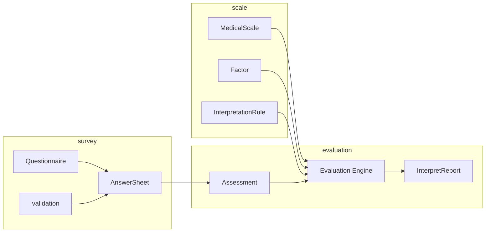

# 测评业务模型：survey、scale、evaluation 为什么分离

本文介绍 `qs-server` 最核心的业务设计：为什么系统会把测评拆成 `survey / scale / evaluation` 三段。

## 30 秒了解系统

`qs-server` 的核心不是“做问卷”，而是把一次作答转成一次可解释的测评结果。

为了完成这件事，系统把业务本体拆成三层：

- `survey`
  - 采集事实，管理问卷和答卷
- `scale`
  - 定义规则，管理因子、计分和解读配置
- `evaluation`
  - 产出结果，把事实和规则组合成测评、得分、风险等级和报告

这不是简单的目录拆分，而是业务语义上的边界划分。

核心代码入口：

- [../../internal/apiserver/domain/survey/questionnaire](../../internal/apiserver/domain/survey/questionnaire)
- [../../internal/apiserver/domain/survey/answersheet](../../internal/apiserver/domain/survey/answersheet)
- [../../internal/apiserver/domain/validation](../../internal/apiserver/domain/validation)
- [../../internal/apiserver/domain/scale/medical_scale.go](../../internal/apiserver/domain/scale/medical_scale.go)
- [../../internal/apiserver/domain/scale/factor.go](../../internal/apiserver/domain/scale/factor.go)
- [../../internal/apiserver/domain/scale/scoring_service.go](../../internal/apiserver/domain/scale/scoring_service.go)
- [../../internal/apiserver/domain/evaluation/assessment/assessment.go](../../internal/apiserver/domain/evaluation/assessment/assessment.go)
- [../../internal/apiserver/domain/evaluation/report/report.go](../../internal/apiserver/domain/evaluation/report/report.go)
- [../../internal/apiserver/application/evaluation/engine/service.go](../../internal/apiserver/application/evaluation/engine/service.go)

## 核心架构

## 核心设计判断

- 作答事实、评估规则和评估结果不是同一种业务对象，应该由不同模块管理。
- 问卷和量表之间可以绑定，但不能互相吞并，否则采集模型会被规则模型污染。
- 评估流程必须围绕 `Assessment` 这种流程对象展开，而不是直接在答卷或量表上生成结果。
- 可扩展点要分别落在各自边界里：题型扩展放在 `survey`，规则扩展放在 `scale`，评估流水线扩展放在 `evaluation`。

## 三段式模型各自管理什么

### survey：采集事实

`survey` 关心的是“用户回答了什么”，因此它负责：

- 问卷结构
- 题型定义
- 题目排序和生命周期
- 答案值构造
- 题目校验和答卷提交

它的核心对象是：

- `Questionnaire`
- `AnswerSheet`
- `AnswerValue`

这层最重要的特点是：它保存的是作答事实，不保存测评结论。

### scale：定义规则

`scale` 关心的是“这些答案应该如何被解释”，因此它负责：

- 问卷和量表的绑定关系
- 因子划分
- 每个因子的题目映射
- 计分策略和参数
- 分数区间到风险等级、结论、建议的映射

它的核心对象是：

- `MedicalScale`
- `Factor`
- `InterpretationRule`

这层保存的是规则定义，不保存任何一次具体测评的结果。

### evaluation：产出结果

`evaluation` 关心的是“一次测评经历了什么流程，最终产出了什么结果”，因此它负责：

- 从答卷创建 `Assessment`
- 管理测评状态流转
- 调用评估引擎
- 保存因子分、风险等级和报告
- 对外提供结果查询

它的核心对象是：

- `Assessment`
- `AssessmentScore`
- `InterpretReport`

这层保存的是一次测评实例及其结果，而不是问卷模板或量表规则。

## 为什么不做成一个“大测评模块”

如果把三层强行合成一个“大测评模块”，系统会立刻失去三个关键边界。

第一，采集模型会被规则模型污染。  
问卷结构、答案值和题型扩展会被因子、风险等级、结论文案这些概念反向侵入。

第二，规则模型会被实例结果污染。  
一次评估产生的 `Assessment / Report` 会和长期存在的 `MedicalScale` 混在一起，生命周期无法分离。

第三，扩展点会变得模糊。  
新增题型、新增计分策略、新增解读规则、新增评估步骤，看起来都像在改同一个大对象，最终会把核心模型改成一团条件分支。

当前三段式分离的目的，就是让这三种变化各自落在自己的边界里。

## 这种分离如何支撑扩展

### 题型和答案扩展落在 survey

`survey` 当前已经把题型扩展和答案校验拆开：

- 题型通过注册器和工厂扩展
  - [../../internal/apiserver/domain/survey/questionnaire/factory.go](../../internal/apiserver/domain/survey/questionnaire/factory.go)
- 答案校验通过独立 `validation` 领域执行
  - [../../internal/apiserver/domain/validation/validator.go](../../internal/apiserver/domain/validation/validator.go)
- 答案值通过适配层进入校验体系
  - [../../internal/apiserver/application/survey/answersheet/submission_service.go](../../internal/apiserver/application/survey/answersheet/submission_service.go)

这说明“新增题型”和“新增校验规则”并不是同一件事，也不应该落在同一个对象里。

### 规则扩展落在 scale

`scale` 当前把“题目如何聚成因子”和“因子如何解释”拆成了两层：

- `Factor.questionCodes` 决定聚合哪些题目
- `Factor.scoringStrategy` 和 `scoringParams` 决定如何计分
- `InterpretationRule` 决定分数如何映射成风险等级和文案

因此新增规则时，系统优先改的是量表配置层，而不是答卷或报告层。

### 流程扩展落在 evaluation

`evaluation` 当前通过引擎流水线推进评估：

- `validation`
- `factor_score`
- `risk_level`
- `interpretation`
- `event_publish`

入口见：

- [../../internal/apiserver/application/evaluation/engine/service.go](../../internal/apiserver/application/evaluation/engine/service.go)
- [../../internal/apiserver/application/evaluation/engine/pipeline/chain.go](../../internal/apiserver/application/evaluation/engine/pipeline/chain.go)

这意味着新增一个评估步骤时，优先改的是引擎流水线，而不是去扩展答卷模型或量表模型。

## 关键设计点

### 1. survey 保存事实，不保存结论

`AnswerSheet` 可以拥有答案和分数，但它不应承担风险等级、解读结论和报告生成职责。那是 `evaluation` 的工作。

### 2. scale 保存规则，不保存实例

`MedicalScale` 可以被很多次测评复用，因此它应该只关心“规则是什么”，不关心“某个人这次测出来是什么结果”。

### 3. evaluation 保存流程和结果，不反向定义问卷或量表

`Assessment` 和 `InterpretReport` 都建立在已有的答卷和量表之上，它们不负责重新定义题目结构，也不负责修改量表规则。

## 边界与注意事项

- `survey` 和 `scale` 会通过“问卷编码 + 版本”发生绑定，但两者仍然是两个独立业务边界。
- `evaluation` 会读取量表规则并消费答卷事实，但不直接持有问卷或量表聚合本体。
- `actor`、`plan`、`statistics` 都很重要，但它们不是这条业务本体的第一核心；它们更像围绕主测评模型协作的其他模块。
