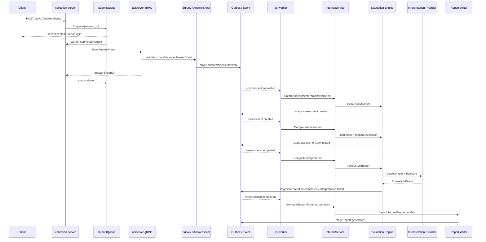

# 02-为什么同步提交但异步测评执行

**本文回答**：为什么 qs-server 的答卷提交链路要“同步确认答卷事实”，但 Assessment 创建、解释模型执行、结果保存、报告生成要“异步推进”；为什么不能让前台提交请求一直等到报告生成；这个设计如何与 collection-server、SubmitQueue、SubmitGuard、Outbox、Worker、Internal gRPC、Evaluation Engine、Interpretation Provider 协作。

---

## 30 秒结论

| 阶段 | 同步 / 异步 | 目标 |
| ---- | ----------- | ---- |
| 前台接收提交 | 同步 | 快速校验请求、认证、监护关系、限流、受理 |
| collection SubmitQueue | 异步受理 | 在 collection-server 内削峰，返回 `202 + request_id` |
| apiserver 保存 AnswerSheet | 同步 | 确定答卷事实已经持久化 |
| `answersheet.submitted` | 异步 | 将“答卷已提交”传递给测评执行链路 |
| `assessment.created` | 异步 | 基于答卷事实创建一次 Assessment |
| `assessment.completed` | 异步 | 完成 Evaluation 层的测评执行阶段 |
| `interpretation.completed / failed` | 异步 | 通过 Interpretation Provider 执行 Scale / MBTI / BigFive 等模型 |
| `report.generated` | 异步 | 保存 InterpretReport 并触发后续投影、通知、统计 |
| 前台查报告 | 异步查询 / 长轮询 | 通过 submit-status / wait-report 感知报告是否完成 |

一句话概括：

> **同步提交保证“作答事实不会丢”，异步测评执行保证“解释模型执行和报告生成不拖垮提交体验”。**

更准确地说，qs-server 的提交不是完全同步，也不是完全异步，而是分成两段：

```text
前台请求 -> 同步 / 排队保存 AnswerSheet
AnswerSheet saved -> 异步推进 Assessment / Interpretation / Report
```

这是一种 **事实先落库，结果后计算** 的设计。

---

## 1. 这个问题本质上是在分离两类 SLA

答卷提交和测评报告的 SLA 完全不同。

### 1.1 提交 SLA

用户点击“提交”时，系统必须尽快给出确定反馈：

- 请求是否被接收。
- 答案是否合法。
- 用户是否有权限为该受试者提交。
- 答卷是否已经保存。
- 如果被排队，`request_id` 是什么。
- 如果队列满，是否返回 429。
- 如果重复提交，是否复用已有结果或提示进行中。

这类 SLA 的核心是：

```text
快、确定、可重试、不能丢答案
```

提交链路的首要目标不是生成报告，而是形成可靠的 AnswerSheet 事实。

---

### 1.2 测评执行 SLA

测评执行涉及：

- 加载 AnswerSheet。
- 加载 Questionnaire snapshot。
- 创建 Assessment。
- 解析 ModelRef。
- 根据 `model_type` 解析 Interpretation Provider。
- 加载 Provider Context。
- 执行 Scale / MBTI / BigFive 等解释模型。
- 保存 EvaluationResult。
- 生成 InterpretReport。
- 写 MySQL / Mongo / Outbox。
- 通知等待报告的请求。
- 触发统计投影、标签回写、行为投影等副作用。

这类 SLA 的核心是：

```text
可最终完成、可失败记录、可重试、可观测
```

它不适合卡在前台提交请求里。

---

## 2. 当前推荐链路总图



注意：客户端拿到 `202 accepted` 并不代表测评完成；它只代表提交请求已被 collection 受理。后续可以用 `submit-status` 或 `wait-report` 查询。

---

## 3. 为什么 AnswerSheet 保存必须同步确认

异步测评执行的前提是：必须先有一个可靠的业务事实。

这个事实就是：

```text
AnswerSheet 已经保存
```

如果连 AnswerSheet 保存都异步，前台就会面临几个无法接受的问题：

| 问题 | 后果 |
| ---- | ---- |
| 用户提交后无法知道答案是否保存 | 用户反复提交 |
| 网络断开后无法确认状态 | 客户端无法重试 |
| 后续失败时不知道是没保存还是没生成报告 | 排障困难 |
| worker 可能处理不存在的答卷 | 异步链路复杂化 |
| 幂等 key 无法稳定落地 | 重复提交难治理 |

所以系统必须先把 AnswerSheet 作为事实源持久化，然后才谈异步测评执行。

核心边界是：

```text
AnswerSheet saved
answersheet.submitted staged
```

而不是：

```text
Report generated
```

---

## 4. 为什么测评执行不能同步卡在提交请求里

如果把测评执行也同步执行，提交链路会变成：

```text
POST /answersheets
  -> 保存答卷
  -> 创建 Assessment
  -> 加载 Questionnaire / AnswerSheet
  -> 解析 ModelRef
  -> 加载 Scale / MBTI / BigFive 等模型规则
  -> 加载 Provider Context
  -> 执行 Interpretation Provider
  -> 保存 EvaluationResult
  -> 生成 InterpretReport
  -> 写 Outbox
  -> 返回报告
```

这会带来明显风险。

### 4.1 延迟不可控

测评链路包含多个下游依赖：

- MySQL。
- MongoDB。
- Redis cache。
- 具体模型规则读取。
- Provider Context 加载。
- 报告文档写入。
- Outbox。
- Waiter notification。

任意一个依赖慢，都会拖慢用户提交请求。

---

### 4.2 失败面扩大

同步提交原本只需要处理：

- 参数错误。
- 权限错误。
- 答案校验错误。
- 存储错误。

同步测评后，还要处理：

- ModelRef 不存在。
- Provider 找不到。
- Context 加载失败。
- 问卷版本不匹配。
- 规则无效。
- Scale 因子规则错误。
- MBTI TypeProfile 缺失。
- 报告保存失败。
- Evaluation 状态机失败。
- Waiter notification 失败。

这会让“提交答卷”变成一个巨大的事务。

---

### 4.3 高峰下容易雪崩

前台提交是高峰入口。

如果每个提交请求都同步跑完整测评，会把：

- collection goroutine。
- apiserver gRPC。
- MySQL connection。
- Mongo session。
- Redis。
- Provider CPU。
- Report writer。

全部绑定在一次用户请求里。

提交量上来时，系统没有削峰空间。

---

### 4.4 重试语义混乱

如果同步测评中途失败，用户重试时到底应该：

- 重新保存 AnswerSheet？
- 复用 AnswerSheet？
- 重新创建 Assessment？
- 继续上次 EvaluationRun？
- 重新执行 Provider？
- 重新生成 Report？

这些都需要状态机和幂等治理。

与其在提交请求里处理，不如把它们收口到 Evaluation 异步流程。

---

## 5. collection-server 的角色：先削峰，再同步保存

collection-server 并不是把一切都异步丢出去。

它承担的是前台保护层。

### 5.1 SubmitQueue 负责前台削峰

SubmitQueue 是 collection-server 进程内 bounded queue：

```text
jobs chan submitJob
statuses requestID -> queued / processing / done / failed
workerPool
```

入队成功：

```text
queue_accepted
status=queued
返回 202 + request_id
```

队列满：

```text
queue_full
返回 ErrQueueFull / HTTP 429
```

这让前台入口具备削峰能力。

---

### 5.2 SubmitQueue 不是业务最终异步化

SubmitQueue 只是 collection 进程内削峰。

队列 worker 仍然会调用：

```text
submitWithGuard
  -> submitSync
  -> apiserver SaveAnswerSheet
```

也就是说，SubmitQueue 不替代 AnswerSheet durable save，它只是把“前台请求线程”与“提交处理 worker”解耦。

---

### 5.3 为什么 SubmitQueue 返回 202

因为请求已经被 collection 接收，但还没有保证 AnswerSheet 已保存。

所以正确语义是：

```text
accepted
```

而不是：

```text
created
```

前台要通过 `request_id` 查询状态。

---

## 6. SubmitGuard 的角色：跨实例幂等与进行中抑制

collection 的 SubmitQueue 是进程内的。

多实例时，仅靠 requestID 本地状态不够。

所以后面还有 SubmitGuard：

```text
done marker
+
in-flight lease
```

### 6.1 done marker

如果同一个 idempotency key 已经完成：

```text
返回 already submitted + answerSheetID
```

### 6.2 in-flight lease

如果同一个 key 正在提交：

```text
ResourceExhausted: submit already in progress
```

### 6.3 为什么它不负责测评执行

SubmitGuard 保护的是：

```text
答卷提交
```

不是：

```text
Assessment 执行
Interpretation Provider 执行
Report 生成
```

测评幂等应由：

- Assessment 状态机。
- EvaluationRun。
- Result / Report 唯一约束。
- worker duplicate suppression。
- Outbox checkpoint。
- Evaluation 自身重试策略。

共同兜底。

---

## 7. Survey 的同步职责：校验并保存 AnswerSheet

apiserver 的 Survey SubmissionService 做的是提交事实确认：

1. 校验 DTO。
2. 加载 Questionnaire。
3. 构建 AnswerValue。
4. 批量校验答案。
5. 创建 AnswerSheet。
6. 保存 AnswerSheet。
7. stage `answersheet.submitted`。
8. 返回 AnswerSheetResult。

这个链路的价值在于：

```text
用户提交的答案被可靠保存
```

不是：

```text
用户报告已经生成
```

这就是同步边界。

---

## 8. Event / Outbox 的角色：连接同步事实和异步处理

AnswerSheet 保存之后，需要通知后续 Evaluation。

直接同步调用 Evaluation 不合适，所以需要事件：

```text
answersheet.submitted
```

更进一步，事件不能只是 best-effort fire-and-forget，否则可能出现：

```text
AnswerSheet 已保存
但事件丢了
Evaluation 永远不执行
```

因此需要 Outbox：

```text
保存 AnswerSheet
  -> stage answersheet.submitted
  -> relay publish
  -> worker consume
```

这正是“同步提交但异步测评执行”的可靠连接点。

后续事件继续按照阶段事实推进：

```text
answersheet.submitted
  -> assessment.created
  -> assessment.completed
  -> interpretation.completed / interpretation.failed
  -> report.generated
```

这些事件表达的是阶段事实，不绑定具体解释模型。

Scale、MBTI、BigFive 等模型都通过 Interpretation Provider 接入，而不是让事件系统理解模型内部算法。

---

## 9. Worker 的角色：事件驱动执行后续处理

worker 消费事件后，只做一件事：

```text
按事件阶段调用 apiserver internal service
```

它不直接写业务主表，不直接执行具体模型算法。

### 9.1 处理 `answersheet.submitted`

```text
answersheet.submitted
  -> answersheet_submitted_handler
  -> CreateAssessmentFromAnswerSheet
  -> stage assessment.created
```

这一阶段把 Survey 的 AnswerSheet 事实转为 Evaluation 的 Assessment 执行事实。

---

### 9.2 处理 `assessment.created`

```text
assessment.created
  -> assessment_created_handler
  -> CompleteAssessment
  -> stage assessment.completed
```

这一阶段完成 Evaluation 层的测评准备与执行推进。

---

### 9.3 处理 `assessment.completed`

```text
assessment.completed
  -> assessment_completed_handler
  -> CompleteInterpretation
  -> resolve ModelRef
  -> Provider.LoadContext
  -> Provider.Evaluate
  -> stage interpretation.completed / interpretation.failed
```

这一阶段才进入具体解释模型。

关键点：

```text
Worker 不关心 Provider 内部是 Scale、MBTI 还是 BigFive；
Worker 只负责消费事件并调用 InternalService。
```

---

### 9.4 处理 `interpretation.completed`

```text
interpretation.completed
  -> interpretation_completed_handler
  -> GenerateReportFromInterpretation
  -> Save InterpretReport durably
  -> stage report.generated
```

这一阶段负责报告生成和报告事实保存。

---

## 10. Evaluation Engine 的角色：慢任务和复杂任务后移

Evaluation Engine 承载的是一次 Assessment 的执行生命周期。

它可能包含：

- Input loading。
- ModelRef 解析。
- Provider resolving。
- Context loading。
- Provider evaluation。
- EvaluationResult 保存。
- InterpretReport 生成。
- EvaluationRun 记录。
- Failure / Retry。
- Waiter notify。

这是一条复杂链路，适合异步执行。

### 10.1 为什么适合异步

| 特征 | 说明 |
| ---- | ---- |
| 多步骤 | 创建 Assessment、加载模型、执行 Provider、生成报告 |
| 多存储 | MySQL + Mongo + Outbox |
| 可重试 | EvaluationRun 可记录失败和重试 |
| 可观察 | event / worker / report status 可查 |
| 非即时交互必需 | 用户提交后可以等待报告 |
| 模型差异大 | Scale / MBTI / BigFive 的计算逻辑不同 |
| 复杂度高 | 不适合塞进提交事务 |

---

## 11. 用户体验如何保证

异步测评执行不等于用户体验差。

关键是设计正确的交互协议。

### 11.1 提交阶段

前台收到：

```text
202 accepted
request_id
status=queued
```

或：

```text
429 queue full / rate limited
```

或：

```text
validation error
permission error
```

---

### 11.2 提交状态查询

通过：

```text
GET /answersheets/submit-status?request_id=...
```

查看：

- queued。
- processing。
- done。
- failed。

---

### 11.3 报告等待

通过：

```text
GET /assessments/:id/wait-report
```

或轮询报告接口，感知报告是否已完成。

---

### 11.4 体验上的真实承诺

系统对用户的承诺应该是：

```text
你的答卷已被接收 / 保存，报告正在生成。
```

而不是：

```text
提交按钮点完，报告必须同步返回。
```

---

## 12. 为什么不是“全部异步”

一种极端方案是：前台提交后只写入 MQ，连 AnswerSheet 都不立即保存。

这个方案不适合当前系统。

### 12.1 缺少提交事实

如果只是 MQ 消息：

- MQ ack 了不代表业务保存。
- 用户无法查询 AnswerSheet。
- 重试语义依赖消息系统。
- 前端状态难维护。

### 12.2 不利于幂等

AnswerSheet durable submit 和 idempotency key 更适合在 apiserver 事务中确认。

### 12.3 不利于审计和排障

答卷提交是核心业务事实，应有明确持久化记录，而不是先进入临时队列。

所以当前设计不是“全部异步”，而是：

```text
业务事实同步落库
测评执行异步推进
```

---

## 13. 为什么不是“全部同步”

另一个极端方案是：答卷提交、测评执行、报告生成全部同步。

这个方案的问题前面已经说过，总结如下：

| 问题 | 后果 |
| ---- | ---- |
| 提交延迟高 | 用户体验差 |
| 故障面大 | 任一环节失败导致提交失败 |
| 高峰承载差 | 无法削峰 |
| 重试复杂 | 多个副作用难幂等 |
| 模块耦合重 | Survey / Concrete Models / Evaluation 混在一起 |
| 运维困难 | 无法区分提交失败、解释失败和报告失败 |

所以当前采用中间方案：

```text
同步保存事实
异步计算结果
```

---

## 14. 这个设计的工程收益

### 14.1 抗峰值能力更强

collection SubmitQueue 可以削峰。

Evaluation 后移到 worker 事件链路，可以通过 worker concurrency 和 MQ backlog 控制吞吐。

### 14.2 故障隔离更清楚

| 故障 | 影响 |
| ---- | ---- |
| 答案校验失败 | 提交失败 |
| AnswerSheet 保存失败 | 提交失败 |
| Outbox publish 延迟 | 报告延迟 |
| Worker 失败 | 报告延迟或测评失败 |
| Provider 找不到 | interpretation.failed |
| MBTI 规则无效 | interpretation.failed |
| Report 保存失败 | 报告失败，可排障 |

### 14.3 更容易扩展

未来可增加：

- MBTIProvider。
- BigFiveProvider。
- Provider registry。
- EvaluationRun retry。
- DLQ。
- 报告生成优化。
- 多 worker。
- 分事件类型扩容。
- wait-report 优化。
- 报告生成通知。

这些都不需要改变答卷提交主协议。

---

## 15. 这个设计的代价

### 15.1 用户看到的是最终一致

答卷提交成功后，报告不是立即可用。

需要前端支持：

- accepted。
- pending。
- processing。
- report ready。
- failed / retry。

### 15.2 排障链路更长

报告没生成时要查：

1. AnswerSheet 是否保存。
2. `answersheet.submitted` 是否 staged。
3. relay 是否 publish。
4. worker 是否 consume。
5. duplicate gate 是否 skip。
6. `assessment.created` 是否产生。
7. `assessment.completed` 是否产生。
8. `interpretation.completed / failed` 是否产生。
9. Provider 是否执行成功。
10. Report 是否保存。
11. `report.generated` 是否出站。

### 15.3 需要更多状态和观测

必须有：

- submit-status。
- outbox status。
- worker logs。
- assessment status。
- evaluation run status。
- interpretation execution status。
- wait-report。
- resilience metrics。
- event metrics。
- interpretation metrics。
- governance drill-down。

否则异步链路会变成黑盒。

---

## 16. 关键设计不变量

后续演进应坚持：

1. AnswerSheet 保存是提交事实边界。
2. 提交成功不等于测评完成。
3. Evaluation 不阻塞前台提交。
4. 解释模型执行不阻塞前台提交。
5. 报告生成不阻塞前台提交。
6. 测评失败不能回滚已提交答卷。
7. 重复提交优先通过 idempotency key 和 SubmitGuard 治理。
8. worker 重复事件通过 duplicate suppression 和业务幂等兜底。
9. 报告等待通过 status / wait-report，而不是同步提交等待。
10. Outbox 是 AnswerSheet 事实与 Evaluation 异步链路之间的可靠桥梁。
11. collection SubmitQueue 只是进程内削峰，不是 durable MQ。
12. 规则变化事件不表示某次测评完成。
13. `report.changed` 不应默认触发历史测评重算。
14. 如果未来要增强可靠性，应增强 Outbox / worker / retry，而不是把测评执行塞回提交请求。

---

## 17. 常见误区

### 17.1 “异步测评说明提交不可靠”

不是。提交可靠性来自 AnswerSheet durable save；测评异步只是后续处理异步。

### 17.2 “返回 202 就代表答卷已保存”

不一定。202 只代表 collection 已受理入队。保存完成要看 submit-status done。

### 17.3 “报告慢就应该把测评改成同步”

不应该。报告慢应排查 worker、outbox、Provider、DB/Mongo、report pipeline，而不是把慢任务放回前台请求。

### 17.4 “SubmitQueue 就是 MQ”

不是。它是 collection 进程内 memory channel，进程退出不 drain。

### 17.5 “测评失败应该让答卷提交失败”

不应该。答卷已经是事实，测评失败应记录在 Assessment / EvaluationRun / Interpretation 状态里。

### 17.6 “MBTI 规则变化后应该自动重算历史报告”

不应默认如此。规则变化事件只触发缓存失效、读模型刷新或预热；历史重算必须通过显式 ReEvaluationJob 或补偿任务建模。

---

## 18. 替代方案分析

### 18.1 全同步

```text
Submit -> Save AnswerSheet -> Evaluate Provider -> Report -> Return
```

优点：

- 前端逻辑简单。
- 一次请求拿结果。

缺点：

- 高延迟。
- 高失败面。
- 高峰下容易雪崩。
- 重试复杂。
- 模块耦合。

结论：不适合当前系统。

---

### 18.2 全异步

```text
Submit -> MQ -> Save AnswerSheet -> Evaluate
```

优点：

- 前台极快。
- MQ 削峰能力强。

缺点：

- 答卷事实不确定。
- 幂等更复杂。
- 用户状态查询困难。
- 提交可靠性依赖消息系统。
- 前台无法确定保存结果。

结论：不适合答卷这种核心业务事实。

---

### 18.3 当前方案

```text
Submit accepted
  -> Save AnswerSheet durably
  -> Outbox event
  -> Worker Evaluation
```

优点：

- 事实可靠。
- 体验可控。
- 高峰可削。
- 测评可重试。
- 模块边界清楚。
- 多解释模型扩展自然。

缺点：

- 最终一致。
- 需要状态查询和观测。
- 排障链路较长。

结论：当前复杂度下更合理。

---

## 19. 代码锚点

### Collection submit

- `internal/collection-server/application/answersheet/submit_queue.go`
- `internal/collection-server/application/answersheet/submit_queue_worker_pool.go`
- `internal/collection-server/application/answersheet/submission_service.go`

### Survey durable submit

- `internal/apiserver/application/survey/answersheet/submission_service.go`
- `internal/apiserver/container/modules/survey/assemble.go`

### Worker event handling

- `internal/worker/handlers/answersheet_handler.go`
- `internal/worker/handlers/assessment_handler.go`
- `internal/worker/handlers/interpretation_handler.go`

### Internal gRPC

- `internal/apiserver/transport/grpc/service/internal_assessment_flow.go`
- `api/grpc/gen/internalapi/internal.proto`

### Evaluation / Interpretation

- `internal/apiserver/container/modules/evaluation/assemble.go`
- `internal/apiserver/application/evaluation`
- `internal/apiserver/domain/evaluation`
- `docs/02-业务模块/40-interpretation/README.md`
- `docs/02-业务模块/30-evaluation/README.md`

### Event / Outbox

- `docs/03-基础设施/event/02-领域事件设计.md`
- `docs/03-基础设施/event/03-Outbox可靠出站链路.md`
- `docs/03-基础设施/event/04-MQ发布与消费链路.md`

---

## 20. Verify

```bash
go test ./internal/collection-server/application/answersheet
go test ./internal/apiserver/application/survey/answersheet
go test ./internal/worker/handlers
go test ./internal/apiserver/transport/grpc/service
go test ./internal/apiserver/application/evaluation/...
```

如果修改事件链路：

```bash
go test ./internal/apiserver/application/eventing
go test ./internal/pkg/eventcatalog
```

如果修改文档：

```bash
make docs-hygiene
git diff --check
```

---

## 21. 下一跳

| 目标 | 文档 |
| ---- | ---- |
| 为什么需要 collection 保护层 | `03-为什么需要collection保护层.md` |
| 为什么使用 Outbox | `04-为什么使用Outbox.md` |
| 多解释模型扩展专题 | `08-多解释模型扩展专题--从Scale到MBTI.md` |
| Evaluation 通用执行引擎专题 | `09-Evaluation通用执行引擎专题.md` |
| 解释模型事件与缓存治理专题 | `10-解释模型事件与缓存治理专题.md` |
| Survey 答卷提交 | `../02-业务模块/10-survey/31-关键链路-答卷提交校验与测评驱动.md` |
| Evaluation 执行链路 | `../02-业务模块/30-evaluation/02-Evaluation执行链路--从AnswerSheet提交到Assessment完成.md` |
| Evaluation 引擎链路 | `../02-业务模块/30-evaluation/03-Evaluation引擎链路--模型解析-规则加载-执行-报告生成.md` |
| Event Publish / Outbox | `../03-基础设施/event/03-Outbox可靠出站链路.md` |
| SubmitQueue | `../03-基础设施/concurrency/03-SubmitQueue提交削峰链路.md` |
