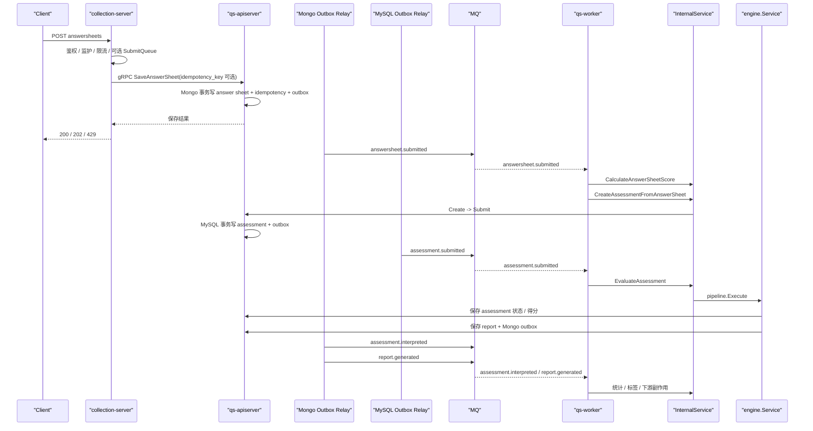

# 异步评估链路：从答卷提交到报告生成

**本文回答**：`qs-server` 当前从“提交答卷”到“报告生成”的真实主链到底怎么走，哪些步骤仍在同步线程里，哪些步骤已经走 durable idempotency / outbox / relay，worker 只负责什么，不负责什么。

与模块文档互参：

- [../02-业务模块/01-survey.md](../02-业务模块/01-survey.md)
- [../02-业务模块/03-evaluation.md](../02-业务模块/03-evaluation.md)
- [../03-基础设施/01-事件系统.md](../03-基础设施/01-事件系统.md)

---

## 30 秒结论

如果只记一屏，先记住下面这张表：

| 维度 | 当前事实 |
| ---- | -------- |
| 同步入口 | 用户请求先到 `collection-server`，再经 gRPC 到 `qs-apiserver` 保存答卷 |
| 第一个可靠边界 | `answersheet` 在 Mongo 里与 durable idempotency 记录、Mongo outbox 同事务落库 |
| 异步第一跳 | relay 补发 `answersheet.submitted`，worker 消费后做“计分 + 创建测评” |
| 异步第二跳 | `assessment.submitted` 通过 MySQL outbox 出站，worker 消费后触发 `EvaluateAssessment` |
| 成功态出站 | `assessment.interpreted` 和 `report.generated` 在报告成功落 Mongo 后一起进入 Mongo outbox |
| worker 角色 | 只负责订阅、分发、调用 internal gRPC、Ack/Nack；不持有业务真值 |
| 真实并发控制 | NSQ in-flight 由 `worker.concurrency` 控制；多实例共享 backlog 取决于相同的 `worker.service-name` |

---

## 先抓主链路

当前真实主路径可以压缩成一句话：

`collection-server -> qs-apiserver -> Mongo durable submit + outbox -> relay -> qs-worker -> Internal gRPC -> MySQL assessment outbox -> relay -> qs-worker -> EvaluateAssessment -> report save + Mongo outbox -> relay`

这条链里最重要的三件事是：

1. **同步受理和后台评估已经明确拆开**
2. **答卷、assessment、report 各自在自己的持久化边界内部做状态与出站一致性**
3. **worker 不是第二套业务中心，只是把事件再驱动回 apiserver**

---

## 全链路时序

### 当前真实时序图

### 这张图里最容易讲错的地方

- `answersheet.submitted` 现在不是“答卷保存成功后立刻 direct publish”，而是 **Mongo outbox relay** 出站
- `assessment.submitted` 也不是 `SubmissionService -> MQ` 直接发，而是 **MySQL outbox relay** 出站
- `assessment.interpreted` / `report.generated` 也不是 pipeline 末尾 direct publish，而是 **报告成功落 Mongo 后进入 Mongo outbox**

---

## 同步段：collection-server 到答卷保存

### 同步线程里到底做什么

同步阶段只做这些事：

1. `collection-server` 做鉴权、监护、限流、可选 SubmitQueue
2. 经 gRPC 调 `qs-apiserver` 的 `SaveAnswerSheet`
3. `qs-apiserver` 在 Mongo 事务里一次性写：
   - `answersheets`
   - `answersheet_submit_idempotency`
   - `domain_event_outbox`
4. 返回提交结果

代码锚点：

- `collection-server` 提交 DTO：[../../internal/collection-server/application/answersheet/dto.go](../../internal/collection-server/application/answersheet/dto.go)
- 答卷提交服务：[../../internal/apiserver/application/survey/answersheet/submission_service.go](../../internal/apiserver/application/survey/answersheet/submission_service.go)
- durable submit：[../../internal/apiserver/infra/mongo/answersheet/durable_submit.go](../../internal/apiserver/infra/mongo/answersheet/durable_submit.go)

### durable idempotency 的当前边界

当前 durable 幂等是 **显式 `idempotency_key` opt-in**：

- 调用方显式传 `idempotency_key`：进入 durable 幂等路径
- 不传：仍可提交，但不会自动拥有同等级的 durable 保障

这意味着当前可以准确讲成：

- `answersheet.submitted` 已经有 durable submit / outbox
- 但 durable 幂等 **不是所有提交默认天然成立**

---

## “异步”其实有两层

### 第一层：collection 进程内排队

`SubmitQueue` 仍然存在，但它只解决接入侧削峰：

- 让 HTTP 请求不必直接堵在下游 gRPC 上
- 支持 `202 / 429` 这种受理语义
- 只在单进程内有效，不承担跨实例可靠任务语义

代码锚点：

- [../../internal/collection-server/application/answersheet/submit_queue.go](../../internal/collection-server/application/answersheet/submit_queue.go)

### 第二层：跨进程消息

真正的异步评估主链靠 MQ + worker：

- `answersheet.submitted`
- `assessment.submitted`
- `assessment.interpreted`
- `assessment.failed`
- `report.generated`

这层才负责把长耗时评估从用户请求线程里拆出去。

---

## worker 在这条链里到底做什么

### worker 的角色

worker 只负责：

- 订阅 Topic
- 根据 `event_type` 分发 handler
- 调用 internal gRPC
- 根据处理结果 `Ack` / `Nack`

worker 不负责：

- 持有主状态
- 自己写核心业务真值
- 在本地跑一套独立领域模型

### 当前主链的 handler 分工

| 事件 | handler | 主要动作 |
| ---- | ------- | -------- |
| `answersheet.submitted` | `answersheet_submitted_handler` | Redis gate；计分；创建测评 |
| `assessment.submitted` | `assessment_submitted_handler` | 更新统计；需要评估时调 `EvaluateAssessment` |
| `assessment.interpreted` | `assessment_interpreted_handler` | 更新统计；高风险日志 |
| `assessment.failed` | `assessment_failed_handler` | 失败日志 |
| `report.generated` | `report_generated_handler` | 读取报告；给 testee 打标签 |

代码锚点：

- [../../internal/worker/handlers/answersheet_handler.go](../../internal/worker/handlers/answersheet_handler.go)
- [../../internal/worker/handlers/assessment_handler.go](../../internal/worker/handlers/assessment_handler.go)
- [../../internal/worker/handlers/report_handler.go](../../internal/worker/handlers/report_handler.go)

---

## 第一跳：`answersheet.submitted`

### 这一步现在怎么保证“尽量别重复”

这一跳有三层保护：

1. **Mongo durable submit**
   - 相同 `idempotency_key` 的请求不会重复创建答卷 / 重复写 outbox
2. **worker 侧 Redis gate**
   - `answersheet:processing:{id}`
   - 用于抑制并发重复处理
3. **创建测评时的业务唯一约束**
   - `answer_sheet_id` 预查
   - MySQL 唯一索引兜底

### `answersheet` 锁的真实定位

当前 `answersheet` 锁已经不是“唯一 correctness 边界”，而是：

- 外层重复工作抑制
- Redis 不可用时允许降级继续
- 最终正确性仍靠下游幂等兜底

这也是为什么它应被讲成 **best-effort gate**，而不是“严格分布式锁保证整个链只执行一次”。

---

## 第二跳：`assessment.submitted`

### 这一步现在怎么出站

`assessment.submitted` 当前不是 direct publish，而是：

1. `CreateAssessmentFromAnswerSheet` 在 application 层显式执行 `Create -> Submit`
2. `Submit` 把 assessment 状态更新为 `submitted`
3. `assessment.Repository.SaveWithEvents` 在 **MySQL 事务**里同时保存 assessment 与 outbox
4. relay 再把 `assessment.submitted` 真正投到 MQ

代码锚点：

- [../../internal/apiserver/application/evaluation/assessment/submission_service.go](../../internal/apiserver/application/evaluation/assessment/submission_service.go)
- [../../internal/apiserver/infra/mysql/evaluation/assessment_repository.go](../../internal/apiserver/infra/mysql/evaluation/assessment_repository.go)

### 为什么要强调 `AssessmentID`

`AssessmentID` 是第二跳之后的主键：

- `assessment.submitted` 以它为聚合 ID
- score、report、状态查询都围绕它展开
- `InterpretReport.ID == AssessmentID`

所以这条链的第一跳是“按答卷唯一建测评”，第二跳之后就是“围绕 assessment 主键推进评估”。

---

## 评估 pipeline 的当前真实形态

### 当前顺序

当前 pipeline 的真实顺序是：

1. `ValidationHandler`
2. `FactorScoreHandler`
3. `RiskLevelHandler`
4. `InterpretationHandler`
5. `WaiterNotifyHandler`

代码锚点：

- [../../internal/apiserver/application/evaluation/engine/service.go](../../internal/apiserver/application/evaluation/engine/service.go)
- [../../internal/apiserver/application/evaluation/engine/pipeline/waiter_notify.go](../../internal/apiserver/application/evaluation/engine/pipeline/waiter_notify.go)

### 这里最需要修正的旧心智

当前不应继续把 pipeline 讲成：

`Validation -> FactorScore -> RiskLevel -> Interpretation -> 旧发布步骤`

因为旧的 pipeline 发布步骤已经退出当前实现。现在最后一步只是本地 waiter 通知；真正的可靠出站发生在各自的持久化边界里。

---

## 成功路径：`assessment.interpreted` 和 `report.generated`

### 为什么它们现在绑定在“报告保存成功”时刻

当前设计明确把这两个成功事件绑定在：

- 报告成功落 Mongo

而不是：

- assessment save 成功

原因很直接：

- `assessment.interpreted` 代表“评估成功可对外可见”
- `report.generated` 代表“报告已可消费”
- 如果报告保存失败，链路会转成 `assessment.failed`

所以当前最准确的说法是：

- `assessment.interpreted` 与 `report.generated` 共享同一个成功边界
- 这个边界是 **Mongo report save + Mongo outbox**

代码锚点：

- [../../internal/apiserver/application/evaluation/engine/pipeline/interpretation.go](../../internal/apiserver/application/evaluation/engine/pipeline/interpretation.go)
- [../../internal/apiserver/infra/mongo/evaluation/repo.go](../../internal/apiserver/infra/mongo/evaluation/repo.go)

---

## 失败路径：`assessment.failed`

### 当前失败态怎么落地

评估链失败时：

1. `engine.Service.markAsFailed`
2. assessment 进入 `failed`
3. assessment 与 `assessment.failed` outbox 在 **同一个 MySQL 事务**里保存
4. relay 再把 `assessment.failed` 真正出站

这一步现在也不再是“状态改了，再 best-effort publish”。

---

## NSQ 并发和“同 channel 扩 worker”现在该怎么讲

### 并发控制

当前真实生效的是：

- `worker.concurrency -> MaxInFlight`

代码锚点：

- [../../internal/worker/options/options.go](../../internal/worker/options/options.go)
- [../../internal/worker/server.go](../../internal/worker/server.go)

### 同 channel 扩 worker

多个 worker 实例要共同消费同一个积压 backlog，关键不是改 Topic，而是：

- 保持相同的 `worker.service-name`

因为它就是 NSQ 的 channel 名。

所以现在可以准确讲成：

- 扩 worker 副本数可以帮同一个 channel 排空 backlog
- 但它会同时放大该进程订阅的全部 Topic 的消费能力，不只是 `answersheet.submitted`

---

## 当前边界：哪些话不能再讲错

### 可以明确讲成“当前已实现”的

- `answersheet.submitted` 已经不是“写库成功后 direct publish”
- 评估主链关键事件已经按 MySQL / Mongo 边界 outbox 化
- `worker.concurrency` 才是当前 NSQ in-flight 真值
- `answersheet` Redis gate 只是第二层保护，不是唯一 correctness 边界

### 不能讲过头的

- 不能把所有事件讲成都已 outbox 化
- 不能把 durable idempotency 讲成所有提交默认都成立
- 不能把 `task.*`、`questionnaire.changed`、`scale.changed` 讲成和评估主链同等级可靠
- 不能把旧的 `events.yaml consumer.*` 字段继续讲成当前运行时并发 / 重试配置

---

## 代码索引

### 提交与 durable submit

- [../../internal/collection-server/application/answersheet/submit_queue.go](../../internal/collection-server/application/answersheet/submit_queue.go)
- [../../internal/apiserver/application/survey/answersheet/submission_service.go](../../internal/apiserver/application/survey/answersheet/submission_service.go)
- [../../internal/apiserver/infra/mongo/answersheet/durable_submit.go](../../internal/apiserver/infra/mongo/answersheet/durable_submit.go)

### worker

- [../../internal/worker/server.go](../../internal/worker/server.go)
- [../../internal/worker/handlers/answersheet_handler.go](../../internal/worker/handlers/answersheet_handler.go)
- [../../internal/worker/handlers/assessment_handler.go](../../internal/worker/handlers/assessment_handler.go)
- [../../internal/worker/handlers/report_handler.go](../../internal/worker/handlers/report_handler.go)

### assessment / report 出站

- [../../internal/apiserver/application/evaluation/assessment/submission_service.go](../../internal/apiserver/application/evaluation/assessment/submission_service.go)
- [../../internal/apiserver/application/evaluation/assessment/management_service.go](../../internal/apiserver/application/evaluation/assessment/management_service.go)
- [../../internal/apiserver/application/evaluation/engine/service.go](../../internal/apiserver/application/evaluation/engine/service.go)
- [../../internal/apiserver/application/evaluation/engine/pipeline/interpretation.go](../../internal/apiserver/application/evaluation/engine/pipeline/interpretation.go)
- [../../internal/apiserver/infra/mysql/evaluation/assessment_repository.go](../../internal/apiserver/infra/mysql/evaluation/assessment_repository.go)
- [../../internal/apiserver/infra/mongo/evaluation/repo.go](../../internal/apiserver/infra/mongo/evaluation/repo.go)

---

*写作约定见 [CONTRIBUTING-DOCS.md](../CONTRIBUTING-DOCS.md)。*
