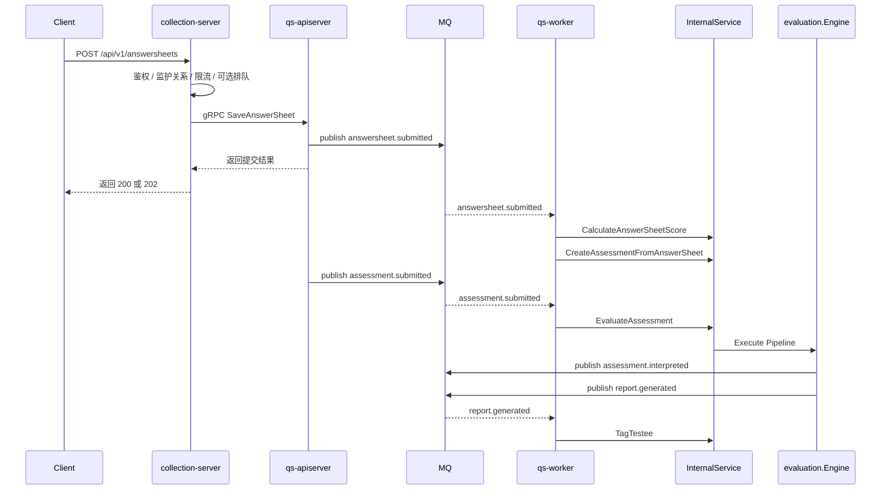

# 异步评估链路：从答卷提交到报告生成

本文介绍 `qs-server` 最关键的运行时设计：为什么答卷提交是同步入口，而评估与报告生成走异步链路。

## 30 秒了解系统

当前系统不会在用户提交答卷的那个 HTTP 请求里同步完成整条评估链。

真实主链路是：

`collection-server -> apiserver -> MQ -> worker -> internal gRPC -> evaluation engine`

这条链路把一次测评拆成两个阶段：

- 同步阶段：验证身份、接收答卷、保存主业务状态
- 异步阶段：计分、创建 Assessment、执行评估、生成报告、后处理

核心代码入口：

- [../../internal/collection-server/application/answersheet/submission_service.go](../../internal/collection-server/application/answersheet/submission_service.go)
- [../../internal/collection-server/application/answersheet/submit_queue.go](../../internal/collection-server/application/answersheet/submit_queue.go)
- [../../configs/events.yaml](../../configs/events.yaml)
- [../../internal/worker/handlers/answersheet_handler.go](../../internal/worker/handlers/answersheet_handler.go)
- [../../internal/worker/handlers/assessment_handler.go](../../internal/worker/handlers/assessment_handler.go)
- [../../internal/worker/handlers/report_handler.go](../../internal/worker/handlers/report_handler.go)
- [../../internal/worker/infra/grpcclient/internal_client.go](../../internal/worker/infra/grpcclient/internal_client.go)
- [../../internal/apiserver/interface/grpc/service/internal.go](../../internal/apiserver/interface/grpc/service/internal.go)
- [../../internal/apiserver/application/evaluation/engine/service.go](../../internal/apiserver/application/evaluation/engine/service.go)
- [../../internal/apiserver/application/evaluation/engine/pipeline](../../internal/apiserver/application/evaluation/engine/pipeline)

## 核心架构

## 核心设计原则

- 用户提交链路只负责尽快落主状态，不承担整条评估耗时。
- 异步链路由事件驱动，不靠前台轮询或接口串行调用推进。
- `worker` 负责消费和推进，但不直接持有核心写库逻辑；真正写业务状态仍回到 `apiserver`。
- 评估流程通过内部 gRPC 和引擎流水线推进，保证跨进程解耦和模块内聚。

## 这条链路分成了哪几段

### 1. collection-server 接住前台提交

前台请求首先进入 `collection-server`，这里负责：

- JWT 身份解析
- 监护关系校验
- 入口限流
- 短时排队削峰

如果排队开启，请求会先经过 `SubmitQueue`：

- 入队成功但短时间未完成，返回 `202`
- 队列满时返回 `429`
- 同一个 `request_id` 可以查询状态

这说明入口层的目标不是完成所有工作，而是先把入口压力整理好。

### 2. apiserver 保存答卷并发布第一跳事件

`collection-server` 通过 gRPC 调 `AnswerSheetService.SaveAnswerSheet`，最终由 `survey` 保存答卷，然后发布：

- `answersheet.submitted`

从这一刻开始，系统就从同步入口切到异步主链路。

### 3. worker 推进“答卷 -> Assessment”

`worker` 消费 `answersheet.submitted` 后，不是自己写数据库，而是回调 `InternalService`：

- `CalculateAnswerSheetScore`
- `CreateAssessmentFromAnswerSheet`

这样做的意义是：

- 事件消费进程不直接持有核心领域写逻辑
- 所有主业务写入仍然集中在 `apiserver`
- 事件层负责“何时推进”，业务层负责“如何写入”

### 4. worker 再推进“Assessment -> 报告”

`Assessment` 提交后，`worker` 再消费：

- `assessment.submitted`

然后调用：

- `EvaluateAssessment`

评估引擎内部通过职责链执行：

- `validation`
- `factor_score`
- `risk_level`
- `interpretation`
- `event_publish`

这一步才是真正把答卷转成可解释测评结果的核心计算过程。

### 5. 报告生成后的动作继续异步化

评估完成后，系统继续发布：

- `assessment.interpreted`
- `report.generated`

`worker` 在这一跳里再做标签、风险后处理和其他外围动作。  
也就是说，报告生成并不是链路终点，而是下一组异步动作的起点。

## 为什么这条链必须异步

### 前台入口不能被后台评估拖住

如果把评估放进提交请求里同步完成，前台请求就会同时依赖：

- 主业务写入
- 量表读取
- 因子分计算
- 风险等级判断
- 报告生成
- 后续事件发布

这样一来，只要任何一步变慢，提交接口就会直接变慢。

### 评估流程天然比提交更重

一次完整评估需要同时读取答卷、量表和测评状态，还要执行多步计算和结果持久化。  
它天然更适合放到后台流程，而不是绑定在用户提交的同步请求上。

### 异步链路更适合做失败隔离和重试

当前设计允许：

- 提交成功，评估稍后完成
- 某个测评失败后单独重试
- 事件消费侧做幂等和去重

这比把一切塞进一个同步请求更容易控制失败语义。

## 关键机制是怎么配合的

### SubmitQueue：吸收短时尖峰

`SubmitQueue` 是入口削峰，不是持久任务系统。它只负责在前台短时间高峰时，把同步 gRPC 和后端写入压力稍微摊平。

### MQ + worker：把执行时机从入口线程里拆出来

MQ 的作用不是“替代业务逻辑”，而是把“何时执行”从前台请求线程中移走，让后台工作可以独立推进。

### InternalService：让 worker 推进流程，但不接管业务写库

`worker` 通过 internal gRPC 回到 `apiserver`，这让运行时解耦和领域写入集中可以同时成立。

### 职责链：让评估步骤保持可增可减

评估引擎没有写成一个巨大的 `Evaluate()` 方法，而是拆成可顺序组合的处理器链。这样新增一步评估逻辑时，不必回头重写整条流程。

## 边界与注意事项

- `worker` 负责推进异步链路，但不是独立业务服务；真正的业务写入仍然回到 `apiserver`。
- `SubmitQueue` 只适合短时缓冲，不提供跨实例共享和持久恢复。
- `assessment.failed` 等失败路径是这条链的组成部分，但主线仍然是 `answersheet.submitted -> assessment.submitted -> report.generated`。
- 对系统吞吐影响最大的不是单个 HTTP Handler，而是整条“入口保护 + 事件推进 + 内部回调”链路是否协同良好。
